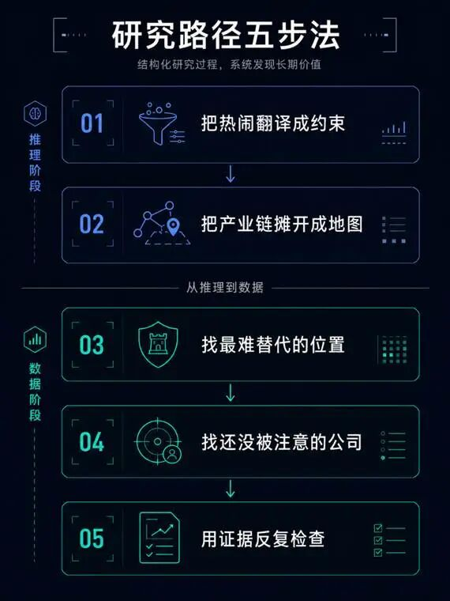
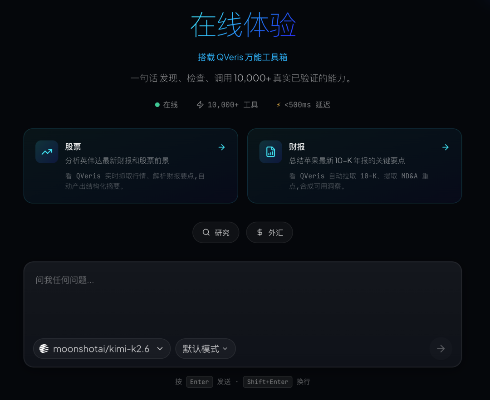
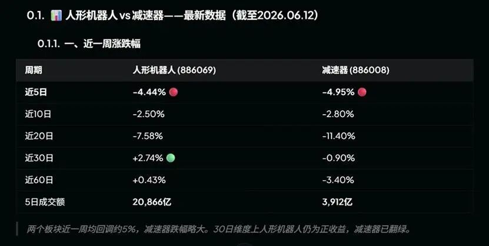
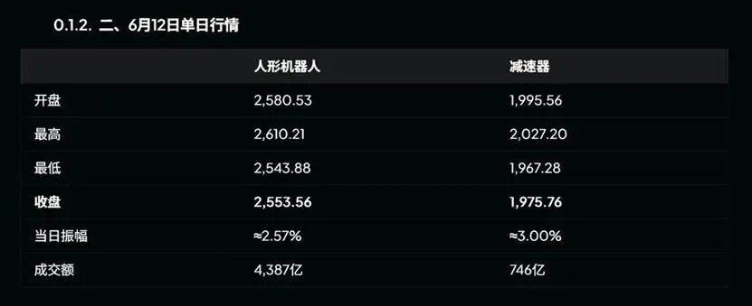
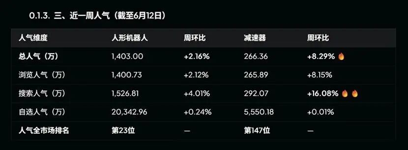
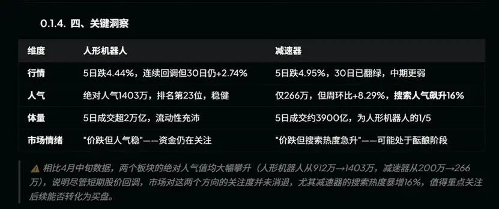

QVeris · 数据实测 

  

# “45 倍收益，1 句话成就 20CM 涨停。”

  

最近投资圈被一个名字刷屏——Serenity，X 平台上的"白毛股神"。历史总收益率一度被传到 225 倍，今年 1-5 月回报约 45 倍，多次提前押中冷门暴涨股。最近她又因为点名 A 股机器人产业链公司，引发了新一轮市场热议。

热度一起来，大家问的都是同一个问题：她下一个点谁？

但更值得问的是另一个：她这套总能看见冷门机会的方法，到底有没有普通人复现不了的部分？

把公开讨论里对她研究路径的拆解翻一遍，结论是：没有。这套东西拆开看只有两样——一套推理框架，加一堆数据验证动作。推理框架是公开的，数据动作是标准的。下面我们沿着她最近点过的机器人这条线，把这套方法完整跑一遍：推理的前两步直接拆给你看，数据怎么验、往哪走，也讲清楚。
## 先说她到底凭什么

只看 Serenity 点过哪些票，学到的是答案。答案没法复用——下一次热点来的时候，你还是不知道该看哪。

**真正值得拆的是路径。把公开资料里她的研究路径归纳一下，大概五步**：

**第一步，把热闹翻译成具体约束。** 别人看到"机器人很火"就停了，她接着问：到底是哪个工程或产能环节卡住了整个行业？

**第二步，把产业链从上到下摊开。** 不急着找股票，先画地图——哪些环节看着不起眼，但整条链都绕不过去。

**第三步，找最难替代的位置。** 供应商少、认证周期长、扩产难、没有现成替代品——条件越苛刻，越可能藏着没被定价的机会。

**第四步，在关键位置里找还没被注意的公司。** 卡在关键环节、已有订单线索，但市值不大、研报覆盖很少的那一类。

**第五步，用证据反复检查，并想清楚什么情况下判断是错的。** 看公告、看财务、看催化，同时列出"出现什么信号，这个判断就推翻"。

看完会发现：前两步是推理活，后三步全是数据活。

大多数人卡住，不是想不到，是查不动。摊开一条产业链要翻几十份研报，验证一个订单线索要扒一手信源，筛一遍小市值标的要在行情软件里点半天。而这些，恰好是机器现在最擅长的。
## 推理交给推理，查数据交给 QVeris

**这套工作流可以拆成两侧分工**：

推理这一侧——翻译约束、拆产业链层级、设计证伪条件，交给会推理的工具。

**数据这一侧——交给 QVeris**。QVeris 是面向智能体的搜索和行动引擎：用自然语言描述要查什么，它通过语义发现从 10,000+ 已验证的工具和数据源里匹配到对应能力，调用后返回结构化结果。板块、资金、筛选、解禁，用中文问就行，不用记数据来自哪家供应商。

下面这次演示，数据全部跑在 QVeris 官网的 Live Demo（Playground）里完成——打开网页、用中文提问，QVeris 自己找数据源、调用、返回结果，不用装任何东西。

## 第一步：把"机器人很火"翻译成具体约束

"机器人很火"不是一个能研究的对象，"哪个环节在变紧"才是。

人形机器人量产的瓶颈，并不在整机叙事，而在几个工程和产能约束上：精密传动（谐波减速器、行星滚柱丝杠的精度与产能）、力控感知（六维力矩传感器）、驱动（无框力矩电机、空心杯电机），以及最关键的——这些核心零部件在量产爬坡时的良率和成本能不能压下来。

到这一步还没有任何股票出现，但靶心已经从"机器人概念"收窄到了几个具体环节。这就是第一步的意义。
## 第二步：把产业链摊开，再用数据验真假

接着把人形机器人产业链按层级摊开，从上到下大致是：上游材料（特种钢、稀土永磁、芯片）→ 核心零部件（减速器、丝杠、电机、传感器、控制器）→ 关节模组与灵巧手 → 本体集成 → 软件与算法 → 下游应用。

框架是推理出来的，但热闹是不是真的、钱在不在场，得用数据验。这是交给 QVeris 的第一类查询——拉板块热度。我们以"人形机器人"和它上游最典型的卡点环节"减速器"两个板块做对比，看市场到底在交易什么。

**一、阶段涨跌幅**

两个板块近一周同步回调约 -4.5% ~ -5%，减速器跌幅还略大一点。但把周期拉长就看出分化：近 20 日、近 30 日、近 60 日，人形机器人全面跑赢减速器，近 30 日人形机器人还是正收益（+2.74%），减速器已经翻绿。**同样在跌，一个是冲高回落，一个是持续弱势。**

**二、资金量级**

差距在这里被拉开：6 月 12 日单日，人形机器人成交 4,387 亿、减速器只有 746 亿，相差近 6 倍；拉到近 5 日，人形机器人累计成交 2 万亿出头、减速器约 3,900 亿，仍是 5 倍以上。**同样是回调，一个放着天量、一个缩量阴跌——人形机器人这一跌，流动性根本没散。**

**三、人气**

人形机器人近一周总人气 1,403 万，在全市场排第 23 位，绝对热度稳居头部。减速器只有 266 万、排第 147 位，绝对量级差着一个身位——但有意思的是它在悄悄升温：总人气周环比 +8.29%（人形机器人才 +2.16%），搜索热度更是周增 +16%（人形机器人 +4%）。**一个是已经站在高位、热度稳住；一个是低位冷门、但搜索量正在被点着。**

把三张表合起来读，是 Serenity 方法最看重的那种信号：**潮水退的时候才看得清谁在动**。人形机器人是"价跌但人气稳、流动性不散"——回调归回调，资金和关注都还在场；减速器是"价跌但搜索热度急升"——绝对量还冷，可是有人开始在低位悄悄查它了。前者是明牌的强势赛道，后者是值得盯一眼"关注度能不能转成买盘"的酝酿位。哪个被错杀、哪个在蓄势，数据自己给了线索，但答案要你自己往下挖。

**前两步到此跑完：靶心有了（精密传动、力控、量产良率），地图有了（六层产业链），行情阶段也用实时数据看清了。接下来往链条深处走。**
## 一个容易被忽略的细节：数据本身也要被验证

在拉板块数据时，你会遇到一个大多数人想不到的坑：**同一个概念，不同数据源的口径可能根本不是同一批股票。**"机器人""人形机器人""机器人执行器"在不同平台被划进不同的板块，成分股不一样，算出来的涨幅、成交也就不一样。口径错位的数字，推理再严谨，结论也是错的。

这正是 QVeris 在调用环节做的事：每一条数据返回时，都能看到它来自哪个供应商、是什么口径、历史成功率、延迟和成本（Inspect）。**同一个数字还能换一家数据源交叉对一遍**。Serenity 方法的最后一步是防止自己骗自己，而在那之前，得先防止数据骗你。
## 第三到第五步：从赛道下钻到个股

看清赛道之后，真正的研究才开始——往个股下钻。沿着减速器、丝杠、电机、传感器这些核心环节，接下来要做三件事：看哪些个股最近资金在持续流入、从里面筛出还小市值且换手温和放大的、再逐一排查未来三个月的解禁和近期的折价大宗交易。**这些数据 QVeris 同样查得到，用中文问一句就行。**

这里就藏着 Serenity 方法第五步那句"用证据反复检查、别被表面热闹骗了"。还记得前面那张表里人形机器人板块的天量成交吗？把资金流拉出来看，会发现近 5 个交易日主力其实是净流出的（约 -417 亿），5 天里只有一天净流入。放量不等于主力在买——成交额的热闹和资金的真实态度，可能是两回事。这一层光看涨幅和成交额是看不出来的，得继续往数据里挖。

但到个股这一层，我们不替你跑、也不列具体清单，原因有两个：一是筛出来的个股清单是研究底稿，不是答案——具体看哪些公司、怎么判断，得你自己跑、自己下结论；二是本文只做方法演示，不推荐任何个股。最后别忘了把证伪条件写出来：什么信号出现，整个判断作废。
## 写在最后

这次跑下来，可以确认一件事：**股神的方法可以被包装成各种产品，但方法背后的工作流本身是开放的**。这套工作流里真正值钱的不是"查得快"，是每一步都查得到、对得上、可以被复核——结论可以错，但底稿必须干净。

以前认真做完这一套，至少要一个下午，所以大多数人选择不做、直接抄答案。这就是为什么"股神"永远有市场。

但现在，推理这一侧，这一代模型已经把能力给到了每个人手里；**数据验证这一侧，QVeris 把 10,000+ 工具接成了一个用中文就能问的入口。**"看见别人没看见的东西"这件事，第一次不再只依赖天赋和信息差，而是看你愿不愿意把这五步跑完。

### 三步上手 QVeris

1、打开 qveris.cn，进入 Live Demo

2、直接在对话框用中文提问（比如"查一下人形机器人板块近5日主力资金净流入"）

3、QVeris 自动找到数据源、调用、返回结构化结果

想接进自己的 Agent 工作流？QVeris 也提供 MCP Server、CLI 和 REST API，丢给 Claude、Cursor 30 秒接入。

**风险提示：** 本文仅用于展示 AI 投研工作流，不构成任何投资建议。文中涉及的板块与数据仅作方法演示，未推荐任何个股。Serenity 相关收益、身份和市场影响力在公开讨论中存在争议。市场有风险，投资决策需独立判断。
