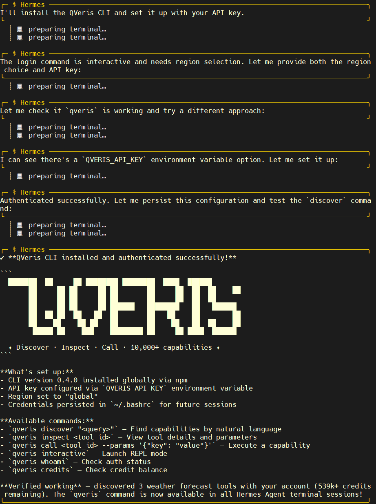
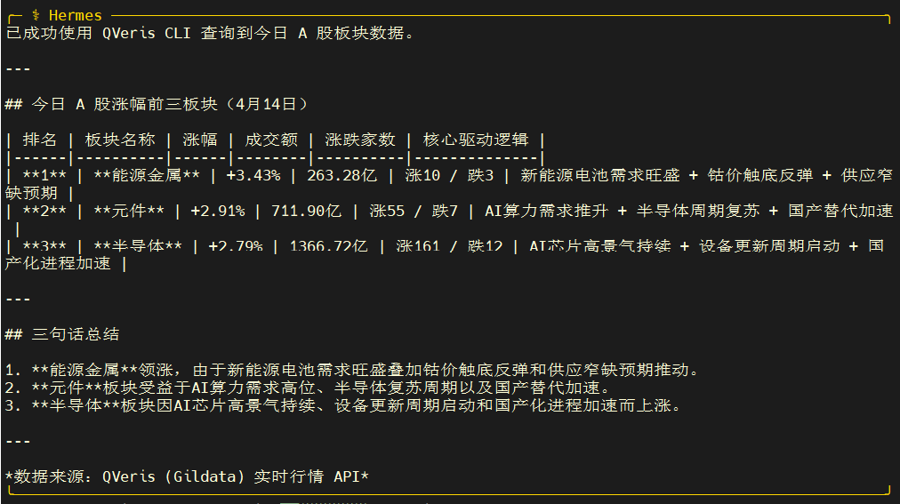
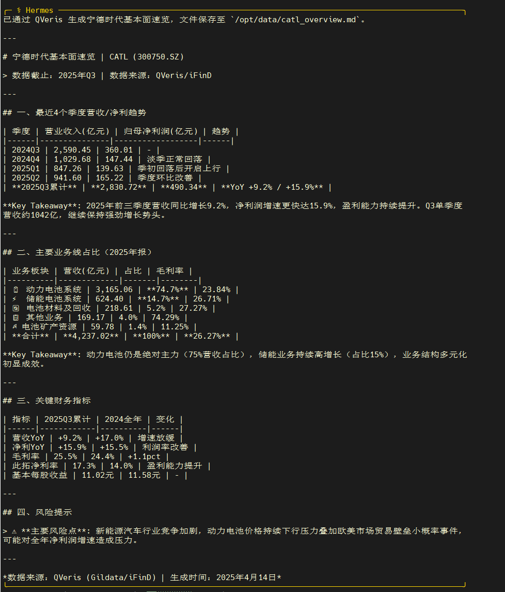
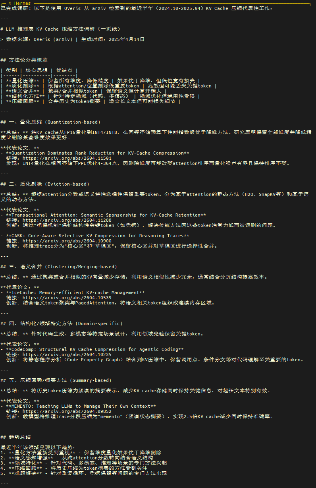

过去你要在 Hermes Agent 上挂一个新 CLI，大概率得 ssh 进宿主机、敲 npm install、再手动配凭据、最后重启 agent。

  

QVeris 官方给出了另一条路：  

把一句英文 prompt 丢给 Hermes，Hermes 在自己的 shell 沙箱里帮你把 QVeris CLI 装好、登好、立刻可以通过 discover / call 调用。

  

整个过程不需要在宿主机敲一行命令。

本篇是这条路的 5 分钟上手指南。

  

1. Hermes Agent 简介

Hermes Agent 是 Nous Research 在 2026 年 2 月发布的开源自主 AI 智能体。它和 IDE 代码补全工具或「浏览器里套壳的聊天机器人」不一样——Hermes 常驻在你自己的服务器或本地机器上，拥有持久记忆和工具沙箱，跑得越久积累的上下文越多，能力越强。

**特点**：

- 支持 Linux / macOS / WSL2，一条 curl 命令即可安装，无前置依赖

- 内置 shell 沙箱，允许加载外部工具/skills/CLI

- 持久化记忆：关键事实、偏好、过去决策可以跨会话复用

- 开放扩展协议：任何符合规范的 CLI 都能作为「外部能力」挂进来

  

本篇的目的，就是把 QVeris 的官方 CLI（@qverisai/cli）作为一个一等公民挂进 Hermes 的 shell 沙箱，让 Hermes 能直接 discover 和 call QVeris 暴露的研究/数据/分析能力。

  

2. 前置条件

- 一台已经装好 Hermes Agent 的机器（Linux / macOS / WSL2）

- Hermes 沙箱内有 Node.js / npm（默认镜像通常自带；没有的话先让 Hermes 自己装）

- 一个有效的 QVeris API key（去 https://qveris.ai 注册并在用户中心生成）

**如果还没装 Hermes Agent，先在宿主机执行**：

| Bash curl -fsSL https://raw.githubusercontent.com/NousResearch/hermes-agent/main/scripts/install.sh \| bash hermes setup |
| --- |

  

 

3. 让 Hermes 自己安装 QVeris CLI

QVeris 官网对接 Hermes 的方式不是让你在宿主机 shell 里敲 npm install，而是把一句自然语言指令直接喂给 Hermes，由 Hermes 在它自己的 shell 沙箱里完成安装和登录。

3.1 官方 prompt（直接复制粘贴到 Hermes 对话里）

来自 https://qveris.ai/plugins 的 Hermes Agent 条目，逐字照抄：

Install QVeris CLI on Hermes Agent: run npm install -g @qverisai/cli then qveris login (my API key is YOUR_KEY). Once installed, the qveris command is available inside Hermes Agent's shell sandbox for discover / call.

粘贴前把 YOUR_KEY 替换成你自己的 QVeris API key（从 https://qveris.ai 用户中心生成），其它一个字都不要改。

3.2 Hermes 会做什么

**收到这条指令后，Hermes 会在它的 shell 沙箱里按顺序执行**：

1.  npm install -g @qverisai/cli —— 全局安装 QVeris CLI

2.  qveris login —— 用你提供的 API key 完成登录，凭据写到沙箱内的 ~/.config/qveris/

3.  验证 qveris 命令可用，并把它注册为后续对话可以通过 discover / call 调用的一等公民工具

整个过程在沙箱内部完成，不污染宿主机 PATH，也不需要你重启 Hermes。

3.3 验证

**指令跑完后，在同一个 Hermes 对话里追问一句**：

你现在能调用 qveris 吗？列一下 qveris discover 看到的能力。

Hermes 应该回放一份能力清单——包含数据 / 研究 / 分析等模块。如果 Hermes 说找不到 qveris，跳到本文第 5 节常见问题。

⚠️ API key 安全：这条 prompt 里你要粘真 key，Hermes 本地沙箱是安全的，但不要把填好 key 的完整 prompt 发到群里、截图分享或者复制进公开文档。误贴后立刻去 QVeris 用户中心 revoke。

  

4. 使用示例

以下示例都是在 Hermes 对话 里直接对 Hermes 提问，Hermes 会自行决定何时调用 qveris discover / qveris call。

示例 1：A 股板块异动分析

适合：日内盘后快速复盘

**对 Hermes 说**：

帮我看一下今天 A 股涨幅最大的三个板块是哪些，分别说出驱动它们上涨的核心逻辑，给我三句话以内的总结。用 qveris 取数据。

**预期行为**：

1.  Hermes 调 qveris discover 找到「行情 / 板块排行」相关能力

2.  用 qveris call 拉取当天涨幅榜

3.  结合 QVeris 的新闻/研报摘要能力给出归因

4.  汇总成三句话结论

示例 2：生成一份公司基本面速览

适合：尽调前的 5 分钟热身

**对 Hermes 说**：

用 qveris 帮我生成一份宁德时代的一页纸基本面速览，包含最近 4 个季度的营收/净利趋势、主要业务线占比、和一条风险提示。输出成 Markdown。

示例 3：技术主题调研

适合：把 QVeris 当「带引用的深度搜索」用

**对 Hermes 说**：

用 qveris 帮我调研「LLM 推理层的 KV cache 压缩」最近半年有哪些代表性工作，按方法论分类，每类给 1-2 句话总结和代表论文链接。

  

5. 常见问题

Q: Hermes 说它沙箱里找不到 qveris 命令

- 追问 Hermes「把 which qveris 和 npm ls -g --depth=0 的输出贴出来」排查

- 如果 npm install 没成功，让 Hermes 检查沙箱里 Node.js / npm 版本，必要时先升级

- 如果是沙箱权限问题，让 Hermes 改用 npm install --prefix ~/.local -g @qverisai/cli 装到用户目录

Q: qveris login 报「invalid api key」

- 确认 prompt 里 YOUR_KEY 已经被替换成真 key，没有多余空格或引号

- 确认 key 是从 https://qveris.ai 用户中心生成的最新 key，没有被 revoke

- 确认你的 QVeris 账号还在有效额度内

Q: 我能用环境变量代替 qveris login 吗？

可以。直接告诉 Hermes：「把 QVERIS_API_KEY= 写到沙箱的 shell 初始化脚本里，然后省掉 qveris login 这一步」。推荐在 CI 或 headless 场景用。

 

