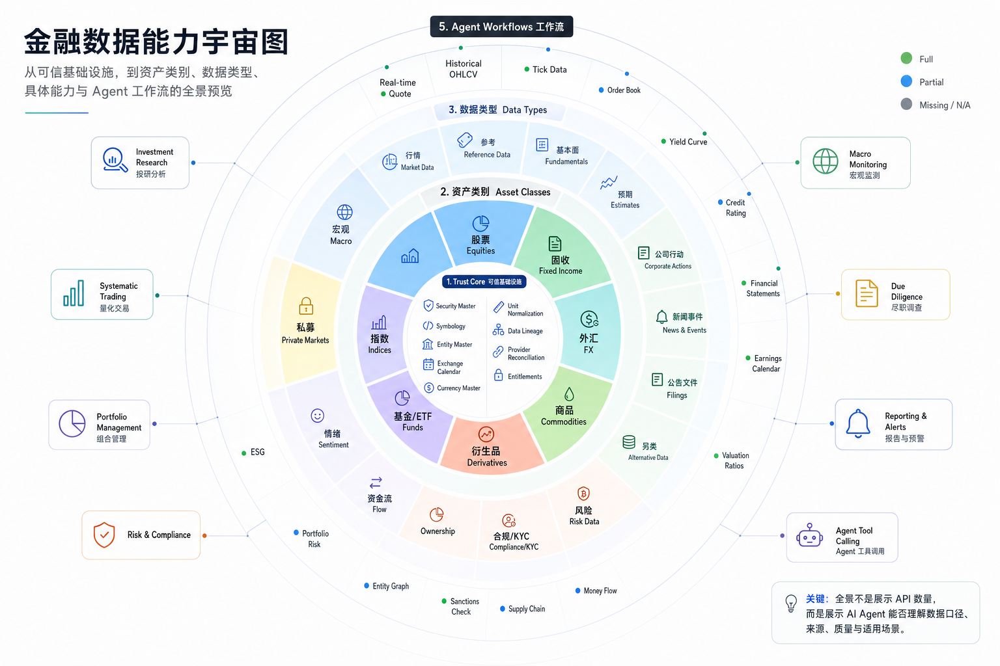
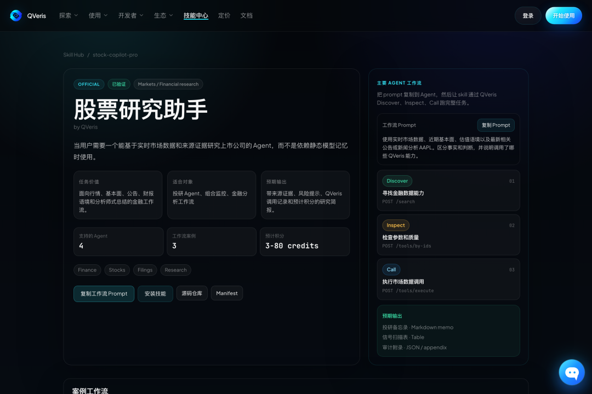

# 给 AI Agent 接上 A 股实时行情，第一步该怎么做？

很多人已经习惯问 AI：茅台怎么看？寒武纪还能不能追？今天 A 股有什么异动？

它能聊三千字，语气还很像研究员。

问题是，它可能根本不知道今天有没有放量、资金往哪流、公告刚刚说了什么。

没有实时行情、资金流、财报、公告和新闻，AI 再会讲逻辑，本质上还是一个坐在旧资料堆里的分析师。

给 AI Agent 做金融能力，第一步不是写更长的 prompt，而是先把市场数据接上。

QVeris 做的就是这件事：把分散在不同 provider、不同 API、不同参数格式里的能力，变成 Agent 能发现、检查、调用的一套入口。

以前接一个金融 API，要先找供应商、看文档、对字段、写适配、处理报错。对人来说，这是工程活；对 Agent 来说，这是它能不能真的行动的前提。

QVeris 的公开文档把这条路径拆成三步：Discover、Inspect、Call。

Discover 是先用自然语言找能力。Inspect 是调用前看参数、schema、成本和质量信号。Call 才是真正执行。

这一步很重要。很多金融 Agent 翻车，不是模型不会分析，而是工具选错了、参数猜错了、数据源没核验。QVeris 的价值不是让你少写几行代码，而是把“找什么工具、怎么调用、花多少钱、调用是否成功”变成一套可审计流程。

目前 QVeris 中文站的能力地图显示，金融域已有 155 个注册能力、153 个可评估能力、126 个已覆盖能力，评估过 60 个供应商。覆盖方向包括量化策略、投研分析、风控合规、宏观与固收、加密资产和另类信号。

拆到具体能力，和普通用户最相关的是这些：

实时 L1 行情、分钟级 K 线、日线行情、复权价格；

个股资金流、板块资金流、跨境资金、技术指标；

期权链、Greeks、隐含波动率、期权主数据、期货行情；

利润表、资产负债表、现金流量表、估值指标；

一致预期、分析师评级目标价、实时财经新闻、新闻标签和情绪信号。

一个 Agent 不只可以问“今天涨跌多少”，还可以把行情、资金、新闻、财报和期权信号放在一起综合分析。

接入方式也不复杂。

第一种，国内用户可以走 QVeris 中文站注册，拿 API Key。官方文档写得很直接：Base URL 是 `https://qveris.cn/api/v1`，在请求头里带 `Authorization: Bearer YOUR_API_KEY`。

第二种，走 CLI。适合开发者和自动化脚本。

大致流程是：先安装 CLI，再执行 `qveris login`；然后用 `qveris discover "A股实时行情"` 找能力，用 `qveris inspect 1` 检查参数，最后再用 `qveris call` 发起真实调用。

这里要注意，最后一行参数只是示意，真实参数要以 `inspect` 返回的 schema 为准。金融数据最怕“看名字猜字段”，这也是 QVeris 把 Inspect 放在 Call 前面的原因。

第三种，走 MCP。适合 Cursor、Claude Code、OpenCode 这类编程 Agent。把 QVeris MCP server 配进客户端，Agent 就可以在对话里先 discover，再 inspect，再 call。

费用上呢？

发现 / 检查工具免费

注册自动获得 API 密钥和 1000 积分；真正调用时，根据具体能力的 billing rule 消耗 credits。

另外分享好友可的双倍积分。

先不用买昂贵终端，也不用一家家申请数据源，可以免费完成发现、检查和初步试用；能不能长期高频使用，要看具体接口、积分消耗和你的使用场景。

AI 金融助手真正的进步，不是它说得越来越像分析师，而是它终于开始知道自己引用了什么数据、为什么用这个工具、这次调用花了多少钱。

不要一上来就让 Agent 给你选股。先让它做三件小事：每天整理自选股异动，每周汇总资金流和新闻，每次财报后把估值、预期和公告放在一起对照。

如果这三件事做稳了，它才有资格继续往策略、回测、组合监控走。

快去试试吧，直接把这句话丢给你的ai👇

接入qveris.cn 或 qveris.ai 获取A股数据试试。
