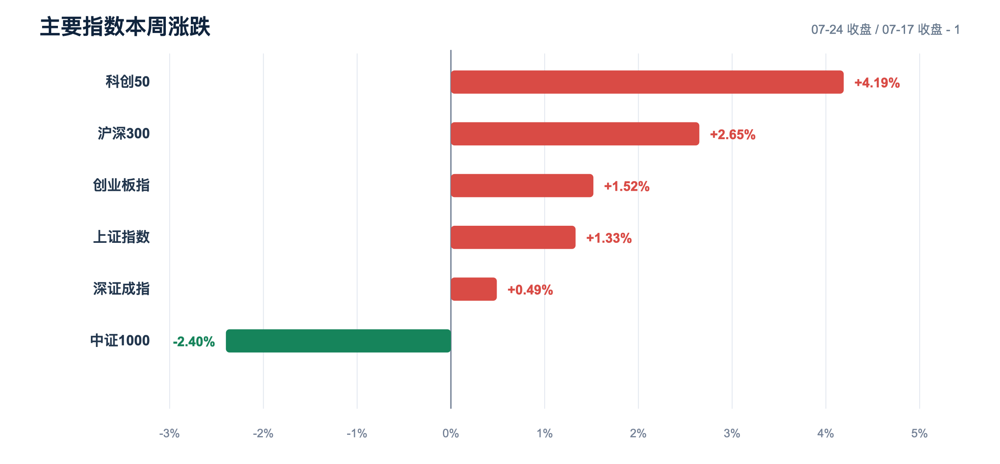
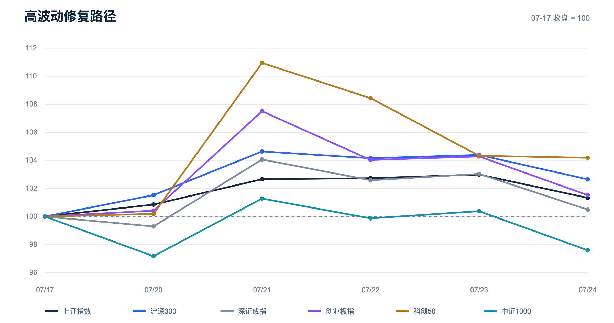
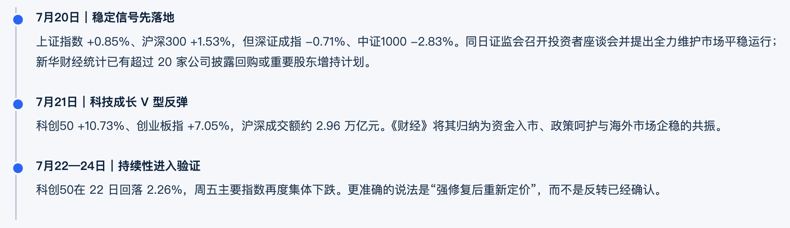
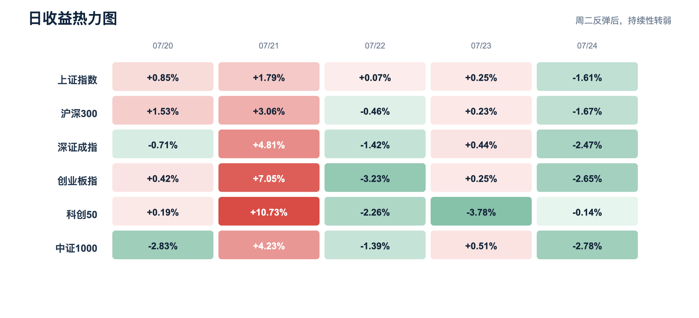
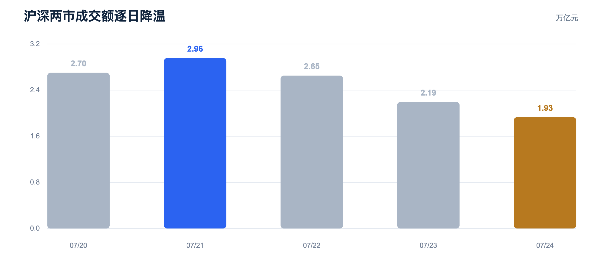
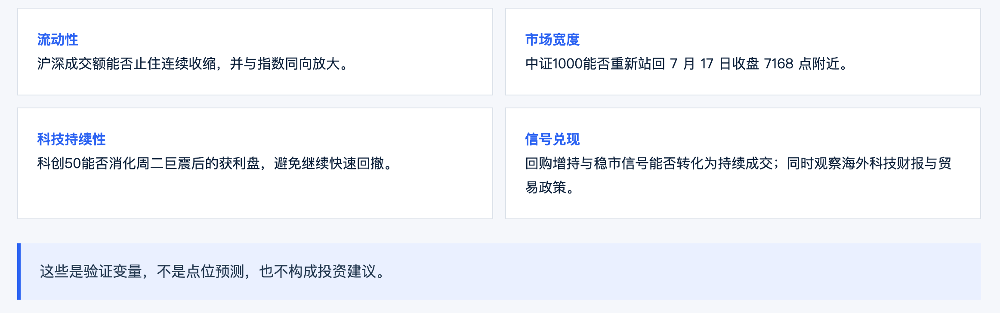

**2026.07.20—07.24  ·  数据截止 07-24 收盘  ·  非投资建议**

**用 QVeris 实跑 1 次真实 Call、拉回 36 行指数日行情，复盘 2026 年 7 月 20–24 日 A 股的高波动修复**

---

**分析结论：这是一周“指数修复、结构分裂、流动性退潮”的行情，不是一个可以用单边反转概括的星期。**

截至 7 月 24 日收盘，科创50较前一周五上涨 **4.19%**，沪深300上涨 **2.65%**，创业板指上涨 **1.52%**，上证指数上涨 **1.33%**；但中证1000仍下跌 **2.40%**。与此同时，沪深两市成交额从周二约 **2.96 万亿元**降至周五约 **1.93 万亿元**，降幅 **34.7%**。指数回来了，扩散度和持续买盘还没有完全回来。

| 数据口径：本周为 2026-07-20 至 2026-07-24；周涨跌以 2026-07-17 收盘为基准。行情数据来自本次 QVeris 真实调用，事件信息另以公开来源交叉核验。 |
|-|

| **科创50 · 本周** | **沪深300 · 本周** | **中证1000 · 本周** | **周二→周五成交额** |
|-|-|-|-|
| **+4.19%** | **+2.65%** | **-2.40%** | **-34.7%** |

# 一、六个指数，讲了三个不同的故事

| **指数** | **代码** | **7月24日收盘** | **本周涨跌** | **周五涨跌** |
|-|-|-|-|-|
| **科创50** | 000688 | 1,787.20 | **+4.19%** | **-0.14%** |
| **沪深300** | 000300 | 4,649.19 | **+2.65%** | **-1.67%** |
| **创业板指** | 399006 | 3,480.87 | **+1.52%** | **-2.65%** |
| **上证指数** | 000001 | 3,814.20 | **+1.33%** | **-1.61%** |
| **深证成指** | 399001 | 13,774.68 | **+0.49%** | **-2.47%** |
| **中证1000** | 399852 | 6,995.69 | **-2.40%** | **-2.78%** |

表 1｜六个主要指数周度表现。来源：QVeris 实跑数据。

图 1｜周涨跌按 7 月 24 日收盘相对 7 月 17 日收盘计算。来源：QVeris 实跑数据。

第一层是**大盘权重的修复更稳**。沪深300周涨 2.65%，明显强于深证成指的 0.49%，说明风险偏好恢复并非雨露均沾，资金更愿意先在流动性好、承载量大的权重资产中停留。

第二层是**科技高弹性，但路径极不稳定**。科创50周涨 4.19%，却在周二单日上涨 10.73% 后，到周五已较本周最高收盘回撤 6.09%。创业板指也出现类似节奏：周二上涨 7.05%，周五再跌 2.65%。这更像“超跌修复 + 高波动再定价”，还不是低波动趋势。

第三层是**中小盘并未同步修复**。中证1000本周下跌 2.40%，是六个指数中唯一周线收跌者。周一它先跌 2.83%，周二反弹 4.23%，随后又连续转弱，说明高弹性不等于广谱风险偏好回归。

图 2｜将 7 月 17 日收盘归一化为 100，周二强修复后，六个指数重新分化。

# 真正的转折点只有一天：7月21日

把每日涨跌铺开看，周二是整周的“波动枢纽”：上证指数 +1.79%、沪深300 +3.06%、深证成指 +4.81%、创业板指 +7.05%、科创50 +10.73%、中证1000 +4.23%。《财经》把当天归纳为资金入市、政策呵护与海外市场企稳三重因素共振；证监会前一日召开投资者座谈会并明确“全力维护市场平稳运行”，同时 7 月 20 日已有超过 20 家 A 股公司披露回购或重要股东增持计划。

但周二之后，持续性没有跟上：7 月 22 日科创50回落 2.26%，新华财经记录科创板上涨个股占比不足两成；到周五，上证、深成指和创业板指分别下跌 1.61%、2.47% 和 2.65%。因此，更准确的表述不是“反转确认”，而是**政策与资金信号触发了一次强修复，随后市场重新进入成交、业绩和外部风险的验证期**。

图 3｜红色代表上涨、绿色代表下跌；周二是全周唯一普遍强势日。

# 三、成交额给出的答案：敢抄底，但不愿持续追高

图 4｜上证指数与深证成指成交额合计。本周日均约 2.49 万亿元。

沪深两市成交额周二达到约 **2.96 万亿元**，随后三天逐级回落，周五降到约 **1.93 万亿元**；本周日均约 **2.49 万亿元**。这组数据指向两个同时成立的事实：

1. 恐慌后的承接力量真实存在，否则不会出现周二的放量反弹。
2. 追价意愿衰减也同样真实，否则成交额不会在三天内下降 34.7%。

所以，下周比“指数能不能再涨”更值得观察的是：成交额能否重新回到 2.2 万亿元以上并伴随上涨家数扩散；如果只有少数权重或少数科技龙头撑指数，修复的质量仍然有限。

# 下周四个验证点

- **流动性**：沪深成交额能否止住连续收缩，并与指数同向放大。

  - **市场宽度**：中证1000能否重新站回 7 月 17 日收盘 7168 点附近；若小盘继续落后，结构性修复仍未完成。
  - **科技持续性**：科创50能否消化周二巨震后的获利盘，避免继续从高点快速回落。
  - **信号兑现**：回购增持、长期资金和监管稳市信号，能否从公告层面转化为持续的成交与持仓行为；同时关注海外科技财报、AI 资本开支与贸易政策变化。

# 五、这篇复盘不是“先写观点，再找数字”

**BUILT WITH QVERIS**

| 这次我们先把任务交给 QVeris： |
|-|

| 查询 2026 年 7 月 17 日至 7 月 24 日上证指数、沪深300、深证成指、创业板指、科创50和中证1000的每日行情，返回交易日期、OHLC、涨跌幅、成交量和成交额。 |
|-|

QVeris 先 Discover 能力，再 Inspect 当前参数与计费规则，最终路由到 Gildata Finance MCP 的 IndexDailyQuote。真实 Call 耗时 **4.7 秒**，返回 **36 行**可计算数据；调用历史确认 **result.valid**，账本最终扣费 **1 credit**。

图 5｜Discover → Inspect → Call → Audit：一次真实调用的可审计证据链。

这正是工具路由引擎与 data harness 结合的价值：**不是让模型“知道所有金融数据”，而是让它找到合适的数据能力、读懂 schema、控制成本、执行调用，并为结果留下可审计证据。** 对开发者而言，最重要的不是又接了一个 API，而是把“找工具—读参数—调用—验结果—对账”变成一条可复现的工程链。

**想复现这次调用：** [创建 QVeris API Key](https://qveris.ai/account?page=api-keys)，并查看 [QVeris Agent Toolkit](https://github.com/QVerisAI/qveris-agent-toolkit)。

# 数据与风险说明

- 行情数据截止 2026-07-24 收盘，来自 QVeris 路由的 Gildata Finance MCP；周涨跌与图表由本地脚本据原始结果计算。
- 7 月 24 日主要指数与成交额已与新华财经公开报道交叉核对；事件归因属于基于公开信息的分析，不代表唯一因果解释。
- 本文仅用于产品演示与市场研究方法展示，不构成证券研究报告、收益承诺或投资建议。

**公开来源**

以下公开链接用于事件信号交叉核验；行情数据来自本次 QVeris 真实调用。

- [证监会：7月20日投资者座谈会](https://www.csrc.gov.cn/csrc/c100028/c7646232/content.shtml)
- [新华财经：7月20日回购增持计划密集披露](https://www.cnfin.com/gs-lb/detail/20260720/4443143_1.html)
- [《财经》：7月21日科技成长 V 型反弹](https://www.mycaijing.com/article/detail/574641?source_id=40)
- [新华财经：7月22日科创板缩量回落](https://www.cnfin.com/gs-lb/detail/20260722/4444281_1.html)
- [新华财经：7月24日主要指数与盘面](https://m.cnfin.com/yw-lb/zixun/20260724/4445682_1.html)
- [每日经济新闻：7月17日全球科技风险与去杠杆背景](https://www.nbd.com.cn/articles/2026-07-17/4475861.html)

**QVeris · Route the right tool. Keep the evidence.**
