日期；1.13

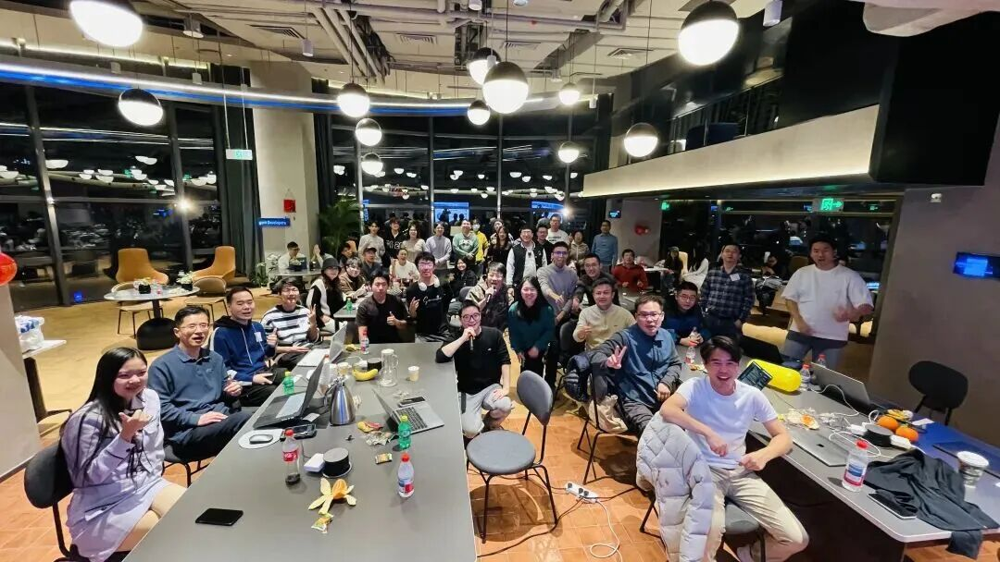

上周日，我们一起做了一件很酷的事。

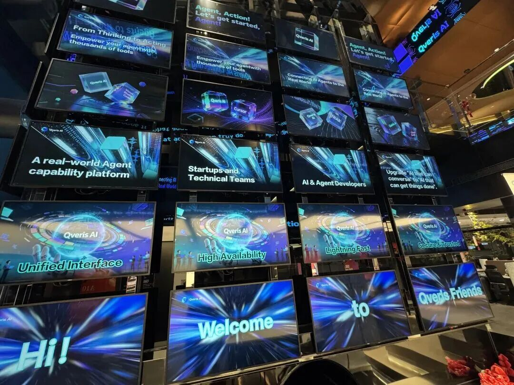

一群对 AI Agent 真正能不能**“动起来” **这件事有执念的人，聚在了一起。

这就是** Qveris Friends × 原点学堂 × Naughty Labs** 的第一场线下活动：

<text underline="true">**Agent, Action！QverisAI 黑客松**</text>

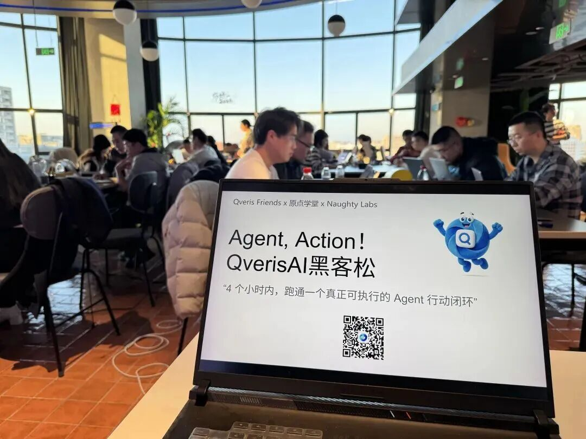

## 一个被反复讨论、却很少被真正做完的目标

这次黑客松，我们没有设定复杂的赛题，也没有限定行业方向。

只有一个极其具体、甚至有点“刁钻”的目标：

4 个小时内，跑通一个真正可执行的 Agent 行动闭环

（而不是 Demo、PPT 或概念）

也就是说：

- <text underline="true">不只是“分析”</text>
- <text underline="true">不只是“生成建议”</text>
- <text underline="true">而是</text><text underline="true">**真的能调用工具、真的执行动作、真的有结果**</text>

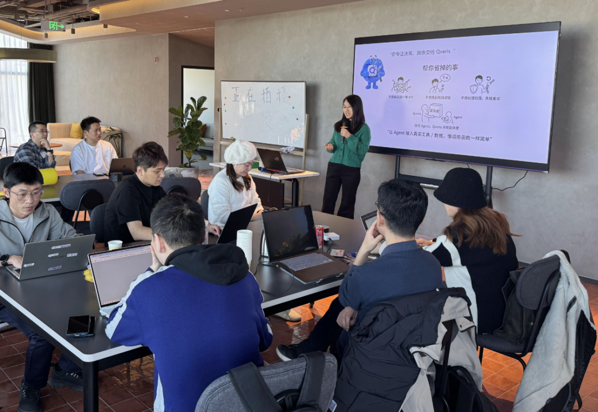

这恰好也是** Qveris 一直在做的事。**

现场来了** 近百位开发者 / 产品 / 创业者**，如果你来过现场，你大概会记得这样一些画面：

- <text underline="true">有人盯着屏幕，等一次 API 的返回</text>
- <text underline="true">有人在不断调整 Agent 的执行流程</text>
- <text underline="true">也有团队不间断地火热讨论</text>

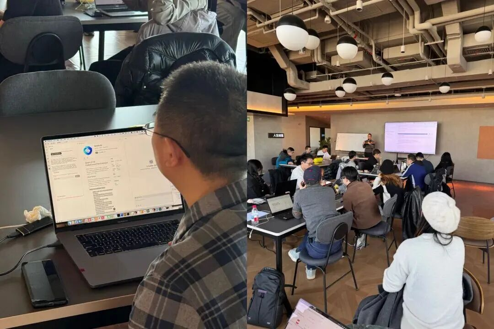

它们都指向同一件事：

Agent** 是否真的完成了一次行动**。

模型越来越强、Demo 越来越漂亮，

但真正能在日常工作中 替人完成一段完整行动 的 Agent，依然很少。

问题不在**“会不会想”**，

而在 **“能不能动”**。

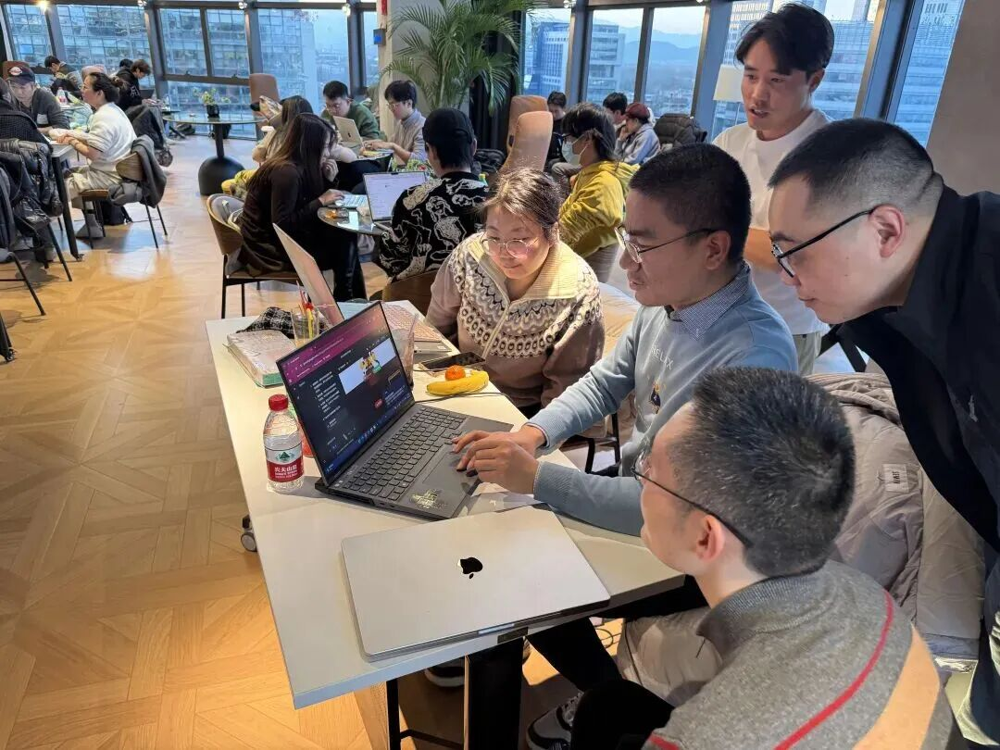

活动进行到中段后，很明显能感受到一件事：

几乎没有人在比模型、比 Prompt、比技巧。

大家花时间讨论的，都是一些非常具体的问题：

这一步为什么没有执行？

是权限问题，还是工具没接好？

Agent 为什么在这里停住了？

有项目一度卡住很久，

只是因为 一个动作始终无法成功执行。

也正是在这些地方，

很多人第一次清楚地意识到：

Agent 跑不动，

很多时候不是模型不行，

而是和外界交互的**门槛太高**。

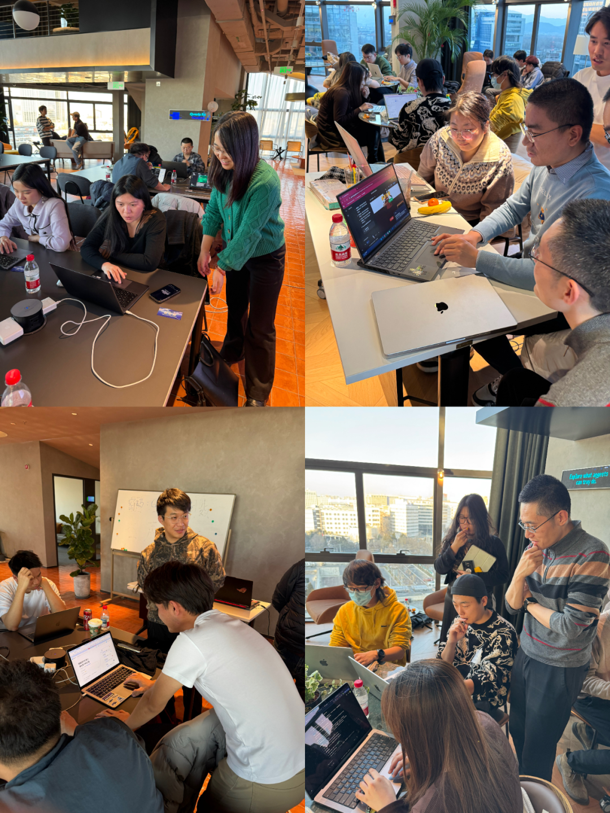

4 个小时结束时，现场一共完成了：

<text underline="true">**10 个 AI Agent 项目**</text>

<text underline="true">** GitHub 提交**</text>

<text underline="true">**跑通至少一个完整行动链路**</text>

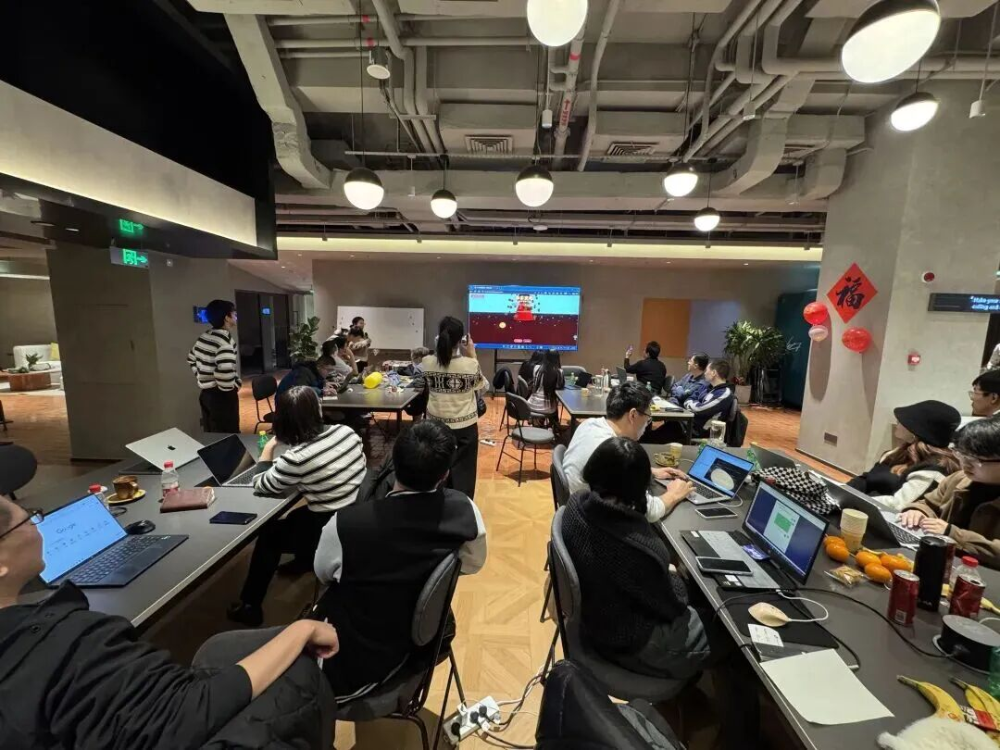

所有项目都有一个非常明确的共同点：

**Agent 已经完成了一件具体的事，**

**而不是停留在讨论它能做什么。**

经大家同意都已完整开源，放在 Qveris Friends 的 GitHub：

👇

<text underline="true">***https://github.com/orgs/QverisFriends/repositories***</text>

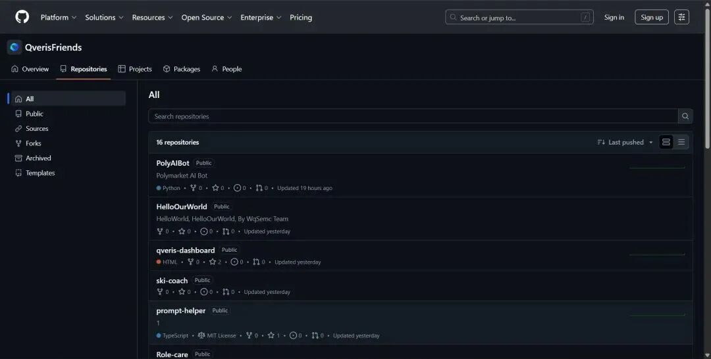

不仅是为了展示成果，

更是希望它们**真的能被复用、被继续跑下去。**

现场评选出了 3 个奖项：

- <text underline="true">**The Best PMF：最具商业潜力的奖**</text>
- <text underline="true">**Just For Fun：最有趣的奖**</text>
- <text underline="true">**Qveris 特别奖**</text>

这些项目并没有随着活动结束而消失。

代码在逻辑在持续建设也在

它们更像是 真实的 Agent 行动样本，而不仅是一次性的展示作品。

Qveris Friends，想和大家把这件事持续做下去

它不仅是一个供大家交流AI Agent的社区，更像一个创造营：

- <text underline="true">允许失败</text>
- <text underline="true">允许跑不通</text>
- <text underline="true">但要</text><text underline="true">**“行动”**</text><text underline="true">起来，不仅是agent，更是</text><text underline="true">**人**</text>

如果 AI Agent 真的会成为下一代生产力工具，

那它一定不是从“更会说”开始，

**而是从 “更会做” 开始。**

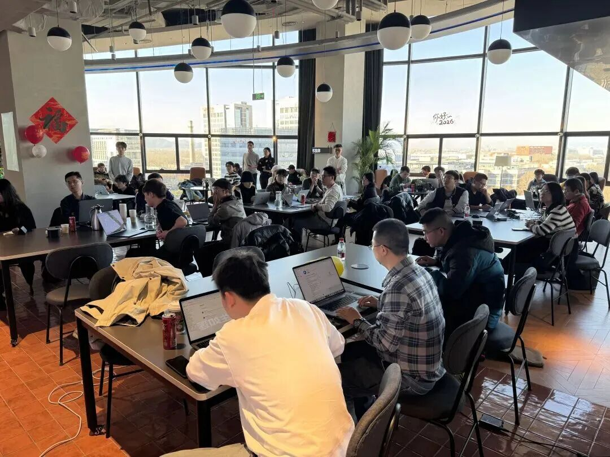

**Agent, Action。**

对我们来说，这不是一句口号。

更像一句提醒：

别急着定义未来，

先让 AI 把一件小事做完。

接下来，我们会：

- <text underline="true">**拆解这 10 个 Agent 项目的真实实现**</text>
- <text underline="true">**分享它们卡在哪、怎么跑通的**</text>
- <text underline="true">**继续做小规模、重实操的共创**</text>

如果你也在关心 Agent 如何真正落地，

那就

## **赶快加入我们，** {align="center"}

## **我们下期再会！** {align="center"}

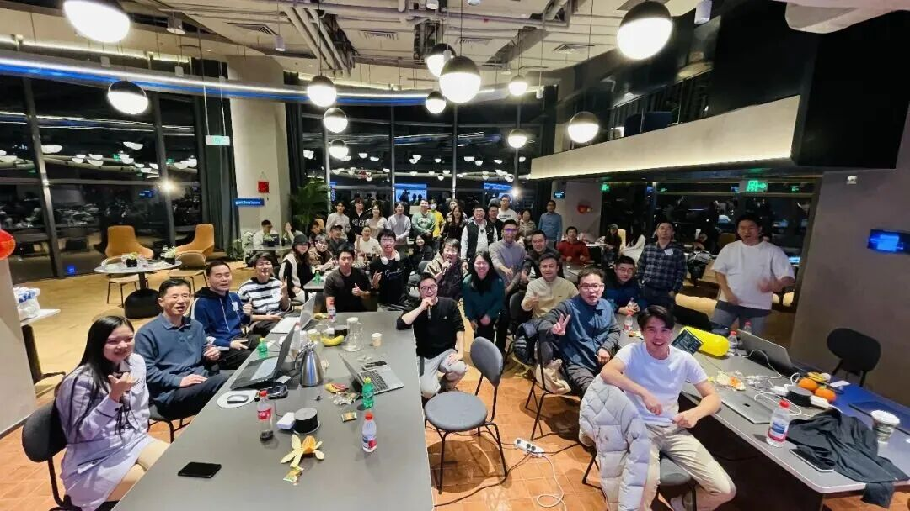

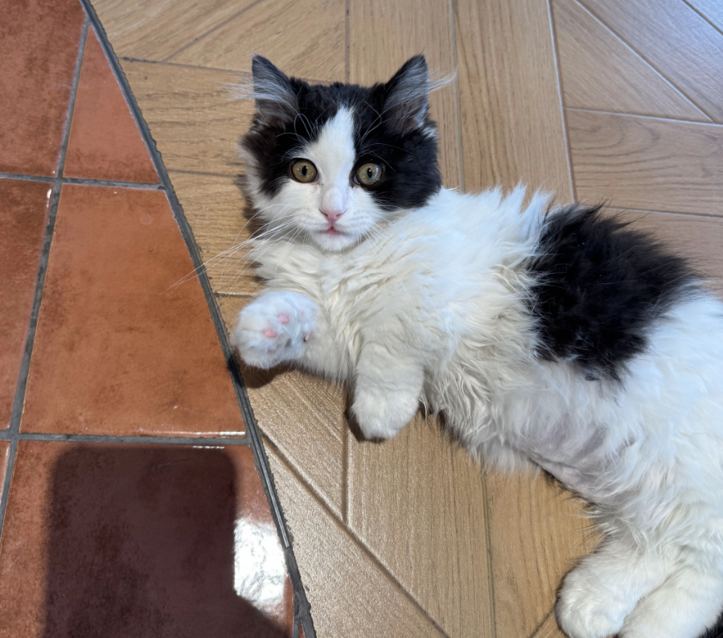

附原点学堂主理人照片一张👆
