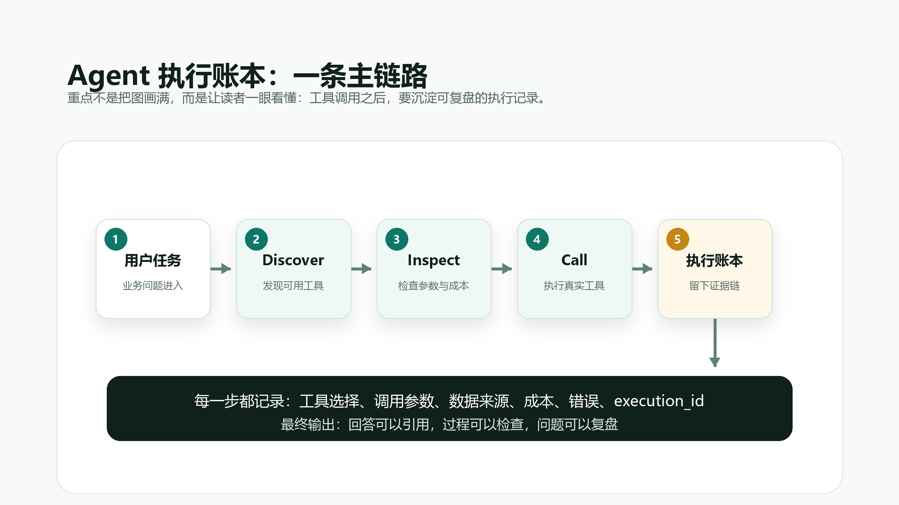
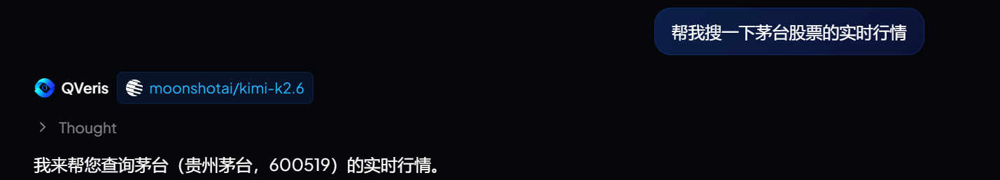
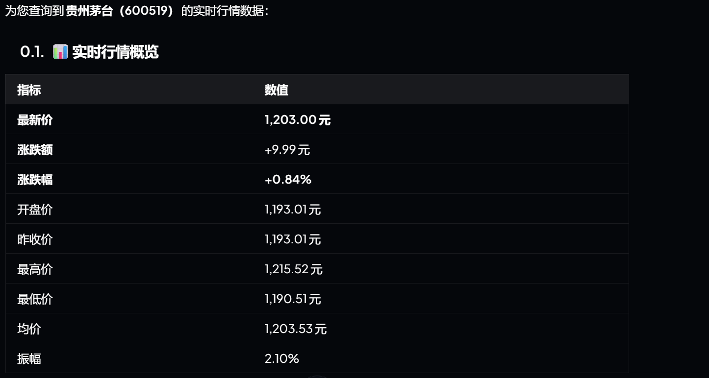
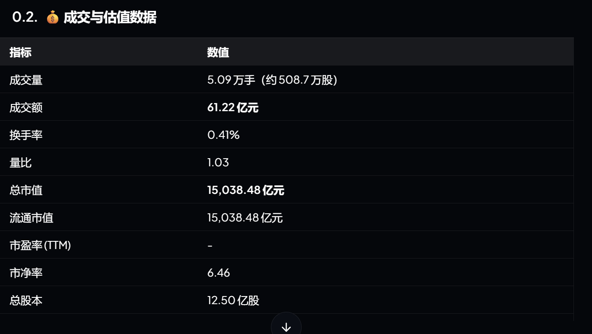
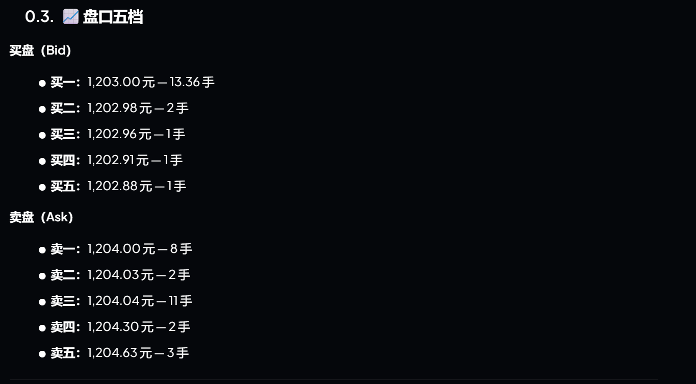
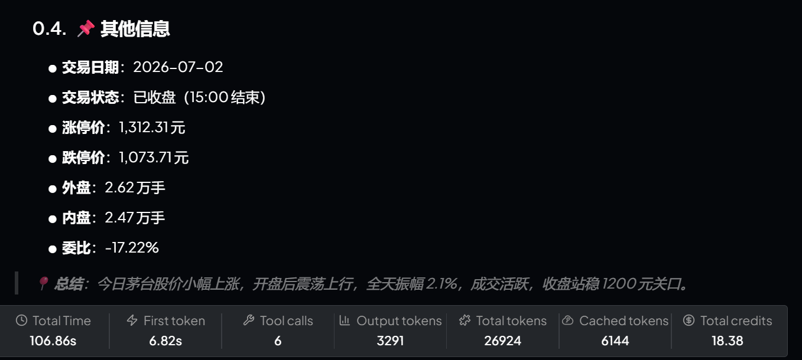

# Agent 不能只会调工具，还要能留下执行账本

## 一句话摘要

Agent 真正进入业务流程之后，最重要的不是一次调用有没有成功，而是每一次执行能不能被复查、被复用、被交接。QVeris 要补的，是 Agent 从“会调用工具”到“能管理执行”的这一层。

很多人第一次做 Agent，最兴奋的时刻，往往是工具终于被调通了。

用户说一句话，Agent 自动拆任务、找工具、填参数、返回结果，再组织成一段看起来完整的回答。

这一步当然重要。

但真正把 Agent 放到业务流程里之后，会发现“调通工具”只是开始。

更麻烦的问题很快出现：

它为什么选了这个工具？

参数是谁填的？

用了哪些数据源？

中间失败过几次？

有没有降级？

花了多少成本？

最后那段结论，能不能回到原始记录？

如果这些问题回答不上来，Agent 看起来是在执行任务，实际上只是把一串不可见过程包装成了一个顺滑结果。

这也是我们最近做 QVeris 工作流时越来越明确的一点：

Agent 不能只会调用工具。

它还要能为每一次调用，留下可检查的执行账本。

## 01｜真正危险的不是调用失败，而是调用成功但无法复盘

工具调用失败，其实并不可怕。

失败至少会暴露出来。

接口超时、权限不足、参数错误、字段缺失，这些问题只要记录下来，后面都可以修。

真正危险的是另一种情况：

Agent 调用成功了，也生成了答案，但没人知道它到底是怎么成功的。

它可能用了一个不适合当前任务的数据源。

它可能在参数缺失时自动猜了一个默认值。

它可能把一个部分结果写成了完整结论。

它可能在第一次调用失败后换了另一个工具，却没有告诉用户。

它也可能只拿到了摘要，却写出了像原始证据一样确定的判断。

这些问题在 demo 里不明显。

因为 demo 更关心“结果有没有出来”。

但在金融、风控、销售、招采、合规、投研这些场景里，结果出来并不等于结果可信。

业务真正需要知道的是：

这个结果是从哪里来的。

它经过了哪些步骤。

哪些地方是确定的。

哪些地方只是临时替代。

哪些地方需要人工复核。

所以，Agent 系统不能只保存最终回答。

它必须保存执行过程。

## 02｜执行账本不是日志，而是一套可用的证据结构

Tool execution failed: token endpoint HTTP 503

Parameters:

{  
  "stockObject": [  
    "贵州茅台"  
  ]  
}

Response:

{  
  "execution_id": "a3e10c38-40fa-41e4-8c7c-886766f16d5a",  
  "tool_id": "hangseng_polysource.a_shares_live_quote.query.v2.10fe0581",  
  "parameters": {  
    "stockObject": [  
      "贵州茅台"  
    ]  
  },  
  "result": {  
    "status_code": -1,  
    "data": null,  
    "error_type": "execution_error",  
    "error_details": "token endpoint HTTP 503"  
  },  
  "success": false,  
  "error_message": "Tool execution failed: token endpoint HTTP 503",  
  "elapsed_time_ms": 5432.54,  
  "created_at": "2026-07-02T15:10:23.283822+00:00",  
  "cost": 0,  
  "execution_outcome": {  
    "schema_version": "execution_outcome.v1",  
    "raw_success": false,  
    "transport_success": true,  
    "provider_success": false,  
    "result_valid": false,  
    "billable_success": false,  
    "outcome": "provider_error",  
    "status": "not_charged",  
    "reason_code": "provider.error",  
    "message": "provider status code -1",  
    "provider_status_code": -1,  
    "provider_status_message": "provider status code -1",  
    "valid_result_count": 0,  
    "raw_result_count": 0,  
    "raw_success_rate_excluded": false,  
    "retryable": false,  
    "display_severity": "error"  
  },  
  "billing": {  
    "price": {  
      "amount_credits": 1,  
      "per": 1,  
      "unit": "call",  
      "unit_label": "call"  
    },  
    "list_amount_credits": 0,  
    "summary": "Execution failed; Provider returned an error; this call was not charged",  
    "execution_outcome": "failure"  
  },  
  "remaining_credits": 615.51  
}

很多系统已经有日志。

但日志和执行账本不是一回事。

日志更像给工程师看的运行痕迹。

执行账本则是给 Agent、开发者、业务人员和审计流程共同使用的证据结构。

它至少应该包含几类信息：

任务是什么；

Agent 拆成了哪些步骤；

每一步候选过哪些工具；

最终为什么选择当前工具；

调用参数是什么；

返回结果是什么；

原始证据在哪里；

是否发生失败、重试或降级；

消耗了多少成本；

哪些结论可以引用；

哪些结论需要保留边界。

如果只有工具返回值，Agent 得到的是一个结果。

如果有执行账本，Agent 得到的是一个可以被继续使用的上下文。

这两者差别很大。

一个结果只能回答当前问题。

一个账本可以支持后续复查、二次分析、人工审核、失败排查和流程交接。

这也是 Agent 从个人助手走向企业流程时必须补上的一层。

## 03｜工具选择也需要被记录，而不是只记录调用结果

很多 Agent 工作流会把注意力放在 Call 上。

也就是工具到底有没有执行成功。

但在真实任务里，Call 之前的选择过程同样重要。

比如用户问：“帮我查一家公司最近的风险信号。”

Agent 可能有很多候选工具：

工商信息；

司法风险；

招投标记录；

新闻搜索。

如果 Agent 直接调用其中一个工具，然后给出答案，这个答案可能是片面的。

更稳的方式，是先记录工具发现和筛选过程。

它搜索到了哪些候选能力？

每个工具覆盖什么数据？

是否需要权限？

成本是多少？

更新频率如何？

结果能不能追溯到原始来源？

当前任务为什么先用 A，而不是 B？

这些选择本身就是证据的一部分。

因为在业务场景里，没查什么，和查了什么一样重要。

如果一个 Agent 只告诉你“没有发现风险”，却没有告诉你它查过哪些范围，这句话很难被信任。

如果它能说明“本次检查覆盖了工商、公告、新闻和司法数据，未覆盖内部 CRM 和付费舆情库”，那结论就有了边界。

边界不是削弱答案。

边界是在保护答案。

## 04｜执行账本让 Agent 可以从一次性回答，变成可交接流程

很多 Agent 现在仍然像一次性问答工具。

问一次，答一次。

看完就结束。

但业务流程不是这样运转的。

一个销售线索可能要交给 BD。

一个风险信号可能要交给合规。

一个投研结论可能要进入后续跟踪。

一个招采机会可能要分派给区域团队。

这时候，最终回答远远不够。

接手的人需要知道：

这个任务为什么被触发；

Agent 做过哪些检查；

哪些字段已经确认；

哪些字段还缺；

哪些证据可以引用；

哪些判断只是模型推断；

下一步应该人工看哪里。

执行账本的价值，就是把一次回答变成一个可交接对象。

它不是让 Agent 显得更复杂。

而是让 Agent 做过的事可以进入下一步。

在企业里，一个流程能不能被交接，往往比回答本身漂不漂亮更重要。

## 05｜QVeris 的位置：把工具调用变成可管理的执行链路

理解任务；

发现能力；

检查工具；

填充参数；

发起调用；

接收结果；

生成证据；

组织回答；

保留记录。

大模型擅长理解和表达。

Agent 框架擅长拆任务和调度。

但工具和真实世界之间，还需要一层更稳定的基础设施。

这也是 QVeris 的位置。

QVeris 不只是让 Agent 多一个 API 入口。

更重要的是，它让 Agent 可以通过语义搜索发现工具，在调用前理解工具，在调用后拿到结构化结果，并把 execution_id、参数、来源、成本和错误信息留在链路里。

这件事听起来不像“生成一个漂亮答案”那么显眼。

但它决定了 Agent 能不能进入真实业务。

因为真实业务不只要结果。

真实业务要知道结果是否可查、过程是否可控、成本是否可算、失败是否可复盘。

## 06｜未来的 Agent 差异，可能不在回答，而在账本

接下来，Agent 会越来越会写。

总结、提纲、报告、分析、邮件、话术，这些能力都会变得越来越普遍。

真正拉开差距的，可能不是谁的文字更像专家。

而是谁能把每一次执行都管理清楚。

同样是一个结论，能不能回到原始数据？

同样是一次调用，能不能看到当时的参数？

同样是一个失败，能不能知道失败发生在哪里？

同样是一段分析，能不能区分证据、推断和建议？

同样是一个工作流，能不能交给下一个人继续处理？

这些问题，决定了 Agent 是停留在演示里，还是进入业务里。

所以我越来越觉得，Agent 的下一阶段，不只是更强的模型，也不是更多的工具。

而是更清楚的执行账本。

因为只有当执行过程可以被看见，Agent 才真的开始变得可信。