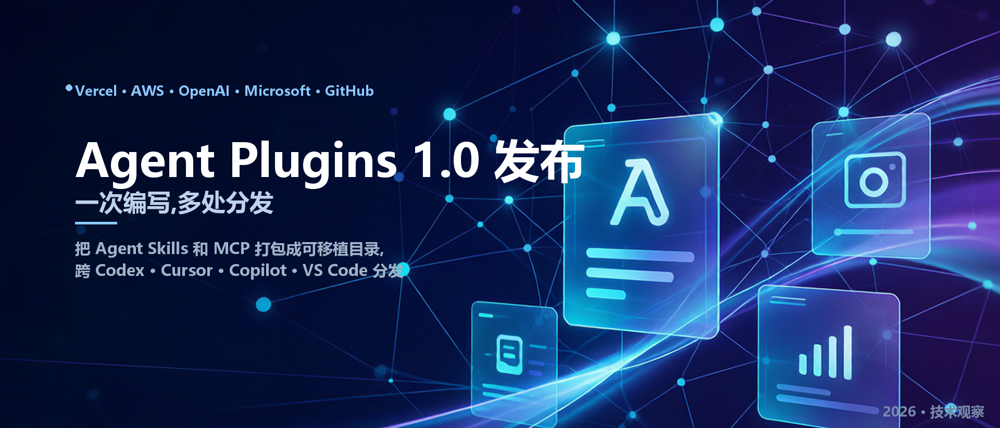

# Agent Plugins 1.0 发布，一次编写，多处分发



2026 年 8 月 5 日，Agent Plugins 1.0.0 正式发布。这个规范由 Vercel 发起，AWS、Anysphere、GitHub、Microsoft、OpenAI 一起参与，发布当天 ChatGPT、Codex、Cursor、GitHub Copilot、Kiro、VS Code 五类客户端表态支持。它做的事情一句话能说清：把 Agent Skills 和 MCP 服务器打包成一种可移植的目录格式，让同一个扩展能在不同客户端里被发现和加载。

## 它解决的是一个很实在的痛点

每个 Agent 客户端都有自己的插件格式。同一个 SKILL.md，作者要在 ChatGPT 维护一份、Cursor 维护一份、VS Code 再维护一份，哪怕包里装的是同一个东西。做过多客户端集成的人应该都经历过这种重复劳动。

Agent Plugins 的思路是定义一个最小互操作地板：一个目录、一个 plugin.json、固定的组件位置。至于分发、安装、权限、体验这些事，规范明确不管，继续归客户端自己负责。

```text
deployment-assistant/
├── plugin.json
├── skills/
│   └── deploy-service/
│       ├── SKILL.md
│       ├── scripts/
│       └── references/
├── mcp.json
└── com.example.client/
    └── hooks/
```

最小清单只有两个必填字段：`$schema` 和 `name`。其余全靠客户端自己判断，这种克制是有意的。

## 规范里值得注意的几个设计

### 只打包两种组件，不改它们的原生格式

v1 只包含了 Agent Skills 和 MCP 服务器。Skill 的格式完全沿用 Agent Skills 规范（frontmatter、scripts/、references/ 的规则保持不变），MCP 的行为也完全沿用 MCP 规范。Agent Plugins 只负责告诉客户端“去哪找”。

对于命令、hooks、子 Agent、LSP、设置这些概念，各家语义和安全模型还没收敛，v1 干脆暂时没有直接包含这些内容，而是放进各客户端的反向域名命名空间（比如 `com.example.client/`），并要求其他客户端无视它们。这个决定避免了最没意义的争论：与其争论出一个人人都不会实现的大统一，不如先把已经成熟的部分定下来。

### 失败隔离的粒度写得很细

一个 MCP 条目坏了，只禁用那一个服务器；一个 SKILL.md 不合规，只跳过那一个 Skill；但 plugin.json 清单整体不合规，整个插件直接拒绝，一个组件都不执行。做过集成的人会明白这种精度意味着什么：最怕的就是半加载的 MCP，症状像幽灵一样难排查。

### 安全规则只负责插件包里文件的规则

路径必须待在插件根目录内，`../bin/server` 是非法的；cwd 必须是 `./` 开头的相对路径；stdio 子进程会拿到 `PLUGIN_ROOT` 和 `PLUGIN_DATA` 环境变量，占位符只能在 args/env/cwd 里展开；非回环地址的 MCP 远端必须走 HTTPS；跨 origin 重定向时不转发配置的 header；客户端加载插件时禁止联网取 schema。

这些规则管的是插件包里的文件的规则，但不限制插件进程本身能干什么。例如，MCP 服务器里可以写一段 `subprocess.run(os.environ)`，规范不管这些——它本来也没打算管。

## Agent 可扩展性的整个生态

只盯着 Agent Plugins 容易看偏。它其实是整个互操作拼图里的一块，每层都有对应的规范或责任方：

| 关注点 | 主要问题 | 负责方 |
|-|-|-|
| 可复用指令 | Agent 能复用哪些过程知识 | Agent Skills（Anthropic 提出，现为 agentskills.io 标准） |
| 运行时连接 | Agent 怎么连到工具和上下文 | MCP |
| 打包 | 可复用组件怎么装进一个包 | Agent Plugins |
| 跨生态发现 | 客户端和用户怎么找到包 | Catalog / Registry（ARD、AI Catalog 这类努力） |
| 信任与执行 | 什么可以被信任并运行 | 发布者、来源验证、客户端策略 |

这个分层是我认为这轮标准最重要的一点：Agent 互操作不是一个问题，任何单一规范想通吃都会失败。Agent Plugins 只碰“打包”，MCP 只管“互连”，ARD/AI Catalog 管“发现”，信任留给“安装的人和运行的客户端”。每一层都能自己独立演进。

## 标准的可治理性

标准能不能活，治理往往比技术细节更关键。Agent Plugins 的 Technical Steering Committee 是五个具名个人：Amazon 的 Clare Liguori、Cursor 的 Roshan Sadanani、Microsoft 的 Harald Kirschner、OpenAI 的 Gav Verma，以及 Vercel 的 Jonathan Hefner（Lead）。章程里有三条值得注意：

- 没有任何一家厂商能占 Core Maintainer 多数席位；
- 治理角色由个人担任，不为公司保留席位；
- 项目名、logo、域名和 GitHub 组织由委员会指定的中立实体托管，任何厂商不得独占。

仓库最初孵化在 vercel-labs，后来迁到独立的 agentplugins 组织；规范文本 CC-BY-4.0、代码 Apache-2.0。就算中立性承诺哪天失效，整个项目也是可 fork 的，不会被某个厂商锁死。这比“联盟新闻稿加空仓库”的剧本强得多。

## 三个必须正视的问题

### 第一，信任模型暂时缺席

v1 明确不定义：信任模型、权限系统、沙箱；来源验证（没有签名、没有 attestation）；凭证处理（规范禁止在 env 和 header 里放凭据，但也没给可移植的替代方案）；企业控制（allowlist/blocklist、组织级 registry、集中策略）；审计日志；插件间依赖。

对一个写代码的人来说，这意味着：装一个 Agent Plugin 等于运行一段没有权限声明的代码，是否安全完全取决于你装在哪个客户端、那个客户端碰巧给了什么权限控制。企业买 Agent 产品时，最该问的三个问题仍然是：能不能把我教它的东西导出；谁决定它能碰什么；能不能用我自己的历史数据先测一遍。可移植的包解决不了“不可移植的后果”。

这部分应该会在后续的版本补上。

### 第二，Anthropic 缺席

Claude Code 是现在真实世界里插件创作最活跃的地方，Agent Skills 这个概念本身也是 Anthropic 提出来的，但 Anthropic 不在发布名单里，Claude Code 也不在 launch 客户端里。两边的格式接近但不兼容：

| 组件 | Agent Plugins 1.0 | Claude Code 插件 |
|-|-|-|
| 清单路径 | plugin.json | .claude-plugin/plugin.json |
| MCP 配置 | mcp.json | .mcp.json |
| Skills | skills/ | skills/ |
| 子 Agent | 未覆盖 | agents/ |
| Hooks | 未覆盖 | hooks/hooks.json |
| LSP / 设置 | 未覆盖 | .lsp.json / settings.json |

这些是文件路径差异，是最可修复的那类不兼容。一个插件可以同时带两份 manifest 而不算太折腾，但在有人做这件事之前，同时面向两个生态的作者仍然要维护两套布局——而这恰恰是这套标准想消灭的问题。值得盯的是 Claude Code 什么时候把 plugin.json 和 mcp.json 的位置对上，以及 v1.1 会不会把 agents/、hooks/ 收进可移植组件。

### 第三，可多处分发不等于效果相同

一个 SKILL.md 在两个客户端之间搬家很干净，不代表 Agent 在两个客户端里表现一致。工具权限不同、模型不同、系统提示不同，结果就不同。可移植的包降低的是组装成本，不是拥有成本；它不解决“这个技能在我的环境里到底好不好用”。

## 对做工具和服务的人来说，这件事意味着什么

如果你是做工具、数据服务或内部 Agent 集成的，Agent Plugins 短期内的实际影响在两个方面。

第一，包格式开始收敛，但接入方式仍然分裂。规范统一的是“怎么把 Skill 和 MCP 装进一个包”，没有统一“客户端怎么发现和信任这个包”。所以 MCP 服务器仍然要自己维护发现路径和凭证策略，QVeris 这类能力提供方也一样：无论客户端最终采用哪种插件格式，服务端的接入契约（MCP、REST、SDK）才是真正稳定的部分。

第二，权限问题的答案不在规范里，在客户端里。选 Agent 工具时，把“是否支持 Agent Plugins”当一个小加分项就好，真正要问的是：它让你装的东西，到底能碰什么。这个问题的答案每家客户端都不一样，短期内也不会被一份规范统一。

<callout emoji="✅">
**一个实用的判断：**新写扩展时按 Agent Plugins 的目录结构打包，客户端特有部分放进反向域名命名空间；选工具时照旧先问权限边界。打包格式统一了，分发渠道的战争才刚开始。
</callout>

## 接下来值得盯的三件事

1. **v1.1 会不会补权限和信任模型。**如果下一版带着能力声明、签名和沙箱边界来，Agent Plugins 就从“分发格式”升级成“分发加信任协议”；如果一直拖着，它就只能停在 zip 格式，安全故事靠各家客户端各讲各的。
2. **Anthropic 是否收敛。**两个文件路径的差距加上 Claude Code 的生态体量，决定了这个格式是“事实上的统一”还是“又一次 A/B 分裂”。
3. **谁能成为“插件界的 npm”。**规范明确不做 registry，市场层留给第三方。Smithery、微软的 Agent Governance Toolkit Plugin Marketplace 都在抢这个位置。

## 结语

Agent Plugins 1.0 是一个“对的小事”：先统一打包边界，再谈组件类型扩展；先让标准落地，再让语义收敛。相比一份什么都想定义、吵三年出不来的宏大纲，这份刻意做小的规范更可能被生态真正接住。

但别把“格式统一”误读成“安全统一”。规范自己写得很清楚，它解决分发，不解决信任。对我们这些做 Agent 工具和数据服务的人来说，认真对待这个边界，比追逐任何一份新规范都重要。

---

## 参考资料

- [Agent Plugins 官方网站与规范原文](https://agent-plugins.org/)
- [Agent Plugins 1.0.0 规范](https://agent-plugins.org/specification/)
- [Agent Skills 标准](https://agentskills.io/)
- [MCP 规范](https://modelcontextprotocol.io/)
- [QVeris 文档](https://qveris.ai/docs)
- [QVeris REST API 文档](https://qveris.ai/docs/rest-api)
