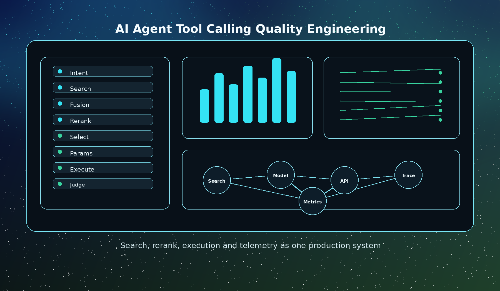
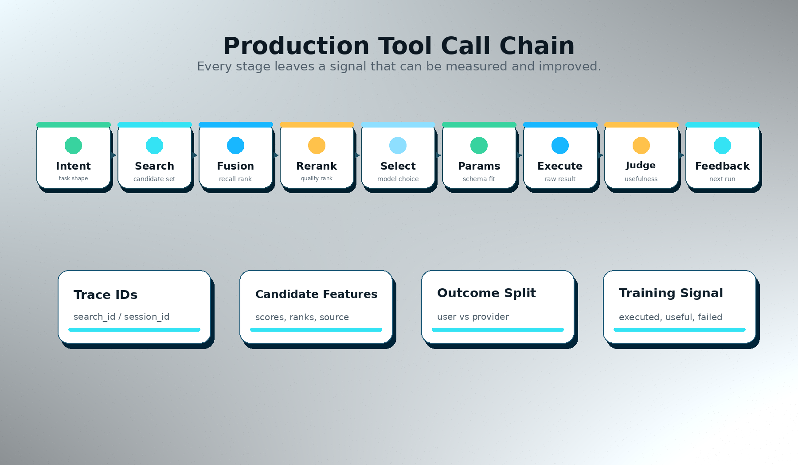
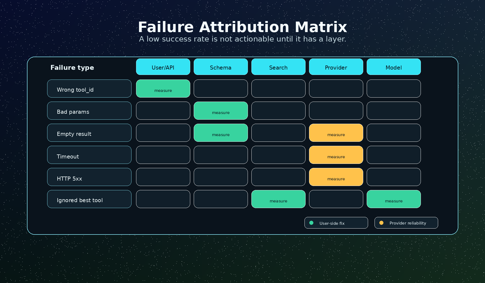
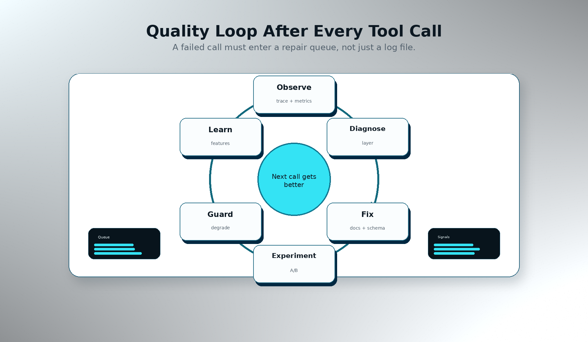

上个月我们复盘过一次很典型的工具调用事故。

用户问得很正常：

> “帮我分析长电科技最近的财务表现、资金流和公告风险。”

这不是一个刁钻问题。一个金融 Agent 理应先找财务数据，再查行情和资金流，最后补公告或新闻。如果候选工具足够多，它甚至应该知道不同供应商擅长什么：有的适合查公告，有的适合查财务报表，有的适合查盘中行情。

但那次 Agent 的执行链路并不好看。它先搜到了二十多个工具，其中既有财务、公告、资金流，也有一些名字相近但能力不匹配的工具。随后它选择了一个看似相关的工具，填进去的参数却像另一个供应商的格式。接口当然失败。日志里最后只留下一个模糊的结论：工具调用失败。

如果只看这一行日志，很容易把责任推给模型：“模型又乱填参数了。”

后来我们把 search、rerank、tool schema、execute、第三方原始返回和 session 串起来看，发现它不是一个单点错误。它是一条链路上连续几个小偏差叠在一起：召回里正确工具没有足够靠前，工具说明里的参数边界不够硬，模型把两个相近工具的参数记混了，执行层又把用户侧错误和供应商错误混在同一类失败里。

这件事让我们重新确认了一个判断：**Tool Calling 不是一个函数调用问题，而是一个质量工程问题。**



## 一次工具调用，实际有九段链路

很多 demo 会把 tool calling 画成两步：模型决定调用哪个函数，然后函数返回结果。

生产环境不是这样。

一个真实 Agent 要调用外部工具，至少要经过下面九段：



第一段是意图理解。用户说“分析长电科技”，Agent 要知道这不是只查股价，也不是只查公司简介，而是一个组合任务：股票代码识别、财务报表、行情、资金流、公告、风险事件，最后再做归纳。

第二段是搜索。工具不可能全塞进 prompt。平台需要把自然语言 query 转成候选工具集合。这里会用全文召回、中文分词、向量召回、别名、provider 信息、category、capability 等信号。

第三段是融合。全文召回对“公告”“财报”这种精确能力词敏感，向量召回对语义相近的工具更友好。两路结果需要融合，常见做法是 RRF 一类的 rank fusion。融合之后的分数不是最终相关性，它只是“这个工具值得进入候选池”的证据。

第四段是 rerank。候选工具多了以后，只靠文本相似度不够。一个工具描述里出现“财务分析”，不代表它真的适合当前任务。排序模型还需要看历史成功率、参数复杂度、延迟、价格、provider 质量、是否支持当前地区、是否常被 Agent 采用。

第五段是工具选择。模型看到前几名候选工具后，会决定调用一个还是多个。这里有一个经常被低估的指标：**adoption rate**。正确工具排在第 3 名，如果模型每次只用第 1 名，那第 3 名和没出现差不多。

第六段是参数生成。参数 schema、示例参数、字段描述、错误提示都会影响模型怎么填。`symbol`、`code`、`ticker`、`stock_code` 看起来都是股票代码，但有的要求 `603308.SH`，有的要求 `SH603308`，有的只要 `603308`。这类细节不写清楚，模型很容易“看起来合理，实际错误”。

第七段是执行。执行层要处理鉴权、限流、供应商超时、缓存、结果截断、字段归一化，还要判断一次调用到底算不算成功。

第八段是结果判断。HTTP 200 不等于 Agent 成功。返回空数组、全 null 财报、错误日期范围、字段单位错了，都可能让最终回答变差。

第九段是反馈。一次调用不能只写日志。它要回流到工具文档、索引、rerank 训练样本、provider 质量统计、告警和降权策略里。否则下次还会错。

这九段里任何一段没观测，就会出现“看起来是模型问题，其实没法定位”的情况。

## 搜索质量：不是相关就够了

工具搜索最容易犯的错，是把它当普通文档搜索。

普通文档搜索只需要回答“这篇文档和 query 像不像”。工具搜索还要回答另一个问题：**模型能不能拿这个工具完成用户任务。**

比如用户搜“华岭数据公告”。这里至少有两个意图：

- “华岭数据”是品牌或数据源偏好；
- “公告”是核心能力。

如果把“华岭数据”作为和工具名称、描述同等权重的文本塞进索引，结果可能变成所有华岭数据工具都排前面，哪怕它们不是公告工具。这看似满足了品牌词，实际牺牲了能力匹配。

更合理的做法是把信号拆开：

| 信号 | 作用 | 权重倾向 |
| --- | --- | --- |
| 工具名称 | 明确能力入口，如公告查询、利润表、实时行情 | 强 |
| 工具描述 | 解释能力边界和适用场景 | 强 |
| 参数描述 | 帮助判断工具能否接住当前实体 | 中 |
| category / capability | 领域和任务类型 | 中 |
| provider 品牌词 | 用户偏好的数据源或供应商 | 弱加分 |
| 历史质量统计 | 成功率、延迟、价格、稳定性 | rerank 阶段使用 |

品牌词应该影响排序，但不能盖过能力词。搜“华岭数据公告”时，最理想的顺序是：

1. 华岭数据的公告类工具；
2. 其他供应商的公告类工具；
3. 华岭数据的其他工具；
4. 语义相近但能力不直接匹配的工具。

这背后其实是一个 intent-aware ranking 问题。查询词里的 token 不应该一视同仁。能力词、实体词、品牌词、时间词、地域词，对排序的作用不同。

如果平台只保存一个 `search_text`，把所有字段拼进去，短期实现快，长期很难调。更稳的方式是保留结构化特征：name match、description overlap、provider in query、category match、capability match、参数类型、历史调用质量。全文检索给候选，rerank 再做结构化判断。

## Rerank 不能只学“相关性”

很多团队第一次做 rerank，会把目标定义成“把最相关工具排前面”。这没错，但不够。

Agent 选工具时，相关性只是第一层。生产里还有几个同样要命的因素：

- 工具是否真的可用；
- 参数是否容易填对；
- 结果是否稳定；
- 调用成本是否合理；
- 延迟是否会拖垮交互；
- 供应商是否经常返回空结果；
- 这个工具是否在相似任务中被模型采用过。

举个例子，两个工具都能查 A 股财务数据：

| 候选工具 | 主要能力 | 文本相关性 | 近 30 天成功率 | 平均延迟 | 必填参数 | 价格 | 排序判断 |
| --- | --- | --- | --- | --- | --- | --- | --- |
| cn_equity.financial_statement.full | 三张报表明细，字段完整，适合深度建模 | 0.91 | 72% | 4.8s | 6 个 | 高 | 适合离线分析，不适合放在交互式任务首位 |
| cn_equity.financials.snapshot | 利润、资产、现金流核心指标快照，字段稳定 | 0.86 | 98% | 1.2s | 2 个 | 中 | 更适合排在前面，先帮 Agent 拿到可靠结果 |

只看文本相关性，报表明细工具应该排前面。看生产效果，财务快照工具反而更适合放在交互式 Agent 的首位：它更快、更稳定，参数也更不容易填错。

这也是为什么 rerank 的训练样本不能只来自人工标注的 relevance。它还应该吸收真实调用反馈：

- 候选工具是否曝光给模型；
- 模型是否采用；
- 是否成功执行；
- 结果是否被后续回答使用；
- 失败是参数问题、权限问题、供应商问题，还是空结果；
- 这个 query 下同类工具谁表现更好。

这里有一个细节：训练样本里要同时保存原始 fusion rank 和最终 rerank rank。否则你无法判断模型到底改了什么。

如果 `fusion_score` 和 `rerank_score` 被混在一起，或者只保存最终分数，复盘会非常痛苦。你看到某个工具排第 1，却不知道它是召回本来就强，还是 rerank 把它提上来的。也就无法判断 rerank 是真的提升，还是只是把原始排序复制了一遍。

一个可复盘的搜索历史，至少要保留这些信息：

```text
query
query_tokenized
candidate_tool_id
provider_id
recall_source
text_score / vector_score / fusion_score
fusion_rank
rerank_score
rerank_rank
tool_stats_success_rate
tool_stats_avg_latency
tool_param_count
required_param_count
categories / capabilities
exposed_to_agent
was_executed
execution_outcome
```

不是所有字段都要进模型，但这些字段要能被追溯。否则一次线上问题只能靠猜。

## 参数错误，通常不是“模型笨”

工具调用里最常见的失败之一是参数错误。

但参数错误不能简单归因给模型。很多时候，模型只是放大了文档和 schema 的歧义。

比如股票代码字段：

- `symbol`: A 股股票代码，必须带市场后缀，如 `600519.SH`
- `code`: 股票代码，如 `600519`
- `ticker`: 美股 ticker，如 `AAPL`
- `secucode`: 内部证券代码，如 `600519.SH`

如果工具描述只写“股票代码”，模型就会根据自己见过的格式猜。它猜对一次，不代表系统可靠；猜错一次，也不全是模型问题。

更好的 schema 写法应该把四件事讲清楚：

1. 输入实体是什么；
2. 格式是什么；
3. 反例是什么；
4. 如果用户只给公司名，应该先查哪个工具来解析代码。

例如：

```json
{
  "name": "symbol",
  "type": "string",
  "required": true,
  "description": "A股股票代码，必须使用 6 位代码 + 交易所后缀，如 603308.SH 或 000001.SZ。不要使用 SH603308、603308、公司简称。若用户只提供公司名，应先调用证券代码查询工具。"
}
```

这不是文案优化，是执行成功率优化。

还有一个经常被忽略的东西：示例参数。

如果历史 telemetry 里已经有高质量成功调用，就应该优先把真实成功参数样例展示给模型。没有 telemetry 时，再退回到人工 examples。因为真实样例包含了很多文档没写清楚的细节，比如日期是否闭区间、代码是否带后缀、分页默认值是否能省略。

参数样例的优先级大概应该是：

1. 最近成功调用的真实参数；
2. 人工维护的 canonical examples；
3. schema 自动生成的最小参数；
4. 让模型自己猜。

第四种应该尽量少发生。

## 成功率要拆成两层

工具调用统计里，最危险的指标是一个孤零零的 success rate。

因为它会把很多不同性质的问题混在一起。



假设某个 provider 昨天成功率 83%。这个数字没有任何行动指向。你不知道该找谁：

- 是用户传了不存在的 tool_id？
- 是模型填错参数？
- 是工具 schema 不清楚？
- 是第三方接口超时？
- 是供应商返回 200 但 data 为空？
- 是我们自己的执行层分类错了？

所以至少要拆两层成功率：

**用户侧成功率**关注用户最终有没有拿到可用结果。参数错、tool_id 不存在、权限不足、空结果，都会让用户侧失败。

**执行层成功率**关注 provider 真实可用性。它应该排除明显用户侧错误，只统计真正发到第三方并能代表供应商质量的调用。

一个简单口径可以是：

```text
provider_success_rate =
  count(provider_success == true)
  /
  count(provider_success in [true, false])

where raw_success_rate_excluded != true
```

这类口径看起来琐碎，但非常关键。

如果不拆，平台很容易做出错误动作。比如某个工具被大量用户用错参数，用户侧成功率很低。你如果把它当 provider 不稳定，就会错误降权甚至拦截一个本来没问题的供应商。正确动作应该是改文档、改 schema、加参数校验、补样例，而不是惩罚 provider。

反过来，如果第三方接口真实 5xx 或 timeout 很多，用户侧错误又被混在一起，告警会被稀释。工具明明该降权，却看起来只是“偶尔失败”。

## 可观测性不是多打日志

Agent 工具调用的可观测性，不是把 request 和 response 全塞进日志。

真正有用的是能回答五个问题：

1. 用户当时想完成什么任务？
2. 搜索返回了哪些候选工具，为什么这样排序？
3. 模型看到了哪些工具，最后采用了哪个？
4. 参数是怎么来的，和 schema 是否一致？
5. 失败属于哪一层，下一步应该改哪里？

这要求 search history 和 tool call history 能通过稳定 ID 串起来。最基本的是 `search_id` 和 `session_id`。

没有 `search_id`，只能看到某次 execute 失败，看不到它是从哪次搜索来的。没有 `session_id`，就看不到一个用户任务里 search 和 execute 的顺序。没有 `model`，就无法比较不同模型的工具采用差异。没有 `source_system`，就无法判断调用来自官网、插件、CLI 还是某个集成系统。

但也不能无脑记录所有东西。需要注意三条边界：

- 不记录敏感凭证、API key、token；
- 对大结果做摘要和截断，保留可复盘字段；
- 错误信息保留原始 provider error，同时做平台侧分类。

比较实用的一条记录结构是：

```text
session_id: 一次用户任务
search_id: 一次搜索
query: 原始 query
candidate_tools: top N 候选及分数
tool_infos: 曝光给模型的工具信息
execute: tool_id + 参数摘要 + outcome
provider_raw: 第三方原始状态、错误码、耗时
stats: search latency / rerank latency / execute latency
model: 发起工具选择的模型
source_system: 调用入口
```

这不是为了“以后可能有用”。它直接决定你能不能在 10 分钟内复盘一个线上问题。

## 质量闭环：每次失败都要有去处

如果一次失败只停留在日志里，它没有价值。

它要进入闭环。



我们通常会把失败分成几类处理：

**搜索召回问题**：正确工具没有进入候选。动作是补索引字段、调整中文分词、增加 category/capability、补 provider 内部搜索词。

**排序问题**：正确工具召回了但排得太靠后。动作是调整 rerank 特征、加入历史质量、做 A/B test。

**工具文档问题**：模型看到了正确工具但填错参数。动作是改 schema 描述、补 examples、增加参数校验和错误提示。

**执行归因问题**：日志把用户侧错误记成 provider 失败。动作是修 outcome taxonomy，拆用户侧成功率和执行层成功率。

**供应商可用性问题**：第三方 timeout、5xx、空结果异常。动作是 provider diagnostics、告警、临时降权、必要时拦截。

**模型采用问题**：正确工具排在前面但模型不用。动作是调 prompt、减少候选噪音、优化工具摘要，或者在 eval 里记录 adoption。

这里 A/B test 很重要。搜索排序改动很容易自我感觉良好，尤其是看单个 query 时。你觉得某个工具应该排前，但全局可能伤害其他任务。

比较稳的做法是：

- 测试环境可以全量走新 rerank；
- 线上小流量灰度；
- 同时记录 search latency、rerank latency、adoption、top1/top3 execution、success rate；
- 分 query category 看效果，不只看总体平均值；
- 对金融、天气、新闻、科研等不同领域分开看。

总平均数很会骗人。金融类提升 10%，新闻类下降 20%，总体可能看起来没变化。

## 评估 Agent，不要只评估搜索结果

还有一个坑：只评估 search API 返回结果。

这适合早期调搜索，但不够评估 Agent 的真实表现。

真实用户不会看完整 top 20 工具列表。用户只会看到 Agent 最终有没有完成任务。中间还隔着模型理解、工具采用、参数生成、结果读取和最终回答。

所以更接近生产的 eval 应该模拟 Agent：

1. 给模型一个真实任务，比如“帮我分析长电科技最近的财务和资金流”；
2. 让模型通过系统提供的 search 和 execute 接口完成任务；
3. 记录模型看到了哪些搜索结果；
4. 记录它采用了哪些工具；
5. 默认执行，不做“只评估搜索不执行”的捷径；
6. 用另一个评估模型或规则判断最终回答是否完成任务；
7. 输出搜索、采用、执行、成功、延迟等指标。

指标可以包括：

| 指标 | 说明 |
| --- | --- |
| Top1 Exec | 排第一的工具是否被执行 |
| Top3 Exec | 前三名是否覆盖被执行工具 |
| Top5 Success | 前五名中是否有成功完成任务的工具 |
| Search → Call | 搜索结果到实际调用的转化率 |
| First Useful Rank | 第一个有用工具的排名 |
| Success Rate | 最终任务成功率 |
| Avg Search Latency | 搜索平均耗时 |
| Avg Rerank Latency | rerank 增量耗时 |
| Provider Success Rate | 第三方真实执行层成功率 |

这类 eval 比单纯看 NDCG 或人工 relevance 更麻烦，但它更接近用户体感。

用户不关心某个工具语义相关性 0.89。用户关心 Agent 有没有把事办成。

## 一个成熟工具网络应该长什么样

如果把上面所有内容压缩成一张工程清单，我会看这些能力：

- 搜索层能保留多路召回分数和原始 rank；
- rerank 层能解释最终排序和原始排序的差异；
- tool schema 有明确参数格式、反例和成功样例；
- execute 层区分用户侧失败和 provider 原始失败；
- history 里能用 search_id/session_id 串起完整任务；
- provider 统计同时有用户侧成功率和执行层成功率；
- 低成功率工具有降权、告警和人工诊断入口；
- A/B test 能按 query category 和工具类型看效果；
- eval 能模拟 Agent 真实 search + execute，而不是只看搜索列表；
- 每次失败都能进入文档、索引、排序、供应商治理中的某个修复队列。

这些东西听起来不如“接入 1 万个工具”性感，但它们决定了工具网络能不能真的被 Agent 用起来。

## 结尾：工具越多，质量工程越重要

当系统只有 10 个工具时，模型选错了，开发者可以手工 prompt 修一下。

当系统有 100 个工具时，需要搜索。

当系统有 10,000 个工具时，需要的是搜索、排序、执行、观测、评估和治理组成的一整套质量工程。

工具调用失败时，最重要的问题不是“模型为什么又错了”，而是：

> 这次失败，究竟发生在链路的哪一层？我们能不能让下一次同类任务少错一次？

这也是 QVeris 在做能力路由网络时最关注的地方。统一协议只是入口，真正的工程难点在后面：让 Agent 找得到、选得准、填得对、调得通，并且在每次失败后变得更可靠。

Tool Calling 的下一阶段，不会只是更多函数。它会是一套可度量、可诊断、可持续优化的工具质量系统。
