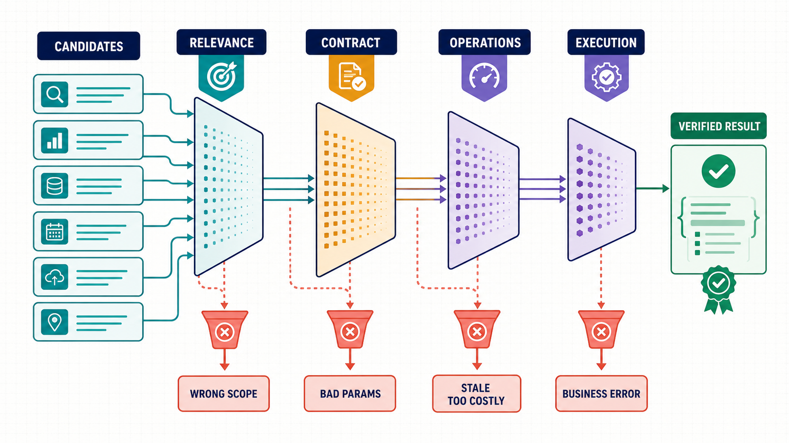
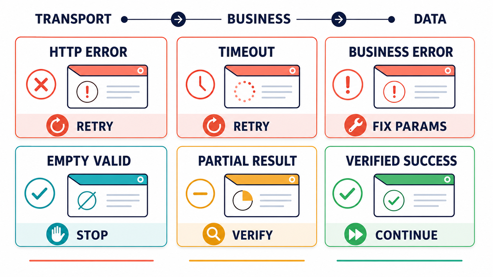

给 Agent 接入工具之后，最容易产生的错觉是：只要模型能生成一次 Function Call，工具能力就已经具备。真实情况恰好相反。模型选中了一个名字相似的工具，只能说明它完成了第一步；数据范围、参数语义、运行状态和返回结果中的任何一层，都可能让这次调用失去价值。

> **本文讨论的不是“模型会不会调用函数”，而是一次工具调用怎样才算完成：**选对能力、构造正确参数、识别真实执行结果，并把可信证据交回 Agent。

## “找得到”与“用得好”之间有四道门



Toolformer 把工具使用概括为几个连续决策：什么时候调用、调用哪个 API、传入什么参数，以及怎样利用返回结果。Berkeley Function Calling Leaderboard 从单轮函数调用逐步扩展到多轮、并行调用、动态工具和 Agent 场景，也说明工具能力不能只用“JSON 格式是否正确”衡量。

工程上可以把工具选择拆成四道门：

1. **相关性：**工具解决的是不是用户真正的问题；
2. **契约：**参数、数据范围、标识和输出结构是否匹配；
3. **运行质量：**数据是否新鲜，延迟、成功率和价格是否可接受；
4. **执行语义：**调用是否在业务上成功，结果是否完整可信。

前一道门通过，不代表后一道门自然成立。名字相关但数据范围不对的工具应在第一道门被淘汰；参数示例过时的工具应在第二道门被发现；高延迟或近期失败率异常的工具应在第三道门降级；HTTP 200 但响应体报错，则必须在第四道门判为失败。

## 第一道门：不要把问题原文当成工具查询

用户问的是信息，能力发现系统找的是“能够提供这类信息的工具”。两者不是同一种查询。

| 用户问题 | 不合适的工具查询 | 更合适的能力描述 |
|-|-|-|
| 明早东京会不会下雨？ | 东京明早是否下雨 | 按小时返回未来天气和降水概率的预报 API |
| 这家公司最近为什么波动？ | 某公司为什么下跌 | 行情、公告、资金流和公司新闻数据 API |
| 把这份 PDF 里的表格提出来 | 分析这个 PDF | 支持表格结构化输出的 PDF 解析或 OCR API |

直接使用用户原文，容易把实体名称和当前事实混进能力查询，召回的是“内容相似”而非“功能匹配”的候选。更可靠的方法是先抽取能力类型、地域、时间粒度、输入形式和输出要求，再形成工具查询。

对“明早东京会不会下雨”这个任务，至少要识别出：

- 需要预报，而不是当前天气；
- 粒度应为小时级，而不是日级摘要；
- 需要降水概率或降水量；
- 时间必须按东京时区解释；
- 最终结论需要覆盖用户所说的“明早”。

如果 Agent 选中的是“当前天气”工具，即使调用完全成功，回答仍然是错的。这类错误不能靠重试解决。

## 第二道门：Schema 正确，不等于参数语义正确

参数生成常见的检查只到 JSON Schema：字段存在、类型正确、必填项齐全。但真实 API 的错误往往藏在类型之外。

| 问题 | 看起来合法的参数 | 真实风险 |
|-|-|-|
| 证券标识 | `"600519"` | 接口可能要求 `600519.SH`、交易所代码或内部证券 ID |
| 时间 | `"2026-07-27"` | 接口可能按 UTC、当地时区或交易日解释 |
| 金额 | `100` | 单位可能是元、万元、美元或最小货币单位 |
| 分页 | `page=1, size=1000` | 服务可能限制最大 100 条，或使用 cursor 而不是页码 |
| 枚举 | `"daily"` | 实际值可能是 `1d`、`D` 或数字代码 |

因此，工具描述至少应包含：字段含义、格式、单位、枚举、条件必填关系、默认值、副作用、示例参数和边界条件。Anthropic 在工具设计实践中指出，面向 Agent 的工具不是传统 API 文档的简单复制；描述必须帮助非确定性模型在相似工具之间做出稳定选择。

### 示例参数不是答案模板

示例的作用是展示结构，不是让 Agent 原样复制。一个股票工具使用 AAPL 作为示例，不代表所有市场都接受纯 ticker；一个天气工具使用 London，不代表它支持中文城市名；一个日期示例使用当天，不代表接口允许未来日期。

调用前应完成三层校验：

1. **结构校验：**类型、必填、枚举、格式；
2. **语义校验：**单位、时区、标识体系、字段之间的约束；
3. **任务校验：**这些参数是否仍然对应用户原始目标。

## 第三道门：同样能用的工具，运营质量可能完全不同

当多个候选工具都能返回天气、行情或公告时，Agent 不能只比较名称和描述。至少还应考虑：

- **数据覆盖：**市场、地域、语言、历史跨度和更新频率；
- **数据新鲜度：**字段标称实时，还是实际延迟数分钟或数小时；
- **近期成功率：**长期平均值可能掩盖供应商当天的故障；
- **延迟分布：**交互任务应关注 P95，而不是只有平均值；
- **价格：**成功收费、按记录收费还是按结果数量收费；
- **输出可用性：**结构化字段是否稳定，是否经常返回大段文本或截断内容。

选择策略也不应该永远是“成功率最高”。交互式问答可能更重视延迟；批量研究更重视完整性；高风险决策可能愿意增加一次独立来源核验。工具排序必须服务于任务，而不是脱离场景形成一个永久榜单。

## 第四道门：HTTP 200 不代表任务成功



很多第三方接口会在 HTTP 200 的响应中返回业务错误，例如：

```json
{
  "code": "INVALID_SYMBOL",
  "message": "security not found",
  "data": null
}
```

如果执行层只检查 HTTP 状态，这次调用会被记为成功；Agent 看到 `data=null` 后，可能把它解释成“没有相关数据”，甚至进一步生成错误结论。统计系统也会把业务错误混入空结果，导致工具成功率、降级和重试策略全部失真。

一次执行至少需要分三层解释：

1. **Transport：**请求是否到达并收到响应；
2. **Business：**供应商是否接受请求并完成业务处理；
3. **Data：**结果是有效空集、部分数据、完整数据，还是无法判断。

“有效空集”与“失败后为空”必须分开。查询一个确实没有公告的日期范围可以是成功；证券代码无效导致的空数据则是参数错误。前者应停止重复调用，后者应修正参数或更换候选。

## 工具结果回到模型前，还要做一次整理

工具返回的数据不应未经处理全部塞进上下文。结果层需要完成：

- 保留来源、查询条件、数据时间和单位；
- 把业务错误转成统一、可机器判断的 outcome；
- 标注截断、分页、缺失字段和部分成功；
- 限制过大的响应，优先返回与任务相关的字段；
- 对来自外部数据的指令性文本进行隔离，避免把数据内容误当成系统指令；
- 在多个来源冲突时保留差异，而不是静默选择一个结果。

返回越多不一定越好。无关字段会占用上下文，也会增加模型抓错重点的概率。更合理的做法是让 Agent 在调用前说明需要哪些字段，执行层返回可追溯的精简结果，同时保留获取完整内容的途径。

## QVeris 如何把工具使用拆成可检查的步骤

QVeris 的公开协议把工具使用分为 Discover、Inspect 和 Call。三步不是为了增加接口数量，而是为 Agent 提供三个不同的决策点。

### Discover：把大工具集缩成小候选集

Agent 用英文能力描述进行搜索，例如 `hourly weather forecast with precipitation probability API`。返回结果用于比较相关性、供应商和可用的质量信号，而不是直接回答“东京会不会下雨”。

### Inspect：使用当前契约，而不是记忆中的旧 Schema

Agent 在执行前检查当前参数、示例、成功率、延迟和价格。如果工具元数据被缓存，应设置较短有效期，或者在新的 Discover 返回该工具时刷新。工具契约会变化，模型记住的旧参数不应成为执行依据。

### Call：保留搜索与执行的因果关系

调用时带上所选工具、结构化参数、search_id 和稳定的 session_id。这样可以回答“这次执行来自哪次搜索”“模型当时看到了哪些候选”“同一个用户任务进行了几次搜索和调用”。公开文档还建议 Agent 记录模型标识，便于分析不同模型的工具选择和参数生成质量。

QVeris 不能替代业务应用自己的最终校验。它提供能力发现、契约检查、结构化执行和质量信号；应用仍需根据自身场景决定权限、预算、是否需要第二来源以及哪些动作必须人工确认。

## 怎样评测一个 Agent 是否真的会用工具

只准备“应该调用工具”的题目，会训练出一个什么都想调用的 Agent。Anthropic 在 Agent 评测实践中建议同时覆盖正反两类情况：该调用时能够调用，不该调用时能够克制。

一套工具评测集至少包括：

| 用例类型 | 检查内容 |
|-|-|
| 应调用 | 实时信息、精确计算、外部业务动作是否正确触发工具 |
| 不应调用 | 稳定常识、本地可完成任务是否避免不必要的外部调用 |
| 多候选 | 能否根据范围、质量、延迟和价格选择合适工具 |
| 参数边界 | 时区、单位、标识、枚举和条件必填是否正确 |
| 业务失败 | HTTP 200 错误体是否被识别，是否避免错误重试 |
| 空与部分结果 | 能否区分有效空集、部分数据和真实失败 |
| 工具变化 | Schema 更新后是否重新 Inspect，而不是继续使用旧参数 |
| 成本约束 | 高价候选是否需要确认，是否能在预算内完成任务 |

指标也要覆盖完整轨迹：正确工具率、参数一次通过率、无效调用率、业务错误识别率、有效空集误判率、任务完成率、P95 延迟和单任务成本。最终答案正确但调用过程越权或浪费严重，不能算作高质量执行。

## 一份可以直接落地的检查清单

### 工具发布前

- 名称和描述是否能与相似工具区分；
- 参数是否包含格式、单位、枚举和条件约束；
- 示例是否真实可运行，并覆盖最常见场景；
- 结果中是否有明确的业务状态和数据时间；
- 是否定义超时、限流、空结果和部分结果；
- 是否有最小的真实调用评测集。

### Agent 调用前

- 查询描述的是能力，而不是直接询问事实；
- 候选工具的数据范围与用户目标一致；
- 使用的是当前 Schema 和示例；
- 参数通过结构、语义和任务三层校验；
- 延迟、成功率和成本满足当前任务约束。

### Agent 调用后

- 分别判断传输、业务和数据 outcome；
- 记录来源、时间、单位和执行标识；
- 明确标记截断、分页和部分成功；
- 只把任务相关字段交回模型；
- 失败按类型决定修参、重试、换工具、降级或停止。

## 结语

Agent 使用工具的质量，最终体现在一连串小判断上：问题有没有被抽象成正确能力、候选有没有经过检查、参数有没有保持业务语义、结果有没有被正确分类。任何一步被“看起来差不多”替代，都会让最后的自然语言回答变得不可信。

QVeris 的价值不是简单扩大 Agent 能看到的工具数量，而是把能力发现、候选检查和结构化调用分开，让每一步都能被观察和评测。工具越多，这种分层越重要。真正好用的 Agent，不是调用次数最多的 Agent，而是能够在需要时选对、调对，并知道什么时候应该停下来的 Agent。

## 参考资料

- [Toolformer: Language Models Can Teach Themselves to Use Tools](https://arxiv.org/abs/2302.04761)
- [Berkeley Function Calling Leaderboard](https://gorilla.cs.berkeley.edu/leaderboard)
- [A Function Calling Perspective on Scalable LLM Agent Evaluation](https://www2.eecs.berkeley.edu/Pubs/TechRpts/2025/EECS-2025-184.html)
- [Writing effective tools for AI agents](https://www.anthropic.com/engineering/writing-tools-for-agents)
- [Demystifying evals for AI agents](https://www.anthropic.com/engineering/demystifying-evals-for-ai-agents)
- [tau-bench: A Benchmark for Tool-Agent-User Interaction](https://openreview.net/pdf?id=roNSXZpUDN)
- [QVeris Documentation](https://qveris.ai/docs)
- [QVeris REST API Documentation](https://qveris.ai/docs/rest-api)
- [QVeris CLI Documentation](https://qveris.ai/docs/cli)
