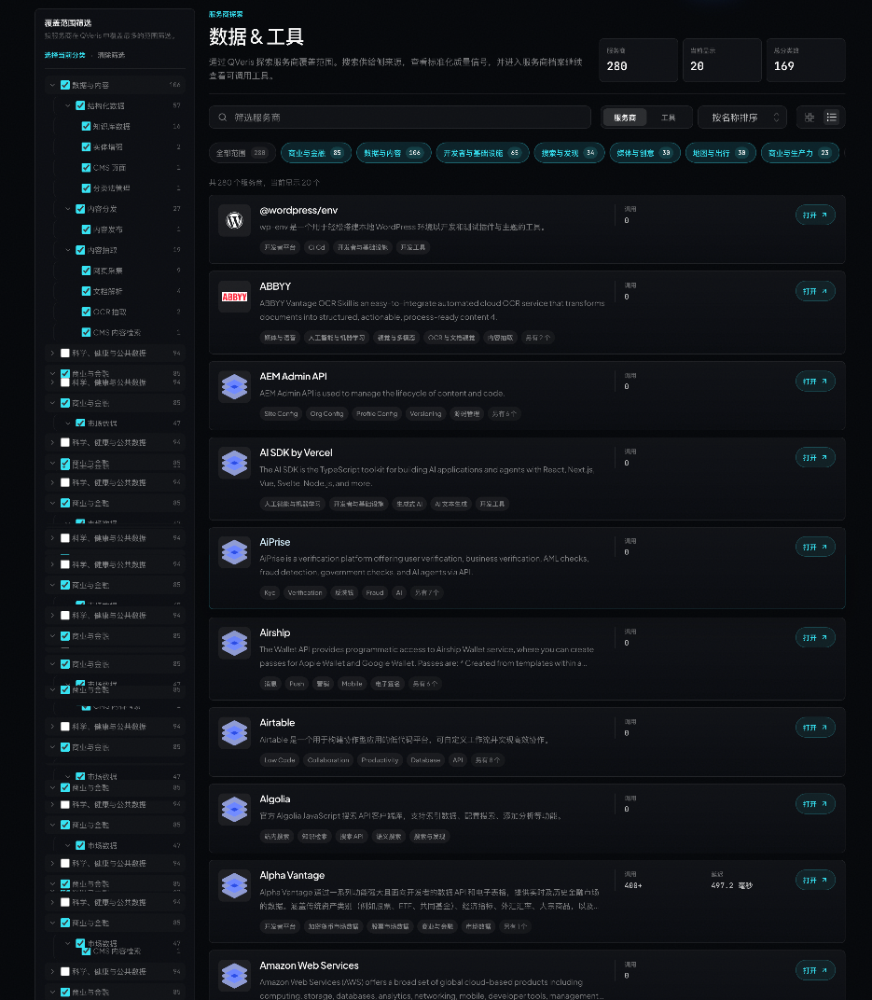
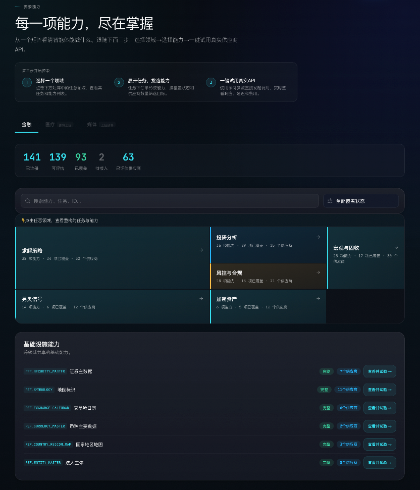
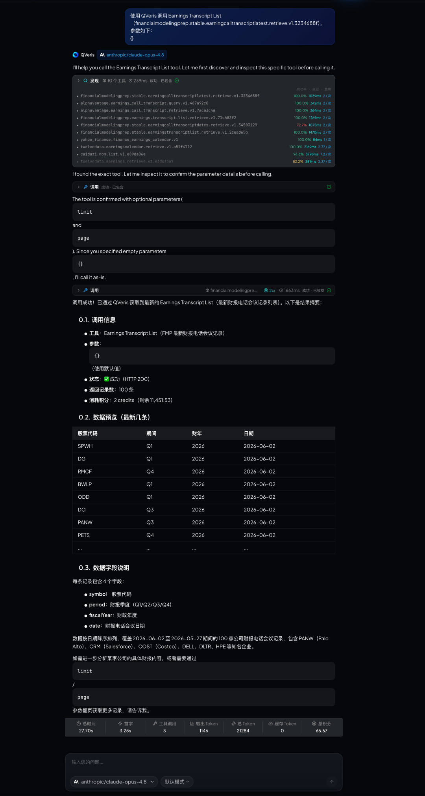

QVeris · 数据实测 

> 当投研、量化、风控都开始接入 AI，真正拉开差距的是：谁能让智能体连接实时金融能力。 
## AI Agent 很火，但它到底能帮你做什么？

  

最近，AI Agent 很火。 

很多人都在说：未来的 AI 不只是聊天，而是能帮你干活。 

但问题来了： 

**AI 想干活，光会回答问题还不够。它还得能查数据、找工具、调用服务、完成任务。**

比如你问 AI： 

「帮我查一下今天 A 股某只股票的行情。」 

「帮我分析一家公司的财报。」 

「帮我找一个可以查天气、地图、新闻、金融数据的工具。」 

「帮我调用一个 API，把结果整理出来。」 

普通 AI 可能只能给你一段文字。 

但真正的 Agent，需要能连接真实工具和真实数据。 

这就是 **QVeris** 要解决的问题。 
## 一句话说清楚：QVeris 是什么？

**  
**

**QVeris 是一个给 AI Agent 用的"万能工具箱"。**

它可以帮智能体找到工具、看懂工具、调用工具。 

官网对 QVeris 的定位是：**"把世界的能力，变成智能体的能力。"** 它面向 AI 智能体提供能力路由网络，让智能体可以发现、检查并调用真实数据、工具和外部服务。 

简单理解：以前 AI 只能"说"。接入 QVeris 后，AI 可以开始"查、选、调、做"。 
## QVeris 能用来做什么？

### 1. 找能力：不知道用什么工具，也能先搜 

进入 QVeris 的能力探索页面后，你可以像逛工具市场一样，看有哪些能力可以用。 

比如：金融数据｜股票行情｜财报数据｜宏观数据｜链上数据｜天气查询｜新闻资讯｜旅行数据｜企业信息｜API 工具 

你不需要一开始就知道某个 API 叫什么。只要知道自己想做什么，就可以先去找对应能力。 

比如：「我想查股票行情。」「我想做投研分析。」「我想给 Agent 接入实时数据。」「我想找一个能被 AI 调用的金融工具。」 

这一步解决的是：**AI 到底能调用什么？**

### 2. 看服务商：知道这个能力是谁提供的 

找到能力之后，还可以继续看背后的服务商。 

这一步很重要。因为同样是"金融数据"，不同服务商的数据范围、稳定性、成本、适用场景都不一样。 

QVeris 的服务商中心可以帮助用户理解：这个能力由谁提供；适合什么场景；能查哪些数据；调用成本大概是多少；是否适合接入自己的 Agent。 

这一步解决的是：**不是随便找一个工具，而是找到更合适的工具。**

### 3. 调工具：不只是展示，而是真的能调用 

QVeris 不只是一个工具展示页面。 

它的核心流程是：**发现能力 → 检查能力 → 调用能力**

QVeris 文档中也明确提到，客户端可以用自然语言发现能力，检查参数和成本信号，再用结构化参数调用选中的能力。 

比如你想让 Agent 查询 AAPL 股票报价，它可以先找到股票报价能力，再查看需要哪些参数，最后真正发起调用并返回结果。 

这一步解决的是：**AI 不只是知道工具存在，而是真的能用起来。**

### 4. 给开发者接入：让自己的 Agent 也能用这些能力 

如果你是开发者，也可以把 QVeris 接入到自己的智能体、应用或工作流里。 

QVeris 支持 API、Python SDK、CLI、MCP Server 等方式接入。官网也显示，QVeris 可以兼容 Cursor、Claude Code、Claude Desktop、OpenClaw、Codex、VS Code、Windsurf、Replit、V0 等多个平台。 

简单说：你可以把 QVeris 当成一个能力入口，让自己的 AI Agent 通过它去调用更多外部工具和数据。 

  

## 举个更好懂的例子

  

假设你想做一个"金融分析助手"。 

你希望它能：查股票行情；看公司财报；分析估值指标；追踪市场新闻；整理投资观点；输出结构化分析报告。 

如果没有 QVeris，你可能要一个个找数据源，一个个接 API，一个个处理参数和返回格式。 

但通过 QVeris，你可以先在能力地图里找金融能力，再进入服务商中心查看对应服务商，最后通过工具调用把能力接入 Agent。 

这样，AI 就不只是"回答金融问题"，而是可以真正去查数据、调工具、做分析。 

## QVeris 适合哪些人用？

**  
**

**如果你是普通用户：** 可以把它理解成一个 AI 工具能力平台，看看 AI 现在能调用哪些真实能力。 

**如果你是产品/运营：** 可以用它理解 Agent 能落地到哪些业务场景，比如金融分析、数据查询、内容生成、市场研究、企业服务等。 

**如果你是开发者：** 可以把它接入自己的 Agent，让 AI 具备调用真实工具和数据源的能力。 

**如果你是企业团队：** 可以用它降低接入外部工具和数据源的成本，让 Agent 更快进入实际业务流程。 

  

## 总结

  

AI Agent 真正有价值的地方，不是"更会聊天"，而是"真的能做事"。 

它需要：找得到工具；看得懂工具；选得出服务商；调得动 API；拿得到真实结果。 

而 **QVeris** 做的，就是把这些能力连接起来。 

**QVeris 是 AI Agent 的能力入口。它让 AI 从会聊天，变成能查数据、调工具、完成任务的智能体。**

快来体验吧： 

国内站：https://qveris.cn/

海外站：https://qveris.ai/
