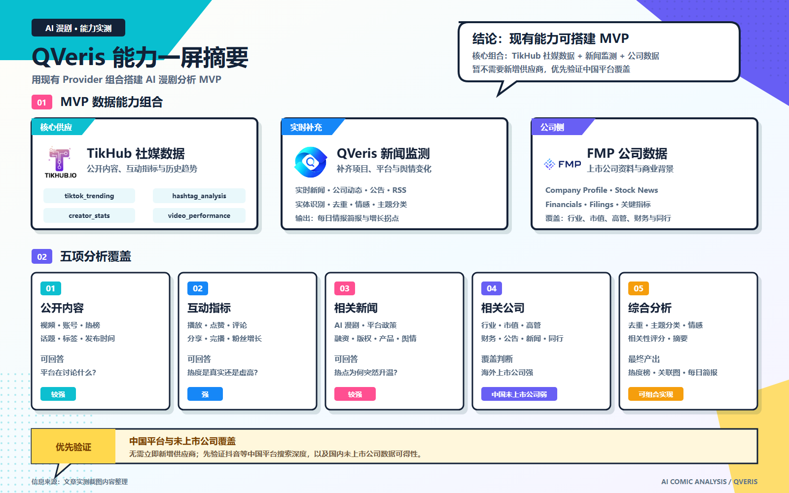
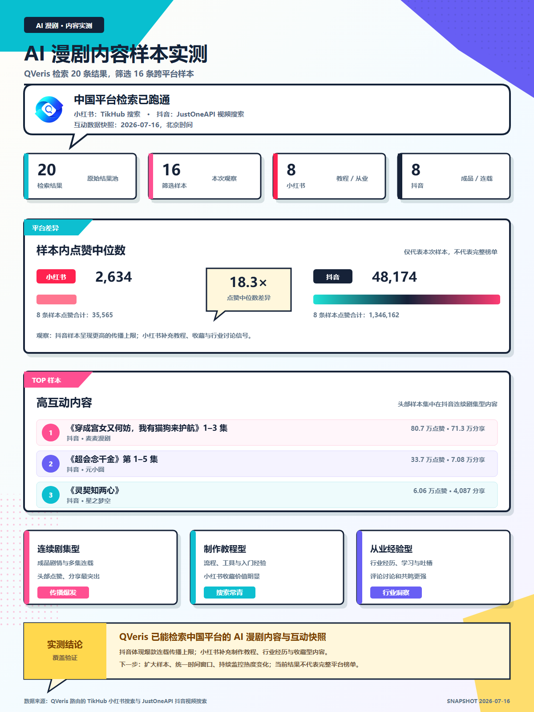
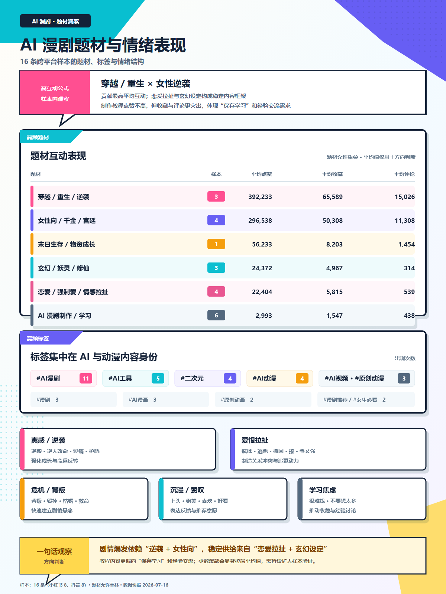
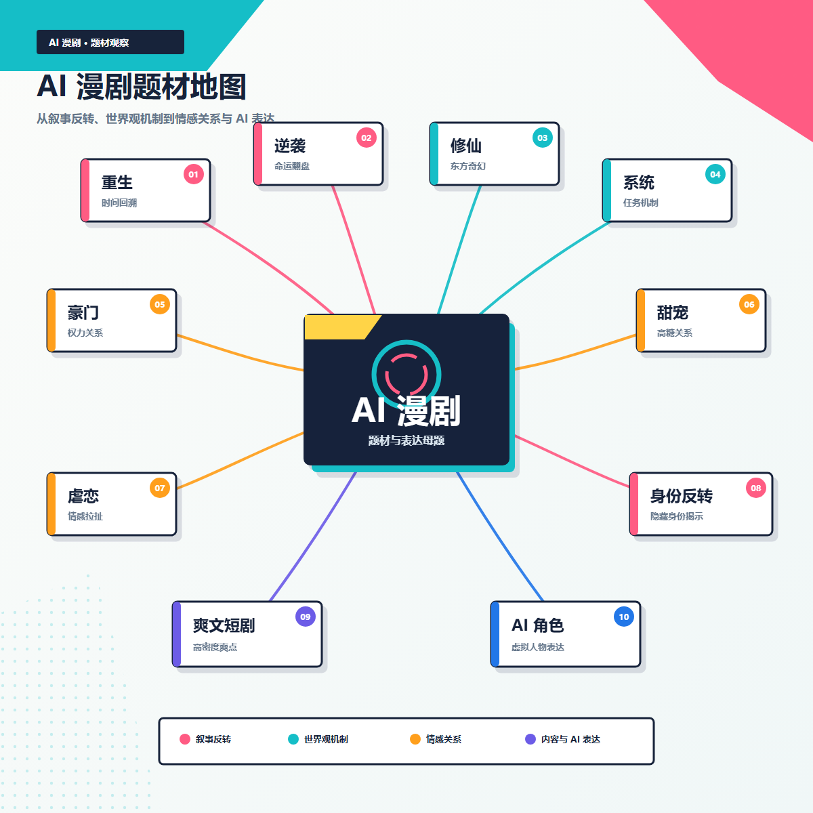
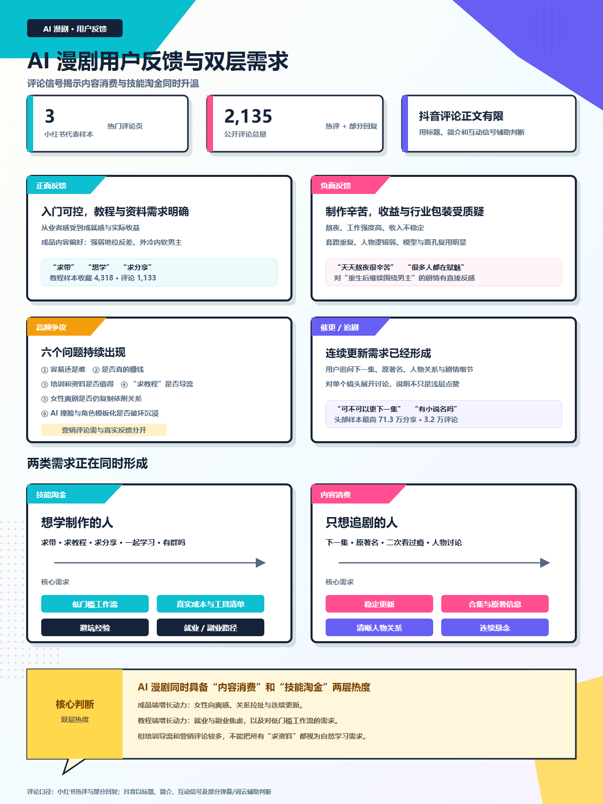
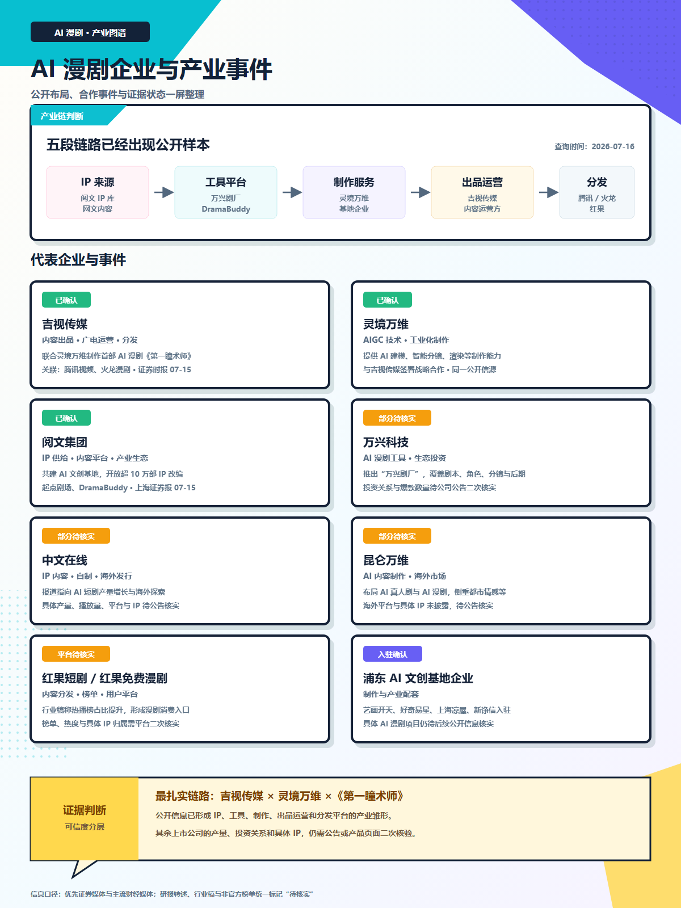
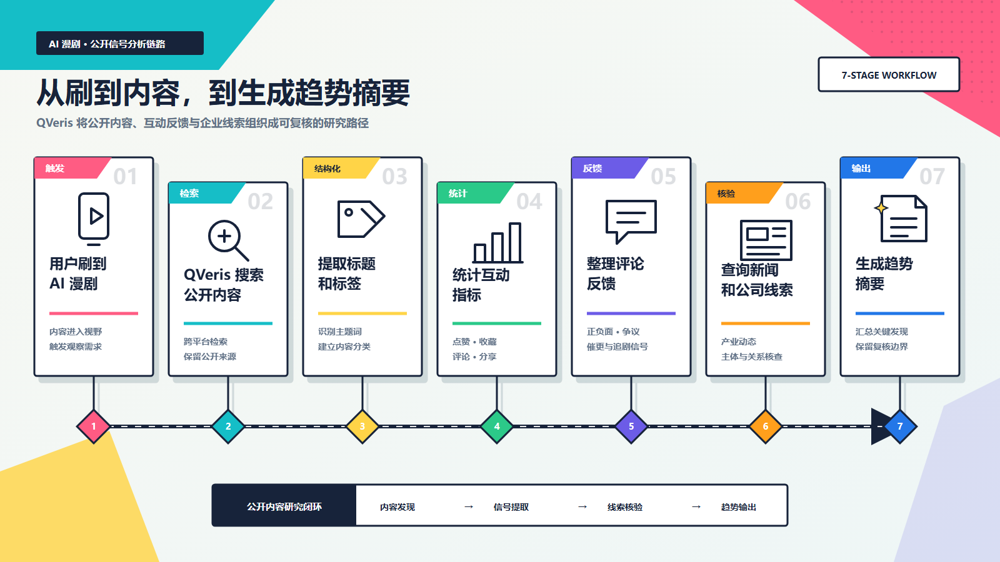

<title>AI 漫剧怎么突然占领了我的短视频？我让 QVeris 查了查</title>

# 我只是刷到一部，平台却觉得我能看一晚上

最近刷短视频时，我遇到了一种越来越难分类的内容。

它看起来像动画，但镜头和台词完全是短剧节奏；角色不一定自然，情绪却非常充沛；一集可能只有几分钟，标题里永远少不了重生、逆袭、修仙、系统、豪门，或者“所有人都看不起我”。

我点开一部之后，推荐页很快出现第二部、第三部。真人演员还没认熟，我已经开始追一个可能根本不存在的 AI 男主角了。

这些内容通常被叫作 AI 漫剧。近期公开报道也开始频繁讨论它在短剧榜单中的增长，以及平台、版权方和内容公司的集中入场。

但作为一个普通用户，我真正好奇的不是“AI 漫剧市场有多大”，而是几个更直接的问题：

> 大家到底在看什么？
> 
> 哪些题材在本次样本中的互动表现更高？
> 
> 公开互动数据里，能不能看到用户主动追更、收藏和讨论的信号？
> 
> 这些内容背后又是谁在做？

于是，我把这个问题交给了 QVeris。

---

# 第一步：先把“AI 漫剧”从一个词变成一批真实内容

我没有先让 Agent 写行业分析，而是让 QVeris 去找公开平台上真正存在的 AI 漫剧内容。

本次实测中，QVeris 返回了内容标题、作者账号、发布时间、话题标签，以及点赞、收藏、评论、分享等公开互动指标。

这一步很重要。

如果没有真实内容样本，所谓“趋势分析”很容易变成几段正确但空泛的话：AI 降低了制作成本、短剧符合碎片化消费、用户喜欢强情绪内容……这些判断未必错，但还没有回答大家究竟在看什么。

本次 QVeris 共检索到 20 条结果，经过相关性筛选后，建立了一个包含 8 条小红书内容和 8 条抖音内容的跨平台样本池。

> 需要说明的是，AI 漫剧、AI 动画和漫剧在不同平台上的标签口径并不完全一致。本次 16 条内容仅用于展示一条可复核的分析路径，不代表平台完整榜单或整个行业的内容结构。

---

# 第二步：爆款题材可能比我想象得更“诚实”

刷多了之后，我发现 AI 漫剧似乎并不太掩饰自己的情绪配方。

角色开局可以很惨，身份反转必须很快，冲突最好前三十秒就发生。如果主角第一集还没有被赶出家门、解除婚约、觉醒系统或者发现隐藏身份，我甚至会怀疑它是不是走错片场了。

当然，这只是刷视频时的体感。真正要判断题材趋势，还是应该看数据。

QVeris 可以让 Agent 对样本中的标题、简介和话题标签做聚类，统计：

| 分析维度 | 本次样本观察 |
|-|-|
| 高频题材 | 穿越/重生/逆袭、女性向/千金/宫廷、玄幻/妖灵/修仙、恋爱/情感拉扯 |
| 高频情绪词 | 逆袭、重生、背叛、救赎、争夺、催更 |
| 高频人物设定 | 女性爽感角色、隐藏身份、系统或修仙设定、高糖关系 |
| 互动表现较高的题材 | 穿越/重生/逆袭、女性向/千金/宫廷 |
| 不同平台偏好的内容类型 | 抖音样本更偏连续剧情和成品内容；小红书样本更多制作教程、行业经验和资料收藏 |

这样得到的就不是“AI 漫剧很火”，而是更具体的结论：什么题材多、什么题材互动高、哪些内容只是产量大但用户反应普通。

---

# 第三步：点赞是一种态度，评论区才更像真人现场

内容能不能被生产出来是一回事，用户愿不愿意追又是另一回事。

AI 漫剧的评论区可能比视频本身更有意思。有人关心剧情，有人吐槽角色手指，有人接受不了口型，也有人完全不在乎画面是否真实，只想催更。

于是，我继续让 QVeris 整理公开评论和互动信号，分别观察用户在夸什么、吐槽什么，以及是否出现催更、求教程和求资料等明确需求。

这里需要非常克制。Agent 不应该把几十条评论写成“全网用户一致认为”，而应该清楚标注样本范围和平台来源。

> 由于抖音评论正文的可获得范围有限，本次评论分析主要使用 3 条小红书样本的公开热评与部分回复；抖音侧则结合标题、简介和互动指标辅助判断。

---

# 第四步：这么多 AI 漫剧，背后到底是谁在做

看到这里，我的好奇心已经从“什么剧好看”转向了“谁在批量生产”。

QVeris 可以继续调用新闻、事件和企业信息能力，把内容样本往产业链上延伸：

- 哪些平台正在增加 AI 漫剧内容
- 哪些公司公开布局了 AI 短剧或漫剧
- 这些公司原来做的是影视、网文、游戏，还是 AI 技术
- 是否存在版权合作、IP 改编或平台合作信息
- 相关企业的成立时间、业务范围和公开关联关系

这一步最能体现 QVeris 和普通搜索的区别。

搜索引擎可能会给我十篇文章，内容平台会给我十部新剧，企业数据库会给我十家公司。QVeris 要做的，是让 Agent 找到合适的能力，把这些线索组织成同一个问题的答案。

---

# QVeris 真正补上的，是从“刷到”到“看懂”的过程

这次查询最有意思的地方，不是让 Agent 告诉我哪部 AI 漫剧最好看。

它做的是另一件事：

> 先找到公开内容，再提取标题、标签和互动数据；接着整理用户反馈，补充新闻与公司线索；最后把“我最近总刷到 AI 漫剧”的个人感受，变成一条可以复核的内容趋势研究路径。

过去，我刷到一部剧，平台会继续给我推荐十部。

现在，我可以让 QVeris 反过来问平台：

- 这些内容为什么会一起出现？
- 用户到底对什么有反应？
- 哪些平台、公司和制作团队已经公开参与这条产业链？
- 这是一阵流量，还是一种新的内容形态？

这才是 QVeris 在这个故事里的角色。

它不是某个短视频平台的搜索框，也不是一份只会罗列新闻的行业报告。它是 Agent 连接公开内容、互动信号、新闻事件和企业信息的统一入口。

至于我还会不会继续追 AI 漫剧？

会。但下次再看到一个表情僵硬、手指数量可疑，却让我忍不住点开下一集的主角时，我至少知道该去哪里查查，他背后到底是谁了。

