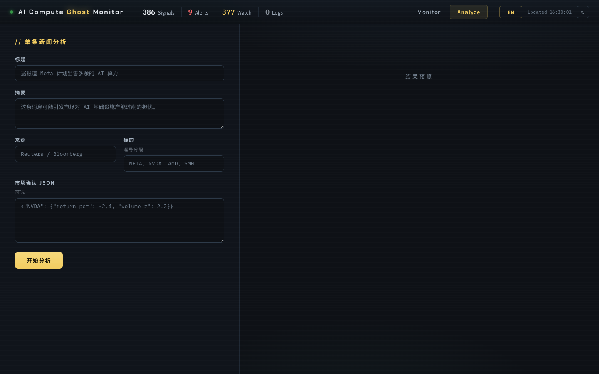

# 我们做了一个 AI 算力“鬼故事”雷达

一条新闻，为什么会让 GPU、HBM、数据中心、电力和 ETF 一起变脸？

*配图 1：AI Compute Ghost Monitor 监控面板*

## 01 先讲一个“鬼故事”

过去两年，AI 市场里最容易吓人的，已经不只是“某家公司业绩不及预期”。

更吓人的是一种叙事：

“是不是买了太多 GPU？”

“数据中心是不是建快了？”

“HBM 会不会突然过剩？”

“云厂商的 AI capex 到底能不能赚回来？”

“如果一个大厂开始出售多余算力，这到底是变现能力，还是过度建设的信号？”

这些问题听起来像新闻标题，但在市场里，它们会沿着一整条链路扩散：

云厂商的资本开支，影响 GPU 和 ASIC 需求；

GPU 需求，影响 HBM、CoWoS、服务器、电源和散热；

数据中心建设，又会牵动电力、租赁、融资和 ETF 篮子。

所以我们把这类新闻叫做 AI 算力“鬼故事”。

它不是因为新闻本身玄乎，而是因为它会攻击市场最核心的共识：AI 算力需求是不是还会继续增长。

## 02 普通新闻监控不够用

普通新闻工具通常回答的是：

这条新闻讲了什么？

但在 AI 算力链条里，我们真正想问的是：

这条新闻会攻击哪一个市场叙事？

它影响的是云厂商、芯片、内存、服务器，还是电力散热？

它是单个公司事件，还是会传染到整个 basket？

市场有没有已经开始用价格、成交量、ETF 或期权隐含波动率去确认？

这就是我们开始做 \*\*AI Compute Ghost Monitor\*\* 的原因。

它不是一个泛新闻聚合器，也不是一个交易喊单工具。它更像一个面向 AI infrastructure 的叙事风险雷达：

抓到新闻之后，不急着下结论，而是先把它拆成结构化问题。

*配图 2：单条新闻分析页*

\`/Users/liuqiyu/Desktop/qveris/09_ai_compute_ghost_monitor/project/docs/screenshots/analyze.png\`

## 03 我们到底做了什么

这个项目的核心目标很简单：

检测可能改变市场对 AI 基础设施需求定价的新闻，然后解释方向、影响链条、置信度和市场确认信号。

我们把一条新闻拆成五步：

1. 识别 ghost type

   这到底是算力过剩、capex ROI 怀疑、订单削减、HBM 短缺、产能洪水、数据中心延期，还是融资压力？

2. 判断受影响层级

   一条新闻不一定只影响新闻里的公司。它可能同时影响 hyperscaler、GPU、HBM、服务器、数据中心电力和半导体 ETF。

3. 映射方向

   方向不是简单看情绪。比如“云厂商出售多余算力”，对卖方可能是变现，对 GPU 供应链却可能是过剩信号。

4. 计算 Ghost Score

   用一个透明的打分规则判断它应该只是记录，还是进入 watch，还是需要 alert。

5. 检查市场确认

   看对应股票、篮子、ETF、成交量和后续期权指标有没有真的开始反应。

*配图 3：Ticker Impact 影响链条页*

\`/Users/liuqiyu/Desktop/qveris/09_ai_compute_ghost_monitor/project/docs/screenshots/ticker-impact.png\`

## 04 Ghost Score：我们故意没有一上来做复杂模型

这个项目最开始没有直接上复杂机器学习。

原因很简单：在没有足够标注案例之前，一个黑盒模型给出的“高风险”不一定比一个透明规则更可信。

所以第一版 Ghost Score 很朴素：

ghost_score =  credibility  \* novelty  \* theme_strength  \* contagion  \* market_confirmation

每个维度 1 到 3 分。

Credibility：来源是否可靠？社媒传言是一档，知名媒体/分析师是一档，公司公告、SEC、Reuters、Bloomberg、Dow Jones 是最高档。

Novelty：是不是重复旧观点，还是出现了会改变预期的新事实？

Theme strength：是不是直接关于 AI capex、GPU、HBM、数据中心、算力租赁？

Contagion：只影响一个 ticker，还是会扩散到一整个篮子或 ETF？

Market confirmation：价格、成交量、ETF 或期权有没有跟着动？

最后得到三个层级：

| **分数** | **层级** | **含义** |
|-|-|-|
| 1-24 | Log | 只记录，不打扰 |
| 25-80 | Watch | 放进看板或摘要 |
| 81-243 | Alert | 需要实时关注 |

这个规则不神秘，但它有一个优点：每一次判断都能被拆开复盘。

## 05 为什么这个项目离不开 QVeris

如果只是写一个新闻爬虫，这个项目没什么意思。

真正难的地方在于：一条新闻是否值得被当成“鬼故事”，不能只靠标题判断。

我们需要查：

这条新闻来自哪里？

有没有公司公告、SEC 文件或财报电话会印证？

相关公司的股价有没有反应？

同一层级的 basket 有没有一起动？

如果后面加入期权，IV、成交量、OI 有没有确认？

这正是 QVeris 对这个项目最有价值的地方。

在项目验证里，QVeris 已经可以支持第一版美国 AI compute MVP：

| **需求** | **QVeris 可用能力** | **用途** |
|-|-|-|
| 新闻 | Finnhub market news、Alpha Vantage news sentiment | 捕捉 AI 算力相关新闻 |
| SEC / filings | FMP、Finnhub、QVeris raw filing tools | 验证公司级权威信息 |
| 财报文本 | FMP / Alpha Vantage transcripts | 提取 capex、guidance、AI spending 语境 |
| 行情 | 多 provider fallback | 检查市场确认 |
| 期权 | ThetaData、TradeFeeds、vol surface | 后续用于 IV / OI / flow 确认 |

这让项目从“我觉得这条新闻重要”，变成“我可以把新闻、公司文件、财报语境和市场反应放在同一条证据链里”。

这也是我们喜欢 QVeris 的地方：它不只是给一个答案，而是把验证答案所需要的工具层铺出来。

## 06 几个真实回填案例

我们做了一次三个月回填：从 2026-04-06 到 2026-07-06，用 QVeris / Alpha Vantage 技术新闻回填，经过相关性过滤、ghost scoring，再结合 Yahoo Finance 日线窗口看事件影响。

最后保留了 49 个 case。

其中几类非常典型：

| **日期** | **类型** | **故事** | **示例影响** |
|-|-|-|-|
| 2025-01-27 | capex ROI doubt | DeepSeek 效率冲击挑战 AI capex 假设 | NVDA 当日约 -16.97%，VRT 当日约 -29.88% |
| 2025-02-24 | data-center delay | Microsoft 被报道取消部分 AI 数据中心租约 | VRT、SMCI、NVDA 等 AI 基建链条承压 |
| 2026-06-26 | financing stress | Oracle AI 融资和自由现金流压力引发担忧 | ORCL、云厂商和 AI 基建叙事被重新审视 |
| 2026-07-01 | compute overcapacity | Meta 被报道计划出售多余 AI 算力 | META 方向混合，AI infra 供应链承压 |

这些案例共同说明一件事：

AI 时代的市场波动，很多时候不是一家公司单独出问题，而是一条共识被重新定价。

## 07 一个例子：Meta 出售多余算力，为什么不是一句“利好”或“利空”

假设一条新闻是：

Meta reportedly explores selling excess AI compute capacity.

第一反应可能是：这不是挺好吗？闲置算力还能卖钱。

但从叙事风险角度，它至少有两层含义：

对 Meta 来说，这可能是把沉没 capex 变成收入的机会，所以方向可能是 mixed / bullish。

但对 GPU、服务器、neocloud 和数据中心基础设施来说，它可能暗示一个更危险的问题：如果大型买方已经有多余算力，市场对未来算力需求的假设是不是太乐观了？

这就是为什么方向引擎不能只做“新闻情绪分析”。

我们必须先判断 ghost type，再看它攻击的是哪一层叙事，最后才映射到具体 ticker 和 basket。

## 08 产品上我们坚持了几件事

第一，不是万能市场雷达。

我们只看 AI compute / AI infrastructure / HBM / data-center capex 这条主线。范围越窄，判断才越有可能变得可靠。

第二，不是自动交易系统。

它只做研究辅助：识别叙事、映射影响、展示证据和市场确认。不输出“买入/卖出”。

第三，先透明规则，后复杂模型。

在有 50 到 100 个标注 ghost stories 之前，透明规则比黑盒模型更容易调试，也更适合复盘。

第四，每条结论都要能回到证据链。

新闻来源、主题分类、影响链条、market confirmation，都应该能被看见。

*配图 4：英文模式页面*

\`/Users/liuqiyu/Desktop/qveris/09_ai_compute_ghost_monitor/project/docs/screenshots/english-mode.png\`

## 09 做完之后，我们最大的感受

AI 投资里，最贵的不是信息本身。

信息太多了。

真正贵的是判断：

哪些信息只是噪音？

哪些信息正在改变市场共识？

哪些变化只影响一家公司，哪些会沿着供应链扩散？

哪些故事看起来吓人，但市场根本没确认？

所以这个项目对我们来说，不只是做了一个 dashboard。

它更像是在尝试把“市场叙事”变成一种可以被拆解、验证、复盘的结构。

新闻是入口。

叙事是中间层。

证据链和市场确认，才是我们真正想抓住的东西。

## 10 结尾

我们接下来会继续把这个项目往两个方向推进：

一是继续补案例，让 Ghost Score 从规则走向更可靠的样本校准。

二是把 QVeris 的新闻、filings、transcripts、行情和期权能力连接得更顺，让一条 AI 算力新闻从出现到验证，形成更完整的研究闭环。

AI 算力的故事还会继续。

有些是机会，有些是泡沫，有些只是噪音。

我们想做的，是在这些故事真正吓到市场之前，先看见它。

免责声明：本文仅为产品研究与技术项目分享，不构成任何投资建议、交易建议或收益承诺。文中案例用于说明产品方法，历史市场反应不代表未来表现。
