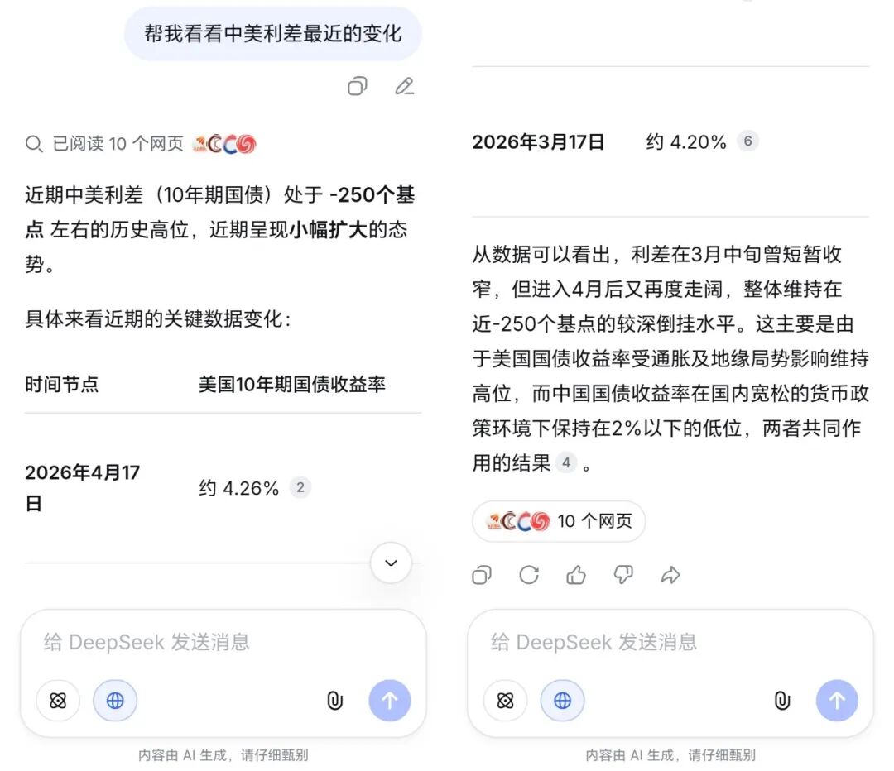
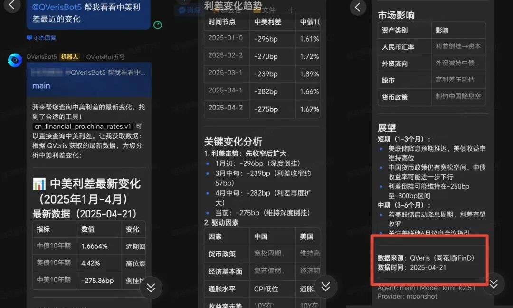
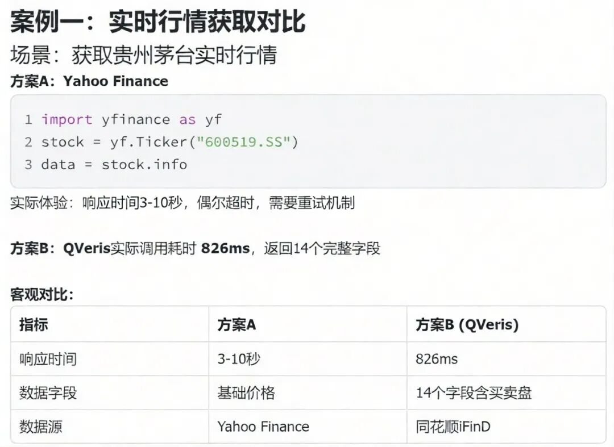
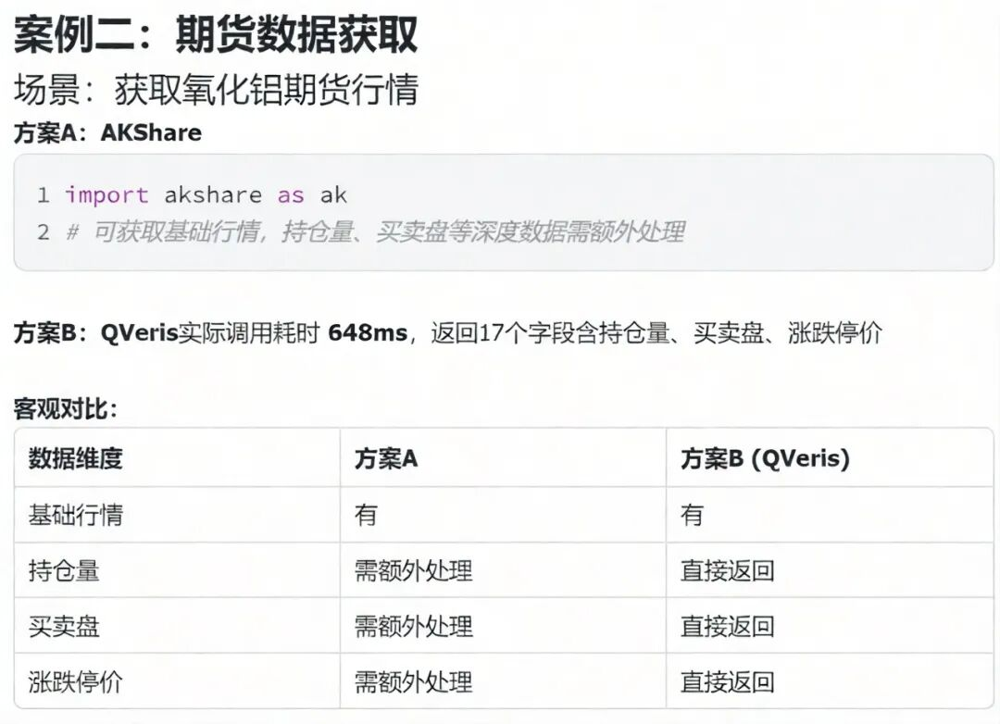
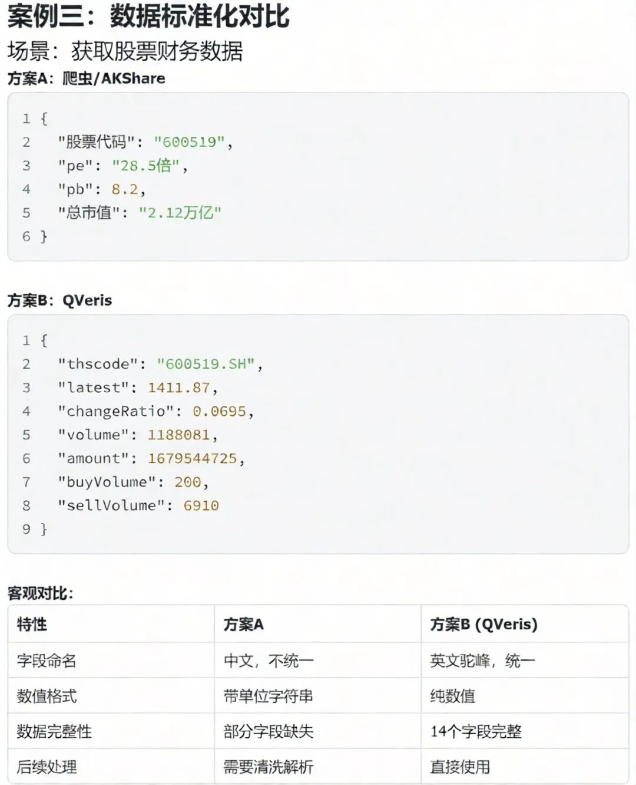
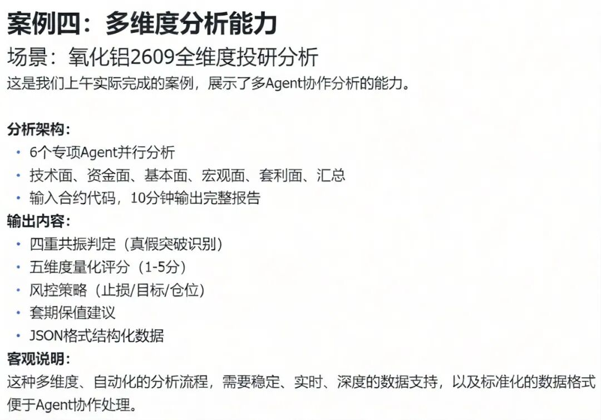

  

------------------------------------------------------------------------

前几天有个朋友问我："我用DeepSeek问它今天茅台股价多少，它说查不到。但你说QVeris能查，不都是AI吗？"

这是个好问题。很多人把豆包、Kimi、DeepSeek和QVeris混为一谈，觉得"都是AI聊天机器人"。但实际上，它们是完全不同的物种——一个是"图书馆管理员"，一个是"特工"。

这篇文章说清两者的本质区别，以及为什么做投研决策，你需要的是后者。

## LLM：知识渊博，但活在"过去"

豆包、Kimi、DeepSeek这类大模型（LLM），本质上是"超级压缩的图书馆"。

它们把互联网上海量的文本资料压缩进模型参数里，所以你能问它"巴菲特的投资理念是什么"，它对答如流。但问题是——**它的知识有截止日期**。

DeepSeek的知识可能停留在几个月前。当你问它"今天茅台股价多少"，它只能无奈地说："我无法获取实时数据。"

更麻烦的是**幻觉问题**。LLM为了"回答得像人"，有时会编造看似合理的数据。我曾用某大模型查一家公司的营收，它给了我一个精确的数字，还煞有介事地分析了增长原因。但我去官网一查，根本对不上。

等等，我是不是说得太绝对了？不是所有LLM都会幻觉，但确实是个普遍风险。对于投资决策来说，这可能是致命的。

## Agent：不只是"懂"，还要"能"

Agent（智能体）和LLM的核心区别在于：**Agent能调用工具**。

想象一个场景：你想知道"现在买美债划算吗"。这需要美国10年期国债收益率、中国10年期国债收益率、两者利差的变化趋势。

纯LLM只能基于训练数据给你"一般性建议"——"美债收益率受通胀预期影响..."这种正确的废话。

但Agent不一样。它会：**调用金融数据接口 → 获取实时收益率 → 计算利差 → 生成分析**。

其实还有个细节——Agent能执行动作。比如你可以让它"每周一早上9点推送中美利差数据"，它是真的能定时给你发消息的。

这就是QVeris+openclaw做的事情。它不是另一个"聊天机器人"，而是AI的"能力路由器"。

## QVeris：数据工具的"万能插座"

现在市面上也有很多Agent框架，为什么偏偏是QVeris？

三个关键词：**广度、深度、标准化**。

|  |  |  |
|----|----|----|
| 维度 | 传统方式 | QVeris方式 |
| 数据覆盖 | 单一数据源 | 10,000+工具覆盖全市场 |
| 数据质量 | 爬虫抓取，易出错 | API直连，交易所级精度 |
| 接入成本 | 每个源单独开发 | 统一协议，一次接入 |
| 使用方式 | 手动查询 | 自然语言一句话调取 |

说白了，QVeris让AI拥有了"专业金融分析师的数据库权限"，而且是用自然语言就能调取。

## 实战对比：同一个问题，两种答案

**说一千道一万，不如看实际对比。同一个问题，纯LLM和QVeris的答案截然不同**：

**👤 问题："帮我看看中美利差最近的变化"**

**🤖 纯LLM：来源有各种网页，只给出关键数据，也不能直接调用数据库里的数据，容易自行编造**

**点评**：描述得像模像样，但是数据来源于各种网页并不够准确，你也无法基于这个回答做决策。

------------------------------------------------------------------------

**🤖 QVeris Agent：**

**点评**：有具体数字、有异常发现、有分析框架，数据来源可追溯。你可以基于这个做交易决策。

这就是本质区别：**一个是"科普"，一个是"情报"**。

嗯，不对，我说得不够准确——纯LLM也能输出数字，如果你给它提供了数据的话。关键是它**无法主动获取**数据，这是核心差异。

## Agent能"连续作战"

纯LLM的对话是"断片的"。你问一个问题，它答一个，上下文有限。

**而QVeris+OpenClaw可以实现的场景更加多元**：

## 知道了区别，我们更需要知道适用边界：所以什么时候用什么？

****用纯LLM（豆包/Kimi/DeepSeek）的场景****：

- 需要创意写作、头脑风暴

- 学习概念、理解原理

- 不需要实时数据的泛泛而谈

****用Agent（QVeris）的场景****：

- 查实时股价、汇率、利率

- 做量化分析、财务对比

- 需要精确数字的投资决策

- 多步骤的数据查询任务

简单来说：**要"想法"，找LLM；要"事实"，找Agent**。

## QVeris是"数据智能"，而非仅仅是查询

QVeris的目标不是替代你的投研工作，而是**放大你的能力**。

以前你要查一个数据，得打开Wind、Choice，翻半天才能找到。现在一句话，AI帮你调取了。

以前你要对比几家公司，得手动复制粘贴到Excel。现在一句话，AI生成对比表格了。

这就是Agent的意义：**把重复、繁琐的数据工作自动化，让人专注于真正的思考——判断、决策、下注**。

------------------------------------------------------------------------

**结语**：  

AI正在重塑投研工作流，但很多人还在用"聊天机器人"的方式用AI，这就像把跑车当自行车骑。理解LLM和Agent的区别，选对工具，才能真的享受到AI带来的效率革命。

如果您在宏观经济数据分析、量化工具开发方面有更多定制化需求，欢迎在后台留言与我们交流！

\[戳文末右下角分享\]，把好用的工具推荐给您的交易伙伴吧！📈

#

---

原文链接：[微信公众号原文](https://mp.weixin.qq.com/s/oIJzfXHPCMqDRwjSD7XZdw)
