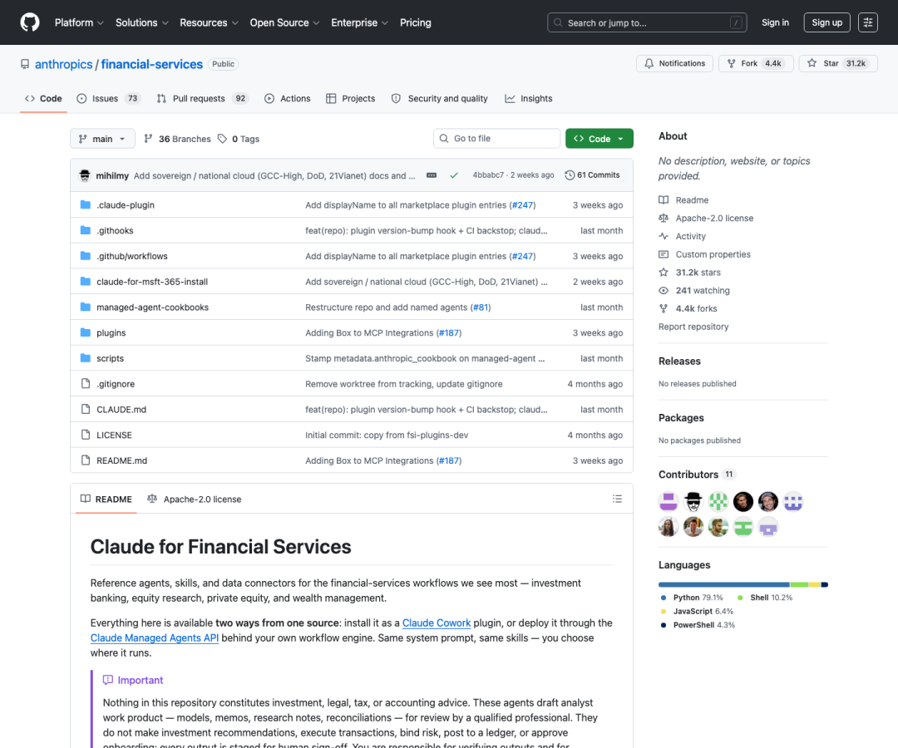
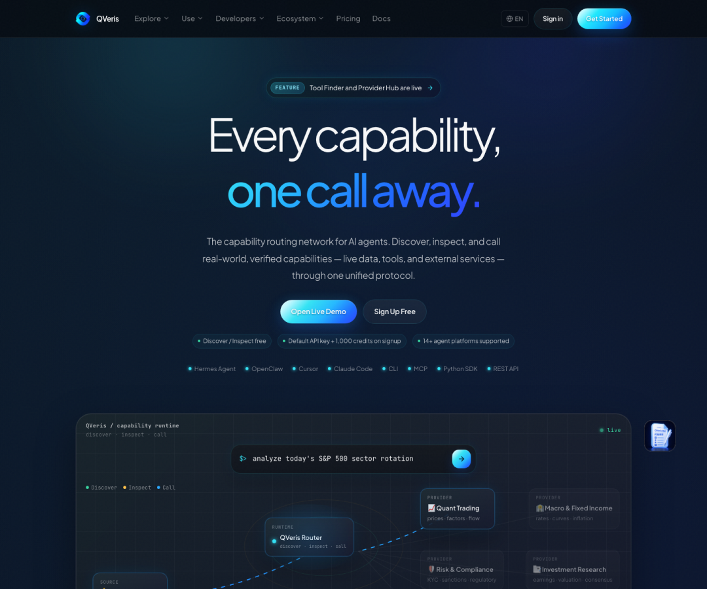
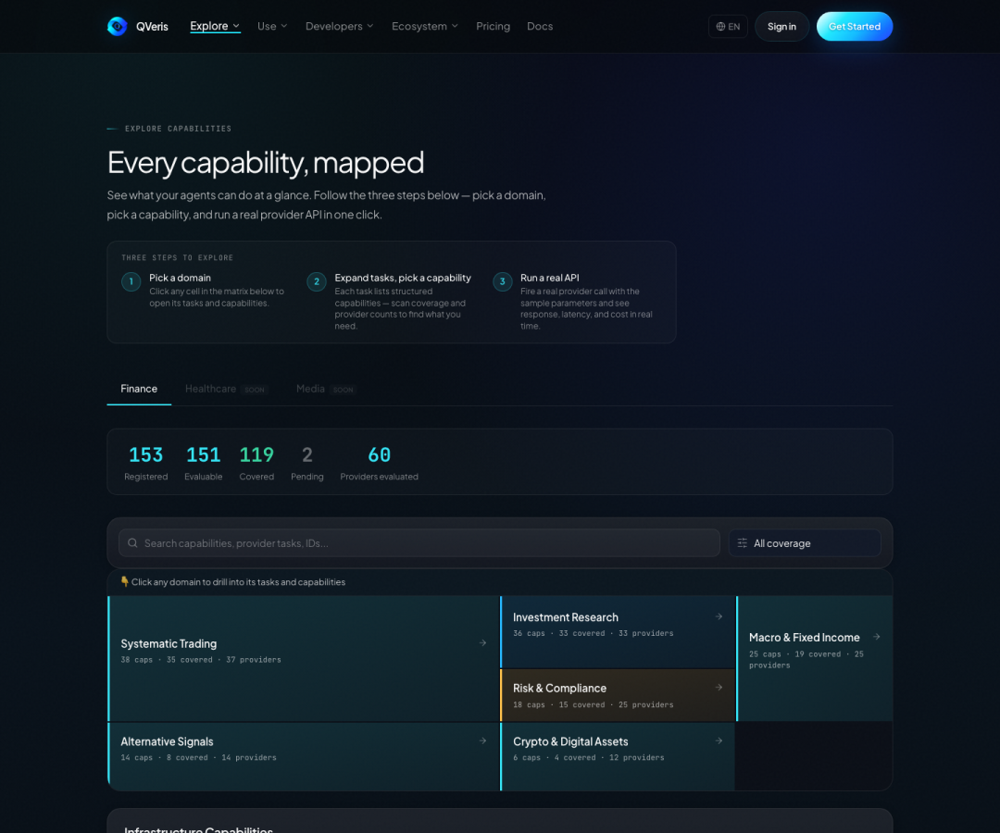
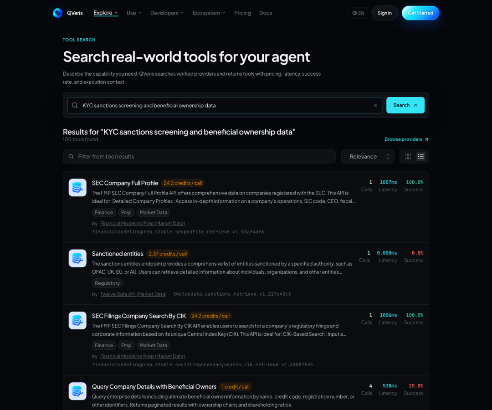
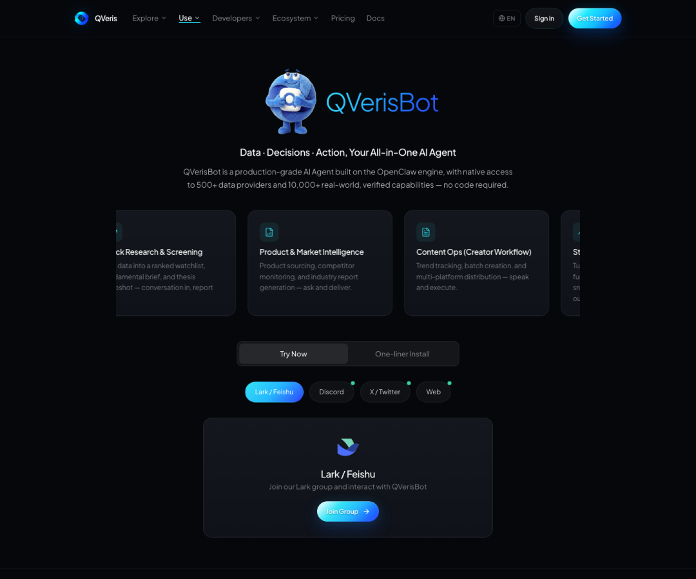

QVeris · 行业洞察 

  

Anthropic 最近公开了 Claude for Financial Services 的参考仓库。很多人的第一反应是：又一个金融 AI Agent demo。

但我们更愿意把它看成一个行业信号。

这次最重要的地方，不是 Claude 能不能写 pitch deck、更新 DCF、读财报电话会。大模型会写金融分析，已经不是新闻。

真正值得看的，是 Anthropic 把金融 AI Agent 跑进生产环境所需的东西，拆成了三层：Agent、Skill、Connector。

这三层一拆开，很多"Agent 为什么落不了地"的问题，就不再神秘。

## /

第一层，是 10 个端到端 Agent。

Pitch Agent 做 pitch deck，从 comps、先例交易、LBO 到品牌化排版；Meeting Prep Agent 做客户会前 briefing pack；Market Researcher 从行业主题生成竞争格局和标的清单；Earnings Reviewer 读电话会、更新模型、起草研报；Model Builder 在 Excel 里做 DCF、LBO、三表模型和可比公司分析。

这些不是单个 prompt，而是完整 workflow。
## /

第二层，是垂直技能包。

金融分析、投行、股票研究、私募、财富管理、基金行政、运营合规，每个都被拆成 markdown、JSON、YAML 这类文件化结构。团队要改自己的模型模板、汇报口径、审批逻辑，可以直接改 skill 文件。
## /

第三层，是数据和企业系统连接器。

Daloopa、Morningstar、S&P Global、FactSet、Moody&#x27;s、PitchBook、LSEG、Box、Egnyte 这些名字，才是金融 Agent 进入真实工作流时绕不开的地方。

一个分析师不是缺一个会说金融黑话的聊天机器人。

他缺的是：模型能不能拿到正确数据，能不能知道数据来自哪里，能不能在调用前看到成本和延迟，能不能在调用后留下审计记录，能不能在供应商挂掉时换一条路径。

这才是金融 AI Agent 最脏、最重、也最值钱的部分。

我们做 QVeris，盯的就是这一层。

过去一年，AI Agent 被讲得太热闹。写邮件、做 PPT、订机票、自动跑流程，听起来都不错。

但一进企业，问题立刻变成另一套语言：鉴权、权限、审批、限流、成本、审计、合规、交付物标准。

所以我们一直不认为 Agent 只是一个 prompt。

Agent 是一套行业 SOP，加上一套可调用工具网络。

Anthropic 这次把金融 SOP 的样板间打开了。我们看到的不是"又多了几个金融 Agent"，而是一个更清楚的趋势：行业 Agent 会越来越垂直，工具连接层会越来越基础设施化。

我们不是在再造一个金融 Agent。

我们做的是 Tool OS，让任意 Agent 能发现、检查、调用真实世界的能力。对 Agent 来说，QVeris 不是"又一个 API 平台"，而是一层能力路由网络。

**这句话拆开只有三个动作**：

Discover：用自然语言找能力。

Inspect：调用前看参数、样例、延迟、成功率、计费规则和 provider 背景。

Call：确认后在沙箱里执行，返回结构化 JSON，并留下可查询的使用和账本记录。

这三个动作，正好对应金融 Agent 最难规模化的第三层。

Anthropic 可以把投行、研究、财务运营这些 workflow 做深。我们要解决的是另一件事：当一个 Agent 需要实时行情、财报、OCR、KYC、制裁名单、受益所有人、新闻、链上数据、地图、文档处理、图像生成时，它不用为每个 provider 单独写 wrapper、管鉴权、改参数、扛限流。

它先找能力，再选 provider，最后调用。

这就是 Tool OS 和单点工具的区别。

单点工具回答的是：我能不能接入某个 API？

Tool OS 回答的是：Agent 现在需要一个能力，谁能提供，价格多少，质量如何，是否可审计，失败以后有没有替代路径。

一个 KYC Screener 不是只会读 PDF 就够了。它要识别证件、提取股权链、检查制裁名单、标记缺口、路由审批，还要让合规团队回头能查：哪一步用了哪个数据源，花了多少钱，结果是什么。

这些事情不在模型参数里。

它们在工具层。

QVeris 现在提供 10,000+ real-world verified capabilities、15+ categories，以及 CLI、MCP Server、Python SDK、REST API 等接入方式。

对 Claude Code、Cursor、OpenClaw、Codex 这类 Agent 环境，QVeris 的价值不是"多一个插件"，而是把工具发现和工具调用从 prompt 里挪出来，变成可审计、可计费、可复用的协议。

如果说 Anthropic 的金融 Agent 更像自营精品应用，我们希望 QVeris 成为面向 Agent 的 App Store 和路由层。

行业专家不应该把时间耗在工具接入上。

投研团队、法务团队、财务团队、跨境电商团队、医疗质控团队，真正该投入的是自己的 SOP：判断标准、交付模板、审批逻辑、异常处理。

底层的能力发现、provider 选择、调用记录、成本追踪和失败兜底，应该交给 Tool OS。

这也是我们判断国内市场会很快进入下一阶段的原因。

金融只是一个样板。类似 SOP 在国内一点不缺：法务合同审查、跨境电商选品、财务报表合并、政企标书制作、医疗病历质控、投研日报、供应链风控、内容运营。

这些场景都有共同点：流程高频，交付物明确，数据源分散，人工判断昂贵，合规和审计不能省。

过去大家做 Agent，容易先问模型够不够强。

现在答案更冷静：先把行业 SOP 写清楚，再把工具连接层标准化。

我们在 QVeris 做的，就是让第二件事变得简单。

要做金融 Agent，可以先去 Capability Map 看金融能力覆盖；要找 KYC、制裁、公司画像、财报、OCR，可以在 Tool Finder 里直接搜；要让自己的 Agent 跑起来，可以用 CLI、MCP、Python SDK 或 REST API 接进去。

如果只是想先用一个现成入口，QVerisBot 已经把数据、决策、行动打包成 no-code 的 Agent 形态。

AI Agent 的下一阶段，不会只靠模型排行榜决定。

谁能把行业 SOP 产品化，谁能把真实世界工具变成稳定、透明、可审计的调用网络，谁才更接近生产环境。

Anthropic 把金融 Agent 的样板间打开了。

我们在做的，是让样板间背后的水电气，变成所有 Agent 都能接入的基础设施。

如果你正在做一个行业 Agent，第一步不一定是再调一个 prompt。

更现实的第一步，是去 qveris.ai 看看：你的 Agent 到底缺哪一种真实能力。

---

原文链接：[微信公众号原文](https://mp.weixin.qq.com/s?src=11&timestamp=1782307131&ver=6802&signature=ZTARrA9sslALul3HMSjo7l29ljsjB2I3UGwY3bGIaypr8Jccraj6*GTCDtTYvDTPFyDp8EiIGhAB-Xm-3b7Ox2jpaHxDF6ZdVCbnObRe9AeqqFKb*dRWFy40nMOxxOAl&new=1)
