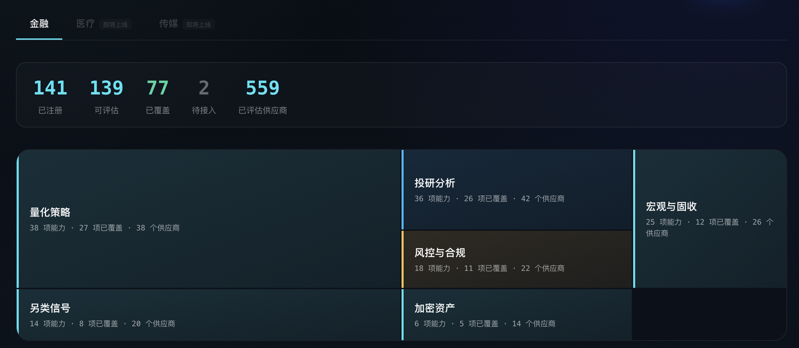
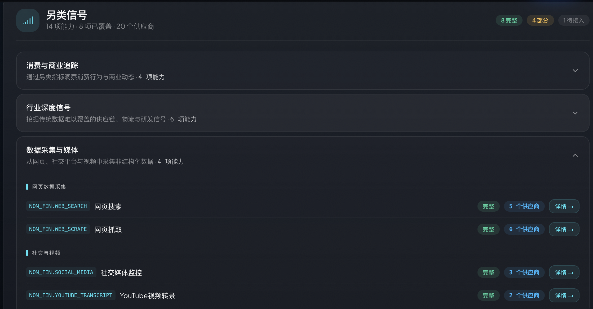
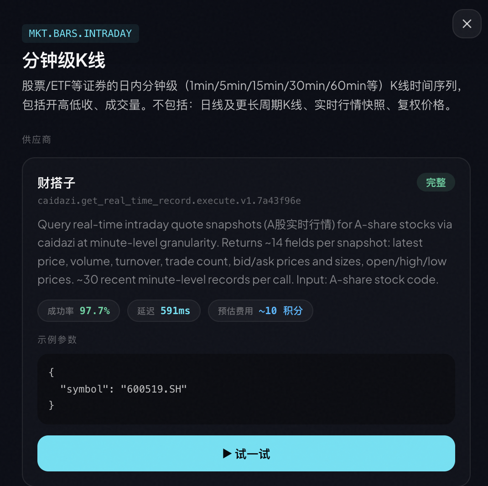

智能体（Agent）正在从"对话工具"变成"行动引擎"。但一个关键问题始终没有好的解决方案：**智能体怎么知道自己能做什么？**

今天，我们推出 **Capability Explorer** — 一个交互式的能力全景地图，让开发者和智能体可以浏览、检视、对比，并实时测试 QVeris 网络中的每一个真实且已验证的能力。

👉 立即体验：[qveris.ai/capabilities/explore](https://qveris.ai/capabilities/explore)

---

## 为什么需要 Capability Explorer

传统的 API 目录是一张列表。你搜索一个关键词，得到一串 endpoint，然后花几个小时读文档、调试参数、对比供应商。

对于 AI 智能体来说，这个过程更加痛苦 — 它们无法"浏览文档"，只能依赖开发者预先硬编码的 API 列表。结果就是：

- 🔒 **能力被锁死在配置文件里** — 智能体只能调用开发者提前写好的几个 API
- 🤷 **无法感知新能力** — 即使 QVeris 网络新增了 50 个数据源，智能体不知道
- 💸 **无法做质量和成本决策** — 同一个能力有 3 个供应商，该选哪个？成功率多少？延迟多少？多少钱？

**Capability Explorer 解决了这些问题。** 它把 QVeris 的整个能力网络变成了一个可浏览、可检索、可测试的交互式地图。

---

## 功能全景

Capability Explorer 由五个层次组成，对应智能体发现和使用能力的完整旅程：

| 层次 | 功能 | 用户交互 |
|---|---|---|
| **全景矩阵** | 6 大领域的能力分布热力图 | 一眼看全局，点击进入领域 |
| **任务结构** | 每个领域下的任务分组与能力列表 | 展开任务 → 查看能力 → 点击详情 |
| **供应商详情** | 每个能力的全部供应商和质量指标 | 查看成功率、延迟、费用、调用量 |
| **实时测试** | 一键调用真实 API，查看结构化结果 | 点击 "Run Try-it" 即刻执行 |
| **基础设施层** | 跨领域通用能力（搜索、翻译、OCR 等） | 独立板块，按需浏览 |



---

## 金融领域：6 大领域，138 项能力，完整覆盖

首批发布的 Capability Explorer 聚焦**金融领域**，这也是 QVeris 能力网络最成熟的垂直行业。

> 🎁 📊 **金融能力一览**
>
> - 138 项注册能力
> - 73 项已覆盖（有活跃供应商）
> - 6 大领域全面覆盖
> - 每个能力附带成功率、延迟、预估费用等质量信号

**六大领域：**

**🔷 量化交易 (Systematic Trading)** 回测引擎、订单管理、执行算法、策略模拟。为量化团队构建自动化交易流水线提供基础能力。

**🔵 市场数据 (Market Data)** 实时行情、历史 K 线、企业行动、指数成分。覆盖美股、港股、A 股多市场数据源。

**🟡 风控合规 (Risk & Compliance)** VaR 计算、压力测试、监管检查、反洗钱筛查。满足金融机构的合规需求。

**🔷 投资研究 (Investment Research)** 基本面分析、财报数据、分析师评级、盈利预测。让智能体具备专业投研能力。

**🟢 另类信号 (Alternative Signals)** 舆情分析、卫星数据、网页爬取、社交媒体情绪。提供超越传统数据的 Alpha 信号。

**🟣 加密资产 (Crypto & Digital Assets)** 现货/衍生品数据、链上分析、DeFi TVL、代币指标。覆盖 Web3 数据需求。



---

## 质量信号：让智能体做出明智选择

每个供应商不只是一个 Tool ID — Capability Explorer 展示了完整的质量画像：

**✅ 成功率** — 历史调用的成功百分比，颜色编码：

- 🟢 ≥ 95% — 可靠
- 🟡 80-95% — 可用
- 🔴 < 80% — 需注意

**⚡ 平均延迟** — 典型执行时间（毫秒级精度）

**💰 预估费用** — 每次调用消耗的 credits（1-100 credits，按数据价值定价）

**📈 调用量** — 历史总调用次数，是"经过验证"最直接的证据

**🏆 供应商等级** — FULL / GOOD / PARTIAL，反映实现完整度

> 🎁 💡 **为什么这很重要**？当同一个能力有 3 个供应商时，你的智能体可以基于质量信号自动选择：优先选成功率最高的，或者延迟最低的，或者最便宜的。这不是 API 目录，这是**能力路由的决策仪表盘**。



---

## Try-it：一键测试，眼见为实

浏览能力、对比供应商之后，你可以直接在 Capability Explorer 中**运行真实的 API 调用**。

每个供应商卡片底部都有一个 **"▶ Run Try-it"** 按钮。点击后：

1. 使用预填充的示例参数（或自定义修改）
1. 调用真实的供应商 API
1. 在沙箱环境中执行
1. 返回结构化的 JSON 结果

```json
// 示例：调用实时股票行情 API
{
  "symbol": "AAPL",
  "price": 192.53,
  "change": 2.15,
  "volume": 54382100,
  "timestamp": "2026-04-10T15:30:00Z"
}
```

这不是模拟数据 — 这是**真实的、已验证的**能力在实时运行。

---

## 开发者集成：从浏览到代码

在 Capability Explorer 中找到心仪的能力后，集成到你的智能体只需要一步。

**通过 QVeris CLI（推荐）：**

```shell
# 发现能力
qveris discover "real-time stock price API" --json
# 检查供应商详情
qveris inspect 1 --json
# 调用
qveris call 1 --params '{"symbol":"AAPL"}' --json
```

**通过 MCP Server（IDE 集成）：**

```shell
npx @qverisai/mcp
```

**通过 Python SDK：**

```python
from qveris import QVerisClient
client = QVerisClient(api_key="your-key")
results = client.search("stock price API", limit=5)
response = client.execute_tool(
    tool_id="polygon.stocks.eod.v2",
    parameters={"symbol": "AAPL"}
)
```

---

## 路线图：金融只是开始

Capability Explorer 当前已覆盖金融领域的 138 项能力。接下来，我们将扩展到：

- 🏥 **医疗健康** — 临床试验数据、药物信息、医学文献检索
- 🎬 **媒体内容** — 图像/视频生成、文本转语音、内容审核

这两个领域已在 Explorer 中以 "SOON" 标签预告。

---

## 立即体验

> 🎁 🚀 **立即打开 Capability Explorer**
>
> - 🌐 全球：[qveris.ai/capabilities/explore](https://qveris.ai/capabilities/explore)
> - 🇨🇳 中国：[qveris.cn/capabilities/explore](https://qveris.cn/capabilities/explore)
> - 📖 文档：[qveris.ai/docs](https://qveris.ai/docs)
> - 💻 GitHub：[github.com/QVerisAI/QVerisAI](https://github.com/QVerisAI/QVerisAI)
>
> 注册即送 1,000 积分。Discover 和 Inspect 永远免费。

---

## 关于 QVeris AI

QVeris AI 聚焦于 **Agent 时代的行动基础设施层**，致力于构建 AI 可理解、可调用的"能力互联网"。

**QVeris 当前定位：面向智能体的搜索和行动引擎，让智能体能够通过语义搜索发现并一键调用 10,000+ 真实且已验证的工具。**

**产品矩阵：**

- **QVeris CLI** — 终端中的万能 API 入口
- **QVeris MCP Server** — IDE 智能体的工具网关
- **QVerisBot** — 基于 OpenClaw 的生产级 AI 助手
- **QVeris REST API** — 标准 HTTP 接口，适配任何语言和平台

**官网：** [https://qveris.ai](https://qveris.ai)

**GitHub：** [https://github.com/QVerisAI/QVerisAI](https://github.com/QVerisAI/QVerisAI)

*QVeris 原创首发，转载请注明出处*
