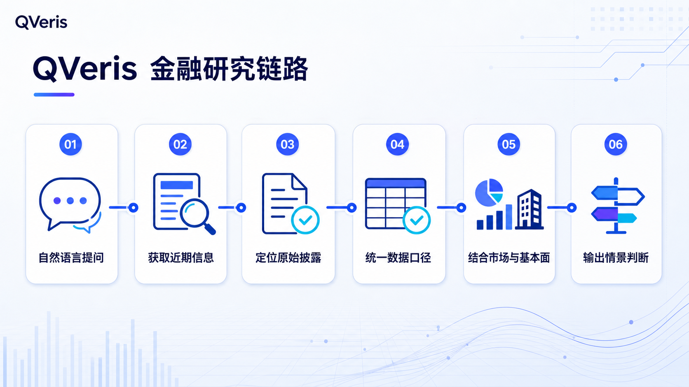

**508 亿元季度营收、约 5792 亿元初始市值，国产 DRAM 的新坐标意味着什么？**  
*截至 2026 年 7 月 25 日*

7 月 27 日，长鑫科技将登陆科创板。按 8.66 元的发行价计算，公司初始市值约 5791.88 亿元。更值得注意的是，2026 年一季度，长鑫科技实现营业收入 508.00 亿元、归母净利润 247.62 亿元——一个季度的收入，已经相当于 2025 年全年的约 82%。

这组数字足够吸睛，也很容易让人迅速下结论。但它究竟意味着什么？是存储价格上涨带来的周期高点，还是国产 DRAM 进入新阶段的信号？上市之后，产业链和资本市场又会如何重新定价？我把这些问题交给了 QVeris。

# 一、我把这个问题交给 QVeris

输入的问题只有一句：

> 请获取长鑫科技最新 IPO 进展，结合 DRAM 市场景气度、半导体板块情绪和公司基本面，分析上市可能带来的产业与市场影响。区分已确认事实、合理推演和主要风险，并标注数据时间与来源。

QVeris 先查找最近的上市进展，再把监管公告、行业数据、公司披露和市场线索放到同一条时间线上。这个过程中最有价值的，不是多找到几篇文章，而是及时发现冲突：有的报道仍停留在过会或注册阶段，有的数字混用了年度、季度和预测口径。

*本文的关键材料由 QVeris 辅助检索和整理，并回到招股书、交易所公告、公司官网等原始出处逐项核验。QVeris 缩短的是检索和核对的过程，原始披露仍是事实判断的依据。*

最后得到的不是一个简单的“利好”或“利空”，而是一条可以继续追问的研究路径：上市进展是否已经更新，行业景气能否持续，市场在交易什么预期，公司的收入、利润、研发和现金流是否提供了支撑。

# 二、最新进展：发行完成，7 月 27 日登陆科创板

长鑫科技的上市进程已经进入最后阶段。上海证券交易所上市审核委员会于 2026 年 5 月 27 日认定公司符合发行条件、上市条件和信息披露要求；中国证监会于 6 月 5 日同意其首次公开发行注册申请。此后公司完成询价与发行，上交所于 7 月 24 日公告，长鑫科技股票将于 7 月 27 日起在科创板上市交易。

截至本文日期，已确认的发行信息包括：**证券简称“长鑫科技”，证券代码 688825，发行价格 8.66 元/股，公开发行约 66.88 亿股，7 月 27 日上市。**超额配售选择权行使前，发行后总股本约 668.81 亿股，按发行价计算的初始市值约 5791.88 亿元。由于 7 月 25 日尚未进入首个交易日，二级市场成交价格和真实交易情绪仍需等待挂牌后观察。

这也是检索近期信息时最容易踩坑的地方。几周前的报道可能还停留在受理、过会或注册阶段，结论却已经过时。这次通过 QVeris 定位最新公告后，我又按时间顺序核对注册批复、发行文件和上市交易公告，才将状态确认到“发行完成、等待挂牌”。

# 三、市场背景：这不是一次孤立的 IPO

沿着 QVeris 整理出的近期行业线索往下查，长鑫科技进入发行窗口时，全球存储行业正处于由 AI 算力需求、数据中心扩张与供给约束共同推动的强景气阶段。Gartner 在 2026 年 4 月预计，全球半导体收入将在 2026 年超过 1.3 万亿美元，同比增长约 64%；其中内存收入预计由 2025 年的 2163 亿美元增至 2026 年的 6333 亿美元。Gartner 同时预计 2026 年 DRAM 年度价格上涨 125%，有意义的价格缓解可能要到 2027 年末。

产业公司的经营数据也印证了景气度。美光 2026 财年第三季度披露创纪录业绩，并预计第四季度收入约为 500 亿美元、毛利率约为 86%；其产品进展集中在 HBM4、HBM4E、DDR5、LPDDR5X 等 AI 与高性能计算相关方向。

这意味着市场可能同时交易三种叙事：存储价格上行带来的盈利弹性、AI 时代内存价值量提升，以及国产 DRAM 供应链自主化。三种叙事相互强化时，容易形成较高关注度和稀缺性溢价；但当供需、价格或发行估值偏离预期时，也会放大波动。

# 四、长鑫科技的基本面：从规模爬坡走向盈利释放

长鑫科技是一体化 DRAM 研发设计制造企业，产品覆盖 DDR、LPDDR 等系列。公司官网显示，其 DDR5 颗粒容量覆盖 16Gb 和 24Gb，最高速率突破 8000Mbps；LPDDR5X 最高速率达到 10667Mbps。相关产品面向服务器、高性能电脑、移动终端等应用。

| 核心指标 | 2023 年 | 2024 年 | 2025 年 | 2026 年一季度（经审阅） |
|-|-|-|-|-|
| 营业收入（亿元） | 90.87 | 241.78 | 617.99 | **508.00** |
| 归母净利润（亿元） | -163.40 | -71.45 | 18.75 | **247.62** |
| 主营业务毛利率 | -2.19% | 5.00% | 41.02% | 未单独披露 |
| 经营现金流净额（亿元） | -72.72 | 68.97 | 365.20 | **425.66** |
| 研发投入占营收比例 | 51.40% | 26.23% | 15.52% | 未单独披露 |

*注：2023—2025 年为经审计年度数据；2026 年一季度为经会计师审阅数据。季度口径与年度口径不可直接年化比较。*

这组数据体现出非常明显的规模与周期弹性。2023—2025 年营业收入复合增长率达到 160.78%，2025 年首次实现归母净利润转正，主营业务毛利率也由负转正并升至 41.02%。与此同时，三年研发投入合计约 206.05 亿元，占同期累计营业收入的 21.67%；截至 2025 年末，公司研发人员 6259 人，占员工总数 32.43%。

2026 年一季度的变化更值得关注。经审阅，公司实现营业收入约 508.00 亿元、归母净利润约 247.62 亿元，经营活动现金流净额约 425.66 亿元。招股书同时预计，2026 年上半年营业收入为 1100 亿—1200 亿元、归母净利润为 500 亿—570 亿元。前一组是经审阅的季度数据，后一组是未经审计或审阅的公司预测，不能混为同一口径，也不构成业绩承诺。

在竞争位置上，招股书援引 Omdia 数据测算，按 2025 年第四季度 DRAM 销售额统计，长鑫科技全球市场份额约为 7.67%；同期三星、SK 海力士和美光合计仍占全球市场 90% 以上。长鑫已经进入主要厂商阵营，但规模、工艺、产品结构与国际龙头之间仍存在追赶空间。

# 五、上市之后，哪些变化值得关注

把最新事件、行业周期和公司数据放在一起，QVeris 帮我把影响范围从“股价会不会涨”扩展到了公司融资、国内产业链、A 股定价和全球竞争格局。以下判断属于基于公开信息的推演，而不是已经发生的结果。

**对公司自身：资本开支与研发能力获得更稳定的权益资本支持。**招股书披露，本次拟使用募集资金 295 亿元，其中 75 亿元用于存储器晶圆制造量产线技术升级，130 亿元用于 DRAM 技术升级，90 亿元用于前瞻技术研发。对资金与技术高度密集的 DRAM 企业而言，上市有助于拓宽融资渠道、增强人才激励和长期研发投入能力。

**对国内半导体产业链：形成更清晰的 DRAM 需求锚点。**产线升级和产能扩张可能增加对设备、材料、零部件、封装测试及工程服务的需求，也会推动国内供应商进入更严格的验证体系。但产业链受益并非自动发生，真正决定订单的是产品性能、良率、交付能力、认证周期与国产化替代节奏。

**对 A 股定价体系：增加一个更直接的 DRAM 资产坐标。**过去投资者往往通过存储控制器、模组、设备材料或产业投资关系间接表达存储周期观点。长鑫科技上市后，市场将获得更直接的 DRAM 制造业绩映射，也可能重新评估相关公司的业务纯度、技术壁垒和周期敏感度。短期主题扩散和长期基本面分化可能同时出现。

**对全球 DRAM 格局：增加来自中国市场的规模化竞争变量。**长鑫的份额提升有助于中国客户获得更多供应选择，并提升本土供应链韧性；长期看也可能影响全球厂商的产品组合、区域策略与价格竞争。不过，国际前三家仍拥有显著规模和技术优势，竞争结果取决于先进制程、良率、HBM 等高价值产品突破以及全球客户认证。

**对市场情绪：稀缺性与周期性会同时被放大。**大体量发行、AI 存储景气和盈利上行可能增强关注度，也可能带来短期资金分流，但高关注不等于低风险。当发行估值充分计入行业高景气后，投资者会更敏感地观察 DRAM 价格、产能利用率、资本开支、产品迭代和客户结构。越是强周期阶段，越需要避免把当期利润简单线性外推。

# 六、不急着预测价格，先看三种情景

| 情景 | 关键假设 | 潜在影响 |
|-|-|-|
| **乐观** | 存储价格保持强势，先进产品放量，良率与产能利用率持续改善 | 盈利与现金流继续释放，募投项目加速，产业链订单和国产 DRAM 估值中枢抬升 |
| **中性** | 行业景气延续但涨价放缓，发行估值基本反映市场预期 | 上市带来长期融资与产业影响，短期股价和主题交易围绕业绩验证反复波动 |
| **审慎** | 需求不及预期、供给扩张或价格回落，技术升级和产能爬坡慢于计划 | 毛利率和利润弹性反向释放，高资本开支、折旧、存货和估值消化压力上升 |

上交所上市委在审核时也重点询问了全球竞争格局、产能扩建、AI 算力新技术路线、下游需求预测、技术差异与业绩波动风险。这说明判断长鑫科技不能只看“国产替代”一个标签，而应持续跟踪价格、产品、产能、客户和现金流五条证据链。

# 七、为什么这类问题适合用 QVeris

这次使用下来，QVeris 最有用的地方不是替我写结论，而是把分散在不同时间、不同来源里的材料迅速拉到同一张研究桌上。它具体帮我完成了这些工作：

- 先确认信息发布时间，并优先回到监管公告、招股书和公司披露，避免旧报道影响判断。
- 把审计数据、审阅数据、公司预测和第三方预测分开，不让相近的数字混在一起。
- 把上市事件、行业环境、市场预期、公司经营和风险放在同一条研究线上。
- 对尚未发生的结果保留多种可能，不把推演写成事实。
- 保留来源和数据时间，方便回头复核，也方便在上市后继续更新。

一句自然语言问题可以启动整套检索，但最后的判断仍然需要人来完成。对研究者来说，QVeris 更像一张工作台：资料来得更快，出处留得更清楚，也更容易看见哪些结论已经有证据、哪些仍然只是推演。

# 结语

回到最初的问题：508 亿元季度营收，是周期高点还是新阶段的开始？现在还不能仓促下结论。接下来真正值得追踪的，是 DRAM 价格、先进产品、产能利用率、客户结构和现金流能否继续相互印证。

如果你也在关注一家变化很快的公司，不妨把问题直接交给 QVeris：先找到最新材料，把口径对齐，再形成自己的判断。它不会替你决定答案，但能让你更快抵达真正值得判断的地方。

---

**数据说明：**本文信息由 QVeris 辅助检索和整理，并以中国证监会、上海证券交易所、长鑫科技招股书及公司官网披露为准；行业数据参考 Gartner、Omdia 和 Micron 公开资料。数据截至 2026 年 7 月 25 日。

> 风险提示：本文用于展示 QVeris 的金融研究工作流，不构成投资建议或收益承诺。长鑫科技计划于 2026 年 7 月 27 日挂牌，本文日期尚无上市后成交数据；发行信息以公司及上交所公告为准，上市后的价格表现与市场影响需要持续跟踪。
