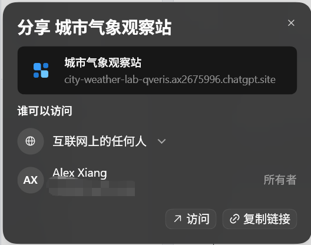
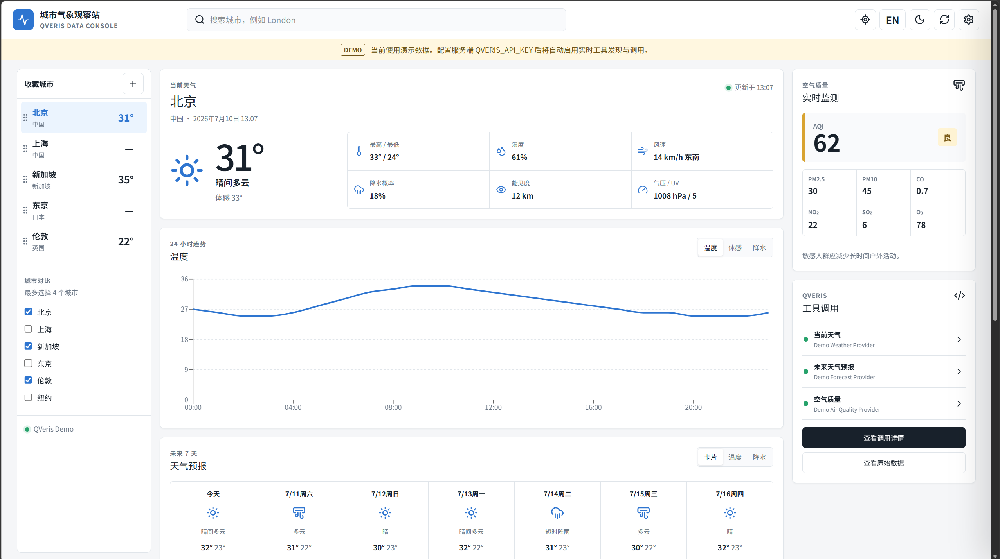
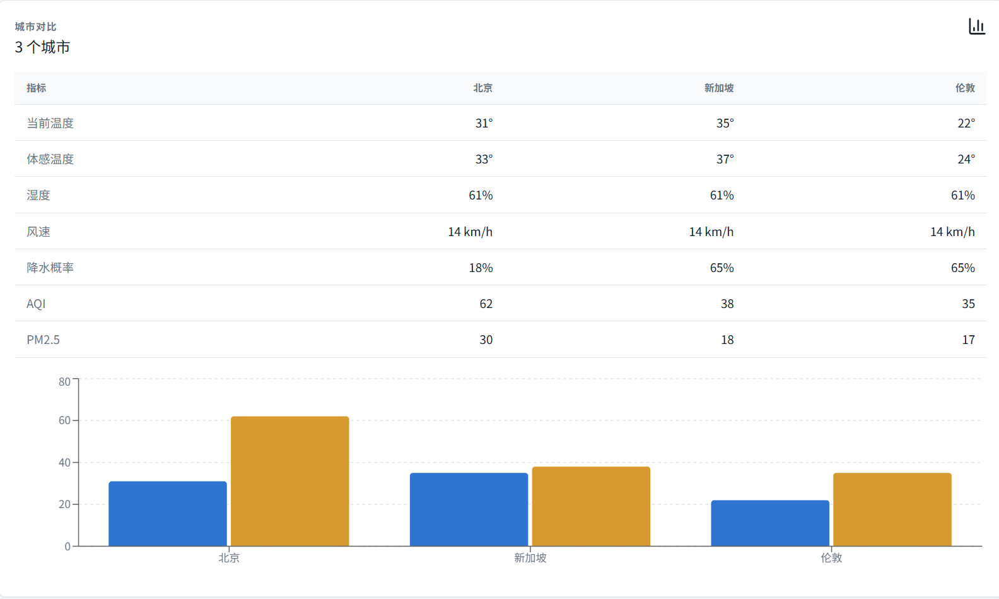

<title>用 Codex Sites 做一个真正调用 QVeris 的演示网站</title>

很多工具演示站的问题，不是页面不够漂亮，而是只能看，不能真正使用。用户看到一张精致的仪表盘，却不知道数据从哪里来、工具如何选择、失败时又会发生什么。

这次我们尝试把演示往前推进一步：让 Codex Sites 负责网站生成，让 QVeris 负责能力发现和工具调用，做一个可以查询城市天气、空气质量和未来预报的交互式网站。页面只是结果，真正值得展示的是一条完整的调用链路。


<callout emoji="📝">
本文当前为持续更新稿。演示网站生成后，将补充实际访问地址、桌面端与移动端截图，以及真实调用结果。
</callout>

# 一、为什么要做这样一个演示站

## 网站不只是工具说明书

传统的 API 文档适合开发者查参数，却很难让第一次接触产品的人迅速理解一种能力能解决什么问题。一个能直接操作的网站，可以把搜索、调用、返回、异常处理和可视化放在同一条体验路径里。

对 QVeris 来说，这种演示尤其重要。QVeris 不是一个固定接口集合，而是面向 Agent 的能力发现与工具调用引擎。用户提出需求后，系统先找到适合的工具，再根据工具的真实参数执行调用。演示站因此不能只写死一份假数据，也不应该把某个 tool_id 永久固定在前端。

## 为什么先从天气和空气质量开始

天气类数据有几个天然优势：任何人都能理解；当前天气、逐小时趋势、未来预报和空气质量适合不同的可视化形式；城市名称、经纬度、时区和多数据源又足以覆盖真实工具调用中常见的参数适配问题。

用户在页面里输入“北京”看似只是一次搜索，背后可能需要先做城市地理编码，再调用当前天气、未来预报和空气质量工具。几个能力可以独立成功或失败，这比只展示一个接口更接近 Agent 使用工具的真实情况。

# 二、Codex Sites 与 QVeris 如何配合

## Codex Sites 负责把需求变成产品界面

Codex Sites 接收的不是一句“做个天气网站”，而是一份接近产品需求文档的指令。指令需要明确页面结构、交互状态、响应式布局、数据模型、安全边界、错误处理和验收条件。要求越具体，最终生成的网站越接近一个可以继续开发的产品，而不是只能展示的页面样稿。

## QVeris 负责动态发现和调用工具

网站服务端先向 QVeris 描述所需能力，例如 weather forecast current conditions API。QVeris 返回候选工具和参数定义，服务端再根据成功率、参数完整度、执行耗时和数据结构选择合适的工具。

选定工具后，服务端携带 discover 返回的 search_id 执行工具，并把不同来源的数据整理成网站统一的数据模型。浏览器只接收天气数据和脱敏后的调用摘要，不接触 QVERIS_API_KEY，也看不到 Authorization Header。


## 这条链路解决了什么问题

- 网站不依赖一个写死的工具，可以在候选工具异常时切换。
- 前端不需要理解每个供应商完全不同的字段结构。
- 用户能看到实际使用的工具、执行耗时和数据更新时间。
- 凭证只存在于服务端，避免因演示站公开而泄露。
- 同一套模式可以继续扩展到金融、体育、新闻、科研、地图等其他工具类别。

# 三、交给 Codex Sites 的完整 Prompt

下面是本次网站生成使用的完整指令。它不仅描述视觉风格，也规定了 QVeris 的接入方式、数据模型、缓存策略、错误状态和验收标准，可以直接粘贴到 Codex Sites 插件中使用。

```text
请生成一个完整、可运行、响应式的网站，名称为：

「城市气象观察站 / City Weather Lab」

网站用途：
演示如何使用 QVeris 发现并调用天气、空气质量、地理编码等工具。网站不是产品宣传页，打开后直接进入可操作的数据看板。

一、技术要求

1. 使用 React + TypeScript。
2. 使用 Tailwind CSS。
3. 图标使用 Lucide，不要手绘 SVG。
4. 图表使用 Recharts 或 ECharts。
5. 必须支持桌面端和移动端。
6. 不要把 QVERIS_API_KEY 写入前端代码或 Git 仓库。
7. 使用服务端 API Route 代理 QVeris 请求，从环境变量读取：
   QVERIS_API_KEY
8. 提供 .env.example，其中只包含：
   QVERIS_API_KEY=
9. 如果当前 Sites 环境不支持服务端 API Route：
   - 保留完整的 API 客户端接口；
   - 默认进入明确标记的 Demo 数据模式；
   - 不允许在公开前端中硬编码真实 API Key。

二、QVeris 接入方式

QVeris API Base URL：

https://qveris.ai/api/v1

所有服务端请求携带：

Authorization: Bearer ${QVERIS_API_KEY}
Content-Type: application/json

不要硬编码具体 tool_id。首次调用某项能力时，通过 QVeris 动态发现工具，并在本次服务端会话中缓存选中的 tool_id。

工具发现接口：

POST /search

请求示例：

{
  "query": "weather forecast current conditions API",
  "limit": 8
}

需要分别发现以下能力：

1. 当前天气：
   "weather forecast current conditions API"

2. 未来天气预报：
   "multi day weather forecast API"

3. 空气质量：
   "air quality pollution index API"

4. 城市地理编码：
   "city geocoding latitude longitude API"

发现后根据以下规则选择工具：

1. 参数能够支持城市名、经纬度或标准地点。
2. success_rate 优先高于 90%。
3. 参数描述清楚且有样例参数。
4. 平均响应时间较短。
5. 返回结果包含结构化数据。
6. 不要仅根据搜索结果排序盲目选择。

执行工具接口：

POST /tools/execute?tool_id=<tool_id>

请求体：

{
  "search_id": "<发现工具时返回的 search_id>",
  "parameters": {
    "...": "根据实际工具参数生成"
  },
  "max_response_size": 20480
}

注意：

- 必须读取发现结果中的真实参数定义，不要假设所有天气工具都使用 city 参数。
- 根据工具参数动态构造调用参数。
- API 返回结构不一致时，在服务端转换成网站统一的数据模型。
- 请求失败时尝试修正参数；仍失败则切换到下一个候选工具。
- 不得把完整 Authorization Header、API Key 或敏感错误信息返回浏览器。

三、核心页面

页面打开后直接显示数据看板，不要制作营销落地页或巨大 Hero。

整体布局：

- 顶部应用栏
- 左侧城市列表
- 中间天气数据区域
- 右侧空气质量和工具调用状态
- 移动端改为单列布局，城市列表使用抽屉

顶部应用栏包含：

- 产品名称「城市气象观察站」
- 城市搜索框
- 定位按钮
- 中文/英文切换
- 明暗模式切换
- 数据刷新按钮
- 设置按钮

四、主要功能

1. 城市搜索

用户可以输入：

- 北京
- 上海
- 新加坡
- Tokyo
- London
- New York

如果天气工具不支持城市名称，先调用地理编码工具得到经纬度，再调用天气工具。

搜索建议显示：

- 城市名
- 国家或地区
- 经纬度
- 时区

2. 当前天气

显示：

- 城市和当地时间
- 天气状况
- 当前温度
- 体感温度
- 当日最高和最低温度
- 湿度
- 风速和风向
- 降水概率
- 能见度
- 气压
- 紫外线指数
- 数据更新时间

使用高质量天气图标，但不要用卡通人物或装饰性渐变球。

3. 未来预报

显示未来 7 天数据：

- 日期
- 天气状态
- 最高温度
- 最低温度
- 降水概率
- 风速

同时提供：

- 卡片视图
- 温度趋势图
- 降水概率图

在移动端图表宽度必须适配屏幕，不允许横向溢出。

4. 24 小时趋势

使用折线图展示：

- 温度
- 体感温度
- 降水概率

用户可以通过分段控件切换指标。

5. 空气质量

显示：

- AQI
- 空气质量等级
- PM2.5
- PM10
- CO
- NO2
- SO2
- O3

根据 AQI 使用绿色、黄色、橙色、红色等语义颜色，但整体页面不能被单一颜色主导。

显示一句简洁、谨慎的活动建议，例如：

- 适合户外活动
- 敏感人群应减少长时间户外活动
- 建议减少户外运动

不要提供医疗诊断。

6. 城市对比

最多选择 4 个城市进行比较。

比较指标：

- 当前温度
- 体感温度
- 湿度
- 风速
- 降水概率
- AQI
- PM2.5

使用表格和柱状图展示。表格移动端允许横向滚动。

7. 收藏城市

默认提供：

- 北京
- 上海
- 新加坡
- 东京
- 伦敦

允许添加、删除和拖动排序。

收藏数据保存在 localStorage。

五、QVeris 演示功能

需要有一个“工具调用”抽屉，让用户能直观看到 QVeris 在后台完成了什么，但不能泄露凭证。

展示内容：

- 用户请求的能力
- 使用的英文 discover query
- 找到的候选工具数量
- 最终选中的 tool_id
- 工具名称
- success_rate
- 平均执行时间
- 本次实际执行时间
- 调用状态
- 参数摘要
- 返回字段摘要
- 是否发生候选工具切换
- 是否使用 Demo 数据

不要显示：

- API Key
- Authorization Header
- Cookie
- 完整敏感响应
- 用户唯一身份信息

页面中增加“查看原始数据”功能，只展示脱敏、格式化后的 JSON。

六、统一数据模型

服务端应把不同工具的结果转换为统一结构：

type WeatherViewModel = {
  location: {
    name: string
    country?: string
    latitude?: number
    longitude?: number
    timezone?: string
    localTime?: string
  }
  current: {
    condition: string
    temperature?: number
    feelsLike?: number
    high?: number
    low?: number
    humidity?: number
    windSpeed?: number
    windDirection?: string
    precipitationProbability?: number
    visibility?: number
    pressure?: number
    uvIndex?: number
  }
  hourly: Array<{
    time: string
    temperature?: number
    feelsLike?: number
    precipitationProbability?: number
  }>
  daily: Array<{
    date: string
    condition: string
    high?: number
    low?: number
    precipitationProbability?: number
    windSpeed?: number
  }>
  airQuality?: {
    aqi?: number
    level?: string
    pm25?: number
    pm10?: number
    co?: number
    no2?: number
    so2?: number
    o3?: number
  }
  source: {
    toolId: string
    toolName?: string
    fetchedAt: string
    elapsedTimeMs?: number
    demoMode: boolean
  }
}

缺失数据统一显示“暂无数据”，不要显示 0 或编造数值。

七、交互状态

必须实现：

- 首次加载状态
- 搜索中状态
- 当前天气加载骨架屏
- 部分工具成功、部分工具失败
- 城市不存在
- QVeris 认证失败
- 调用超时
- 返回数据缺失
- 空气质量工具不可用
- Demo 模式提示
- 手动重试
- 最近一次成功数据保留

401 错误提示：

“QVeris 凭证无效或服务端未正确携带 Authorization Header，请检查 QVERIS_API_KEY。”

不要把底层异常堆栈直接展示给用户。

八、视觉设计

风格定位：

- 专业的数据观察工具
- 清晰、克制、现代
- 适合长时间查看
- 不做营销页
- 不使用大面积紫色渐变
- 不使用装饰性光球
- 不在卡片中嵌套卡片
- 卡片圆角不超过 8px
- 保持较高的信息密度

配色：

- 页面背景使用浅灰白
- 主文字深灰
- 蓝色用于天气数据
- 绿色、黄色、橙色、红色用于空气质量等级
- 深色模式使用中性灰，不要做成单一深蓝色页面

布局尺寸要稳定，加载状态、图标和动态文字不能导致页面明显跳动。

九、数据与缓存

1. 服务端对工具发现结果缓存 24 小时。
2. 天气结果缓存 10 分钟。
3. 空气质量结果缓存 15 分钟。
4. 缓存键至少包含：
   - 工具能力
   - 城市或经纬度
   - 语言
5. 前端显示数据更新时间。
6. 用户点击刷新时允许绕过天气结果缓存，但不要重复执行工具发现。
7. 防止同一城市并发请求造成重复调用。

十、验收标准

完成后验证：

1. 北京、新加坡、伦敦至少能够查询。
2. 城市名不能直接调用时，会自动使用地理编码。
3. 当前天气、预报和空气质量可以独立失败。
4. 页面能显示实际使用的 QVeris tool_id 和执行耗时。
5. API Key 不出现在浏览器源码、请求响应和构建产物中。
6. 桌面端宽度 1440px 显示完整。
7. 移动端宽度 390px 无文字重叠和页面横向溢出。
8. 明暗模式可用。
9. 中英文切换可用。
10. 刷新页面后收藏城市仍然存在。
11. 运行 lint、类型检查和生产构建。
12. 使用 Playwright 分别截取桌面端和移动端截图，检查页面非空、图表正常、没有元素重叠。

请直接生成完整网站、API Route、环境变量样例、README 和必要测试，不要只生成静态设计稿。
```

# 四、网站生成后需要补齐的内容

## 在线访问地址

这个网站是由codex的Sites插件生成的，由 OpenAI Codex Sites 托管和管理，需要在codex中选择分享给互联网的所有人，如下图所示，这样别人才能看到。



因为是对外可以访问的，所以我没有配置真实的`QVERIS_API_KEY`，避免积分不足导致demo无法使用。目前使用的都是测试数据，只需在服务端根目录的.env里配置好`QVERIS_API_KEY`即可真实的从QVeris获取数据。

下面是这个网站的在线访问地址：

<callout emoji="📌">
**https://city-weather-lab-qveris.ax2675996.chatgpt.site**
</callout>

## 网站截图

- 桌面端首页截图



- 工具调用抽屉截图，展示实际 tool_id、耗时和调用状态


- 城市对比页面截图



## 真实调用验证

| 验证项 | 预期 | 结果 |
|-|-|-|
| 北京天气 | 返回当前天气、逐小时趋势和未来预报 | 待验证 |
| 新加坡天气 | 正确处理城市、国家和时区 | 待验证 |
| 伦敦空气质量 | 空气质量失败时不影响天气数据 | 待验证 |
| 工具切换 | 首选工具不可用时自动尝试候选工具 | 待验证 |
| 凭证保护 | 浏览器和构建产物中不出现 API Key | 待验证 |
| 移动端 | 390 像素宽度下无溢出和遮挡 | 待验证 |

# 五、从一个演示站继续扩展

天气只是一个容易理解的起点。保留“能力描述、动态发现、参数适配、服务端调用、统一数据模型、结果可视化”这条主线，演示站可以很快换成其他主题。

- **体育赛事：**赛程、积分榜、球队状态和球员数据。
- **金融市场：**行情、公告、资金流向和公司基本面。
- **科研助手：**论文检索、引用关系、主题聚类和摘要。
- **城市生活：**天气、空气质量、地理编码、路线和周边服务。
- **内容处理：**网页提取、PDF 解析、OCR、翻译和语音合成。

Codex Sites 降低了把想法做成网站的门槛，QVeris 则让这个网站能够接入真实、可选择、可替换的外部能力。两者结合以后，演示不再停留在“这个工具能做什么”，而是让访问者亲手完成一次真实调用。

> 页面负责让能力被看见，工具调用负责让能力真正发生。
