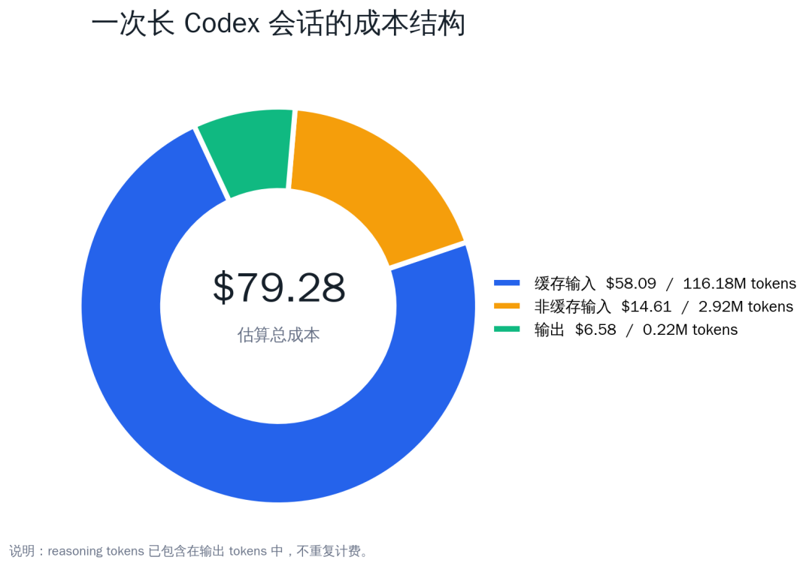
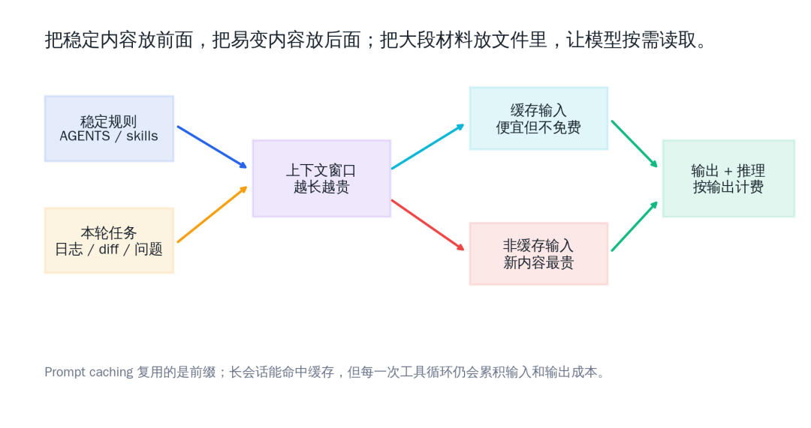
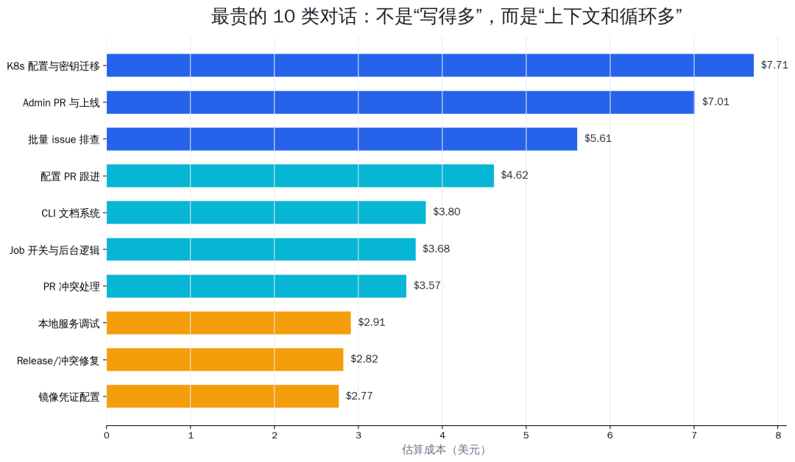
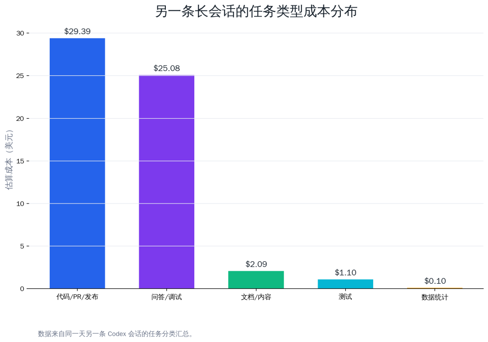

古董级程序员，大厂出来后一直在创业公司，现在还在一线写 AI 相关的后端。更完整的技术记录写在微信公众号「字与码」：踩过的坑、换技术栈时的权衡、和这些年绕过的弯路，会不定期发在那里。若这篇对你有用，欢迎顺手关注。

我最近把一条很长的 Codex 会话完整算了一遍账。结果有点出乎意料：真正贵的不是最后那几段回答，而是为了完成任务，模型在每一次循环里反复带上的上下文。

那条会话持续了一整天，做了很多典型的工程工作：读文档、查日志、改代码、解冲突、提 PR、上线、排查 CI。最后统计下来，主会话一共消耗了 **119,743,174 tokens**，大约相当于我当时 Codex 周用量的**15%**。按 GPT-5.5 的标准 API 价格估算，原始成本约**79.28 美元**。其中输出只有 219,381 tokens，不到总量的 0.2%。大头是输入，尤其是长会话里不断复用的缓存输入。

需要先强调一点：文里的美元价格只是拿公开 API 单价做的「原始成本估算」，不是我实际付给 Codex 的边际成本。订阅套餐、限额、缓存、服务侧调度和平台定价是另一套账，实际摊到个人使用上的成本通常远低于这个数字。这篇文章不是想制造「Codex 很贵」的焦虑，而是想把长会话里的 token 流向看清楚。看清楚以后，才能知道哪些优化有意义，哪些优化只是自我折腾。

这就是 Codex 这类 coding agent 的成本特点：它不像普通聊天那样「问一句，答一段」。它会读文件、跑命令、看日志、修改代码、再验证；每一步都要带着任务上下文继续推理。上下文越长，循环越多，token 就越容易悄悄涨上去。


## 先说结论

**如果只记四件事，我会这样记**：

第一，**长会话不是免费记忆**。哪怕 prompt caching 命中率很高，缓存输入仍然会计价，只是单价更低。

第二，**最贵的对话往往不是文字最多的对话，而是跨仓库、跨系统、需要多轮工具调用的对话**。比如排查线上问题、处理 PR 冲突、迁移部署配置、批量扫描 issue。

第三，**省 token 的关键不是让回答变短，而是让任务边界变清楚**：该拆会话就拆，会话之间用交接摘要；大段日志放文件里，让模型按需读；稳定规则沉淀到 `AGENTS.md`、skills 或本地配置里，不要每次都重新粘一遍。

第四，**不要为了省 token 把工作流搞得很别扭**。Codex 本身是够用的，真正值得优化的是那些明显浪费的输入：整段日志、无关历史、反复粘贴的固定规则、一次塞太多互不相关的任务。为了少花一点 token 而频繁打断工作状态，通常得不偿失。

## 这次统计怎么算

这次统计来自本地 Codex session log 里的 `token_count` 记录。计价口径使用 GPT-5.5 的公开 API 价格：

| 类型 | 单价 |
| --- | --- |
| 非缓存输入 | $5.00 / 1M tokens |
| 缓存输入 | $0.50 / 1M tokens |
| 输出 | $30.00 / 1M tokens |

**计算公式很简单**：

```
uncached_input = input_tokens - cached_input_tokenscost =  uncached_input / 1,000,000 * 5.00  + cached_input / 1,000,000 * 0.50  + output_tokens / 1,000,000 * 30.00
```

这里有两个容易算错的点。第一，`reasoning_output_tokens` 已经包含在 `output_tokens` 里，不能再单独加一次。第二，这只是 API 侧的原始价格估算，不等同于订阅制产品的真实边际成本。对个人用户来说，更有参考价值的反而是「它占了多少周用量」：这条一整天的长会话约占 **15**%周用量；生成这篇文章本身约占**1%** 周用量。

OpenAI 的模型文档显示，GPT-5.5 的文本 token 价格是 input \$5.00、cached input \$0.50、output \$30.00；它还有 1,050,000 的上下文窗口和 128,000 的最大输出 tokens。文档也提醒，GPT-5.5 如果单次输入超过 272K tokens，会进入长上下文加价区间。本文统计的那条会话里，单次最大输入约 238,871 tokens，没有触发这条加价规则。

Prompt caching 这部分也值得单独说一下。OpenAI 的 prompt caching 文档写得很清楚：缓存命中依赖「完全匹配的前缀」，稳定的系统提示、工具定义、历史上下文更容易复用；静态内容应该放在 prompt 前面，动态内容放后面。缓存能显著降低延迟和输入成本，但它不是免费额度。



从这张图看，缓存输入的 token 数最多，费用也最多。它的单价只有非缓存输入的十分之一，但体量太大，最后仍然占了主要成本。

## 为什么一个短问题也可能很贵

很多人第一次看 agent 的 token 账单，会有一个误解：我明明只问了一句，为什么这轮消耗这么多？

**原因是「这一句」并不是孤立发给模型的。对 Codex 来说，本轮请求通常会带上**：

- 系统和开发者规则；

- 当前仓库的上下文摘要；

- 会话历史；

- 最近工具调用结果；

- 可用工具定义；

- 用户刚刚发的任务；

- 可能还有打开过的文件片段、错误日志、测试输出。

所以，一个看上去只有十几个字的问题，实际输入可能是几十万 tokens。更关键的是，agent 任务往往不是一次模型调用，而是一串调用：先分析、再读文件、再改代码、再跑测试、再处理失败、再总结。每一次循环都会重新消耗一部分上下文。



这也是为什么「让最终回答短一点」只能省一点输出成本，不能从根上解决问题。真正要省的是反复带进去的上下文，以及没有必要展开给模型看的材料。

## 哪些对话最耗 token

我把那条主会话里最贵的 10 个交互挑出来，结果很符合日常直觉：越是跨系统、跨仓库、需要不断验证的任务，越贵。



这 10 个交互具体做了什么，也很有代表性。

| 排名 | 估算成本 | 这轮大概在做什么 | 为什么贵 |
| --- | --- | --- | --- |
| 1 | $7.71 | 迁移一套后台服务的 Kubernetes 部署方式，同时处理镜像仓库凭证、集群配置、密钥管理和部署验证。 | 同时牵涉代码仓库、配置仓库、线上机器、K8s 资源、CI workflow；每一步都要确认不会影响既有服务。 |
| 2 | $7.01 | 提交后台服务 PR、跟进上线、验证新镜像和新工作流是否生效。 | 既要整理本地改动，又要查 PR 状态、构建日志、部署结果，属于高频工具调用任务。 |
| 3 | $5.61 | 扫描一批指派给我的 issue，判断是否仍存在，能修就修，已修就 comment 并关闭。 | issue 数量多，每个 issue 都要看上下文、代码、历史 PR，有些还要实际验证。 |
| 4 | $4.62 | 跟进配置仓库 PR 通过后的后续动作，确认配置能否进入部署链路。 | 这类任务表面只是「PR 通过了」，实际要回到部署设计里确认下一步怎么触发。 |
| 5 | $3.80 | 为 CLI 引入基于 MkDocs 的文档系统，梳理命令文档和线上文档结构。 | 文档任务会读大量现有命令、配置和站点结构，输入材料多。 |
| 6 | $3.68 | 调试本地 Job Platform 页面，增加开关、联动 run 列表、检查后台逻辑。 | 前后端一起改，且需要反复看日志、看页面状态、看服务行为。 |
| 7 | $3.57 | 处理已有 PR 的冲突，判断 PR 内容是否已合入测试分支，再修复冲突。 | 冲突处理通常需要看两边历史、当前分支状态和目标分支内容。 |
| 8 | $2.91 | 调试本地服务管理面板，排查为什么某个服务状态、日志或启动方式不对。 | 本地进程、端口、日志、配置文件都要看，循环验证较多。 |
| 9 | $2.82 | 合并当前改动到已有 PR，解决冲突并准备 release。 | PR 与 release 混在一起时，需要同时保留变更说明、测试结果和分支关系。 |
| 10 | $2.77 | 把镜像仓库拉取凭证纳入配置管理，改成可复用的加密 Secret。 | 涉及安全边界、命名、加密方式、部署兼容性，不能只改一行配置。 |

这些交互大致可以归为五类。

**第一类是部署和配置迁移。** 这种任务通常要读 README、看 Kubernetes 或 CI 配置、查线上环境、改 workflow、再验证部署结果。它贵的地方不在某一个回答，而在「查清楚」和「确认没影响别的服务」。

**第二类是批量 issue 排查。** 用户一次给十几个 issue，让 Codex 判断是否存在、能不能修、修了要不要关闭。每个 issue 都需要看上下文、看代码、看 PR、甚至跑测试。单个 issue 可能不贵，批量做就会叠起来。

**第三类是多仓库 PR 和 release。** 一个仓库改代码，另一个仓库更新依赖，第三个仓库改部署配置；中间还要解决冲突、更新 PR 说明、重新跑 CI。每跨一个仓库，上下文和工具循环都会变长。

**第四类是长日志排查。** 用户把几百行甚至几千行日志贴进来，模型确实能读，但也会完整计入输入。日志里真正有用的可能只有 20 行。

**第五类是文档生成。** 读飞书文档、结合代码、再生成长文档，看上去是「写作任务」，实际上包含读取、归纳、重写、排版和多次校正。

另一条同一天的长会话也印证了这个结论。按任务类型粗分，代码/PR/发布和问答/调试占了绝大多数成本，普通数据统计反而很少。



| 任务类型 | 估算成本 | 占比 |
| --- | --- | --- |
| 代码 / PR / 发布 | $29.39 | 50.9% |
| 问答 / 调试 | $25.08 | 43.4% |
| 文档 / 内容 | $2.09 | 3.6% |
| 测试 | $1.10 | 1.9% |
| 数据统计 | $0.10 | 0.2% |

这个比例也和一篇关于 agentic coding token 消耗的研究结论一致：agentic coding task 的成本往往由输入 tokens 驱动，而不是输出 tokens；同一个任务的 token 消耗还可能有很大波动。换句话说，agent 的成本不是只由「任务看起来难不难」决定，更多取决于它为了完成任务走了多少步、读了多少材料、试错了多少次。

## Prompt caching 能帮忙，但别把它当免费午餐

Prompt caching 是长会话能跑起来的重要原因。没有缓存，每一次都完整处理几十万 tokens，成本和延迟都会更难接受。

但 caching 的作用更像是「给重复前缀打折」，不是「把上下文变成免费」。所以它有几个工程上的启发：

| 做法 | 影响 |
| --- | --- |
| 稳定规则放前面 | 更容易命中前缀缓存 |
| 易变输入放后面 | 避免破坏前缀 |
| 不要频繁改系统级规则 | 减少缓存失效 |
| 大段日志不要直接贴 | 降低非缓存输入 |
| 长任务拆成多个会话 | 减少每轮携带的历史 |

这点在 Codex 里尤其明显。比如 `AGENTS.md`、skills、工具说明、固定工作流，这些内容适合成为稳定前缀；而某次报错日志、某个 PR 的 diff、某段临时 SQL，就应该靠文件和命令按需读取。

## 我的省 token 工作法

下面这些做法不是理论上的 prompt engineering，而是长时间用 Codex 做工程任务后留下来的习惯。

### 1. 一个会话最好只做一个主题

最容易失控的场景，是在同一个会话里连续做十几件互不相关的事：上午修 CI，下午查数据库，晚上写博客，中间还穿插几个 PR review。这样会话上下文越来越厚，后面的每一句都在为前面的历史付费。

**更好的方式是按交付物拆**：

- 一个 PR 一个会话；

- 一个线上事故一个会话；

- 一篇文档一个会话；

- 一次数据分析一个会话。

如果任务需要延续，就让 Codex 生成一段交接摘要，复制到新会话开头。摘要通常几百到一两千 tokens，远比带着几十万 tokens 的历史继续跑便宜。

这并不等于每个小问题都要新开窗口。我的经验是：只要任务还在同一个交付物里，比如同一个 PR、同一个线上问题、同一篇文档，就可以继续用同一个会话。Codex 自动 compact 以后，长会话仍然能工作，只是它会把历史压缩成摘要。这个能力很实用，不需要过度规避。

真正应该新开的，是「主题切换」：刚才在修后台部署，突然要写博客；刚才在查数据库，突然要 review 前端 PR；刚才在做线上问题，突然要研究一个完全不相关的新技术。这种切换不仅会增加 token，也会污染模型对当前任务优先级的判断。

### 2. 不一定每个仓库一个会话，但每个交付物最好一个会话

「每个仓库一个会话」听起来很清楚，但现实里很多任务天然跨仓库。比如一个功能可能要同时改后端、前端和部署配置；一个发布问题可能要看业务仓库、CLI 仓库和配置仓库。硬拆成三个会话，反而会丢失上下文。

**我更推荐按交付物，而不是按仓库**：

| 场景 | 建议 |
| --- | --- |
| 单仓库小改动 | 一个会话做完 |
| 一个 PR 牵涉多个仓库 | 一个会话统筹，但每个仓库分阶段处理 |
| 多个互不相关 PR | 分多个会话 |
| 一个线上事故跨多个服务 | 一个会话保留事故上下文 |
| 同一天连续处理很多 issue | 先建一个分诊会话，再把复杂 issue 单独拆出去 |

多仓库会话的关键是让 Codex 清楚当前阶段：现在只看哪个仓库、只改哪类文件、下一步验证什么。否则模型容易在多个目录之间来回跳，token 和时间一起涨。

### 3. 冷门任务尽量新开会话

有些任务很「冷门」：临时研究一个陌生库、查一个很少用的云服务、写一篇完全不同主题的文章、分析一份和当前项目无关的资料。这类任务如果塞进长期工程会话里，会带来两个问题。

第一，它会污染当前会话的语义背景。后面继续做原来的工程任务时，模型可能还会把刚才那堆陌生材料带在历史里。

第二，它不利于缓存。Prompt caching 依赖稳定前缀；长期工程会话里前缀相对稳定，突然插入大量异质材料，虽然不一定完全破坏缓存，但会让后续上下文变得更重。

所以我的做法是：冷门任务、一次性调研、和当前项目无关的写作，单独开会话。做完后只把结论摘要带回来，不把整个过程带回来。

### 4. 更好利用缓存：稳定内容早放，临时内容晚放

Prompt caching 对 agent 很重要，但它不是用户能手动「开关」的功能。我们能做的是提高它命中稳定前缀的概率。

**几个简单原则**：

- 稳定规则放在 `AGENTS.md`、skills、README、本地配置里，不要每次临时粘贴；

- 同一个会话里，不要反复改系统级要求和工作方式；

- 临时日志、diff、SQL、CSV 放文件里，让 Codex 按需读取；

- 长 prompt 里，稳定背景放前面，易变输入放后面；

- 如果一段材料只对一次任务有用，不要把它带进长期会话。

这也是为什么我不喜欢在每次请求里重复贴一大段「你要如何工作」。稳定规则应该沉淀，临时材料应该隔离。

### 5. 日志只给关键段，全文放文件

**不要把完整日志直接贴进聊天窗口。更好的写法是**：

```
日志在 /tmp/deploy.log。请先用 rg 查找 ERROR、Traceback、exit code、failed，再只读取相关上下文。不要把整份日志输出给我。
```

这样模型会用工具定位，而不是把整份日志吞进去。对几千行 CI log 或服务日志来说，这个差异非常大。

还有一个实用做法：如果已经知道错误大概在哪里，只贴前后 30 到 80 行就够了。比如 CI 失败，通常只需要失败 job 的最后一段、报错栈、触发命令和环境变量摘要。完整日志可以放路径，留给 Codex 需要时再读。

### 6. 数据分析先确定口径，再跑全量

统计类任务容易反复返工。比如「统计最近 7 天某 provider 的调用量」看似简单，但数据源可能有 MongoDB、Postgres、历史表、账单表，口径可能是 raw call、billable result、成功调用、搜索曝光。

**我现在会先问**：

```
先不要全量跑。请先说明你准备用哪些表、哪些字段、什么时间窗口、如何判断成功和计费。
```

口径确认后再执行，能少很多无效查询和无效上下文。

如果数据量很大，尽量让 Codex 先产出 SQL 或脚本，再把结果落到临时文件。聊天里只展示 top N、异常样本和结论。完整结果留在 CSV、JSON 或 Markdown 文件里。

### 7. 让 Codex 用文件，不要用聊天框搬运文件

大段配置、SQL、JSON、CSV，都更适合放到文件里。用户只需要告诉 Codex 路径和目标。

```
数据在 /tmp/provider_stats.csv。请读取并生成 top 20 的对比表，不要输出原始 CSV。
```

这样有两个好处：第一，聊天历史不被大文件污染；第二，Codex 可以用脚本处理，模型只读汇总结果。

### 8. 稳定偏好沉淀到规则里

**有些信息每次都说，既浪费 token，也容易漏**：

- PR 标题必须中文；

- 某个仓库的 release 分支规则；

- 本地服务怎么启动；

- 哪些群 ID 是固定的；

- 某类测试怎么跑；

- 某个产品怎么发版。

这类内容应该放进 `AGENTS.md`、skills、项目 README 或本地配置。这样模型能按需读取，也更容易保持一致。

### 9. 明确输出上限

很多时候，真正需要的是结论，不是完整过程。

| 原始说法 | 更省 token 的说法 |
| --- | --- |
| 看一下这个 run 为什么失败 | 只提取失败 job、关键错误、最可能原因和修复建议 |
| 分析这些 issue | 每个 issue 最多 5 行：是否存在、证据、建议动作 |
| 总结这个 PR | 只列行为变化、风险、测试，不要复述所有 diff |
| 生成报表 | 只列 top 20，完整结果写入文件 |
| 看日志 | 先 rg 关键字，再读命中上下文 |

输出短一点当然能省输出 token，但更重要的是它会让模型少走弯路。

### 10. 不要把 compact 当成失败

Codex 自己做 compact，说明上下文接近窗口上限，需要把历史压缩成摘要。它不是坏事。对长任务来说，compact 能让会话继续进行，也能保留大体脉络。

但 compact 也不是万能的。它会丢掉一些细节，尤其是很早之前的边缘约束、某个文件的具体改动、某次命令输出里的小线索。所以长任务 compact 后，我通常会做两件事：

- 让 Codex 先复述当前目标、已完成事项、未完成事项；

- 如果某个关键细节很重要，把它写进文件、issue、PR 描述或交接摘要里。

不要指望会话历史永远完美保存。真正重要的东西应该落到可查的地方。

### 11. 多开窗口是可以的，但要有边界

**多开几个 Codex 会话窗口是正常的。我一般会这样分**：

- 主线窗口：当前最重要的 PR、发布或事故；

- 调研窗口：临时查资料、比较方案；

- 文档窗口：写文章、整理飞书文档、生成报告；

- 验证窗口：跑测试、查日志、做一次性数据分析。

多窗口的风险是结论分散。解决办法是每个窗口结束时生成一段交接摘要，明确「可以带回主线的结论」。不要把多个窗口的完整历史互相搬运，那只是把省下来的 token 又花回去。

### 12. 先让 Codex 计划，再让它执行

对复杂任务，直接说「帮我修好」当然可以，但容易让模型一上来就读很多文件、跑很多命令。更省也更稳的方式是：

```
先不要改代码。请先说明你会检查哪些文件、可能的原因、验证方式。
```

计划阶段通常不贵，但能避免后面走错方向。确认方向后再让它执行，整体反而更省。

## 一张实用检查表

| 高成本信号 | 更好的做法 |
| --- | --- |
| 一个会话已经跨了多个主题 | 生成交接摘要，开新会话 |
| 用户消息里贴了长日志 | 改成给文件路径，让 Codex 搜关键行 |
| 一次要求处理很多 issue / PR | 分批处理，或先做优先级列表 |
| 需要读很多文档 | 指定章节或目标问题，不要泛读全文 |
| 需要跑数据库统计 | 先确认口径，再执行查询 |
| 反复强调固定规则 | 写进 AGENTS.md 或 skill |
| 输出经常很长 | 明确 top N、只要差异、不要贴全文 |
| 任务需要长时间验证 | 拆成「实现」「验证」「发布」多个会话 |

## 别把 token 优化变成新的负担

写到这里，很容易让人产生一种错觉：用 Codex 必须小心翼翼，时时刻刻算 token。我的实际感受正好相反。

Codex 的额度在日常工程使用里是够用的。真正需要关心的不是「每句话省一点」，而是避免明显浪费：把整份日志粘进来、一个会话混十几个主题、重复贴固定规则、让模型在错误方向上跑很久。这些优化本身也会改善工作质量，不只是省 token。

如果为了省 token，把本来顺畅的工作拆得七零八落，频繁开新窗口、复制摘要、重新解释背景，那就过头了。工程效率永远是第一位的。我的判断标准很简单：

| 情况 | 是否值得优化 |
| --- | --- |
| 正在处理一个连续任务，会话上下文还能帮上忙 | 不急着拆 |
| 会话已经混入多个不相关主题 | 值得拆 |
| 只是怕 compact | 没必要 |
| 大段日志、CSV、JSON 正准备贴进聊天框 | 值得改成文件路径 |
| 一次性冷门调研 | 值得新开会话 |
| 固定规则每次都重复说 | 值得沉淀到规则或 skill |

所以更准确的说法不是「省 token」，而是「减少无效上下文」。有效上下文应该保留，无效上下文才应该删掉。

## 对团队来说，token 优化其实是流程优化

如果只是个人偶尔用 Codex，token 成本可能没那么显眼。但当团队开始把 Codex 用在 PR review、CI 排查、发版、数据分析、文档生成这些日常工作上，token 就会变成一种工程预算。

**这个预算不应该靠「少用」来控制。真正有效的是把流程设计好**：

- 规则稳定、可复用；

- 数据通过文件和脚本流动；

- 对话按任务边界拆分；

- 长日志和大文档不直接塞进聊天；

- 每次让模型先说口径，再大规模执行；

- 重要任务结束后生成交接摘要。

这样做不是为了抠几毛钱，而是为了让 Codex 的工作方式更可靠。长上下文很强，但它不是无限免费的白板。真正好用的 agent 工作流，应该让模型把精力花在判断和决策上，而不是反复读同一堆历史材料。

## 参考资料

- OpenAI Prompt Caching 文档`[1]`

- OpenAI GPT-5.5 模型文档`[2]`

- OpenAI: Introducing GPT-5.5`[3]`

- How Do AI Agents Spend Your Money? Analyzing and Predicting Token Consumption in Agentic Coding Tasks`[4]`

## 附：写这篇文章时又花了多少 token

这部分统计会在文章生成完成前写入，因此不会包含最后一次构建校验之后的最终回复。这样处理是为了避免「为了统计统计本身又产生新的统计」。

截至写入本文前，本轮写作相关模型请求共 **26 次**（另有 1 条上下文压缩记录未计入接口成本），合计**3,517,666 tokens**，约占当时 Codex 周用量的**1%**。按 GPT-5.5 标准 API 价格估算，原始成本约\**$4.1587**。同样要注意，这只是 API 单价口径下的原始估算，不等同于订阅套餐里的真实摊销成本。

| 指标 | 数值 |
| --- | --- |
| 输入 tokens | 3,501,200 |
| 缓存输入 tokens | 3,075,840 |
| 非缓存输入 tokens | 425,360 |
| 输出 tokens | 16,466 |
| reasoning 输出 tokens | 1,683 |
| 缓存命中占输入比例 | 87.9% |
| 估算成本（API 原始价格口径） | $4.1587 |

逐次模型请求明细如下。说明列是根据本轮操作顺序做的阶段标注，价格仍按上面的 GPT-5.5 标准 API 公式估算。

| # | 本次调用说明 | 输入 | 缓存输入 | 输出 | 推理输出 | 估算成本 |
| --- | --- | --- | --- | --- | --- | --- |
| 1 | 读取任务与写作规则，确认博客仓库结构 | 203,042 | 4,480 | 478 | 170 | $1.0094 |
| 2 | 检索 OpenAI prompt caching、GPT-5.5 与 agent token 资料 | 215,467 | 202,624 | 258 | 97 | $0.1733 |
| 3 | 读取飞书源文档和站点文章风格样例 | 215,525 | 208,768 | 37 | 0 | $0.1393 |
| 4 | 整理源文档中的主会话统计口径 | 219,938 | 215,424 | 442 | 87 | $0.1435 |
| 5 | 确认图表方案与文章结构 | 223,147 | 219,520 | 284 | 8 | $0.1364 |
| 6 | 生成/整理封面图与图表数据 | 233,349 | 223,104 | 393 | 47 | $0.1746 |
| 7 | 起草文章主体前的结构化推理 | 232,197 | 208,768 | 2,072 | 225 | $0.2837 |
| 8 | 上下文压缩记录；非一次实际模型接口成本 | 0 | 0 | 0 | 0 | - |
| 9 | 恢复压缩后的上下文并确认任务状态 | 68,151 | 53,632 | 295 | 50 | $0.1083 |
| 10 | 检查博客仓库、frontmatter 和图片目录 | 76,401 | 67,968 | 471 | 101 | $0.0903 |
| 11 | 生成 PNG 图表并处理中文字体问题 | 77,671 | 70,016 | 97 | 21 | $0.0762 |
| 12 | 补充官方资料引用与外部研究引用 | 77,845 | 77,184 | 355 | 23 | $0.0525 |
| 13 | 写入文章初稿与图片引用 | 85,012 | 77,696 | 95 | 8 | $0.0783 |
| 14 | 检查 session log 位置和 token 统计方法 | 85,154 | 84,864 | 2,320 | 9 | $0.1135 |
| 15 | 解析 token_count 事件结构 | 93,960 | 84,864 | 80 | 19 | $0.0903 |
| 16 | 定位当前用户消息所在窗口 | 94,311 | 93,568 | 1,969 | 12 | $0.1096 |
| 17 | 聚合本轮 token 明细 | 112,143 | 94,080 | 4,552 | 369 | $0.2739 |
| 18 | 检查图表实际显示效果 | 114,949 | 96,128 | 263 | 38 | $0.1501 |
| 19 | 运行 Astro 构建校验 | 115,259 | 114,560 | 93 | 6 | $0.0636 |
| 20 | 等待构建完成并读取结果 | 115,457 | 115,072 | 202 | 17 | $0.0655 |
| 21 | 准备写入本轮 token 统计说明 | 115,848 | 115,072 | 209 | 9 | $0.0677 |
| 22 | 生成最终 token 明细表 | 116,837 | 115,584 | 281 | 17 | $0.0725 |
| 23 | 构建后复核文章与图片资源 | 119,278 | 116,608 | 544 | 58 | $0.0880 |
| 24 | 汇总最新统计口径 | 120,697 | 119,168 | 176 | 53 | $0.0725 |
| 25 | 生成写入正文前的统计摘要 | 121,498 | 120,192 | 335 | 224 | $0.0767 |
| 26 | 读取构建输出并准备最终补丁 | 123,955 | 53,632 | 92 | 8 | $0.3812 |
| 27 | 输出明细表供写入文章 | 124,109 | 123,264 | 73 | 7 | $0.0680 |

这张表比总成本更有用，因为它能反推下一次怎么优化。

最明显的是第 1 次调用：输入 203,042 tokens，缓存输入只有 4,480 tokens，缓存命中率约 2.2%，单次成本就到了 \$1.0094。原因并不复杂：这轮写博客是在一个长期工程会话里临时切出来的，模型要重新吸收写作任务、站点结构、工作区规则、飞书文档处理方式、图片要求等一整套背景。对一个不常发生的写作任务来说，这很正常；但如果以后经常写博客、同步公众号，就值得单独开一个「博客写作与发布」会话。

**这个专用会话可以长期保留以下稳定上下文**：

- 博客仓库位置、文章目录、图片目录、frontmatter 规则；

- 封面图和插图的尺寸、风格、不能用 SVG 的约束；

- 常用构建命令和发布/同步公众号流程；

- 文章风格偏好：少 AI 味、不要内部链接、保留个人技术复盘口吻；

- 常用参考资料处理方式：飞书文档只当素材，不直接照搬。

如果这个任务不是天天做，也不需要一直开着窗口。更好的方式是保留这条专用会话，需要写博客时用 resume 拉起来。这样既能保留稳定前缀和缓存，又不会把博客写作材料混进主工程会话里。

第 2 到第 7 次调用的缓存命中已经明显改善，大多在 89% 到 98% 之间。说明一旦写作上下文稳定下来，继续查资料、读源文档、整理结构、生成图表，缓存就能发挥作用。这里的优化重点不是拆会话，而是避免在中途频繁改变写作规则。比如不要一会儿要求公众号风格、一会儿要求论文风格、一会儿又要求产品公告风格；风格稳定，前缀也更稳定。

第 11 次「生成 PNG 图表并处理中文字体问题」成本不高，但暴露出另一个可优化点：图表生成脚本可以沉淀成站点工具。现在每次都让 Codex 临时写 matplotlib 脚本、处理字体、检查 PNG，如果以后经常写带图表的文章，可以在博客仓库里放一个 `scripts/render_blog_charts.py` 模板，或者在 skill 里记录中文字体、尺寸、配色、输出路径。这样模型只需要填数据，不需要每次重新推导图表工程细节。

第 14 到第 17 次是在解析当前 session log，计算这篇文章自身消耗的 token。这里的输出和推理都明显变多，尤其第 17 次输出 4,552 tokens。它本身有价值，但不应该每篇文章都重新发明一次。更好的做法是把「解析 Codex session token 用量」做成固定脚本：输入 user message 片段或 turn id，输出 Markdown 表格和成本估算。这样以后写类似文章，只需要运行脚本，不需要让模型在聊天里反复解释和手工汇总。

第 19 到第 25 次大多是构建、复核、准备写入统计，缓存命中很好，成本都不高。这说明验证步骤不必为了省 token 而省掉。构建一次能发现 frontmatter、图片路径、Markdown 表格这类问题，收益远大于这点 token。

第 26 次调用比较特殊：输入 123,955 tokens，缓存输入只有 53,632 tokens，缓存命中率约 43.3%，成本突然升到 \$0.3812。它发生在读取构建输出并准备最终补丁时。这里的优化不是不跑构建，而是控制构建输出进入上下文的方式：只保留是否成功、失败摘要和相关错误；对于成功构建，不需要把几百行 route 生成日志完整带进下一轮。可以让命令输出限制得更短，或者只 grep 新文章路径和最终 `Complete`。

**所以，单看这篇文章的写作过程，最具体的优化建议是**：

| 观察 | 下次怎么做 |
| --- | --- |
| 第 1 次调用缓存命中极低，说明写作背景是冷启动 | 建一个「博客写作/公众号发布」专用会话，按需 resume |
| 写作风格、目录、图片规则每次都要重新确认 | 把这些规则沉淀到博客 skill 或仓库说明 |
| 图表脚本每次临时生成 | 准备固定 PNG 图表模板，模型只填数据 |
| token 统计逻辑靠临时脚本和聊天推理 | 做成固定统计脚本，输出 Markdown 片段 |
| 成功构建日志很长 | 构建输出只保留结果摘要和新页面路径 |
| 文档源和文章仓库是两个领域 | 写作会话与主工程会话分开，避免污染主线缓存 |

换句话说，优化不是把写作拆得更碎，而是把可复用的写作环境固定下来。下一次再写同类文章，最理想的流程应该是：resume 博客会话，给出飞书文档或素材路径，直接生成文章、图表、构建校验和公众号同步草稿。这样既能减少冷启动成本，也能减少主工程会话被写作上下文污染。

------------------------------------------------------------------------

### 参考链接

1. https://developers.openai.com/api/docs/guides/prompt-caching

2. https://developers.openai.com/api/docs/models/gpt-5.5

3. https://openai.com/index/introducing-gpt-5-5/

4. https://arxiv.org/abs/2604.22750
