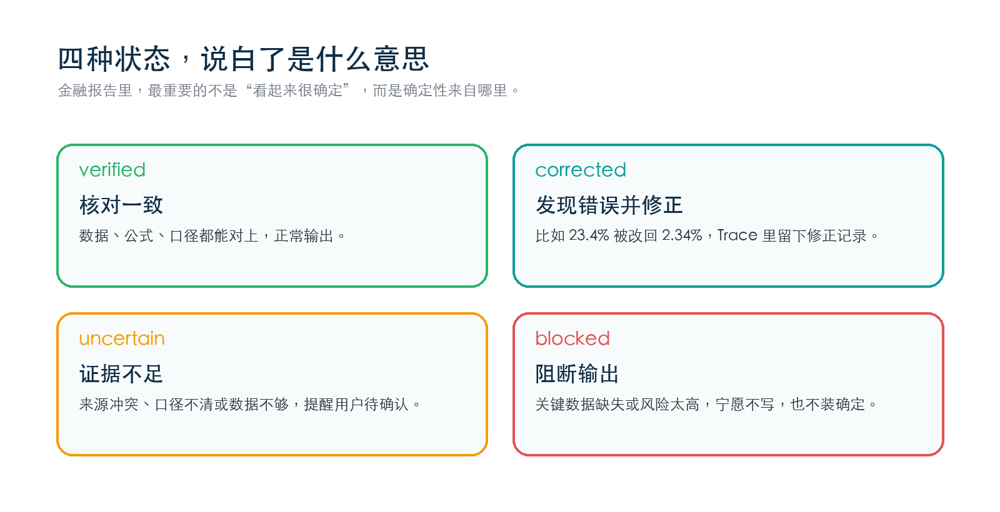
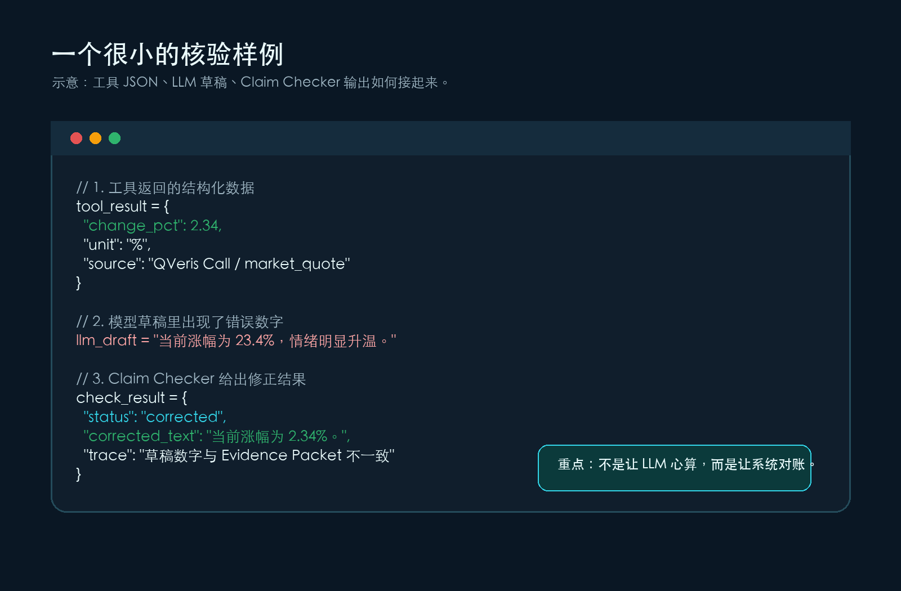
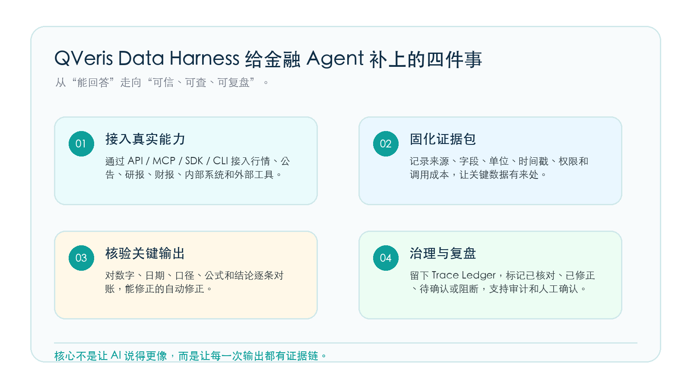

工具没错，数据源也没错。真正危险的，是一个正确数据在写进报告时，被模型悄悄写错了一位。

一个看起来很小的数字错误，可能会一路进入晨会、客户简报和公众号草稿。

**工具返回 2.34%，模型写成 23.4%。这不是数据源坏了，而是工具结果进入自然语言输出时出了错。**

## **一个早上的小事故**

周一早上，研究员小林让 AI 帮忙写一段异动快报。

工具返回的数据很正常：某只股票当前涨幅是 2.34%，成交量比前一日放大，盘中有一条公告被市场关注。几秒后，AI 草稿出来了，文字很顺：公司股价大涨 23.4%，资金明显追捧，短期情绪迅速升温。

小林第一眼觉得顺，第二眼就冒冷汗。

2.34% 被写成了 23.4%。工具没错，数据源没错，错在模型把数据抄进报告的那一刻。更麻烦的是，如果这段话没有被人工发现，它可能继续进入晨会纪要、客户简报、公众号草稿，最后变成一个看起来“有来源”的错误。

## **更常见的幻觉，不是编造，而是写错**

很多人理解的 AI 幻觉，是模型凭空编了一个事实。但在金融场景里，更常见也更难发现的是另一类幻觉：数据是真的，最后写出来的东西却错了。

比如，工具返回万元，报告写成亿元；美元和人民币混在一起；同比、环比被算反；季度口径和年度口径放在一张表里；“可能受事件影响”被写成“确定上涨原因”。这些错误不像胡说八道，它们往往藏在一段很专业、很流畅的文字里。

这也是金融 AI 比普通问答更难做的地方：你不仅要回答得像样，还要让每个关键数字、每个结论都能回到证据上。

## **为什么只靠 prompt 不够**

你当然可以在 prompt 里写：不要编造、请仔细核对、所有数据必须有来源。

问题是，模型本质上还是在生成文字。让它一边写、一边记住所有字段口径、一边做精确计算、一边判断合规边界，这不现实。金融报告里的关键事实，不能只靠模型“认真一点”。

QVeris Data Harness 的思路很简单：别让模型一个人背锅，也别让模型一个人做账。

## **QVeris Data Harness 怎么拦住这个错误**

当 Agent 调用工具后，Data Harness 会先把工具结果封成一个 Evidence Packet。它不只是保存一个数字，还会记录这个数字来自哪个工具、哪个 provider、哪个字段，是什么时间返回的，单位是什么，是否有延迟，调用花了多少 credits。

接着，LLM 可以负责写草稿。但草稿不能直接交付。Data Harness 会把草稿里的关键 claim 抽出来，尤其是数字、日期、实体、计算结果和带判断色彩的结论。Claim Checker 再拿这些 claim 去对照 Evidence Packet、字段定义和公式模板。

刚才那个例子里，草稿写“涨幅 23.4%”，证据包里是“change_pct = 2.34”。Claim Checker 不需要猜，它只要核对：这个数字和证据是否一致？不一致，但可以修正，于是状态就是 corrected，修正文本是“涨幅 2.34%”。

QVeris Data Harness 的核心思路：先固化证据，再让模型写作，最后逐条核验。

## **四个状态，比一句“AI 已核验”更有用**

QVeris 不会把所有结果都包装成“已确认”。它会把关键输出拆成四类状态。

verified 表示证据一致，可以正常输出；corrected 表示发现抄写、单位或计算错误，但能自动修正；uncertain 表示数据不足或口径冲突，需要提示用户待确认；blocked 表示关键数据缺失或风险太高，系统宁愿不输出，也不把错误包装成确定结论。

这四个词看起来很技术，但本质上就是一句人话：能确认的确认，能修的修，不能确定的说清楚，风险太高的别硬写。

四类核验状态让用户知道：哪里可信，哪里被修正，哪里还需要确认。

## **这不是纠错插件，而是金融 Agent 的事实保真层**

Data Harness 的价值不只是“纠错”。它让金融 AI 的输出变得可解释：一份报告里哪些是事实，哪些是推断，哪些经过公式复算，哪些需要人工确认，用户可以看得见。

对开发者来说，这意味着不用在每个 Agent 里重复写一堆脆弱的校验逻辑。对投研和内容团队来说，这意味着报告可以更快生成，但关键数字不会裸奔。对机构客户来说，这意味着 PoC、审计和复盘时能看到完整 Trace Ledger，而不是只拿到一段漂亮文字。

所以，QVeris 想解决的不是“让 AI 更自信”，而是“让 AI 的自信有证据”。

代码示意：工具 JSON、LLM 草稿和 Claim Checker 输出如何形成一个核验闭环。

## **让 AI 的自信有证据**

金融场景里，最贵的错误往往不是模型完全编了一个东西，而是它把一个正确数据写错了一位，把一个普通波动写成强烈信号，把一个待确认信息写成确定判断。

Data Harness 做的，就是在这些关键缝隙里加一道门：工具给数据，模型写文字，QVeris 负责把两边对起来。

一个真正值得信任的金融 Agent，不应该只会给答案。它应该告诉你：答案从哪来，哪里被核验过，哪里被修正过，哪里还不确定。

这也是 QVeris Data Harness 的价值：让 AI Agent 接上真实世界的数据，也让每一次输出都经得起回看。

**如果你正在做金融 Agent、投研助手、数据工具调用或企业级 AI 工作流，QVeris Data Harness 可以作为底座：让 Agent 找得到真实能力、调得动真实工具，也让最终输出留下证据。**

QVeris Data Harness：让金融 Agent 的每一次输出都有证据链。
