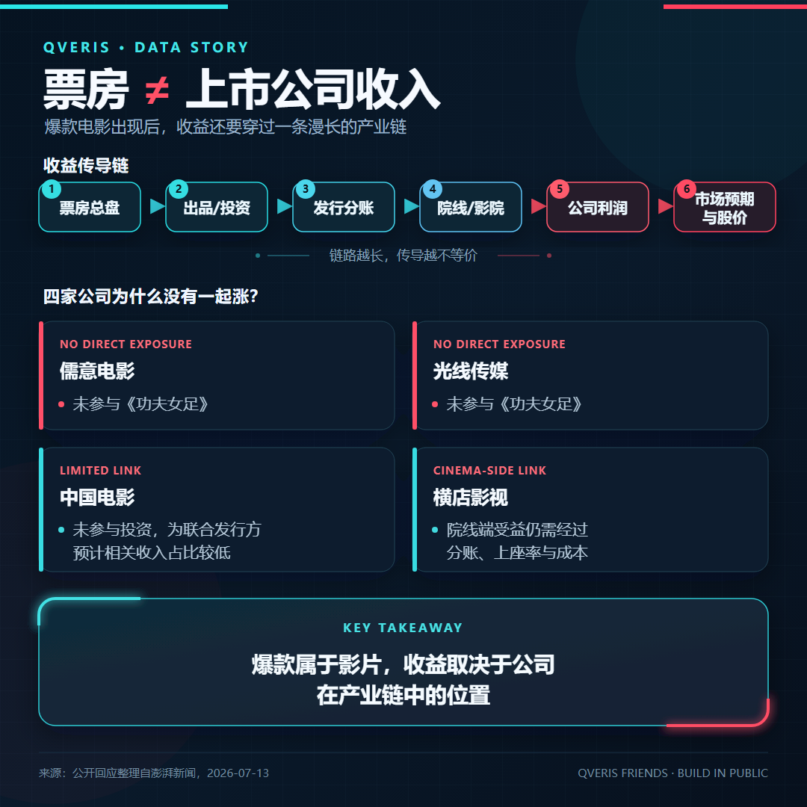
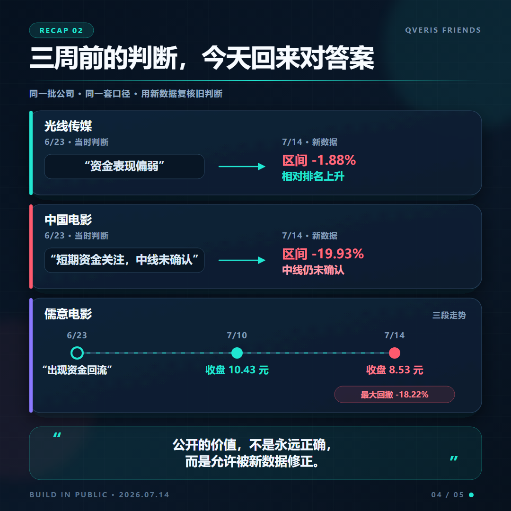

# 票房热了，影视股为什么没一起涨？我用 QVeris 重跑了四家公司

**三周前公开留下的问题，今天回来对答案。**

6 月 23 日，我用 QVeris 看了万达电影、光线传媒、中国电影和横店影视。

当时暑期档刚刚开场，四家公司的股价和资金表现已经出现分化。文章最后还留了一个待办：

> 等到 7 月中下旬，再把同一批公司拉出来看一次。

今天来交作业。

这次不预测哪只股票会涨，也不拿某一天的行情包装结论。我重新拉取了四家公司从 6 月 23 日至 7 月 14 日的行情和资金流向，再把结果与最新票房表现放在一起看。

答案很直接：

> 票房的确热了，但热的是一部电影、一个周末，不是四家上市公司的利润一起增长。

## 01 票房“热了”，但不是全面回暖

先看票房。

截至 7 月 13 日13时14分，2026 年暑期档总票房已经突破 30 亿元；当天20时，《功夫女足》上映3天票房突破6亿元，登顶暑期档票房榜。

单日热度更加明显。公开数据显示，《功夫女足》一度以约48.2%的排片，贡献了超过80.3%的单日票房。

但另一组数据也不能忽略：截至 7 月 12 日15时，暑期档累计票房为28.31亿元，同比仍下降8%。

所以，更准确的描述不是“电影行业全面回暖”，而是：

> 一部爆款影片把暑期档短期热度迅速拉了起来，但行业累计表现仍未超过去年同期。

这也是后面理解股价分化的前提。

## 02 我用 QVeris 重跑了四家公司

这次我调用了 QVeris 接入的 A 股资金流工具，查询：

- 儒意电影，即原万达电影（002739.SZ）
- 光线传媒（300251.SZ）
- 中国电影（600977.SH）
- 横店影视（603103.SH）

其中，万达电影已于今年4月正式更名为儒意电影，证券代码保持不变。

观察区间为 6 月 23 日至 7 月 14 日，共16个交易日。结果如下：

<sheet sheet-id="swhWRB" token="Ke9SsqANuhyS91teQEncfU4Rngc"></sheet>

四家公司里，只有儒意电影的期末价格仍略高于6月23日。

但它的过程并不平稳：股价在7月10日一度达到10.43元，随后两个交易日回落至8.53元，从区间高点回撤18.22%。

光线传媒最终下跌1.88%，反而成为四家公司中表现第二好的公司。

中国电影从15.10元降至12.09元，区间下跌19.93%；横店影视则下跌10.29%。

更值得注意的是：按照该数据源的统计口径，截至7月14日，四家公司近5个交易日的资金净额全部为负。

票房热度出现了，影视股却没有形成同步上涨。

## 03 因为票房不是上市公司的收入

暑期档票房增加，不等于四家公司按照相同比例受益。

以目前最热的《功夫女足》为例，公开回应显示：

- 儒意电影没有参与该影片；
- 光线传媒没有参与该影片；
- 中国电影没有参与投资，主要是联合发行方，预计相关收入占公司整体收入的比例较低；
- 横店影视即使能从院线放映端受益，也还要经过票房分账、上座率、影院成本等环节。

相关情况可见[澎湃新闻对上市公司参投情况的整理](https://www.thepaper.cn/newsDetail_forward_33577524)。

所以，看到一部电影票房突破6亿元，不能直接把这6亿元映射到任意一家“影视概念股”。

> 行业出现爆款，和某家公司真正赚到多少钱，是两个不同的问题。

真正需要追踪的是利益归属：谁参与投资、谁负责发行、谁拥有影院，以及各自在项目中能够分到多少收入。

## 04 市场交易的也不只是票房数字

票房是已经发生的数据，股价交易的却是未来预期。

影片上映前，片单、预售、排片和市场讨论可能已经提前进入价格。上映后的好数据，如果只是兑现此前预期，不一定会继续推动股价。

而且，这次的热度高度集中在单片。

一部影片拿走超过一半的排片，对相关出品方可能是好消息；对没有参与项目、自己的影片还在等待上映的公司，意义则完全不同。

除此之外，估值、公司业绩、后续片单、市场风格和资金偏好，也会同时影响股价。

因此，这次数据能够确认的是：

> 票房表现与四家公司的股价没有简单同步。

但仅凭行情和资金流数据，还不能断言某一天的涨跌究竟由哪一个因素造成。

## 05 把三周前的判断拿回来对答案

这次复盘最有意思的地方，不是哪句话“猜对了”，而是哪句话需要被新数据修正。

6月23日的文章里，光线传媒被认为是资金表现最弱的一家公司。但从后续区间涨跌看，光线传媒反而排在第二，“最弱”的相对排序已经发生变化。

当时中国电影是四家公司中唯一取得正收益的公司，短期资金关注度也比较高；但文章同时提醒，其中期趋势还没有得到确认。

到7月14日，中国电影变成四家公司中区间跌幅最大的一家。

儒意电影此前出现的资金回流，后来确实对应了一段明显上涨，但这段上涨也没有稳定延续。

这就是持续复盘的价值：

> 当时的数据可能没有错，但基于短窗口形成的判断，不应该被无限外推。

Build in Public 不只是公开做对了什么，也应该公开哪些判断被新数据推翻了。

## 06 QVeris 在这次复盘里做了什么？

这次实测中，我给 QVeris 的任务可以概括为：

> 查询002739.SZ、300251.SZ、600977.SH、603103.SH在2026年6月23日至7月14日的收盘价、涨跌幅、资金净流入和DDE数据，计算区间收益、最大回撤及近5日资金净额，并以表格输出。不要对涨跌原因作未经数据支持的归因。

QVeris 把找工具、统一参数、获取数据和重复计算串起来，让三周前提出的问题，可以在今天用相同口径重新验证。

边界也需要说明：本文股票行情和资金流数据通过 QVeris 获取；票房及影片参与方信息来自公开媒体，未通过行情工具提供。文中的“资金净额”为数据服务商依据成交特征计算的统计口径，不能等同于对具体机构身份的识别。

## 写在最后

这次重跑后，我得到的结论不是“票房与股价无关”，而是：

> 行业总票房改善，不会自动、同步地转化为每一家上市公司的业绩和股价表现。

比“票房涨了多少”更值得追踪的，是新增票房最终落到了谁手里、市场此前计入了多少预期，以及短期资金与公司基本面能否持续相互验证。

三周前公开留下问题，今天再用同一套数据回来对答案。

对 QVeris 来说，这种可重复、可复查、也允许被修正的过程，可能比给出一个听起来确定的预测更重要。

---

\*\*数据说明：\*\*股票数据截至2026年7月14日收盘；区间收益及最大回撤均按每日收盘价计算。

\*\*免责声明：\*\*本文仅为 QVeris 产品实测与公开数据复盘，不构成任何投资建议。市场有风险，投资需谨慎。
