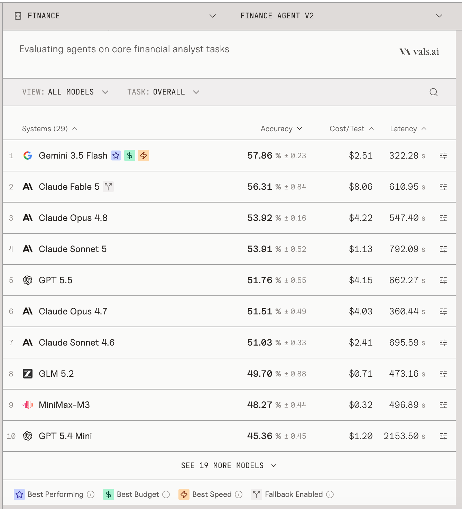
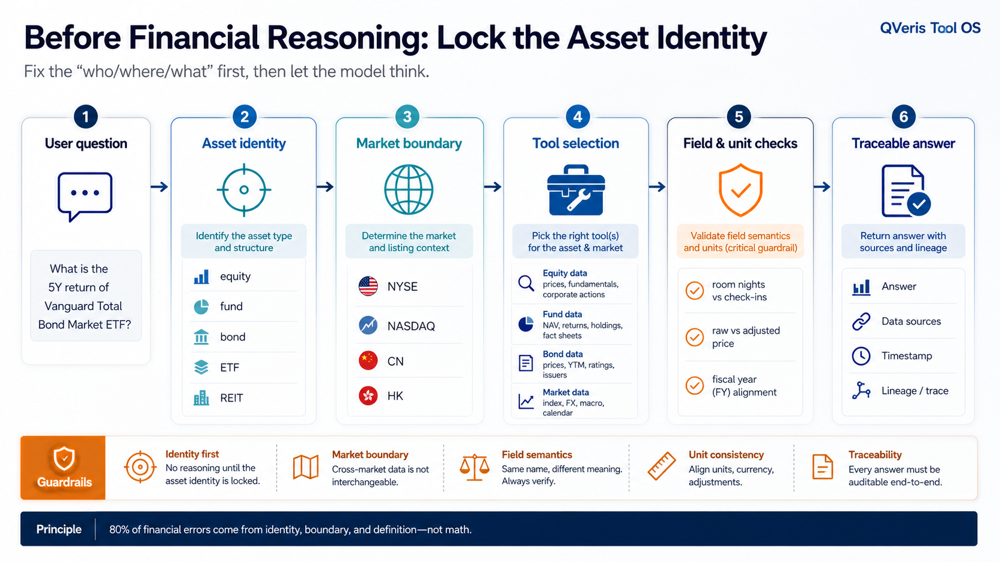
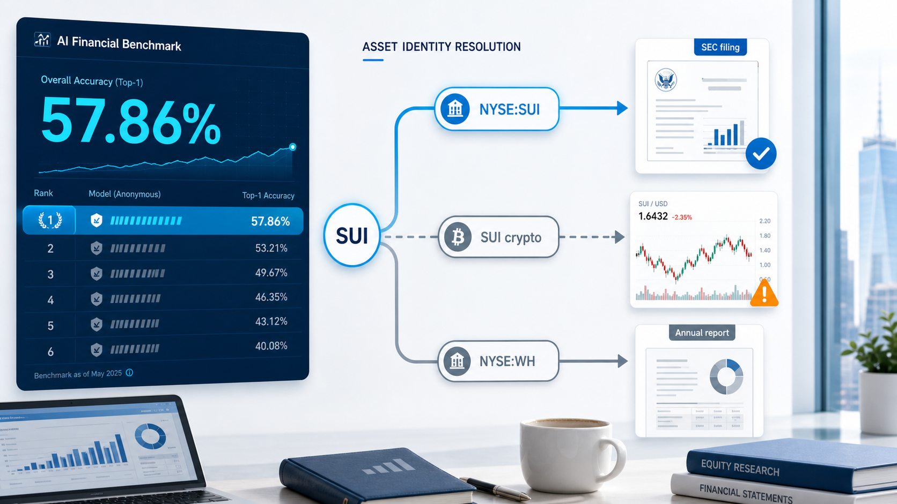

# 全球顶尖模型做金融分析，最高分为什么还不到 58%？

**副标题：从 Vals Finance Agent v2 到两个公开题复测：金融 Agent 的短板，可能不在“分析”，而在“识别对象”**

7 月，Vals AI 更新了 Finance Agent v2 benchmark。

这套评测值得认真看。它不是金融常识问答，也不是让模型解释“什么是市盈率”“债券价格为什么和利率反向变动”。它更接近一个初级金融分析师的日常工作：查 SEC filings，读取公司公告，抽取关键数字，做跨来源计算，最后给出一个可追溯的答案。

这类任务和普通聊天的差别很大。

普通问答只要语言顺畅，答案大体相关，用户可能就觉得“还不错”。但金融分析不是这样。一个数字错了，一个 filing 找错了，一个口径混了，最终结论就可能完全不可用。

**图 1：Vals Finance Agent v2 官方榜单截图**

<callout emoji="📊">
Vals Finance Agent v2 的官方榜单显示，表现最好的模型准确率仍然没有超过 **57.86%**。如果按更严格的 all-pass 口径，要求关键检查项全部通过，模型表现还会进一步下降。
</callout>

这和很多人对金融 AI 的直觉并不一致。

现在的大模型已经很会写金融内容。给它一家公司，它可以组织出行情、估值、新闻、财务摘要和投资逻辑；给它一份财报，它可以总结收入、利润、指引和风险因素。很多输出看起来已经像一份合格的投研摘要。

但 Vals 的评测提醒我们：金融任务的难点不在“写得像不像”，而在“查得准不准、算得对不对、口径能不能对齐”。

这也是为什么金融 Agent 的能力，不能只看最终回答。更应该看它中间经历了什么：

- 它查的是不是正确公司？
- 拿到的是不是正确 filing？
- 提取的是不是正确字段？
- 两个公司披露的是不是同一个指标口径？
- 计算过程能不能回放？
- 最终答案里的数字，能不能回到原始来源？

这些环节里任何一步错了，模型越会写，风险越隐蔽。

Vals v2 的设计也很有代表性。

它把任务拆成 Public、Private Validation 和 Test 三部分。公开题只有 27 道，真正用于榜单的 Test set 不公开。这个设计本身说明，金融评测已经开始进入更严肃的阶段：不只是出一批题给模型刷，而是要防止数据污染，保留不可见测试集，并用更细粒度的 rubric 判断答案质量。

这也意味着，我们不能简单复现官方榜单。但可以用它公开的题目做一些诊断式测试：不追求得出总分，而是观察金融 Agent 到底会在哪些环节失手。

我选了其中两个公开题，做了一个很小的对比实验。

**图 2：Finance Agent v2 评测任务结构示意**

## 第一个例子：`SUI` 是一家公司，还是一枚加密资产？

Vals public set 里有一道题，问的是：

> `NYSE:SUI made an announcement about a CEO transition in July 2025...`

题目要求找出 Sun Communities 在 2025 年 7 月 CEO transition 相关公告里，新 CEO 是谁，以及什么时候上任。

如果保留完整身份边界，检索路径很清楚：

`NYSE:SUI Sun Communities CEO transition July 2025 8-K`

这个查询会指向 Sun Communities 的 Form 8-K 和公司公告。答案也明确：新 CEO 是 **Charles D. Young**，生效日期是 **October 1, 2025**。

但如果把 `SUI` 当成一个裸代码去查，比如：

`SUI historical data July 2025`

搜索结果很容易进入另一个世界：Sui crypto。

它也叫 SUI，也有价格历史，也有金融数据页面。对一个没有资产身份约束的 Agent 来说，这条路径并不荒唐。问题是，它完全答错了对象。

这不是推理失败，而是身份识别失败。

金融任务里，ticker 不是完整身份。`SUI` 只有和 `NYSE`、公司主体、证券类型绑定在一起，才是题目里的 Sun Communities。脱离这个上下文，它可以指向另一个完全不同的资产。

## 第二个例子：`WH` 不是一个酒店关键词

另一个公开题要求比较：

`NASDAQ:MAR` 和 `NYSE:WH` 在 FY2025 loyalty program 上的表现，包括会员贡献的 room nights / check-ins 占比，以及 loyalty program 的 funding mechanism。

如果模糊检索：

`WH loyalty funding mechanisms FY2025`

结果会明显发散。`WH` 太短，酒店、补贴、泛 loyalty 页面、营销网页都可能混进来。

但如果保留完整金融身份：

`NYSE:WH Wyndham Hotels 2025 annual report Wyndham Rewards check-ins funded by contributions`

检索路径就稳定很多。`WH` 被绑定到 Wyndham Hotels & Resorts，数据来源也从泛网页收敛到年报和 SEC filing。

这道题还有第二层难点：Marriott 和 Wyndham 披露的不是同一个指标。

Marriott 披露的是 member stays 占 room nights 的比例。

Wyndham 披露的是 Wyndham Rewards members 占 check-ins 的比例。

一个是 room nights，一个是 check-ins。两个都和 loyalty program 有关，但不能粗暴当成同一口径比较。

所以这道题测的不是“会不会搜索”。它实际在测四件事：

- 模型是否识别出 `MAR` 是 Marriott，`WH` 是 Wyndham；
- 是否保留了 `NASDAQ` / `NYSE` 这样的市场边界；
- 是否进入了正确 filing，而不是营销页；
- 是否意识到 room nights 和 check-ins 不是同一个披露口径。

这里的失败，依然不是“模型不会写结论”。

而是金融对象、数据来源和指标口径没有先被锁住。

**图 3：裸代码 vs 带市场身份：两条不同的数据路径**

## 这类错误为什么在金融 Agent 里很常见？

因为金融数据的标识体系并不天然统一。

一个短代码可能跨市场重名。

同一个公司可能有多种证券。

同一个资产可能有股票、债券、ETF、ADR、衍生品。

同一个指标在不同公司、不同品类、不同文件里披露口径也可能不同。

股票场景之所以让 AI 看起来更稳定，是因为它是金融 AI 里最成熟的默认路径。股票有相对标准的 ticker、行情、财报、估值指标和丰富公开语料。大多数金融 Agent 的工具链和训练语料，也最容易围绕股票展开。

但一旦进入基金、债券、ETF、REIT 或跨市场资产，这条默认路径就不够用了。

基金不是一家公司。

债券不是一只股票。

ETF 不是普通个股。

REIT 虽然上市交易，但它的经营指标、分红逻辑、资产属性又和普通公司不同。

如果系统把所有金融对象都先压成一个裸 ticker，再交给模型分析，很多错误在第一步就已经埋下了。

## 我们做的小修复

顺着这两个公开题，我们在 QVeris  这边做了一个很小但关键的修复方向：处理金融代码时，不再只把它当成裸 ticker，而是先保留市场和资产类型边界，再进入工具选择、参数推导和数据检索。

简单说，就是先问清楚：

- 这是哪个市场的代码？
- 它属于股票、基金、债券、ETF，还是其他资产？
- 这个代码能否从上下文推导出市场？
- 如果能推导，映射规则是否明确？
- 如果不能推导，系统应该停下来，而不是猜。

<callout emoji="✅">
在我们的小对比测试里，模糊路径下，`SUI` 容易被带到 crypto，`WH` 容易被带到泛酒店网页。保留市场和资产身份后，两道题都能进入正确公司、正确 filing 和正确披露口径。
</callout>

这不是完整 benchmark，也不能包装成官方分数提升。

但它说明了一个可复用的方向：金融 Agent 的可靠性，不只取决于模型本身，还取决于它调用工具之前，是否有一层稳定的资产身份识别和口径约束。

这也是 QVeris 最近在底层持续补的一层能力。

我们不希望 Agent 只是“搜到一个看起来相关的结果”。我们希望它先知道自己要找的到底是什么：是 `NYSE:SUI` 这家公司，还是 Sui crypto；是 `NYSE:WH` 的 annual report，还是一个泛酒店网页；是股票、基金、债券，还是另一个同名资产。

模型负责推理，但金融 Agent 要真正进入工作流，必须先把“查什么、去哪查、怎么解释、能不能用”这几件事做对。

**图 4：金融 Agent 的资产身份识别链路**

## Vals 榜单真正给我们的提醒

Vals Finance Agent v2 的价值，不只是告诉我们某个模型排第几。

它更像是在提醒金融行业：金融 Agent 的评估标准，不能停留在“回答是否像样”。

真正要看的，是它能不能完成一条可验证的工作链路。

从问题到数据源，从数据源到字段，从字段到计算，从计算到结论，每一步都要能被检查。尤其是在金融这样高口径密度的领域，答案的可用性往往取决于最前面的几步。

如果一开始对象就错了，后面再强的模型、再漂亮的报告、再复杂的推理，都是在错误路径上优化。

所以，全球顶尖模型在 Finance Agent v2 里最高不到 58%，并不只是模型能力的问题。

它暴露的是金融 Agent 这类系统的共同短板：金融任务不是普通文本任务。它要求模型之外，还有一套稳定的工具、数据、标识、口径和验证基础设施。

这也是我们现在判断金融 AI 的一个基本标准：

不要先看它能不能写出一段像专家的回答。

先看它能不能找对对象。

## 参考资料

- Vals AI Finance Agent v2: https://www.vals.ai/benchmarks/fabv2
- Vals Finance Agent v2 public questions: https://raw.githubusercontent.com/vals-ai/finance-agent-v2/main/data/public.txt
- Sun Communities 2025-07-23 Form 8-K: https://www.sec.gov/Archives/edgar/data/912593/000091259325000199/sui-20250720.htm
- Sun Communities CEO transition announcement: https://www.globenewswire.com/news-release/2025/07/23/3120644/0/en/sun-communities-inc-announces-ceo-transition.html
- Marriott FY2025 results: https://marriott.gcs-web.com/news-releases/news-release-details/marriott-international-reports-fourth-quarter-and-full-year-2025
- Wyndham 2025 annual report: https://investor.wyndhamhotels.com/financial-information/all-sec-filings/content/0001722684-26-000052/a2025annualreport.pdf