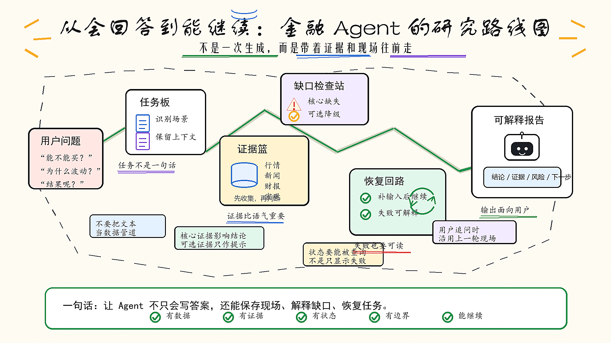

# 金融 Agent 的下一步：不是更会回答，而是失败之后还能继续

结论先说：金融 Agent 真正难的，不是生成一段看起来完整的分析，而是把一次金融研究任务稳定地跑完。它要知道自己需要什么数据，知道哪些数据已经拿到，知道哪些证据不够，知道失败发生在哪里，也要知道用户补充一句话之后，怎么沿着上一轮任务继续往下走。

换句话说，金融 Agent 不能只追求“回答得像研究员”，它更需要像一个可追踪、可恢复、可复核的研究流程。

## 01 一次性 Prompt 能回答问题，但不等于能做研究

很多金融 Agent demo 一开始都很惊艳。

用户问：“帮我分析一下某只股票还能不能买。”

模型很快给出一篇完整回答：公司业务、近期行情、行业环境、估值风险、投资建议，看起来结构清楚，语气专业。

但真正进入金融场景后，问题很快会暴露出来：它到底看了哪一版数据？有没有拿到最新 K 线？新闻和行情是否对齐？财报、公告、研报是不是同一时间窗口？如果某个数据源失败了，它是明确降级，还是默默用猜测补上？

一次性 Prompt 的问题，不是它不会写，而是它很难持续证明自己为什么这么写。

投研不是一个问题，而是一组不断变化的工作流。今天看行情，明天看公告，后天要因为一条新闻重跑假设，下周还要把结果和实际走势复盘。一个只会“当场生成答案”的 Agent，很难支撑这种连续过程。

## 02 工具越多，越不能只靠模型临场发挥

金融 Agent 接入工具以后，看起来能力会立刻变强：行情、新闻、财报、公告、研报、宏观、回测都能查。

但工具越多，系统越容易出现另一个问题：工具不是简单的 API 列表，而是一组语义并不相同的数据入口。

同样是 symbol，在行情工具里可能代表证券代码，在财报工具里可能代表公司主体，在新闻工具里可能只是搜索关键词。A 股、美股、港股的 ticker 格式可能不一样；技术指标、资金流、新闻搜索、财务摘要对参数的要求也不一样。

如果所有规则都塞进一段超长 Prompt，模型不仅容易忘，还可能把一个工具的规则误用到另一个工具上。

所以，金融 Agent 后面一定会从“一段通用 Prompt”走向更分层的上下文：全局规则、provider 规则、工具精确规则、历史失败经验、参数修复经验，都应该按当前任务动态加载。

这不是为了把 Prompt 写复杂，而是为了让工具调用变得可修复、可解释、可复用。

## 03 金融 Agent 的关键不是答案，而是证据组织

金融问题最怕的不是结论保守，而是结论没有证据。

用户问“某家公司最近为什么波动”，一个很快的回答可以说：可能和行业消息、订单预期、资金变化有关。听起来没错，但金融场景里，“听起来像答案”不代表经得起追问。

真正可靠的系统应该能把不同来源放在一起质证：

- 行情数据证明市场有没有反应。
- 成交量和资金流证明反应是否异常。
- 新闻和公告解释可能的事件原因。
- 财报和基本面判断影响是不是短期噪音。
- 研报和行业信息帮助判断市场是否已经提前预期。

这些来源不是可以随便替换的接口，而是不同角色的证据。Agent 的价值，不是把它们拼成一段话，而是知道每类证据能证明什么，不能证明什么。

这也是金融 Agent 从问答走向工作流时最核心的一步：用户看到的不应该只是“分析完成”，而应该能看到结论、依据、风险、数据缺口和下一步动作。

## 04 失败不是异常情况，而是金融工作流的一部分

做金融 Agent 时，一个很容易被低估的问题是失败。

现实里，失败非常常见：

- 用户没给股票代码、策略条件或时间区间。
- 数据源返回空结果。
- 数据请求还在处理中，结果暂时没有完成。
- 不同数据源对 ticker 格式有特殊要求。
- quote 里没有 volume，但 OHLCV 里其实已经有成交量。
- 宏观问题被误套成个股分析模型。
- 数据结果已经返回了，但报告层没有及时恢复聚合。

如果系统只会把这些情况统一表达成“分析失败”，用户就会困惑：到底是我问错了，还是数据源坏了，还是模型不会分析？

更合理的做法，是把失败拆成可理解的状态：正在取数、需要补充输入、数据源暂不可用、部分数据缺失、请求超时可重试、结果已完成但证据不足。

这听起来像产品文案问题，本质其实是系统建模问题。只有底层把任务、步骤、证据、请求、结果、重试动作建清楚，上层才能把复杂状态翻译成用户能理解的话。

## 05 不要让 LLM 文本变成数据管道

金融 Agent 还有一个很典型的坑：让模型把结构化数据通过自然语言“转述”给下一步。

比如回测任务里，行情分析模块可能已经拿到了 K 线，但父流程要从它的回复文本里解析 candles。只要模型回复不完整、上下文过长、字段格式漂移，最后就可能变成 0 candles。

这不是模型不聪明，而是链路设计不对。

K 线、成交量、财报表格、组合持仓、回测结果，本质上都不应该靠自然语言传递。更稳的方式是 artifact-first：工具调用成功后，把 requestId、toolId、参数、状态、原始结果、标准化 candles、quote、news、financials 都写成结构化 artifact。回测、报告、证据审计再读取 artifact，而不是从聊天文本里抠数据。

LLM 适合理解问题、解释结果、归纳风险，但不应该承担高密度金融数据的中间传输层。

## 06 用户最终需要的不是过程噪音，而是可理解的研究状态

可追踪不等于把所有内部细节都暴露给用户。

用户不需要看到 storeDir、requestId、toolId null、底层心跳、raw JSON、sourceRequestIds。那些是工程诊断信息，不是产品信息。

用户真正需要看到的是：

- 当前任务在规划、取数、分析还是撰写。
- 哪些核心数据已经拿到。
- 哪些增强数据缺失，但不影响主结论。
- 哪些数据缺失会降低置信度。
- 系统是否需要他补充输入。
- 失败后能不能继续、重试或降级完成。

这也是金融 Agent 从 demo 走向产品的关键一步：内部可以复杂，但外部要稳定、克制、可理解。

## 07 从“会回答”到“能恢复”

金融 Agent 的下一阶段，不应该只比谁接了更多工具，谁的模型更会写报告。

真正重要的是：它能不能把金融研究过程组织起来。

它要能识别任务类型，规划数据需求，调用合适工具，区分核心证据和可选证据，沉淀结构化 artifact，生成可解释报告，并且在缺数据、超时、用户追问、输入不足时继续恢复。

一个成熟的金融 Agent，不是永远不失败。

恰恰相反，它应该承认失败、解释失败、保存现场、允许补充输入，并尽量沿着上一轮研究继续往下走。

这才是金融 Agent 从一次性问答，走向真实投研工作流的分界线。

最后可以把这件事概括成一句话：

**金融 Agent 的核心竞争力，不是把每个问题都回答得很漂亮，而是让每一次回答都有数据、有证据、有状态、有边界，并且失败之后还能继续。**
