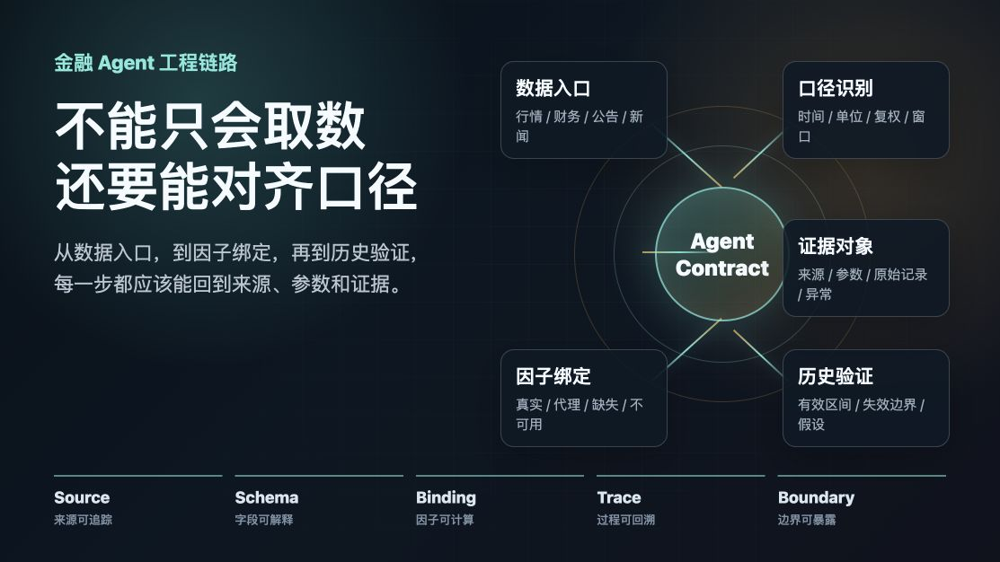
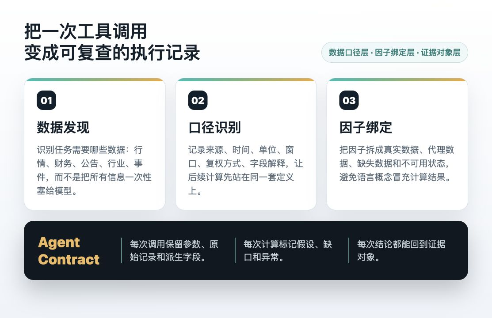

# 金融 Agent 不能只会取数，还要能对齐口径

金融场景里，Agent 从来不缺可以调用的数据。

行情、财务、公告、新闻、行业指数、资金数据、宏观指标，任何一个方向往下展开，都能接出一长串接口。

但真正开始做金融 Agent 之后，会发现一个更底层的问题：

数据接进来了，不代表它已经能用。

同样是价格数据，可能有前复权、后复权、不复权；

同样是财务数据，可能有报告期、披露日、TTM、单季、累计值；

同样是新闻和公告，可能有发布时间、事件发生时间、市场反应时间；

同样是一个因子名称，背后可能对应完全不同的数据窗口、缺失处理和计算口径。

如果这些口径没有对齐，Agent 生成的内容越完整，反而越危险。

因为它看起来是在分析，实际上可能只是在把不同口径的数据拼成一段顺滑的解释。

这也是我们最近做 A 股研究工作流时反复遇到的问题：

金融 Agent 的难点，不只是“能不能取到数据”。

更关键的是，它能不能把数据变成一套可解释、可计算、可验证的口径契约。

## 01

## 金融数据最容易出错的地方，往往不在模型，而在口径

很多金融 Agent 的失败，并不是模型不会推理。

而是模型拿到的数据本身已经混在一起了。

比如一个价格序列，如果没有说明是否复权，后面所有基于涨跌幅、波动率、均线和动量的计算都会受到影响。

比如一个财务字段，如果只知道“营收”两个字，却不知道它是年度、单季、累计，还是 TTM，后面的比较就很容易失真。

比如一条公告，如果只记录文本内容，没有记录披露时间和事件时间，Agent 就很难判断它应该进入哪一个研究窗口。

比如一个行业指数，如果成分股、权重和更新周期没有明确，拿它做参照时就会天然带着偏差。

这些问题单独看都很小。

但放到 Agent 工作流里，它们会被不断放大。

因为 Agent 不是只读一条数据。

它会把价格、财务、事件、行业和计算结果串在一起。

一旦最前面的口径不清楚，后面的推理越长，偏差就越难被发现。

所以，金融 Agent 真正要解决的第一件事，不是把接口接得更多。

而是让每一次数据进入系统时，都带着清楚的来源、时间、单位、窗口和处理方式。

## 02

## 因子不是 Prompt 里的名词，而是一份数据契约

很多人会把因子理解成一个词。

比如动量、反转、波动、换手、资金、估值、情绪。

但在系统里，因子不是一个名字，而是一份契约。

它至少要回答几个问题：

用什么原始数据？

数据来自哪里？

时间窗口多长？

缺失值怎么处理？

是否需要复权？

是否允许用代理字段？

计算结果能不能回到原始数据？

如果这些问题没有定义清楚，Agent 看到“动量因子”四个字，并不等于它真的知道该怎么计算。

一个十日动量和六十日动量不是同一个东西。

基于不复权价格和复权价格计算出的结果，也不是同一个东西。

基于交易日窗口和自然日窗口得到的结果，仍然不是同一个东西。

这也是为什么，金融 Agent 不能只把因子当成语言概念。

它需要知道每个因子背后的数据绑定关系。

哪些因子可以直接由价格数据计算？

哪些因子需要财务报表？

哪些因子需要公告、新闻或行业数据？

哪些因子当前只有代理字段？

哪些因子因为数据不足，应该明确标记为不可用？

这一步看起来不如生成回答显眼，但它决定了 Agent 后面的分析是否站得住。

## 03

## 工具调用不应该只返回结果，还要返回证据对象

在金融 Agent 里，工具调用很容易被设计成一个简单过程：

用户问问题，Agent 选择工具，工具返回结果，模型组织答案。

但如果工具只返回一个数字、一段摘要或一张表，Agent 仍然很难判断这个结果能不能被信任。

更稳的方式，是让工具返回一个“证据对象”。

这个对象不只包含结果，还要包含：

数据来源；

调用参数；

时间范围；

字段口径；

原始记录；

派生计算；

缺失说明；

异常提示；

可复用的引用标识。

这样，Agent 生成的不是孤立答案，而是一段可以回溯的执行记录。

当后续需要复查某个结论时，系统可以知道它当时调用了哪个工具、用了什么参数、基于哪些原始数据、有没有缺字段、有没有触发降级逻辑。

这对金融 Agent 很关键。

因为金融场景里的“看起来差不多”，经常并不是真的差不多。

一个字段差一个口径，一个时间点差一个交易日，一个事件差一个披露窗口，都会改变后面的解释。

所以，工具调用的目标不应该只是让 Agent 拿到结果。

而是让 Agent 拿到可以被检查、被引用、被复算的证据。

## 04

## 历史验证不是为了给结论背书，而是为了暴露边界

金融 Agent 进入研究工作流之后，很自然会遇到历史验证。

但历史验证的价值，不是让系统说“过去有效，所以未来也会有效”。

它更重要的作用，是暴露一个分析逻辑的边界。

哪些市场阶段里，这个变量有解释力？

哪些阶段里，它会失效？

失效时是因为数据稀疏、行业切换、事件冲击，还是因为因子本身只适合某类样本？

同一套规则，在不同时间窗口、不同样本范围、不同数据口径下，结果是否稳定？

这些问题比单个指标更重要。

如果 Agent 只给出一个漂亮结论，却不知道这个结论在哪些条件下容易失效，那么它仍然只是一个文本生成器。

如果 Agent 能把历史验证里的有效区间、失效区间、数据缺口和计算假设都记录下来，它才开始接近一个真正的研究系统。

这也是金融 Agent 和普通问答工具的分界线。

普通问答工具更关心回答是否完整。

研究型 Agent 更关心回答是否可以被复查。

## 05

## 从“能调用工具”到“能约束工具”

很多 Agent 系统的第一步，是让模型学会调用工具。

但在金融场景里，仅仅会调用还不够。

Agent 还要能约束工具。

它要知道什么时候不能继续算；

什么时候应该提示数据不足；

什么时候只能使用代理字段；

什么时候应该保留原始记录，而不是直接生成解释；

什么时候应该把一次分析标记为阶段性结果。

这套约束，才是金融 Agent 变稳定的关键。

从工程上看，它不是一个单点能力，而是一整条链路：

先做数据发现；

再做口径识别；

再做因子绑定；

再做工具调用；

再做历史验证；

最后把每一步都沉淀成可复盘的执行记录。

这也是 QVeris 在金融场景里真正有价值的地方。

它不只是让 Agent 多一个数据入口，而是让 Agent 有机会把“取数、计算、验证、复盘”变成同一条链路。

金融 Agent 未来的差异，可能不在于谁生成的文字更像研究员。

而在于谁能把数据口径、工具契约和验证过程管理得更清楚。

因为在金融研究里，最难的不是说出一个完整答案。

而是让每一个答案，都能回到它所依赖的数据、口径和证据。
