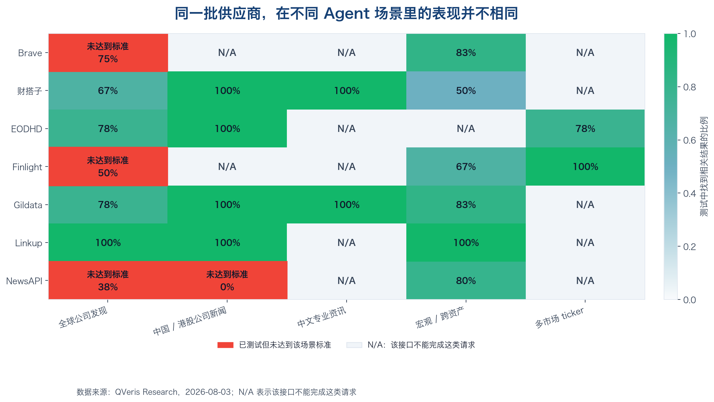
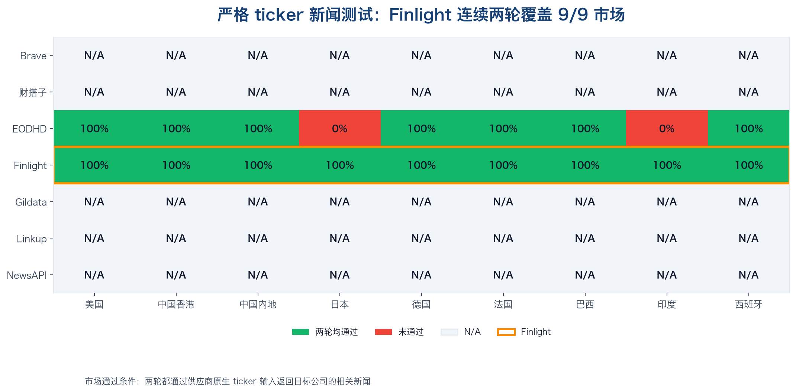
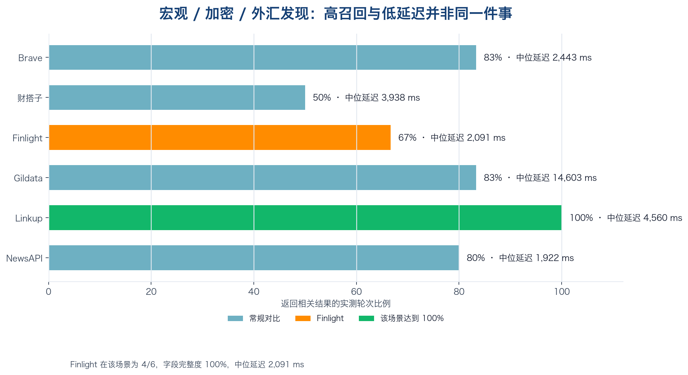

> 360 次实时观测之后，我们不做总榜，只回答不同 Agent 任务该怎么选数据源。

一个金融 Agent 收到“查一下腾讯最近的新闻”，真正困难的并不是生成一段摘要。

它得先解决一串更基础的问题：该把 `0700.HK`、`700:HK` 还是 `0700` 发给数据源？要中文新闻时，接口究竟支持语言过滤，还是只能依赖关键词碰运气？接口返回了 HTTP 200，里面却是一组无关结果，这算成功还是失败？

这些问题决定了答案究竟来自实时数据，还是来自模型记忆和猜测。

为此，我们在 2026 年 8 月 3 日对 Brave、财搭子（Caidazi）、EODHD、Finlight、Gildata、Linkup 和 NewsAPI 做了一轮公开基准测试，共完成 **360 次实时观测**：316 次通用场景观测和 44 次严格 ticker 观测。凡是接口能够完成的场景，我们都连续测试两轮，覆盖公司新闻、宏观、加密货币、外汇、错误输入、中文专业资讯和 9 个上市市场。

这轮测评的目的，不是从 7 家供应商里选出一个“最好”的。有人擅长全球检索，有人擅长中文专业资讯，有人擅长根据 ticker 返回结构化公司新闻。用户和 Agent 真正需要知道的是：面对眼前这项任务，哪一种产品更合适。把完全不同的能力压缩成一个总分，反而会误导选型。

## 当 Agent 已经知道 ticker，Finlight 的优势更明显

这轮测试里，Finlight 最突出的能力不是“搜得最广”，而是**当 Agent 已经知道 ticker 时，能够稳定返回结构化的公司新闻**。

我们围绕 ticker 对 Finlight 发起了 24 次调用，每次返回的数据都能被程序正常读取。美国、中国香港、中国内地、日本、德国、法国、巴西、印度和西班牙 9 个市场，都在连续两轮测试中找到了目标公司的相关新闻。我们还故意输入了不存在的 ticker，以及两种不符合 Finlight 规则的 ticker 写法，它们都返回空结果，没有拿无关新闻来凑数。该组测试的中位延迟为 **2,298 ms**，约 2.3 秒。

这里有一个容易被忽略的细节：Finlight 的 `tickers` 过滤器要求公司的**主要上市代码**。

例如，贵州茅台应使用 `600519`，不是 Yahoo Finance 风格的 `600519.SS`；巴西 Petrobras 应使用主要上市代码 `PETR3`，而不是同一交易所的次要上市代码 `PETR4`。我们因此把 `600519.SS` 和 `PETR4` 专门保留为错误写法测试，没有把空结果误判为“中国市场不支持”或“巴西市场不支持”。

这也是 Agent 接数据时最常见的坑：**市场覆盖和 ticker 方言是两件事**。接口听不懂某种 symbol 写法，不等于它没有对应市场的数据。

Finlight 返回的内容也方便 Agent 继续加工。除了标题、时间、来源等基础信息，它还给出语言、文章关联的国家或地区、情绪、分类和公司实体。两个同名的 `confidence` 需要分开理解：文章上的数值表示情绪判断有多大把握，公司对象里的数值表示这篇文章与该公司的关联有多确定。Finlight 自己的接口还会返回 ISIN、OpenFIGI、MIC 和上市信息，适合继续做证券识别和数据关联。

## 任务换了，合适的数据源也会变化

如果问题从“查某只股票的新闻”换成“从全球网页里发现与一家公司有关的内容”，选择标准也会随之改变。这时 Agent 手里可能还没有准确 ticker，更需要先把线索找出来。

在全球公司新闻测试中，Linkup 连续 18 次都找到了相关结果；财搭子、EODHD 和 Gildata 也达到了我们为这个场景设定的标准。Finlight 在这里只能完成 2 个案例、共 4 次测试，其中 2 次找到了相关内容，样本和结果都不足以支持我们把它推荐为全球公司发现的优先选择。

这并不矛盾。Linkup 更接近开放网页检索，擅长先把可能相关的内容广泛找回来；Finlight 更像结构化金融新闻产品，擅长在目标公司已经明确时精确取数。

中文场景还要继续细分。中国与港股公司新闻测试中，Gildata Stock News、EODHD 和 Linkup 都在 4/4 次可测试观测中找到了相关结果。面向基金、行业和机构的中文专业资讯，财搭子 Hybrid Search V2 与 Gildata Public Opinion 都实现了 6/6 轮找到相关内容，前五条结果全部与问题相关；在这组测试里，相较 Gildata Public Opinion，财搭子返回的信息更完整、来源更清楚、速度也更快。

到了宏观、加密货币和外汇主题，Linkup 连续 12/12 次都找到了相关内容；Gildata Public Opinion 和 NewsAPI 也比较稳定。Finlight 在 6 次观测中有 4 次找到相关内容，但每次返回的信息都很完整，中位延迟为 **2,091 ms**，约 2.1 秒。这说明“能不能广泛找到内容”“返回的信息是否完整”和“速度快不快”是三件不同的事，不能用一个总分概括。

## 接口返回了内容，不等于 Agent 回答对了

评估新闻 API 时，我们把三个问题分开看：

- **程序能不能读。** 接口返回的格式是否正常，Agent 能否继续处理。
- **该有结果时有没有，该没结果时会不会乱答。** 正常问题应该找到内容，故意输错时应该诚实返回空结果。
- **找到的内容是不是真的相关。** 前五条中是否出现目标公司或主题，而不是随手给一组热门新闻。

如果把这三件事混成一个“成功率”，就会出现很奇怪的结果：返回无关热门新闻的接口反而得分，诚实返回空结果的接口却被扣分。

所以我们专门加入了错误搜索词和无效 ticker。Linkup、Brave 和财搭子在宏观场景收到错误搜索词时，仍然返回了其他内容。这不影响它们在正常问题里的价值，但使用这些接口的 Agent 需要再检查一次公司或主题是否真的相关，否则很容易把“接口给了内容”误认为“问题已经答对”。

## Finlight 能不能搜中文新闻？我们又单独测了 34 次

我们在第一轮测试中只看到了英文结果。但“默认返回英文”和“产品只支持英文”是两回事，不能仅凭一次默认设置下的结果下结论。

根据 Finlight 的接口文档，新闻可以按语言筛选，默认语言是英文。为了确认它能否稳定返回中文内容，我们没有停在文档说明上，而是另外做了一轮中文测试。

为了把这件事弄清楚，我们又直接对 Finlight API 做了 **34 次独立补充测试**。这 34 次不计入前面 360 次公开对比。使用 `zh`、`zh-CN` 和 `zh-Hans` 时，连续两轮都返回了中文结果。

当天查询到的新闻源清单共有 **121 个来源**。其中 62 个默认来源里，有 27 个声明支持中文，覆盖 9 个中国内地媒体集团。Finlight 随后还确认，返回结果里的 `countries` 表示**这篇文章主要关联的国家或地区**，不是媒体所在地，也不是公司的注册地或上市市场。

## 怎么选：不要问谁最好，要问你的 Agent 从哪里开始

这轮测评不是为了选出一家“最好的金融新闻 API”。真正有用的结论，是先看 Agent 手里已经有什么，再决定下一步需要哪种数据产品。

**如果 Agent 已经有可靠的 ticker，重点是找得准。** 例如用户问“`AAPL` 最近有什么重要新闻”，Agent 已经知道目标公司，不需要再从整个互联网猜它指的是谁。这时更应该关注 ticker 能否被准确识别、新闻是否真的属于目标公司、标题和来源等信息是否齐全，以及 ticker 写错时接口会不会拿无关内容来凑数。

在这个起点下，Finlight 是本轮测试中更匹配的产品：9 个市场连续两轮都找到了目标公司新闻，错误 ticker 也能干净地返回空结果。它的使用条件同样明确——上游最好已经完成 ticker 标准化。`600519.SS` 和 `600519` 对人来说都像贵州茅台，对接口来说却是两种不同的写法。如果 Agent 接收到的代码来自不同市场和终端，就要先做一层转换。如果工作流本身大量使用带交易所后缀的 ticker，也可以对比 EODHD，但 Agent 需要为接口报错准备明确的处理逻辑。

**如果 Agent 只有公司名或一段开放问题，重点是先把线索找出来。** 例如“查一下腾讯最近在海外发生了什么”，这里可能涉及公司中文名、英文名、子公司和产品名。Agent 的第一步是发现相关内容，而不是按一个已经确认的 ticker 精确取数。

在本轮全球公司发现测试中，Linkup 的 18/18 次观测都找到了相关结果，更适合承担“广泛发现”这一步。代价是开放网页内容通常更杂，Agent 还要继续做去重、公司归属判断、来源筛选和相关性排序。更成熟的工作流可以先用发现型产品找到线索，再用结构化金融新闻产品核对公司并补全信息，不必强迫一家供应商包办所有任务。

**如果 Agent 服务中国市场，先区分公司新闻和专业金融资讯。** “腾讯最近有什么新闻”和“最近有哪些公募基金在关注人工智能行业”虽然都是中文问题，需要的数据却不一样。前者可以重点比较 Gildata、EODHD、Linkup 和财搭子；后者涉及基金、行业和机构语境，本轮测试中财搭子与 Gildata 更值得优先比较。

因此，“支不支持中文”还不够具体。选型时要继续追问：它擅长的是上市公司新闻、基金资讯、行业动态，还是机构舆情？Finlight 的补充测试证明它能返回中文新闻，但这并不自动意味着它在所有中文专业场景里都比本地化产品更合适。

**如果 Agent 从宏观或跨资产主题开始，要在“找得广”和“方便处理”之间做选择。** “最近哪些因素在影响黄金”没有唯一公司，也没有固定 ticker。研究型 Agent 通常要先找到足够多的材料，再归纳共同主题；自动监控型 Agent 则更在意字段是否稳定，能不能持续做分类、情绪判断和告警。

本轮测试中，Linkup 在宏观、加密货币和外汇主题上的相关内容更稳定；Finlight 找到的内容没有那么广，但每次返回的信息更完整。哪一个更合适，取决于结果是直接给人阅读，还是还要交给 Agent 继续自动处理。

实际落地时还要问最后一个问题：查不到或答错一次，代价有多大？原型、个人研究或低频任务，可以先从一个主数据源开始；生产级监控、投研流程或关键决策场景，再根据失败代价增加备用数据源和结果校验。数据源不是越多越好，能覆盖真正的失败风险才有价值。

这些建议都有时间边界。新闻内容会随着新闻周期、授权范围、套餐、收录速度和接口变化而变化。连续两轮测试可以确认当时的结果能否重复，却不能代替长期稳定性统计。因此，我们建议按季度重测；当供应商调整接口、新闻来源、语言能力或 ticker 规则时，也应追加测试。

## 这不是一篇孤立的测评

这篇文章会成为 **「QVeris 数据供应商实测」**系列的起点。

接下来，我们会继续公开金融行情、基本面、新闻与情绪、基金、宏观、另类数据等供应商的真实调用结果，持续检查稳定性、Agent 是否容易使用、字段到底代表什么、错误输入会得到什么，以及接入后的表现是否与产品本身一致。

QVeris 要做的，也不只是把更多 API 塞进一个目录。

**一端，我们要成为面向 AI Agent 的集成型数据接入商**：统一不同供应商的认证方式、ticker 写法、请求参数、返回格式和故障处理，让 Agent 不必逐家学习“数据方言”。

**另一端，我们要成为中立的数据测评方**：用公开方法、固定案例和真实调用，持续告诉开发者每个供应商适合哪些场景，又有哪些使用条件和风险。

数据接入解决“能不能调用”，中立测评解决“该不该信、该在什么场景用”。这两件事合在一起，才是 Agent 真正需要的数据基础设施。

如果你是数据供应商，希望进入后续公开测评，或更新接口说明、反馈接入问题，可以前往 [QVeris Provider Hub](https://qveris.ai/providers)，也可以发送邮件至 [support@qveris.ai](mailto:support@qveris.ai)，主题注明“数据供应商测评”。

如果你正在为 Agent 选择数据源，也欢迎关注后续文章。我们会继续实测，不靠宣传册替你下结论。

---

**测评说明**：本文基于 2026 年 8 月 3 日完成的实时观测，是可以按照相同方法重新测试的产品选型参考。
