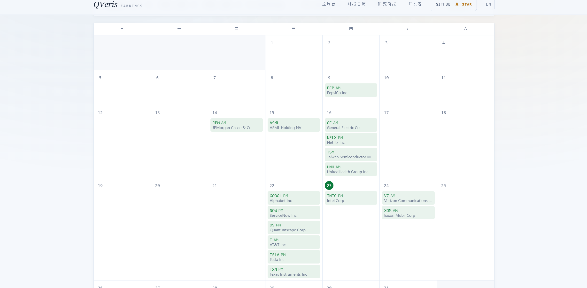
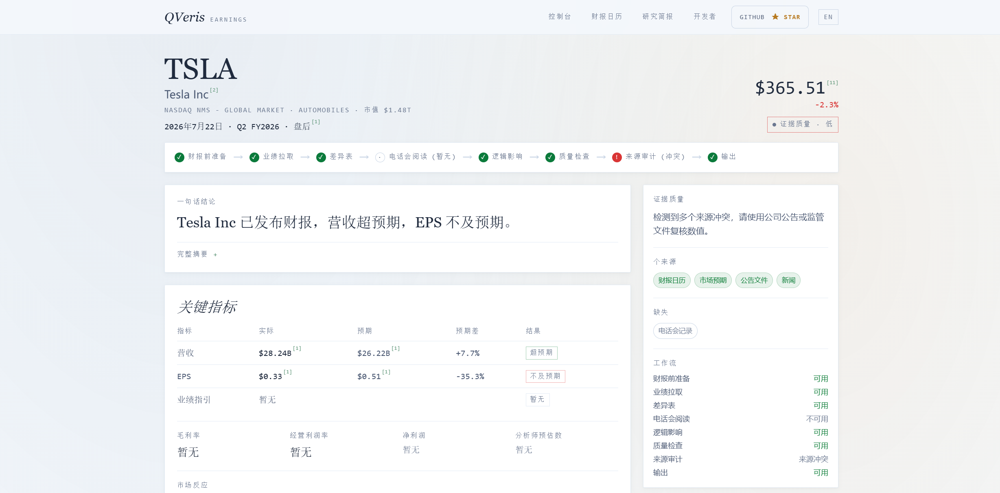

# 谷歌 Cloud 暴涨 82%，特斯拉 EPS 腰斩：昨夜两份财报对 A 股半导体的真实信号

昨天下午两点半，科创 50 从跌 3% 一口气拉到涨 10%，半导体全线涨停。雪球上有人喊"牛市来了"，也有人冷静地说"别高兴太早，今晚谷歌特斯拉财报，明天才是真正的大考"。

他说的对。嗯，方向对了。

北京时间今日凌晨，谷歌和特斯拉双双交出 Q2 成绩单。谷歌营收 \$1,198 亿（+24%），Cloud 暴增 82%；特斯拉营收 \$282 亿（+26%），交付量创 Q2 历史新高。两家的营收都超了预期。

但市场没买账。特斯拉盘后跌超 4%。等等，谷歌也没稳住，盘后同样在跌。因为两家在同一个问题上踩了雷：AI 资本开支失控，利润被吃掉。

## 第一层：用日历定位，昨晚谁在放榜，A 股盯什么

做财报事件交易，第一步永远是搞清楚谁、什么时候。打开 QVeris Earnings Copilot，首页就是一个实时财报日历，不用手动搜股票，当天盘后放榜的公司按交易所排列好了。

7 月 22 日盘后的日历里，真正对 A 股有传导效应的筛出两家：

| 公司 | 对 A 股的传导链 | 今晚盯什么 |
|-|-|-|
| **谷歌（GOOGL）** | AI Capex → 芯片/算力需求 → 半导体设备 & 材料 | Cloud 增速、全年 Capex 指引 |
| **特斯拉（TSLA）** | 交付指引 → 新能源车链 → 锂电池 & 零部件 | 利润率、Robotaxi 进展 |

日历里的每家公司卡片点进去，直接切到一致预期和历史数据。点 GOOGL，页面自动拉到 Q2 的共识页。

## 第二层：一致预期 vs 实际，谁 beat 了，谁翻了

从日历点进谷歌，Copilot 展示的第一屏就是一致预期。左边是市场共识，右边等财报出了自动刷新实际数字。昨晚刷新完之后长这样：

| 指标 | 实际值 | 市场预期 | 差距 |
|-|-|-|-|
| 营收 | \$1,198 亿 | ~\$1,168 亿 | **+2.6% beat** |
| Google Cloud 增速 | +82% | ~+67% | 大超预期 |
| 全年 Capex 指引 | \$1,950-2,050 亿 | \$1,750-1,900 亿 | **上调 \$200 亿** |

Cloud 从一致预期的 +67% 跳到 +82%。这不是边际改善，是加速。利润方面，归母净利润 \$280 亿，同比暴增 298%，单季表现很强。

但问题出在 capex。预期 \$1,750-1,900 亿，实际指引拉到 \$2,050 亿，超了 \$200 亿。直接代价：**谷歌历史上首次出现负自由现金流**。AI 基础设施的投入已经把现金牛吃出一个窟窿。

切到特斯拉的卡片，同一套"实际 vs 预期"的数据结构，画面完全不同：收入厉害、利润塌方。

| 指标 | 实际值 | 市场预期 |
|-|-|-|
| 总营收 | \$282 亿（+26%） | \$257-263 亿 |
| 调整后 EPS | **\$0.33** | **\$0.50-0.53** |
| 营业利润率 | 1.4% | — |
| 自由现金流 | -\$10.9 亿 | -\$32.5 至 -\$36.4 亿 |

营收 beat，EPS miss。这是最经典的"卖得多、赚得少"。交付 48 万辆车创 Q2 纪录，但促销降价把利润率压到了 1.4%。往下翻特斯拉的历史 surprise 记录，营业利润率从两年前的双位数一路滑到今天的一点几，这条下滑曲线比任何一个单季数字都更有说服力。

## 第三层：把两家数据拼在一起，A 股怎么判断

说回 A 股。Copilot 里每家公司研究页面的结构一致：日历、预期、实际、历史。自然地在谷歌和特斯拉之间来回切，同一个故事浮出来了，但结论是分裂的。

**有利于 A 股半导体的**：谷歌 Cloud +82%、Capex 上调至 \$2,050 亿，说明 AI 基础设施的硬件投入还在加速。芯片设备、先进封装、算力芯片的需求不会减速。昨天科创 50 涨 10% 前置反映的正是这个预期，至少这部分没被打脸。

中长期的信号就没那么舒服了。两家同时负自由现金流、特斯拉利润率跌到 1.4%，盈利都在被 AI 投入吃掉。如果这个趋势继续，市场不会一直买账。资本开支的增速迟早要收敛，到时候最先受冲击的就是硬件供应链。

短中期（6-12 个月），AI capex 还在加速，A 股半导体有订单支撑。中长期如果投入回报不成比例，减支就是迟早的事。

## 适用边界

QVeris Earnings Copilot 有它的长处，也有目前做不到的事情。

**适合的场景**：财报季快速扫雷，日历 + 一致预期 + 实际对比，一条线走完；跨公司研究，每家页面结构一致，来回切很方便，昨夜谷歌和特斯拉一起看才能发现"营收都超但利润都被 capex 吃"的共同叙事；研究笔记，分析结果可以直接生成带引用的分享页。

**目前的边界**：电话会议记录目前只覆盖部分美股大公司，A 股暂无；不提供技术面指标；不含国内券商研报；不发布买卖建议。

做"财报事件→板块映射"这条线的，Copilot 能把从日历到判断之间的大量手动拼接省掉。做纯技术面的，另找工具。

## 实际体验

昨晚跑下来的对话大概是：

**你**："7 月 22 日盘后有哪些大公司放榜？"

**AI**："谷歌、特斯拉、IBM、德州仪器四家。谷歌 Q2 营收预期 \$1,168 亿，特斯拉预期 \$257-263 亿。点击任一家查看详细预期。"

**你**："谷歌 Q2 实际出来了吗？"

**AI**："已出。营收 \$1,198 亿（+24%）beat。Cloud +82%，远超 +67% 共识。但全年 Capex 上调至 \$2,050 亿，首次负自由现金流。切到特斯拉看看。"

**你**："好，看特斯拉。"

**AI**："营收 \$282 亿（+26%）beat，但调整后 EPS \$0.33 远低于 \$0.51 预期。营业利润率仅 1.4%，自由现金流转负。盘后跌超 4%。两家营收都超了但利润被 Capex 吃：谷歌吃的是未来增长，特斯拉吃的是现在利润。"

**你**："对 A 股半导体是利好还是利空？"

**AI**："短中期利好。谷歌 Capex 还在加速，Cloud 验证了 AI 需求真实。中长期警惕，投入回报失衡，行业中段迟早被压缩。"

**数据说明**：本文涉及的谷歌和特斯拉 Q2 2026 实际数据来自 Alpha Vantage 及公开财报，通过 QVeris 能力路由网络实时调取。QVeris Earnings Copilot 产品即将在 earnings.alexai-lab.com 上线。

QVeris 是 AI agent 的能力路由网络，一个统一协议，发现和调用上万个实时数据工具。

- 插件：qveris.cn/plugins
- 开发者：`npx -y @qverisai/mcp` 或 `npm install -g @qverisai/cli`
- 官网：qveris.cn

---

*免责声明：本文为数据工具实测，所有数据来自第三方 API（Alpha Vantage、Twelve Data）及公开财报，不构成投资建议。*
