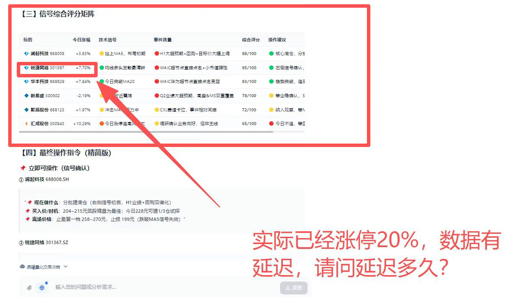

> 用 10 个 token 的冗余，保护上万元的报告


前几天，我和同事聊起刚解决的一个问题。

我说：

> “客户的 Agent 幻觉我给解决了。他们的大模型调实时行情工具，根据公司名瞎编了个股票代码。  
> 我给工具包了一层：它查什么，我都把真实的公司名＋代码组合冗余放回工具结果。  
> 10 个 token，降低 99% 幻觉。对 8 个工具同时生效。”

同事问：

> “你这难道是传说中的 Harness？”

“Harrrrrr……”

我停顿了五秒，脑子里走马灯一样闪过 Prompt、Context、Tool、Guardrail、Runtime，以及我看过的所有 Harness 八股文。

然后我说：

> “啊对，我一开始就是想着 Harness。”

当然，我一开始只是想修一个具体问题。

# 1、 数据是真的，公司错了

用户想查证的事情需要“锐捷网络”。

模型根据公司名，编出了股票代码 `301367.SZ`，然后调用实时行情工具。

这个代码格式完全合法，工具正常返回了真实行情，最终报告里出现：

```
锐捷网络｜301367.SZ｜+7.70%
```

看起来没有任何问题。

代码是真的，涨跌幅是真的，工具调用也成功了。

但是用户怒气冲冲地指责我们：



我们最多也就秒级延迟啊。仔细一查，`301367.SZ` 实际对应瑞迈特，不是锐捷网络。

模型没有编造整份行情，它只是把两个看起来合理的信息拼错了：

```
上下文里的公司名：锐捷网络
工具返回的代码：301367.SZ
```

在金融 Agent 里，最危险的幻觉有时不是假数据，而是：

> 数据全是真的，但不是这家公司的。

# 2、 Prompt 里的“必须”，不是程序里的“必须”

我们以前的规则写得很“必须”：

```
涉及具体公司的所有问题，必须遵循：
1. 先调用 identify_company 确认身份和股票代码；
2. 再调用对应工具获取数据。
```

模型可能遵守，也可能跳过。

那反正你最后都要调用工具，我就在工具里强制帮你调确认身份的接口，看你还怎么幻觉。

以前工具主要返回：

```json
{
  "ts_code": "301367.SZ",
  "price_change_pct": 7.7
}
```

现在会多一组 `_identity`：

```json
{
  "_identity": {
    "canonical_name": "瑞迈特",
    "ts_code": "301367.SZ",
    "verified": true
  },
  "price_change_pct": 7.7
}
```

公司名优先取自同一条供应商记录，再回退到本地证券主数据或公司识别服务。


# 3、 这么简单，也算 Harness？

我觉得算。

以前是：

```
提醒模型先核对身份
→ 模型可能核对，也可能跳过
→ 再调工具
```


没有 Harness，用户一句相反的指令，就可能把这条规则顶掉。

现在是：

```
在工具里绑模型核对身份
→ 模型一定调工具
→ 模型看到工具返回的核对身份信息
```

正确性从“模型应该遵守的规则”，下沉成了“工具必须提供的数据契约”。

我还故意让用户指令和 Harness 正面打了一架：名称和代码明明对不上，我却要求它严格沿用用户给出的名称，不要纠正。


Harness 没有抢用户的表达权：名称可以按要求展示，但归因冲突必须明确暴露。用户可以决定怎么称呼，不能悄悄决定数据属于谁。

OpenAI 的 Harness Engineering 并没有直接讨论金融幻觉，但它给出了一套很明确的方法：把正确的信息变得对 Agent 可读，把关键规则放进系统边界，并通过工具机械执行。我的 `_identity`，就是这套思路在金融数据归因上的一次小应用。

而且这次不是只修实时行情。同一套归因能力被批量接入八类结构化公司工具：

- 实时行情
- 公司画像
- 财务报表
- 估值
- 历史行情
- 公司公告
- 个股资金流
- 分钟级技术指标

这些工具由多个 Agent 共享，因此不需要逐个修改 Agent。只要它们使用这批工具，就会同时获得这层保护。

这正是 Harness 的杠杆：

> 在共享的高价值位置增加一个小约束，让大量下游 Agent 一起变得更可靠。

# 4、 10 个 token，保护上万元的报告

这里的冗余非常便宜。

完整的上市公司名称—代码映射仍然放在代码和数据层。每次只把当前证券的一组 `name＋code` 放进工具结果，增加的核心上下文大约只有 10 个 token。

而这些 Agent 生成的金融报告，一篇就可能售价上万元，还可能卖给多个客户。

为了节省 10 个 token，让模型继续自行拼接公司名和代码，几乎省不下任何成本；只要错配一次，整篇报告的可信度却可能归零，错误还会随着分发继续放大。

```
约 10 个 token
→ 保护 8 类工具
→ 多个 Agent 生效
→ 保护上万篇上万元的报告
```

怎么算都划算。

我没有等这个错误随机复现，而是直接构造冲突：把“锐捷网络”和 301367.SZ 绑在一起，甚至明确要求模型不要纠正公司名。

修复前，Agent 会顺着错误名称继续输出。修复后，工具返回的 `canonical_name` 会把冲突直接暴露出来：普通请求会使用权威名称；用户强制保留原称呼时，也会明确告警，不再让错误静悄悄混进报告。

“降低 99%”不是精确的线上 A/B 结果，而是基于机制覆盖的工程估算：在这 8 类工具里，公司名和代码不再由模型自由拼接。

```
错误何时自然出现，是概率问题；
一旦进入这 8 类工具，归因冲突能否被发现，是确定性问题。
```

更硬的方案，是在最终报告输出前再做一轮结构化槽位校验。但自由文本报告需要针对不同 Agent 适配事实抽取和输出规则，成本更高。

这次我们先选择共享工具层：成本更小，覆盖更广。

# 写在最后

所以，我一开始当然不是想着 Harness。

我只是遇到了一个模型经常忘记的规则，然后决定不再只靠提醒，而是把规则做进它所处的环境里。

没有更换模型，也没有逐个修改 Agent，更没有设计复杂的新架构。

我只在公共 Prompt 里补了一条归因规则，再让共享工具把真实的 `name + code` 随结果一起返回。

Prompt 还是写了。但这次 Prompt 不再负责教模型怎么猜对，只负责告诉它：别和工具层返回的事实打架。

做完以后回头一看：

Harrrrrr……

啊对，这就是 Harness。

---

参考资料：[OpenAI：Harness engineering](https://openai.com/index/harness-engineering/)
