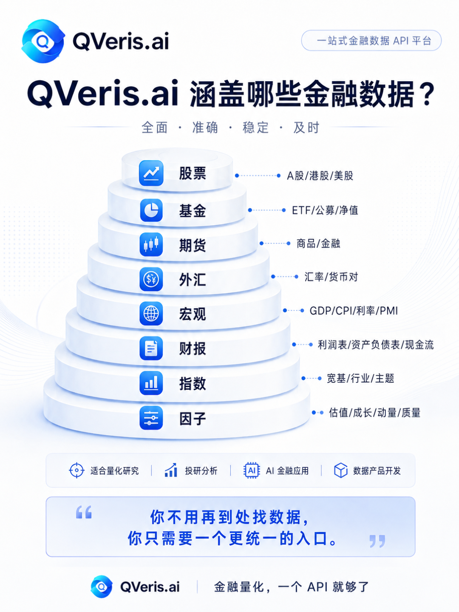
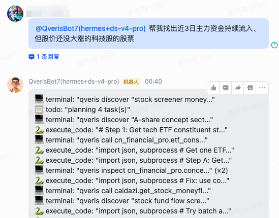
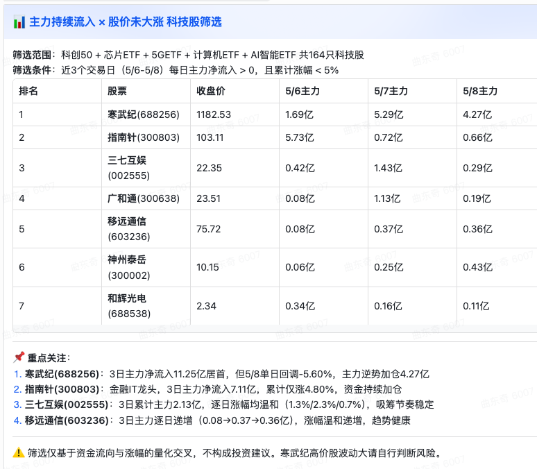
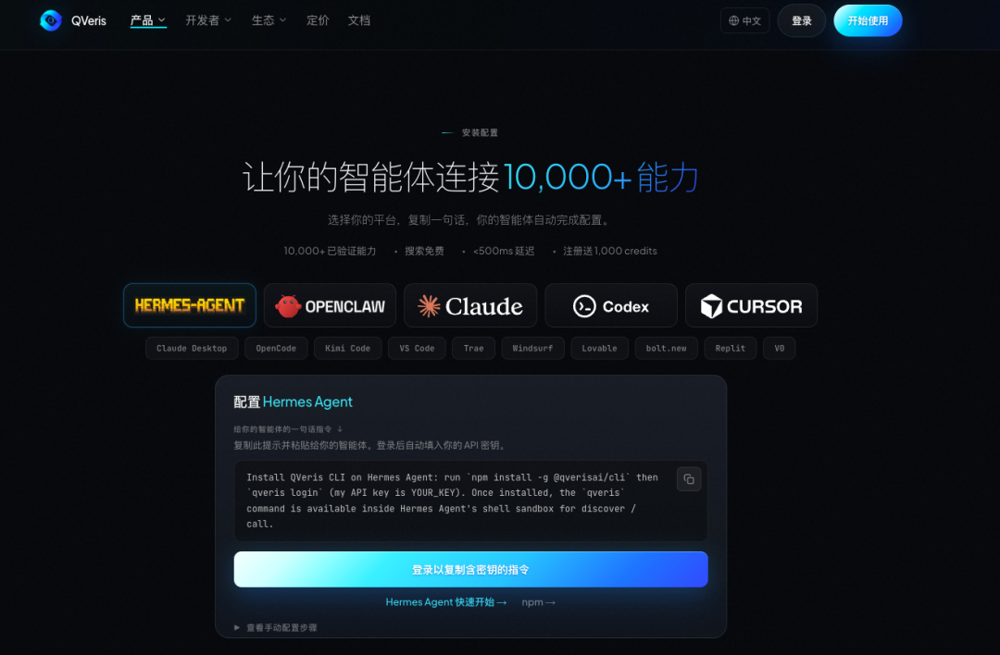
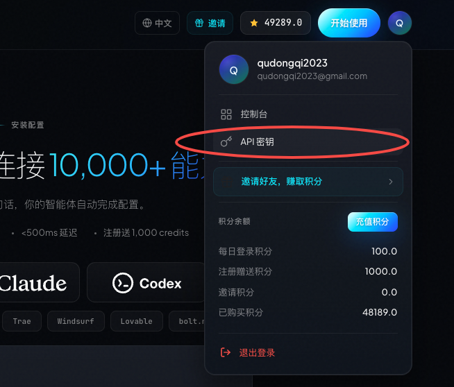
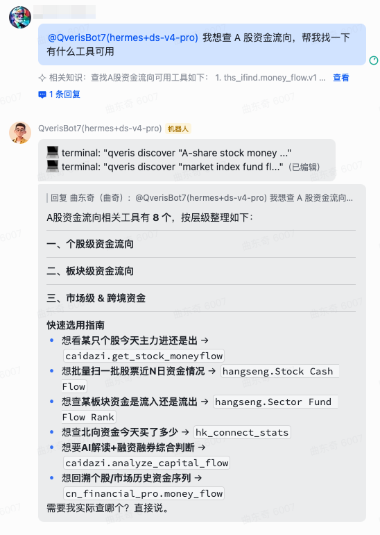
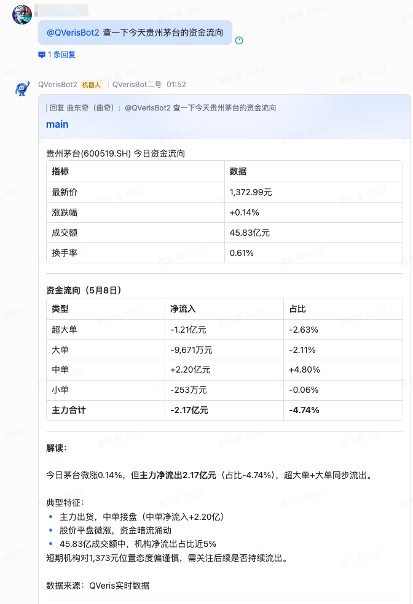
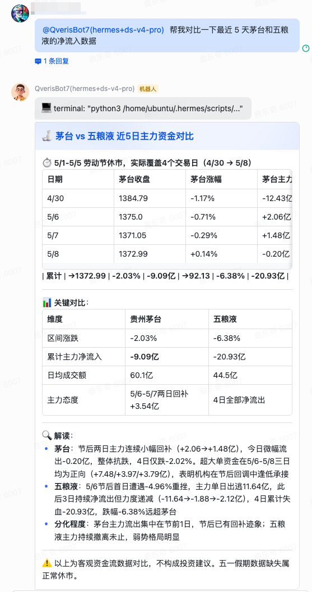
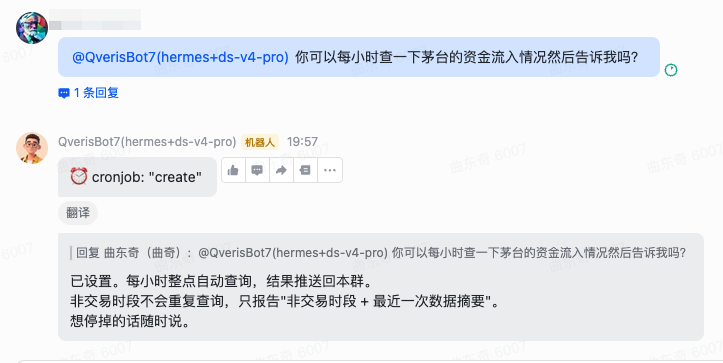
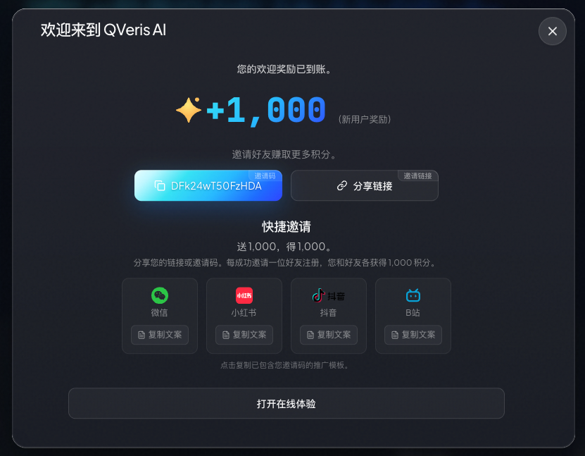

QVeris · 使用教程   

最近圈子里有个话题特别火：怎么让 AI Agent 实时获取 A 股数据，做自动化分析和决策。 

不是那种隔天看财报的滞后分析，是盘中实时监测、异动预警、策略回测那种。 

今天我就用 Hermes 框架 + QVeris 数据源，给大家演示一套完整方案。从安装到跑通第一个查询，15 分钟搞定。 

 

01先说说为什么选这套组合

**Hermes 是什么？**

如果你在做 AI Agent 开发，应该听过 Hermes —— 一个开源的 Agent 执行框架，特点是轻量、可扩展、对 LLM 友好。相比其他框架，它更适合做"持续运行型"的 Agent，比如 24 小时监控市场、自动触发交易提醒那种。 

**QVeris 是什么？**

简单说，它是 AI 时代的"能力路由网络"。你不需要对接每一个数据供应商，只需要接入 QVeris，就能调用上万个实时数据工具 —— A 股行情、资金流向、财务数据、研报、甚至社交媒体情绪，都涵盖在内。 

关键是**门槛极低**： 

-    免费额度足够个人开发者低频用一个月 

-    不需要签协议、不需要预存几万块 

-    一个 API Key 走天下 

这套组合的逻辑是：Hermes 负责"思考"和"决策"，QVeris 负责"感知"市场。两者一结合，你的 Agent 就有了眼睛和可以进化的大脑。 

02准备工作：3 样东西

开始前，你需要准备： 

1. **一台能联网的电脑**（Windows/Mac/Linux 都可以，本文以 Mac 为例） 

2. **一个 QVeris API Key** —— 去 qveris.ai 免费申请，1 分钟搞定 

3. **安装好的 Hermes 框架** —— 如果你还没装，可以先看官方文档快速上手 

先看一下最终效果 —— 在飞书里问 Hermes 今天的市场情况： 

 👤 帮我找出近3日主力资金持续流入、但股价还没大涨的科技股的股票

03核心步骤：一条命令接入

  

Hermes 的好处是插件化设计。接入 QVeris，本质上就是安装一个 Skill。 

登录：https://qveris.ai/plugins 复制下面的一句话丢给Hermes 

接入即可。

如果需要你填写API KEY可以在网站右上角，登陆后点击头像，选择API密钥获取。

然后问问你AI是否接入成功即可，就是这么简单。

  

04实战演示：三步查询 A 股数据

  

现在你的 Hermes 已经能调用 QVeris 的全部能力了。我们用三段式工作流走一遍。 

第一步：发现工具 

告诉 Hermes 你想查什么，让它帮你找合适的工具： 

   👤 "我想查 A 股资金流向，帮我找一下有什么工具可用" 

第二步：执行查询 

   👤 "用第一个工具查一下今天贵州茅台的资金流向" 

第三步：深度追问 

   👤 "帮我对比一下最近 5 天茅台和五粮液的净流入数据" 

看到没？你的 Hermes Agent 现在具备了专业的 A 股数据分析能力。 

 

05进阶玩法：自动化监控

   

既然能查询，就能自动化。 

在 Hermes 里配置一个定时任务，让 Agent 每小时检查一次持仓股票的资金流向： 

这样，你的 Agent 就成了 24 小时不打烊的监控员。有异动自动推送到飞书/钉钉/Telegram，再也不用盯盘了。 

  

06适用边界：谁适合用这个方案？

  

这套组合特别适合以下几类人： 

**量化策略研究者** —— 需要高频、多维度数据回测策略，但不想花几万块买数据接口。 

**个人投资者** —— 想建立自己的"智能投顾"，自动监控持仓、发现机会。 

**Agent 开发者** —— 正在做金融场景的 AI 应用，需要快速接入稳定的数据源。 

**但如果你是以下情况，可能不太适合：**

-    只需要偶尔查一次股票行情 —— 直接用券商 App 更快 

-    需要做高频交易（毫秒级延迟）—— QVeris 是分钟级数据，不适合超低延迟场景 

-    对数据合规要求极高（比如公募基金的正式交易系统）—— 建议走官方数据供应商的合规通道 

  

07成本与配额

   

QVeris 的计费很透明： 

- **搜索发现**：免费 

- **工具调用**：按实际使用计费，A 股行情类工具通常在 0.1-0.5 元/次 

- **新用户福利**：注册送 1000 credits，邀请好友再送双倍 

什么概念？如果你每天查 20 次数据，一个月下来大概花 30-50 块钱，比一杯咖啡还便宜。 

**并且计费公开透明**：

QVeris 计费升级：让你清楚Agent的每一次付费

  

08写在最后

 

AI Agent 正在改变我们获取和处理信息的方式。 

以前，你要打开十个网页、翻几十页财报、盯一整天盘面，才能得到的投资洞察，现在一个配置好的 Agent 几分钟就能给你。 

更重要的是，这套方案的门槛足够低 —— 不需要昂贵的数据接口，不需要复杂的系统架构，一个 API Key、一条配置命令，就能让你的 Agent "看见"市场。 

如果你已经装好了 Hermes，不妨现在就试试。去 qveris.ai 申请一个免费 Key，丢给你的Agent叫她自己接入即可，15 分钟后回来告诉我效果。 

**👇点击下方链接立即注册赠送你1000积分**：

https://qveris.ai/?ref=DFk24wT50FzHDA

邀请朋友还可额外获赠1000积分🎁

我们下篇见。
