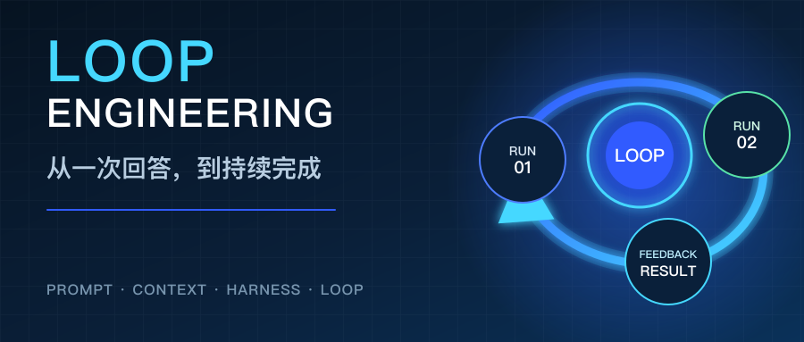
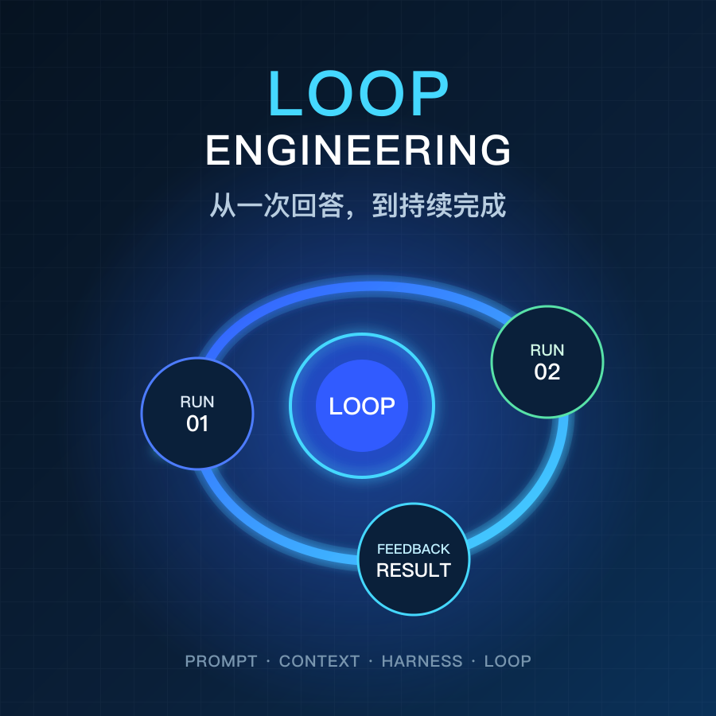
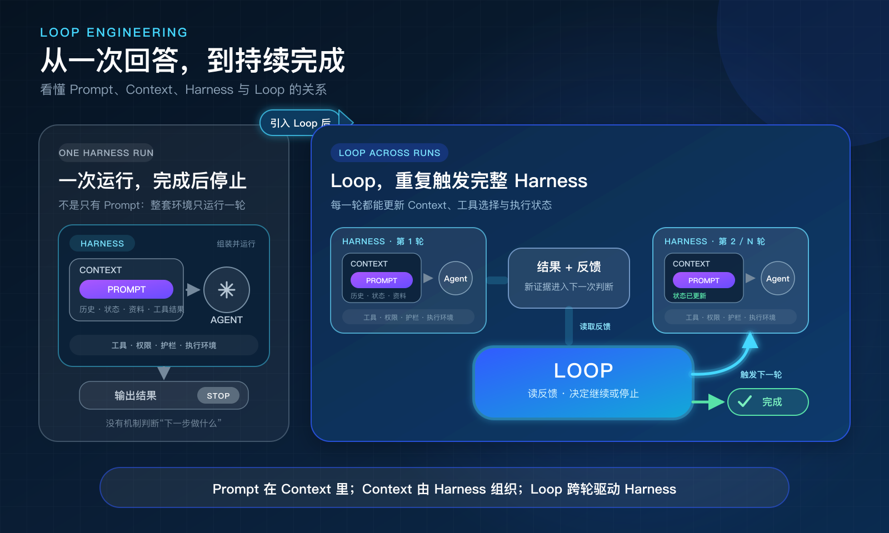
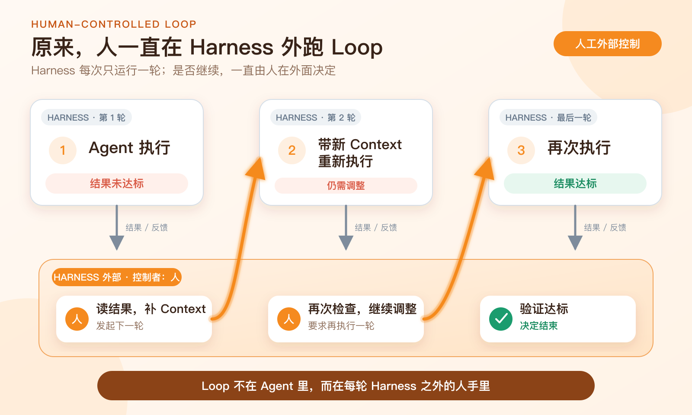
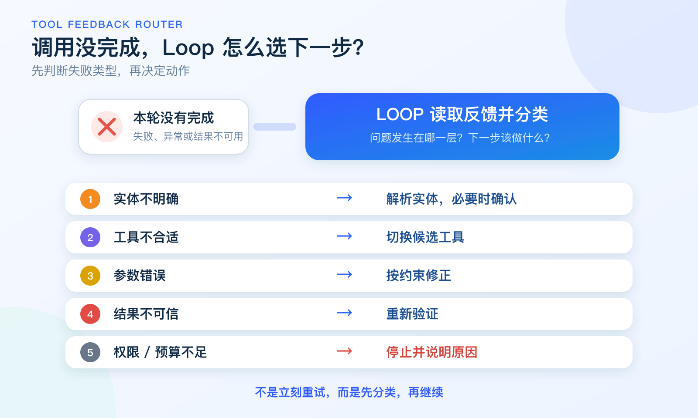
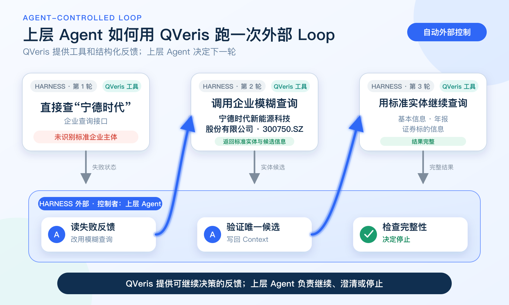

<title>Loop Engineering：从“完成一次”到“持续把事情做完”</title>





> 当 Agent 不再依赖人逐轮提醒，真正需要设计的就不只是 Prompt，而是任务如何启动、验证、记忆和停止。

Agent 真正卡住的，往往不是不会做，而是做完一轮就停了。

写代码、查资料、调用接口，它完成一次运行，把结果交回来。顺利的话，任务结束；不顺利的话，我们复制错误、补充背景，再告诉它“换个方法试试”。看起来是 Agent 在工作，真正负责发现问题、维持状态和决定下一步的却一直是人。

2026 年 6 月底，一篇预印本把 coding-agent 圈里正在形成的 Loop Engineering 实践整理成了一套框架：与其逐步提醒 Agent，不如设计一个能触发、验证、记忆并停止的外部工作循环。

# 01 从一次回答，到一项持续推进的工作

把一件事交给 Agent 时，Prompt 只是这一轮的任务说明。模型真正拿到的是整个 Context：Prompt、已有资料、历史结果，以及工具刚刚返回的信息。

Harness 再把 Context 与 Agent、工具、权限和护栏装配起来，组织并约束一次完整运行。

在本文采用的外部 Loop 口径里，它们不是四个并列概念：Prompt 是本轮 Context 的一部分；Loop 读取运行结果，在 Harness 之外决定停止，或带着更新后的状态触发下一轮。

这是一种便于理解的工程分层，不是已经标准化的行业架构。它把关注点从“怎样得到一次好回答”，推进到“怎样让一项工作持续向前”。

# 02 Loop 不等于让 Agent 一直重试

一个最简单的循环，可以只是失败后再执行一次。但如果系统不知道失败发生在哪里，也不知道怎样的结果才算正确，那么重试只是把相同的不确定性重新跑一遍。

要让 Loop 真正可靠，至少要把四件事设计清楚。

**首先是目标。**“继续优化”不是一个可以验证的目标，“通过指定测试并生成可审核的结果”才是。

**其次是验证。**Agent 说自己完成了，不代表任务真的完成。验证可以来自确定性规则、测试程序、另一个模型或人工判断。

**然后是状态。**上一轮尝试了什么、为什么失败、哪些证据已经确认，需要被保存下来。否则每一轮都只是在重新开始。

**最后是停止条件。**完成、出现歧义、权限不足、连续失败或超过预算，都应该让 Loop 进入明确状态，而不是无休止地消耗。

Loop 的核心因此不是“循环”，而是根据上一轮留下的证据，决定下一步是否值得继续。



# 03 人一直在 Harness 外跑 Loop

很多 Agent 工作流其实早已有 Loop，只不过它一直由人来完成。



Agent 每完成一次 Harness 运行就停下来。人查看结果，判断是否达标；如果没有，就补充信息、调整方向，把已有结果带入下一轮，再启动一次完整运行。

换句话说，Loop 不在 Harness 里面，而在人和 Harness 之间。人一直站在外面，管理任务的轮次。

Loop Engineering 想接手的，首先正是这段反复衔接的工作。人的位置则向上移动：定义目标、设置边界，并处理真正需要取舍的决策。

# 04 工具调用，是最容易看清 Loop 的地方

在一次工具调用中，Agent 可能遇到很多分支：用户给出的实体不标准，工具选错了，参数不完整，接口返回成功但内容不对，或者当前账号没有权限。

如果没有 Loop，这些情况通常都会回到人这里，再由人告诉 Agent 下一步。

如果把它设计成 Loop，系统就需要自己区分：



到这里，Loop 不再是一个抽象概念。它变成了一套围绕真实输入、真实工具和真实反馈运行的控制逻辑。

# 05 QVeris 为外部 Loop 补上反馈

了解这个概念后，我们重新看了一遍 QVeris 正在做的工具接入与评估工作。QVeris 不接管用户任务，而是为上层 Agent 提供工具，以及足以继续判断的结构化反馈。

```text
QVeris 提供工具与反馈 → 上层 Agent 决定继续、澄清或停止
```

例如，QVeris 正在建设实体解析能力。在企业查询场景中，它可以通过模糊查询工具，把企业简称、别名，甚至差一两个字的输入，解析为标准企业名称、证券代码、候选项和匹配置信度。未命中、存在歧义或权限不足，也会成为明确的结果。接下来换什么工具、怎样更新 Context、是否触发下一轮，仍由上层 Agent 决定。QVeris 也在用真实问题持续评测这些工具，并沉淀跨运行经验，让每次调用都能为下一轮留下可用反馈。

假设上层 Agent 收到一句：“宁德时代最近咋样？”

第一次 Harness 运行，系统直接用“宁德时代”查询，没有命中标准企业主体，并返回明确的实体未解析状态。

上层 Agent 读取这次失败，触发第二次完整运行，改用 QVeris 正在建设的企业模糊查询工具。如果返回唯一的高置信度候选，它就把“宁德时代新能源科技股份有限公司”和“300750.SZ”写回 Context；如果返回多个候选，则由上层 Agent 决定是否向用户澄清。



第三次 Harness 运行，系统使用标准实体继续查询企业基本信息、年报和证券标的信息。结果通过验证，Loop 结束。这里真正发生的 Loop，不是一次运行里连续调用了几个工具，而是每一轮先留下可判断的结果，再由 Harness 外的上层 Agent 决定是否启动下一轮。

# 06 持续完成，不等于永远运行

Loop Engineering 容易让人联想到完全自主、永远运行的 Agent。但可靠的 Loop，不以运行时间长为目标，而以抵达一个可验证的终态为目标。

每一轮都应该带来新的证据：确认一个实体、排除一个工具、验证一组参数，或者明确发现问题必须交给人。没有新证据，就不应该继续空转。

从“完成一次”到“持续把事情做完”，改变的不是 Agent 会不会循环，而是系统能否保存状态、检查结果、处理失败，并在必要时把判断交还给人。

> 真正可靠的 Agent，不是更会重试，而是知道为什么继续，也知道什么时候停止。

---

# 参考资料

- [Stop Hand-Holding Your Coding Agent: Engineering the Loops that Replace Step-by-Step Prompting](https://arxiv.org/abs/2607.00038)
- [OpenAI：Harness engineering: leveraging Codex in an agent-first world](https://openai.com/index/harness-engineering/)
- [Anthropic：Effective context engineering for AI agents](https://www.anthropic.com/engineering/effective-context-engineering-for-ai-agents)
