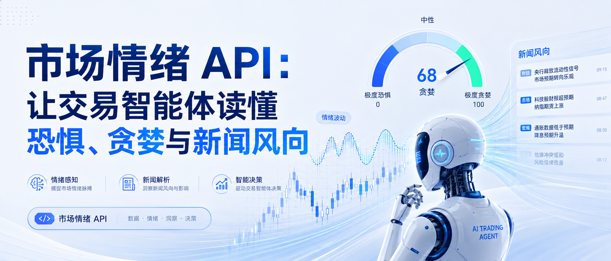

<title>市场情绪 API：让交易智能体读懂恐惧、贪婪与新闻风向</title>

一个只关注价格的交易智能体，往往只能在行情变化之后才意识到发生了什么。

情绪 API 可以补上关键的一层信息：当前市场究竟是由恐惧、贪婪，还是新闻语气的突然转变所驱动。但常见的误区，是直接把情绪信号当成买入或卖出按钮。

**情绪只是一种假设。最终应由价格、成交量和基本面决定，这个假设值得触发预警，还是应该被忽略。**

# 在交易系统中，“情绪”究竟指什么

在实际应用中，智能体通常会接触三类情绪信号。

第一类是**新闻语气**，用于判断新闻标题和内容整体偏利多还是偏利空。

第二类是**社交平台与内容热度**，用于观察市场注意力正在向哪些主题集中。

第三类是**市场层面的恐惧与贪婪指标**，用于概括某类资产或某个指数整体的拥挤程度与风险偏好。

如果智能体无法识别一个情绪分数究竟来自哪一类信号，它就很容易对噪声赋予过高权重。

# 新闻语气是最适合入门的起点

对于股票市场，建议优先从带有股票代码标签的财经新闻入手，而不是分析泛互联网新闻标题。

在 QVeris 中，智能体通常可以根据覆盖范围和调用频率限制，从 Finnhub、Alpha Vantage、Financial Modeling Prep（FMP）或 Yahoo Finance 获取相关数据。

不要只请求一个“利多”或“利空”的极性标签。更有价值的返回字段通常包括：

- 对应的股票代码
- 发布时间
- 新闻来源
- 在可用情况下提供的置信度评分

# 恐惧与贪婪指标必须明确时间窗口

一小时内出现的恐慌性情绪激增，与持续一周的风险规避状态，并不是同一回事。

在让智能体总结“当前市场处于恐惧状态”之前，应当先在提示词或工具策略中明确采样时间窗口。

加密资产交易团队通常会将 CoinGecko 或 CoinMarketCap 的价格数据，与新闻情绪或社交平台情绪结合使用，因为加密市场的叙事变化速度通常快于股票市场。

# 社交热度有价值，但也很容易被误用

社交平台上的讨论，有时能够在消息进入专业财经终端之前，提前暴露市场正在发酵的事件。

通过 QVeris，TikHub 和 X Developer Platform 可以帮助智能体读取公开内容及单条帖子的传播动量，而不只是分析经过润色的新闻稿和官方报道。

但点赞量和转发量并不等同于机构资金流向。

更合理的做法，是将社交热度激增视为一种早期预警，然后再要求新闻语气或价格行为提供确认。

# 每次使用情绪信号，都应搭配市场数据核验

一条负面新闻出现在成交清淡、波动有限的市场中，可能并不重要。

但同样一条新闻，如果发生在流动性较低的环境中，影响可能会显著放大。

因此，当情绪信号触发后，应让智能体继续调用报价或 K 线接口进行验证。在 QVeris 中，常用的数据源包括 Twelve Data、FMP 和 EODHD。

**没有确认规则，就不应执行任何带有交易指向性的操作。**

# 设计能够被智能体解释的预警

一条合格的预警，应当回答四个问题：

1. 涉及哪个股票代码或主题
2. 情绪信号来自哪个数据源
3. 具体发生了什么变化
4. 核验了哪一项市场事实

“市场情绪转为负面”远远不够。对于需要在 30 秒内作出判断的交易团队，这样的提示缺乏可操作性。

同时，应将原始新闻链接或文章 ID 保存在执行追踪记录中，方便人工在事后审计智能体的判断依据。

# 在自动化之前，先了解常见失败模式

情绪分析可能受到多种因素干扰，包括：

- 讽刺和反讽表达
- 旧新闻被重复传播
- 股票代码或公司名称冲突
- 过期的评级信息
- 实体识别错误
- 时间衰减处理不当

例如，一条隔夜发布的下调评级，不应与两分钟前刚发布的突发消息拥有相同权重。

当智能体无法确认时，更合理的做法是选择放弃判断，并请求人工复核。

# 一个保持诚实和可解释的简单智能体循环

1. 检测新闻或社交平台中的情绪异常变化。
2. 将事件主体解析并匹配到正确的股票代码。
3. 使用实时价格和成交量进行确认。
4. 只有确认完成后，才生成简报、自选股标记或风险预警。

QVeris 可以作为这些步骤之间的能力路由层，让智能体动态发现并调用新闻、社交平台和市场数据工具，而不需要为每条路径固定绑定某一家数据供应商。

# 最先应该构建什么

不要一开始就尝试搭建覆盖所有资产的情绪监控仪表盘。

更适合优先落地的是一个单一、稳定的工作流：

**自选股新闻语气监控 → 价格确认 → 生成简短的交易台简报**

当这条链路稳定后，再逐步加入：

- 面向加密资产的社交热度监控
- 面向消费类公司的内容热度信号
- 更广泛的恐惧与贪婪市场背景

情绪 API 不能替代市场数据。

它们的价值，是帮助交易智能体理解行情为什么可能正在变化。而当这种“原因”需要证据支持时，QVeris 可以帮助智能体调用 Finnhub、Alpha Vantage、FMP、Twelve Data、TikHub 及其他相关数据源，组合出更加可靠的判断依据。
