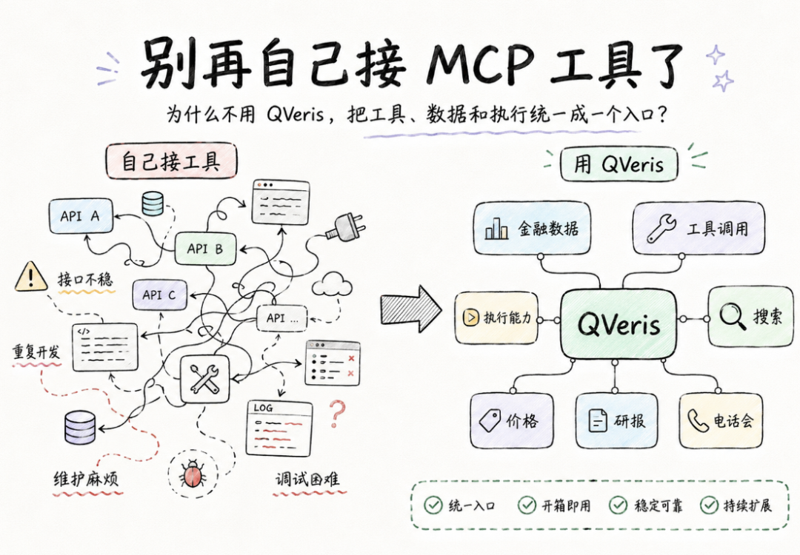
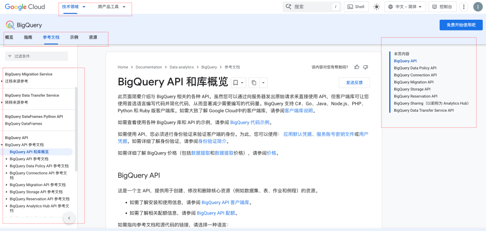
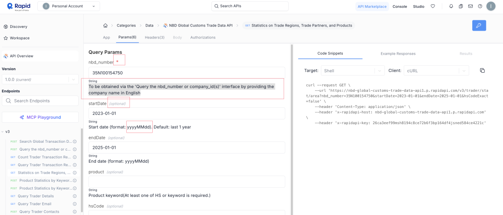
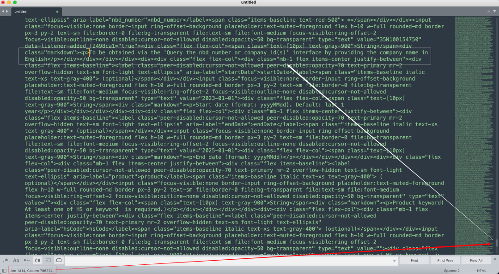
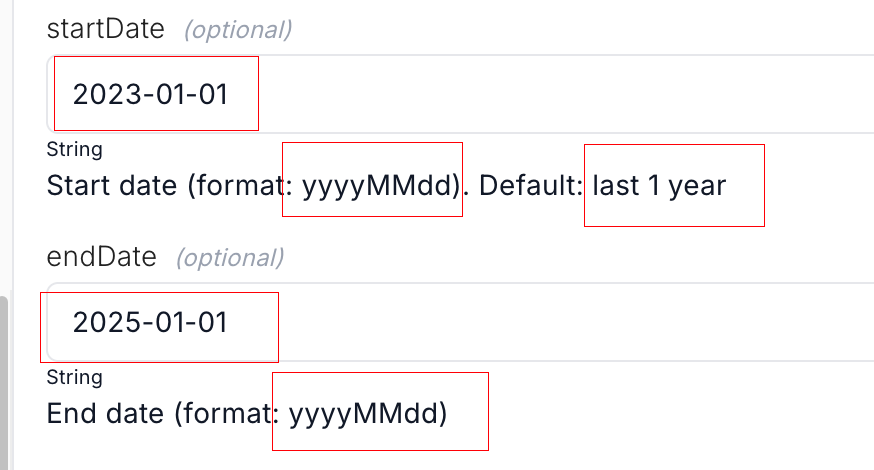

QVeris · 技术解读 

  

把一个工具接进模型，已经不是最难的部分了。真正难的，是让 Agent 在真实环境里稳定地找到对的工具、看懂它、再把参数用对。 

## 背景

  

这两年，大家对 Agent 的期待越来越高。给它一份 API 文档，或者接一个 MCP 服务，很多时候半小时就能把第一次调用跑通。 

但"第一次跑通"和"长期好用"其实是两回事。 

工具调用说的是：模型会不会决定调用工具，会不会选对工具，会不会填参数。 

MCP 说的是：工具怎么用统一方式接给模型。 

所以 MCP 很重要，但它解决的主要是"怎么接进来"。 

它不会自动帮你解决下面这些问题： 

1.  互联网上到底有哪些工具值得发现。 

2.  这些工具属于谁，文档散落在哪。 

3.  哪些信息是有效能力，哪些只是噪音。 

4.  用户一句自然语言过来，到底该选哪个工具。 

5.  参数到底该怎么补全、纠错、归一化。 

所以今天难的已经不是"接不接得上"，而是"接上以后能不能真的用好"。 
## Agent 真正"用好工具"，到底需要什么能力

  

最核心的，我觉得有四层。 

### 1. 先得能发现工具 

互联网上的工具信息，很少会整整齐齐地放在一个地方。官网讲产品，开发者文档讲接口，认证方式在认证页面，套餐和免费额度在价格页面。OpenAPI 规范和 MCP 文档又常常是另一套入口。 

所以第一步不是调用，而是先把入口找出来、把归属理清。 

### 2. 还要把文档整理成机器能读懂的数据 

原始文档是给人看的，不是给 Agent 直接执行的。 

真正进入调用链路的，不是一整页文档，而是几件事：这是谁家的工具，能做什么，怎么调，有什么限制。 

这一步最难的，不是"能不能抽出来"，而是三件事： 

- 要准，不能把说明文字误当成可执行能力 

- 要稳，同一类文档不能今天一个结构、明天一个结构 

- 要省，能直接按规则提取的内容，就不要每次都重新让模型读一遍 

OpenAPI 这类内容比较适合规则解析。套餐说明、隐藏字段这类信息，很多时候还得靠语义理解。 

这一步做错了，后面的检索和调用就会一起出错；太依赖 LLM，成本也会跟着上去。 

### 3. 工具多了以后，核心问题会变成检索和排序 

工具少的时候，调用问题通常不大。工具一多，最难的就不再是"能不能调起来"，而是"先选谁"。 

名字像的不一定最好，官方的不一定最稳，最新的不一定最便宜。真正可用的工具检索，得同时看适配度、成功率、成本和延迟。 

### 4. 最后还要把用户的话变成正确参数 

这一层更像"把人话翻译成参数"。 

用户给出的输入，通常不是标准 API 参数，而是自然语言、别名、口语、错别字，甚至缺字段。 

比如用户说"要成年人"，工具真正要的可能是 age \> 18。 

用户说的是人话，工具要的是条件。 

如果没有这一层，模型表面上像是在调工具，实际上很多时候是在硬猜参数。 
## 几个真实工程问题

  

这一篇只讲前半段，也就是发现、筛选、抓取、结构化解析里，几个很真实、也很容易被低估的问题。 

### 1. 不是所有链接都值得抓 

入口不是"看见链接就抓"。 

通常要先收入口，再筛链接，最后才决定抓不抓。第一批入口可能来自 GitHub 聚合源、API 目录、MCP 注册中心。到了筛链接这一步，核心就是判断：这是不是高价值页面，能不能匹配已有服务方，对不上时要不要新建，低价值链接要不要直接丢掉。 

重点不是"尽量多抓"，而是"尽量把真正有价值的入口抓出来"。 

 一份文档一个页面几千链接，每个链接点开都可能继续爆炸下去。而且为了稳定性这种事要定时维护。 

### 2. 页面很长，但关键内容不一定在最显眼的地方 

很多 API 文档页长得离谱，早就超过了大模型能舒服处理的上下文长度。 

更麻烦的是，真正关键的信息不一定在开头。它可能在前面一点，也可能藏在后半段。认证、限制、套餐、参数约束，经常都分散在不同位置。 

所以真正难的，不是把页面抓下来，而是怎么用尽量低的成本，把最关键的部分找出来。 

这里要同时控制三件事：准确率、识别率、成本。 

准不准，决定后面会不会理解错；漏不漏，决定关键信息会不会丢；贵不贵，决定这件事能不能长期做下去。 

 这次选一个看着很规范的一个docs，简洁清晰。是否必填、描述、格式。看上去大模型一下就能出结果啊 

 藏在99万字符的文档的第76万字符的位置 

### 3. 结构定义不是附属品，它会直接影响后面的调用效果 

很多人会把结构定义理解成"文档整理后的结果"，但如果这份结构定义是给 Agent 用的，它其实更像执行层的一部分。 

字段语义清不清楚，参数边界准不准确，认证信息、套餐信息、rate limit、枚举值、默认值有没有写明白，都会直接影响后面的检索和纠错。 

 所以 schema 不是"整理得更好看"，而是"让 Agent 少犯错"。 

## 这篇先讲前半段

  

这次讲的，基本都是供给侧的问题：怎么找到能力，怎么判断值不值得抓，怎么把原始文档稳定地结构化。 

但 Agent 真正把工具用好，还差后半段：怎么检索，怎么排序，怎么理解用户输入，怎么做参数纠错和归一化。 
## 所以，QVeris 在解决什么

  

如果只看表面，很容易把这件事理解成"再接一个 MCP server"，或者"再多收一点 API 文档"。 

但沿着这条链路往下看，会发现问题根本不是"接没接上"，而是：有没有一套系统能力，让 Agent 在一个越来越大的工具世界里稳定工作。 

QVeris 想解决的，其实就是这一层。不是单纯把工具接进来，而是把发现、整理、结构化这件事先做好，再把后面的检索、纠错和调用建立在一个更稳的底座上。 

MCP 解决的是"怎么把工具接进来"。 

QVeris 要解决的，是"接进来之后，怎么让 Agent 真正在生产里把工具用起来"。 

这篇先写到供给侧为止。下一篇如果继续写，我会更具体地讲后半段：当工具足够多以后，检索为什么会变成核心问题；排序怎么做才不只是"名字最像"；以及用户输入参数时，纠错、补全、归一化为什么会直接决定调用成功率。
