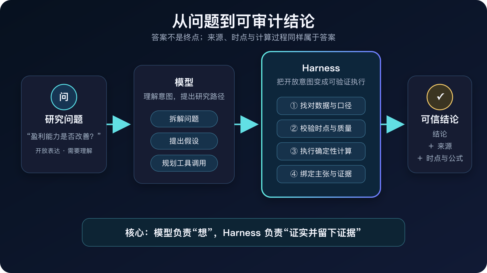
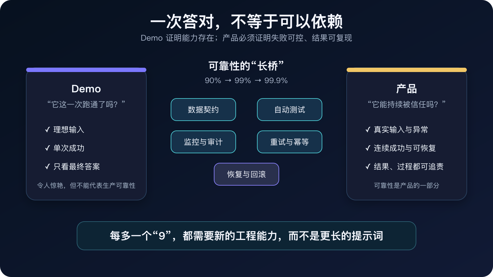
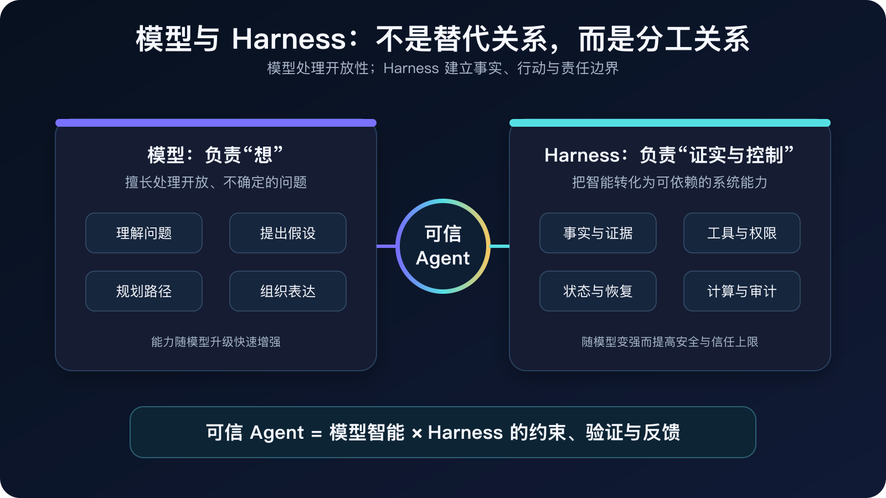
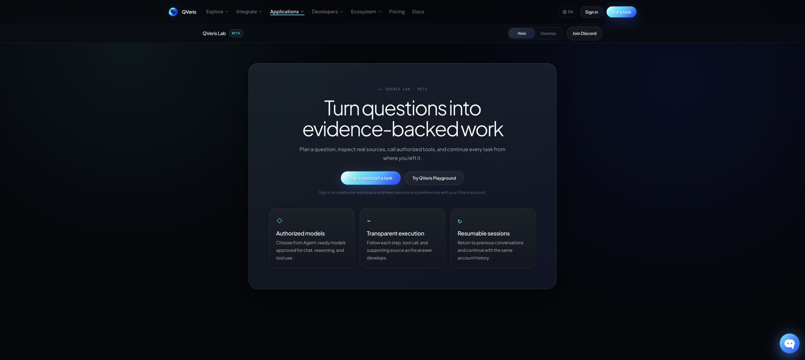
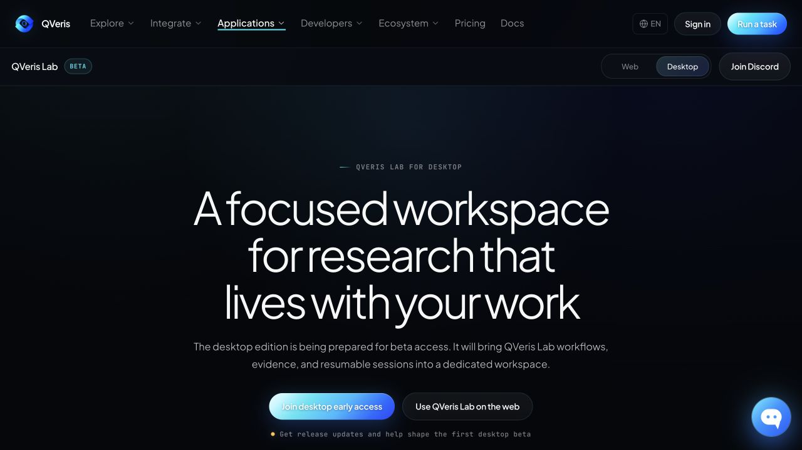

> **一个 100 步任务，即使每一步都有 99% 的成功率，完整跑通的概率也只有 36.6%。**
>
> 在一个简化的独立事件模型里，20 步是 81.8%，50 步是 60.5%。Agent 一旦从一次回答变成一条长链路，“每一步都不错”并不等于“最终结果可以依赖”。

这不是一道纸面算题。一次金融研究，可能要连续完成实体识别、时点解析、数据授权、工具选择、字段映射、质量校验、公式计算、证据绑定和报告生成。任何一步出错，最后都可能得到一份语言流畅、数字真实、结论却错误的报告。过去几周，我们一直在为 QVeris Lab 的发布打磨 Agent Harness；做得越深，我越确信：Agent 时代最容易被低估的技术，不是模型，也不是工具数量，而是模型与真实世界之间的 Harness。

“Harness”这个词很容易让人想到一层薄薄的工程外壳，仿佛它只是把提示词、工具调用和界面粘在一起。但在真正的生产系统里，它更像一个组织系统：决定模型能看到什么、可以做什么、哪些结果可以相信、错误发生后如何恢复，以及系统能否对一次决策负责。

这篇文章不讨论某个特定框架，也不试图给出另一套 Agent 名词表。我更想分享我们在金融研究场景中反复碰到的共性问题，以及由此形成的一套判断：模型越强，Harness 不会越不重要；恰恰相反，它会从“调用模型的代码”逐渐变成智能系统的认识论内核和执行控制面。

# 一、从 Demo 到生产，真正的鸿沟在哪里

一个 Agent Demo 展示的是系统最聪明、最顺利的五分钟：输入清晰、数据可用、网络稳定、工具按预期返回。产品面对的却是完整分布——数据延迟、授权过期、名称歧义、第三方超时、进程重启、用户中断都会成为日常输入。Demo 证明“能力存在”，产品必须证明“失败可控”。

这种 Demo 与产品之间的鸿沟，Andrej Karpathy 讲得很直白：**“Demo is easy, a product takes a decade”**。他借自动驾驶说明，真正漫长的是可靠性的“march of nines”——从 90% 到 99%、99.9%，每多一个 9 都意味着新一轮艰苦的工程工作。

用户不再只问“它能不能回答”，而会继续追问：数据是什么时候的？这个数字来自哪里？不同来源冲突时为什么选择了它？公式是什么？中途超时后有没有重复执行？费用是否已经发生？任务中断后为什么还能继续？下次打开时看到的是历史事实，还是某个缓存留下的幻象？

这些问题都无法靠一段更长的提示词解决。它们要求系统在模型之外拥有自己的事实边界、状态边界和责任边界。

## 1. 模型理解了问题，却拿错了数据

这是工具型 Agent 最常见、也最隐蔽的失败。用户问的是实时价格，Agent 可能返回昨日收盘；用户问的是某个季度的利润率，Agent 可能混入全年数据；用户问的是一家公司的指标，模型可能在名称相近的实体之间发生漂移。

这里往往不是工具不存在，也不是模型完全不懂问题。问题在于，系统把“选择哪个工具”当成了一次语言判断，却没有把用户真正需要的数据能力表达成机器可以验证的条件。

工具名不是语义。一个名字里带有“行情”或“财务”的工具，并不能证明它满足实时性、期间、币种、调整方式、数据范围和授权要求。模型可以提出选择，但不能同时担任自己的验收者。

## 2. 数字是真的，结论仍然可能是错的

金融研究让这个问题格外突出。一个数字可以真实存在，却因为时间、口径或上下文错误而导致完全错误的判断。

举一个简化例子：系统把某公司第二季度单季毛利率 44.1%，与上半年累计毛利率 43.6% 直接比较，于是生成“毛利率改善 0.5 个百分点”的结论。两个数字都可能真实，减法也完全正确，但单季与累计期间不可直接比较，最终趋势是被口径制造出来的。

因此，可信 Agent 不能只保存数值。它必须同时保存实体、时间、期间、币种、单位、数据范围、来源和处理方式。缺少这些信息时，系统应当降低结论强度，必要时拒绝生成确定性判断。

## 3. 工具调用不是纯函数，而是有副作用的远程行为

很多 Agent 架构把工具调用画成一个简单箭头：发送请求，得到结果。真实世界没有这么干净。

一个常见现场是：工具请求在第 30 秒超时，本地没有拿到结果，但远端其实已在第 29 秒完成执行。如果 Harness 把“未收到响应”当成“未执行”并自动重试两次，一次研究动作就可能变成三次扣费；换成交易、邮件或文件写入，重复副作用会更严重。

如果系统把“没有收到结果”直接等同于“没有执行”，就可能造成重复行动。如果把“暂时不知道费用”显示成零，就会制造虚假的确定性。

所以，生产 Agent 需要维护独立于模型的执行真相：谁拥有这次任务、请求是否已经提交、远端结果是否确定、是否允许重试、费用是待确认还是已结算。这里的核心不是追求一句轻率的“Exactly Once”，而是诚实地表达不确定性，并确保每种不确定状态都有安全的下一步。

## 4. 长会话不是把全部历史重新发给模型

当 Agent 从一次问答变成长期研究伙伴，另一个问题会迅速出现：用户需要完整历史，模型却不应该在每一轮重新阅读全部历史。

假设一场长期研究已经进行 200 轮，每轮平均沉淀 2,000 个 token，仅历史正文就达到约 40 万 token，还不包括系统指令、工具定义和本轮材料。即使模型窗口能够容纳，逐轮重读也会持续增加延迟、成本和注意力稀释；缓存只能减少重复计算，不能让旧信息重新变得相关。

更合理的做法是分离“用户可见的完整历史”和“模型当前需要的工作集”。系统持续维护当前任务、关键实体、用户约束、已经确认的事实、未完成事项和历史引用；只有确有需要时，才取回更早的内容。

换句话说，长期记忆不是无限上下文，而是有结构的遗忘与按需回忆。

Anthropic 在 [《Effective context engineering for AI agents》](https://www.anthropic.com/engineering/effective-context-engineering-for-ai-agents) 中也把上下文称为一种“关键但有限”的资源，并指出随着上下文增长，模型会出现注意力稀释和信息相关性下降。它给出的方向不是无限堆入材料，而是寻找足以支持当前任务的最小高信号信息集。这与我们对长期记忆的实践判断高度一致。

## 5. 可观测性也会制造幻觉

Agent 团队很容易被漂亮的 P95、token 降幅和成本曲线鼓舞。但在只有 20 个样本时，P95 几乎就是“第二慢的那一次”；只要替换一个任务、改变一次缓存命中或混入一个更难的问题，数字就可能明显波动。若新旧方案使用的模型版本、任务难度或输入口径不同，再精确的小数点也没有解释力。

我们逐渐形成的原则是：结构正确性、研究质量、延迟和成本必须分别度量；样本不足时明确写“结论不足”；新旧方案必须绑定相同模型、配置和任务做成对比较；评测产物本身也要能够验证版本和完整性。

可信系统首先要拒绝用错误口径证明自己可信。

这种风险并非理论问题。OpenAI 最近在 [《Separating signal from noise in coding evaluations》](https://openai.com/index/separating-signal-from-noise-coding-evaluations/) 中审计一个主流编码基准，估计约 30% 的任务存在破坏性问题，并明确指出有缺陷的评测会制造对模型能力的错误理解。对 Agent 团队而言，评测集、评分器和统计口径本身也是需要被审计的产品组件。

> **工程启示：** 拿错数据，需要能力契约；数字真实但结论错误，需要证据语境；重复执行，需要状态机与幂等；长会话变慢，需要上下文组装；指标反常，需要可审计评测。提示词可以改善表现，但不能替代这些系统能力。

# 二、金融研究为什么是检验 Agent 的理想场景

金融研究不是唯一需要高可信度的领域，但它把 Agent 的主要困难同时集中到了一起。

数据具有强时效性，同一个事实会随市场和披露变化；指标高度依赖期间、口径、币种与调整方式；多个来源可能互相冲突；研究既需要开放式推理，也需要确定性计算；工具调用具有成本、权限和许可约束；最终结论还可能影响真实资金决策。

这意味着，一个金融研究 Agent 不能只追求“多数时候答对”。它至少要做到：

- 知道每个关键事实属于哪个时间点和数据口径；
- 能够把结论追溯到来源和计算过程；
- 在来源冲突、信息不足时表达不确定性；
- 在发布关键数字前完成机器校验；
- 在中断、超时和重试后保留真实执行状态；
- 让用户能够复核，而不是要求用户相信模型的自信语气。

我更愿意把“审计级”理解为一种工程属性，而不是一句营销标签：系统不承诺永远不犯错，但必须让错误可发现、可解释、可阻断、可恢复，并且不能用流畅语言掩盖证据缺失。

# 三、Harness 到底是什么

如果把大模型比作一位极具天赋、学习速度极快的研究员，那么 Harness 不是他的秘书，也不只是工具箱。它更接近研究机构本身：数据规范、研究流程、权限制度、计算方法、档案系统、质量控制和责任机制。

模型负责理解开放问题、提出假设、制定策略、发现关联和组织表达；Harness 负责把这些开放意图转化为可以执行和验证的要求，管理外部行动，并决定什么样的证据足以支持什么样的结论。

OpenAI 在 2026 年的 [《Harness engineering》](https://openai.com/index/harness-engineering/) 中把这种分工概括为 **“Humans steer. Agents execute.”**。我们更重要的经验是：不要微观规定模型的每一步实现，而要把环境做得可理解，把关键约束变成可机械执行的不变量，并建立持续反馈回路。这正是 Harness 从“模型外壳”走向“生产组织系统”的过程。

> 问题 -> 证据需求 -> 数据与行动 -> 质量验证 -> 确定性计算 -> 结论与证据绑定 -> 输出

这个流程中，模型不是被排除在外，而是被放在最擅长的位置。Harness 也不是与模型竞争智能，而是把模型的智能转化为可依赖的系统能力。

# 四、Harness 会被更强的模型吃掉吗

会吃掉一部分，而且应该吃掉。

关键词路由、脆弱的提示词技巧、大量手写的工具选择分支、固定而冗长的计划模板，以及纯格式转换，都会随着模型能力增强而不断减少。好的 Harness 不应该把今天模型的弱点永久固化成复杂架构。

但更强的模型无法凭推理创造外部事实，也不能仅靠“思考”知道一次远程请求是否已经扣费、某个用户是否拥有数据许可、进程崩溃前发生了什么、一个财务字段属于哪个报告期，或者一份缓存是否已经过期。

因此，真正长期存在的 Harness 不是替模型思考，而是承担四类模型无法自证的责任：

**事实责任。** 数据来自哪里、属于什么时间和语境。

**行动责任。** 系统做了什么、谁授权、能否重试、是否产生副作用。

**状态责任。** 中断、并发和恢复之后，什么仍然是真实的。

**发布责任。** 哪些证据足以支持哪些结论，哪些内容必须被阻断或降级。

模型越强，能够自主完成的任务越长、调用的工具越多、影响的外部系统越广，错误半径也越大。Harness 的价值因此不是下降，而是从“辅助模型工作”升级为“治理模型能力”。

Anthropic 的演进也提供了一个很有价值的旁证。它在 [《Building effective agents》](https://www.anthropic.com/engineering/building-effective-agents) 中建议从最简单、可组合的模式开始，只在必要时增加复杂度；到了 2026 年的 [长任务 Harness 实验](https://www.anthropic.com/engineering/harness-design-long-running-apps)，团队进一步提出：Harness 的每个组件都隐含着“模型自己还做不到什么”的假设，这些假设必须随着模型升级持续接受检验。模型进步后，应删除已经过时的脚手架；仍然承担事实、评价和边界责任的组件，则继续保留。

# 五、如何设计一个能与模型共同进化的 Harness

## 1. 从工具出发，改为从证据出发

不要让模型一开始就在工具列表中猜答案。先让它说明：为了回答这个问题，需要哪些实体、时间范围、数据能力、质量标准和结果形态。工具只是满足这些需求的一个实现。

这样，数据源、模型和工具接口发生变化时，研究语义仍然稳定。

## 2. 模型提出，系统验证

模型应该拥有充分的规划空间，但不能同时定义规则、执行规则并宣布自己通过。权限、预算、时间语义、数据质量、重试边界和发布条件应由系统独立验证。

这不是不信任模型，而是成熟系统对任何关键组件都不实行自我认证。

## 3. 让证据成为一等对象

如果研究成果只存在于聊天消息和工具返回文本中，系统很难重放、比较和复用。更好的方式是把来源事实、派生计算和最终主张保存为版本化对象。

答案、表格、图表、下载和审计视图都引用同一份证据。这样不会出现文字使用一套数据、图表又解释出另一套数据的情况。

## 4. 把“计算”与“生成”分开

模型适合提出要计算什么、解释结果意味着什么；确定性的金融计算应尽可能由版本化公式或受控计算环境完成。

这既不是否定模型写代码的能力，也不是追求僵化。它只是承认：当一个数字进入正式结论时，可重现通常比即兴聪明更重要。

## 5. 保存执行真相，而不只是聊天历史

聊天历史告诉我们用户和模型说过什么，执行真相则告诉我们系统实际做过什么。生产 Agent 必须持久化任务归属、行动状态、证据版本、费用状态和恢复边界。

实时缓存和事件流可以服务体验，但不应成为唯一事实来源。

## 6. 让模型升级进入成对评测，而不是印象评测

模型、提示词、工具和 Harness 经常一起变化。如果没有同任务、同环境、同版本绑定的对照实验，团队很难知道质量变化究竟来自哪里。

每次模型升级都应该同时观察答案质量、证据覆盖、工具行为、延迟、成本、失败恢复和外部副作用。更强的模型不应只带来更高分，也应获得更大的自主空间；系统则继续守住相同的事实和执行边界。

Anthropic 在 [《Demystifying evals for AI agents》](https://www.anthropic.com/engineering/demystifying-evals-for-ai-agents) 中明确区分了“轨迹”和“结果”：Agent 在对话中声称任务完成，并不等于外部环境中真的产生了正确结果；评估 Agent 时，评估的也是模型与 Harness 组成的整体。OpenAI 的 [可信评测指南](https://openai.com/index/trustworthy-third-party-evaluations-foundations/) 同样指出，Harness、工具和预算会实质性改变测得的能力。所谓模型升级，必须说明是在什么系统条件下测得的升级。

## 7. 把每次失败沉淀成系统能力

遇到错误时，最便宜的修复通常是补一句提示词；最有价值的修复则是追问：系统是否缺少一种数据语义、一个质量规则、一条状态记录、一个回归样本，或一种用户可见的证据表达。

当线上失败不断沉淀为契约、验证器、评测集和产品反馈，Harness 就会随着模型一起成长。模型扩大能力边界，Harness 把已经学会的能力变成稳定基础。

> **最小可落地版本：** 先把五件事做实——能力契约、证据对象、执行状态机、确定性计算、成对评测。复杂编排可以后加；事实、行动和评测边界不能后补。

# 六、QVeris Lab：我们正在构建什么

QVeris Lab 即将推出网页版和桌面版。我们希望它既不是一个通用聊天产品的金融皮肤，也不是传统金融终端的自然语言入口。

通用 Agent 的优势是开放理解和跨领域推理，但通常缺少金融数据的时间语义、确定性计算和执行审计。传统垂类产品拥有高质量数据库和固定工作流，却往往难以支持开放问题、动态研究路径和长周期协作。

QVeris Lab 试图连接这两端：保留模型的开放研究能力，同时把金融数据契约、证据、计算、权限、成本和恢复机制做进运行底座。

**它以能力而不是工具为中心。** 用户表达研究目标，系统理解所需的数据和行动能力，再选择具体实现。

**它以证据而不是消息为中心。** 研究成果首先成为可复用、可验证的证据对象，答案只是其中一种呈现。

**它重视“当时知道什么”。** 时间、披露、市场状态和历史版本不是备注，而是研究结论的一部分。

**它把关键主张与证据绑定。** 重要数字和判断可以下钻到来源、字段、时点与计算过程。

**它把长会话当成研究工作空间。** 用户可以在网页和桌面端延续完整研究过程，模型则使用经过组织的有效上下文，而不是反复吞入所有历史。

**它把执行与费用也纳入可信范围。** 工具调用、失败恢复和费用状态不是后台黑盒，而是研究活动的一部分。

**它提供面向人的审计体验。** 普通用户首先看到结论、进度和关键证据；需要复核时，再逐层进入数据来源、质量、计算和执行详情，而不是面对一长串原始工具日志。

这些能力不会在第一个版本中同时达到终局。我们更在意的是建立一套能够持续演进的底座：新模型可以替换，新工具可以加入，新数据源可以迁移，但事实、行动、状态和发布责任始终有明确归属。

# 七、我们对下一代 Agent 的判断

今天的行业讨论常常在两个极端之间摇摆：一边认为模型能力会吃掉所有工程层，另一边则试图用越来越复杂的流程完全约束模型。

我认为两者都低估了真正的变化。

随着模型进步，Harness 中为弥补模型能力不足而存在的部分会持续缩小；与此同时，为承载模型更大自治权而存在的部分会持续增强。未来的 Harness 会更少地告诉模型每一步该怎么想，却更清楚地规定什么事实可以使用、什么行动可以发生、什么状态可以恢复，以及什么结论可以发布。

如果一定要把这套判断压缩成一个公式，我会写成：**可信产出 ≈ 模型能力 × 证据完整度 × 执行可靠性 × 可恢复性。** 这不是一个用于打分的数学模型，而是一个设计提醒：乘法系统中，任何一项接近零，整体价值都会迅速接近零。

因此，优秀 Agent 的差异不会只是模型排行榜上的几个点，也不会只是工具市场里多了多少连接器。真正的差异是：当模型进入真实世界，系统能否把它的聪明转化为一种可靠、可积累、可治理的生产力。

这是我们构建 QVeris 的出发点，也是我认为所有 Agent 和 Agent Harness 开发者都将面对的长期命题。

> 模型决定智能的上限，Harness 决定这种智能能否被社会、组织和用户真正信任。

---

## 参考与延伸阅读

- [Andrej Karpathy — AGI is still a decade away](https://www.dwarkesh.com/p/andrej-karpathy)，Dwarkesh Podcast，2025
- [Harness engineering: leveraging Codex in an agent-first world](https://openai.com/index/harness-engineering/)，OpenAI，2026
- [Separating signal from noise in coding evaluations](https://openai.com/index/separating-signal-from-noise-coding-evaluations/)，OpenAI，2026
- [Building effective agents](https://www.anthropic.com/engineering/building-effective-agents)，Anthropic，2024
- [Effective context engineering for AI agents](https://www.anthropic.com/engineering/effective-context-engineering-for-ai-agents)，Anthropic，2025
- [Demystifying evals for AI agents](https://www.anthropic.com/engineering/demystifying-evals-for-ai-agents)，Anthropic，2026
- [Harness design for long-running application development](https://www.anthropic.com/engineering/harness-design-long-running-apps)，Anthropic，2026
