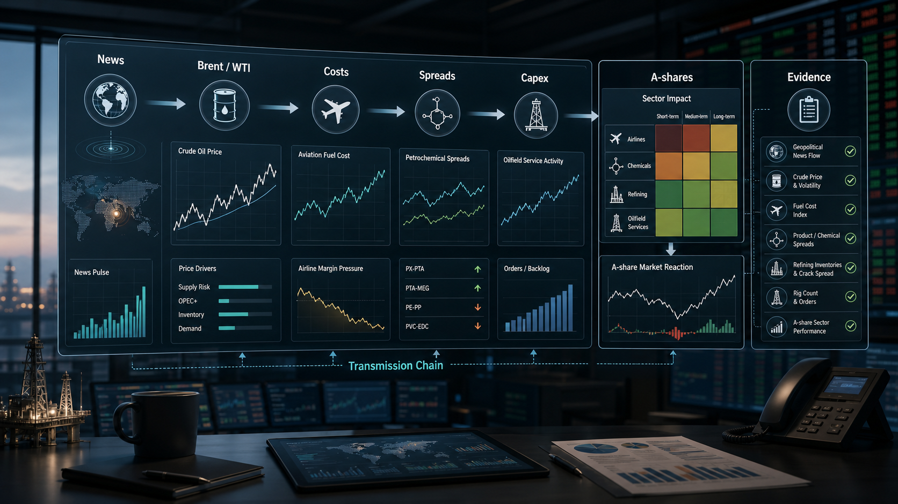

# 油价一跳，A股哪些行业先疼？我用 QVeris 跑了一遍跨市场传导链

*本文所有数据基于2026年6月29日收盘后复盘，文中"A股当天表现"指该交易日。*

昨天，一个做航空研究的朋友在群里丢了一句话：

“油价又动了，航空是不是又要被锤？”

这句话听起来很日常。

但真正做过投研的人都知道，油价不是一个孤立数字。

它一跳，后面跟着的是航油成本、化工价差、油服订单、通胀预期、美债利率、汇率压力，最后才落到 A股行业和公司。

所以问题不是“油价涨了买什么、卖什么”。

问题是：

**一条中东消息，究竟通过哪几层数据，传到你的股票账户？**

昨天我用 QVeris 把这条链路拆了一遍。

不是为了预测明天哪个板块涨跌。

而是看一个金融 Agent 能不能把新闻、商品、宏观、行业和个股，组织成一条能复查的证据链。

## 别先看股票，先看原油发生了什么

6 月 29 日，市场最先反应的不是 A股。

是原油。

据 Reuters 口径，Brent 原油期货一度上涨 **0.8%**，到 **72.57 美元/桶**附近。MarketWatch 同时提到，油价和美股期货在美伊据报同意暂停攻击后小幅上行，但 WTI 和 Brent 当月仍大约下跌 **20%**。

这组数字看起来有点拧巴：

一边是地缘风险还在，油价短线反弹。

另一边是月度维度仍在大幅回落，说明市场对供给冲击的定价并不稳定。

这就是金融 Agent 很容易误判的地方。

如果它只抓到“油价上涨”，就会直接生成一段航空承压、油服受益、通胀抬头的分析。

听起来很对。

但如果它同时看到“当月仍跌约 20%”，结论就不能这么粗暴。

同一个油价，短线交易、月度趋势、成本测算、行业配置，对应的解释完全不同。

我让 QVeris 先做的第一步，不是查 A股。

而是拉出三类原油证据：

- 今天新闻口径里的盘中变化；
- Brent 和 WTI 的日频基准价格；
- 最近 20 个有效交易日的价格区间。

这里有一组 QVeris 实测数据。

我调用了 Alpha Vantage 的 Brent/WTI 日频基准价格工具。

Brent 查询客户端耗时 **5.3 秒**，WTI 查询客户端耗时 **5.5 秒**。

返回结果很长，QVeris 没有把 40 多万字节的结果硬塞进对话，而是给了 **20480 字符截断预览 + 完整结果下载链接**。

预览里的字段很克制：`date`、`value`、`unit`。

不是 OHLCV，不是成交量。

这点很重要。

因为它告诉你：这条数据适合做“日频基准价格验证”，不适合直接冒充盘中 K 线。

## 油价不是直接打到 A股，而是先打到成本表

很多文章写油价，喜欢直接列板块：

油价涨，航空跌。

油价涨，油服涨。

油价涨，化工分化。

这当然没错，但太粗。

真正要看的是成本表。

航空公司最敏感的是航油成本。

化工企业看的是原料价格和产品价差。

炼化企业看的是库存、成品油价格、裂解价差。

油服企业看的是上游资本开支预期，而不是今天油价涨了几个点。

所以，QVeris 的第二步不是问：

“油价上涨利好哪些股票？”

而是问：

“请把油价变化拆成航空、化工、炼化、油服四条传导链，每条链说明核心变量、正负影响和需要验证的数据。”

一个合格的金融 Agent，应该至少给出这样的中间层：

- 航空：原油 -> 航油 -> 单位 ASK 成本 -> 毛利率；
- 化工：原油/石脑油 -> 产品价格 -> 价差 -> 盈利弹性；
- 炼化：原油成本 -> 成品油价格 -> 库存收益/损失 -> 炼油毛利；
- 油服：油价预期 -> 上游资本开支 -> 钻完井/设备订单 -> 收入确认。

注意，这里还没有到个股。

因为个股结论来得太早，往往就是幻觉开始的地方。

> *注：对国内航空公司，完整的传导链还须纳入人民币汇率。油价与人民币双升时成本压力可部分对冲，油价涨而人民币贬则为"双杀"，这是A股航空有别于美股航空的关键宏观变量。此处为聚焦油价主线，暂不展开。*

**油价传导到 A股，中间至少隔着成本、价差、库存和资本开支四道门。**

少过这四道门，文章就容易写成“宏观变量 + 板块标签”的拼接。

这也是我觉得 QVeris 适合做这类选题的地方。

它不是只让 Agent 多拿一个数据源。

而是让 Agent 先把变量关系摆出来，再决定该查哪些数据。

## A股行业映射，最怕口径不齐

到了 A股，问题会更麻烦。

同样叫“油价受益股”，背后可能完全不是一类公司。

有的是上游资源。

有的是油服设备。

有的是炼化。

有的是煤化工替代。

有的是航运、航空这种成本承压方向。

如果 Agent 只按关键词搜“石油”“化工”“航空”，很快就会出错。

因为它看到的是名字，不是业务敞口。

比如一家化工公司，原油上涨到底是利好还是利空，要看它的原料端、产品端和库存周期。

再比如航空公司，油价上涨是成本压力，但如果同时人民币升值、国际航线恢复、客座率提升，股价反应可能不会只跟油价走。

这也是金融 Agent 和普通问答最大的区别。

普通问答喜欢给结论。

研究型 Agent 要先承认：

这件事需要对齐口径。

我会让 QVeris 在这一层做三件事：

第一，按行业暴露度筛选，而不是按公司名字筛选。

第二，把每家公司最近的行情、成交额和新闻事件放在同一时间窗口里。

第三，对每条结论标记证据来源：行情、公告、财务字段、新闻还是行业指数。

这里我又用 QVeris 查了三只代表公司。

不是为了推荐股票。

只是验证“航空承压、油服偏受益、化工要看价差”这条逻辑，在当天 A股里有没有价格反应。

结果很有意思：

<sheet sheet-id="jN9Q6D" token="KrjwszcCnh9bsCtVbMsc8Li3nMc"></sheet>

这三个点放在一起，文章就不再只是“逻辑上应该如此”。

它至少有了一个可复查的当天样本：

航空样本跌，油服样本涨，化工样本小幅上涨但并不激烈。

同时，我还查了 6 月 29 日 A股概念板块涨幅前 20。

QVeris 用 **1488.7 毫秒** 返回了 **20 个概念板块**。当天前几名是减肥药、重组蛋白、CRO、创新药、细胞免疫治疗，涨幅分别是 **7.4357%**、**7.0181%**、**6.5983%**、**6.0750%**、**5.7479%**。

换句话说，油价是全球宏观热点，但 6 月 29 日 A股概念热度的最前排，并不在油气链。

这也是一个很有用的结论。

它提醒我们：油价可以解释部分行业的相对表现，但不能强行把当天 A股主线说成“原油行情”。

没有这层证据，所谓“受益/受损”就只是标签。

有了这层证据，Agent 才能说清楚：

我为什么把这家公司放进来。

它受影响的是成本、收入、库存，还是估值情绪。

## 如果油价明天反向走，分析还能不能继续？

金融市场最烦人的地方在于：

你刚写完一套逻辑，价格就反着走。

所以一个成熟的金融 Agent，不能只会在当下生成一篇漂亮分析。

它还要能继续。

比如今晚 Brent 重新站上 80 美元，明天 A股航空低开，它应该能沿着上一轮证据链继续追踪：

- 是油价本身驱动，还是市场风险偏好下降？
- 航空板块跌幅是否超过大盘？
- 化工内部是一起跌，还是上游强、下游弱？
- 油服有没有成交额放大？
- 新闻事件有没有新的变化？

如果今晚油价回落，它也不应该把上一轮分析推翻重写。

它应该更新状态：

短线供给冲击降温，成本压力暂缓，但地缘风险仍作为尾部变量保留。

这就是 QVeris 这类金融 Agent 产品真正值得写的地方。

不是“它能回答油价影响哪些行业”。

而是它能把一次市场冲击，拆成可追踪、可更新、可复核的研究链路。

一句话：

**金融 Agent 的价值，不是比人更快说出利好利空，而是把每一次利好利空背后的数据、口径和证据保存下来。**

## 用 QVeris 怎么玩

不用先写一大段研究框架。

直接三句话：

你：今天油价为什么动？帮我整理 Brent、WTI 和中东相关新闻。

你：把油价变化映射到 A股航空、化工、油服、炼化四个方向，分别列出核心变量和候选公司。

你：按证据强弱给我排一下，哪些是价格已经反应，哪些只是逻辑上相关，哪些需要明天开盘继续观察。

三轮对话，你拿到的不是一段“油价利好油气、利空航空”的套话。

而是一张**跨市场传导链**：

新闻事件 -> 原油价格 -> 成本/价差/资本开支 -> A股行业 -> 个股证据 -> 下一步跟踪。

这才是今天这类行情里，金融 Agent 真正该做的事。

## 本次 QVeris 实测统计

这篇文章一共做了三类实测：

1. 原油日频价格：Brent、WTI 各 1 次，客户端耗时分别为 5.3 秒、5.5 秒。
2. A股代表公司行情：中国国航、中海油服、万华化学各 1 次，15:00 收盘样本分别为 -2.51%、+1.11%、+0.20%。
3. A股概念热度：概念板块前 20 返回成功，用时 1.5 秒，当天前排主线集中在医药、半导体等方向。

整个过程最有价值的地方，不是 QVeris 每次都返回一个漂亮答案。

而是它把“行情怎么动、数据是什么口径、结论该落在哪个层级”都摆在了一条链路里。

金融 Agent 真正要做的，不是把热点写热闹。

而是让每个热点都能回到它背后的数据、口径和证据。

*注：文中所有行情样本均为基于历史数据的模拟复盘，相关公司名称与价格仅用于说明分析逻辑，不代表实际操作建议。市场有风险，投资须谨慎。*
