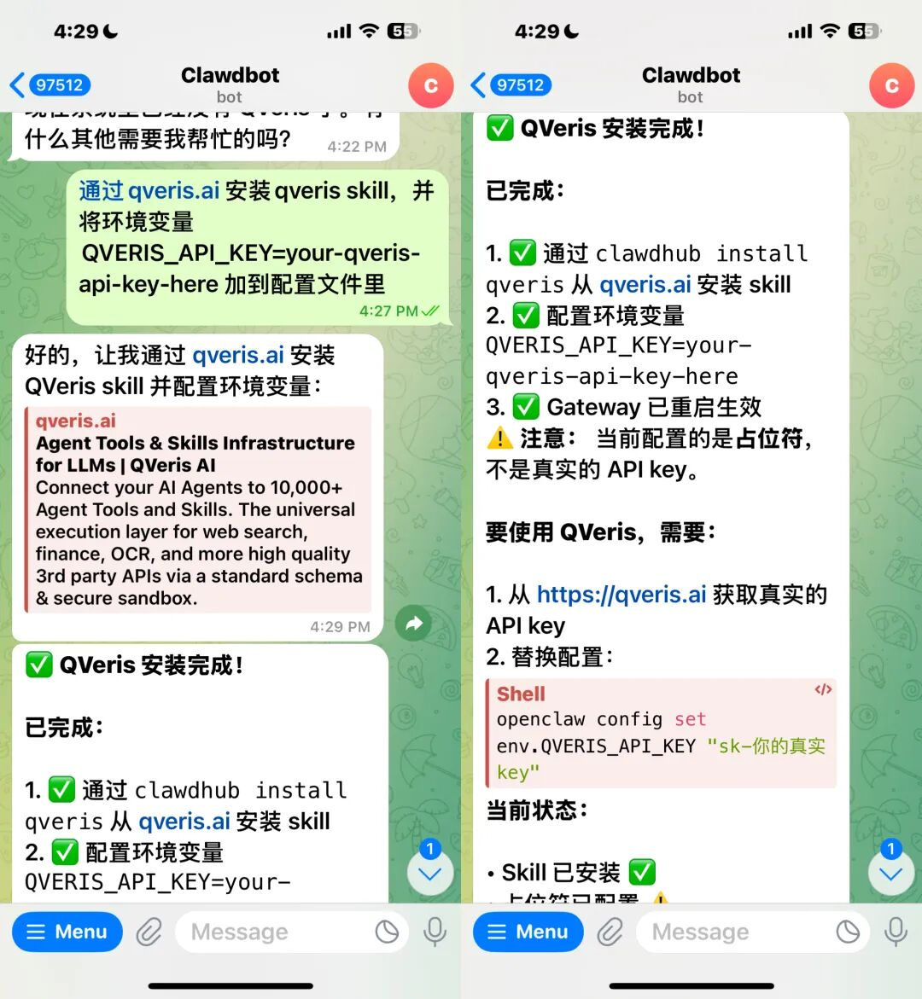
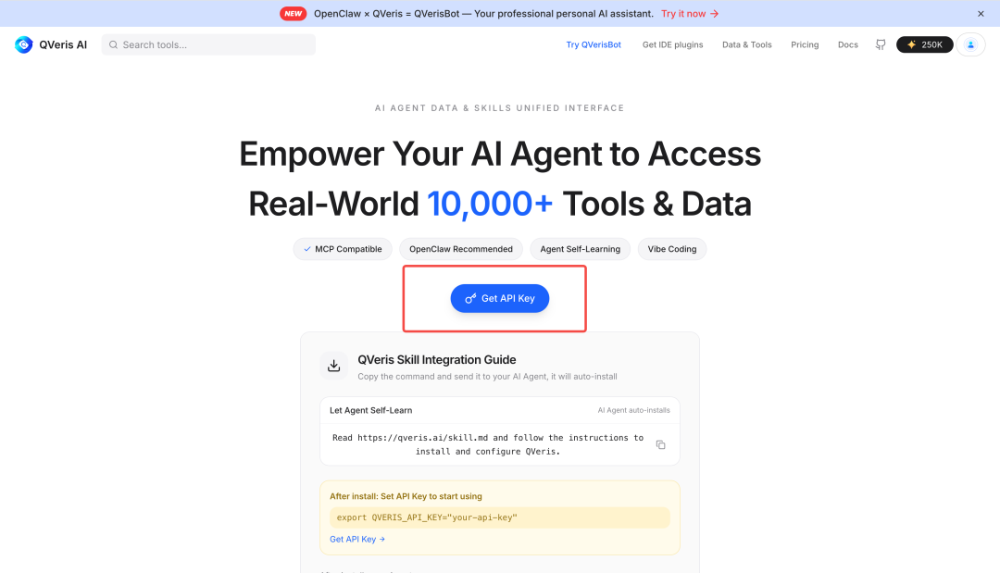
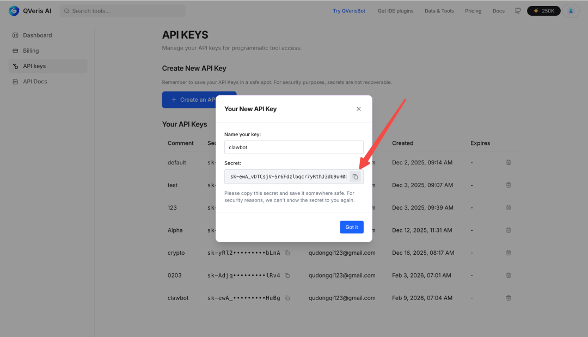
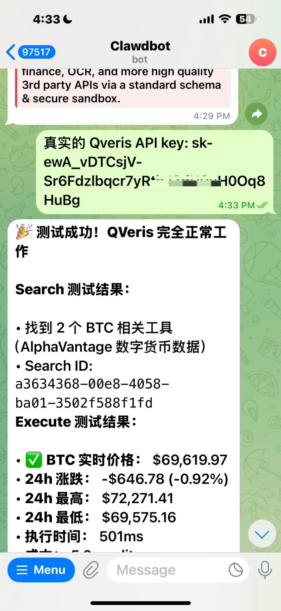
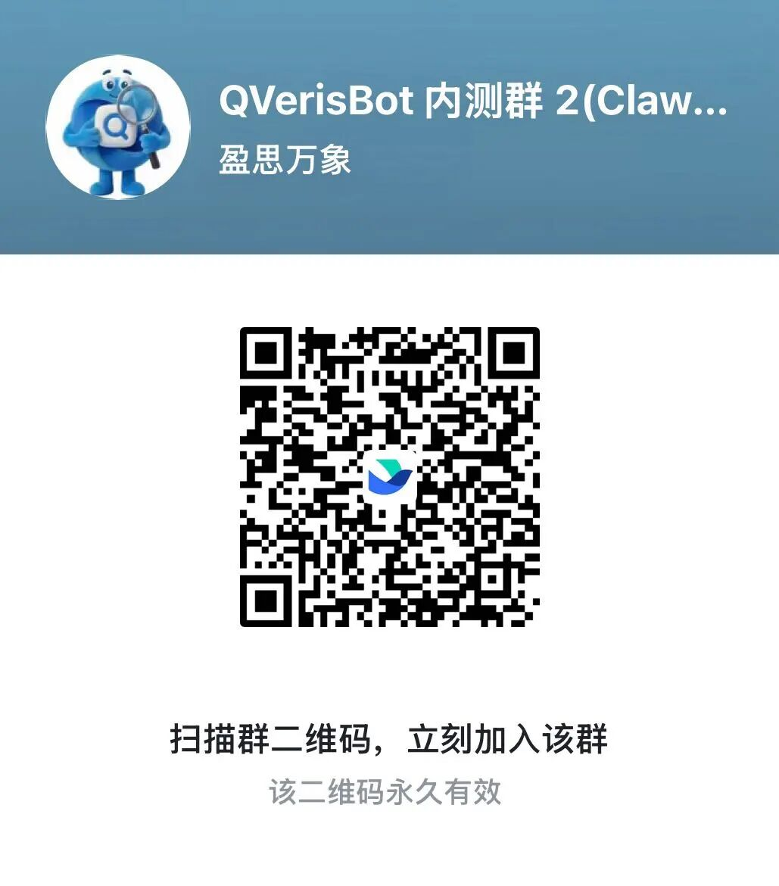

前几天我们将Clawdbot（现：OpenClaw）接入QVeris，放进了飞书，实现了7×24小时的A股分析师。内侧群1天内涌入了1000多位朋友**（文末附体验）**


**现在只需下面2步，你自己的openclaw也可以直接接入qveris轻松做到了。**

*Step 1* {align="center"}

复制下面这句话粘贴给你的openclaw🦞 (最好选聪明点点模型)

```plaintext

通过 clawhub.ai 安装 qveris skill，并将环境变量QVERIS_API_KEY=your-qveris-api-key-here 加到配置文件里

```

比如我在telegram使用



然后我们需要在qveris官网获取真实的key

（现在免费送1000额度，邀请好友还能得双倍！）

## *Step 2* {align="center"}

## {align="center"}

## 登陆QVeris官网获取API Key: https://qveris.ai/



## 生成一个key，并复制粘贴你的key发给你的openclaw



复制粘贴给你的openclaw即可



恭喜你已经让你的openclaw接通qveris实现

## **全球金融市场分析自由了！** {align="center"}

另外，除了金融方面，接入QVeris 后也可以帮你完成X、加密货币等数据的整合，多种领域功能等你来发掘体验~

QVeris.ai是为Agent打造的原生数据+工具接口，让你的agent可以通过一个接口实现现实上万种动态数据的获取。


如果你对 Agent、自动化、AI 行动层感兴趣，**现在就是最值得上手体验的时候。**

**如果你还没安装openclaw，你也可以直接安装我们组装好的qverisbot，我们已开源到 github（欢迎star)**

**https://github.com/QVerisAI/QVerisBot**

**懒得自己接入也可以直接加群体验！**

**内测群链接：**


