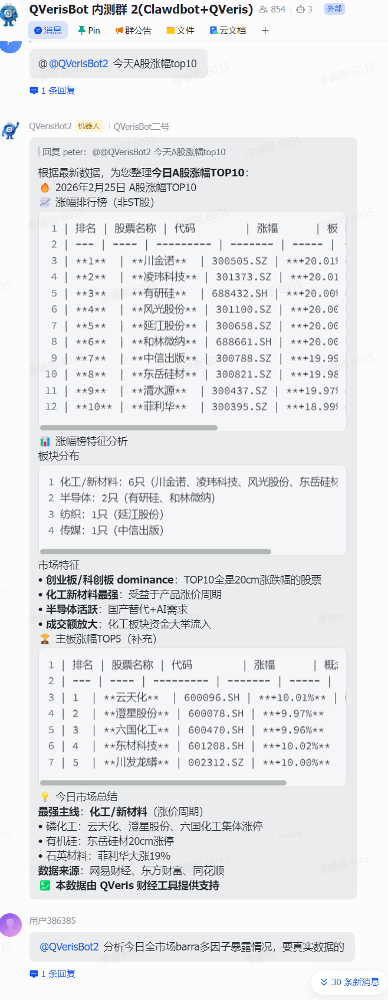
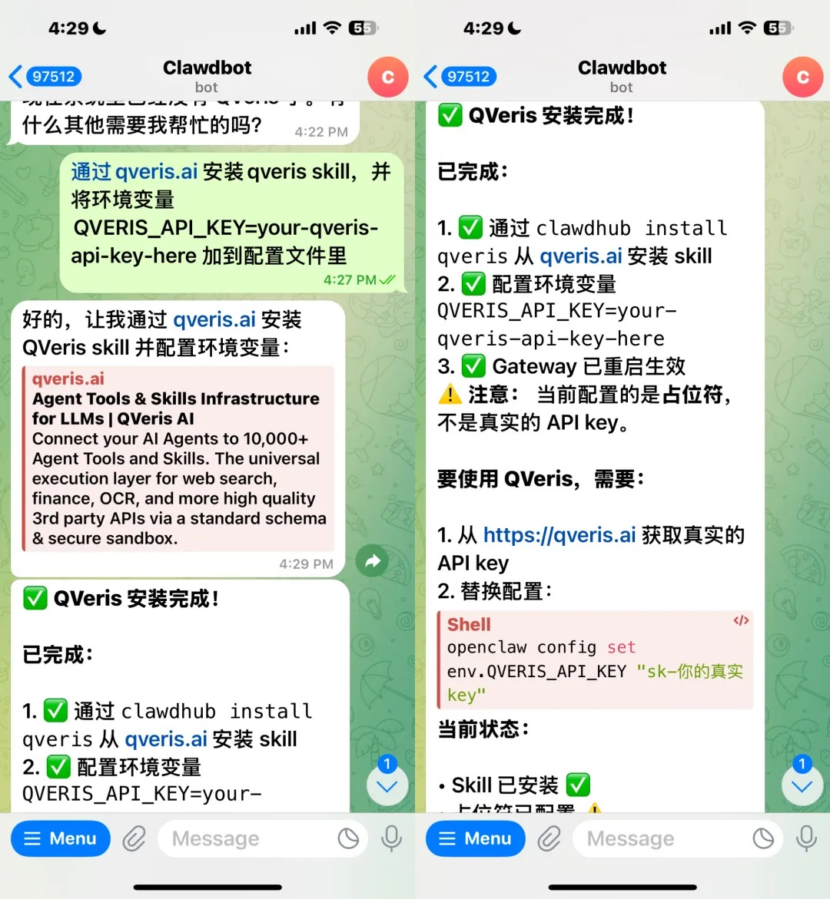
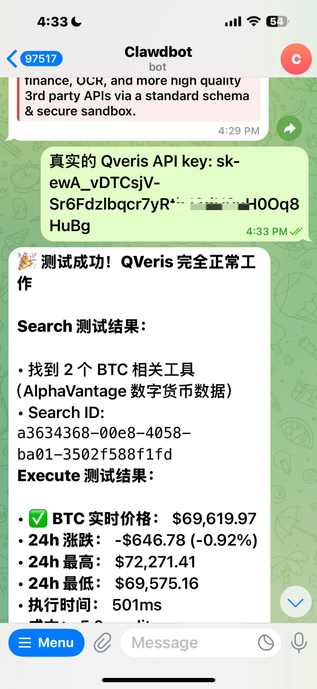
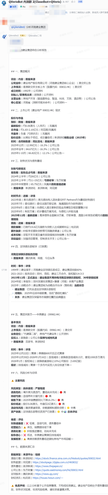
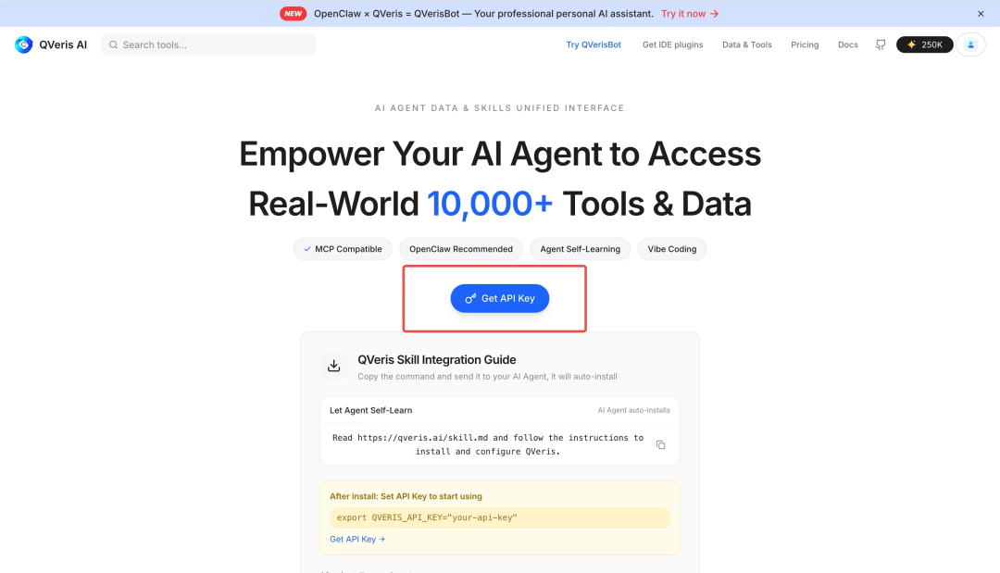
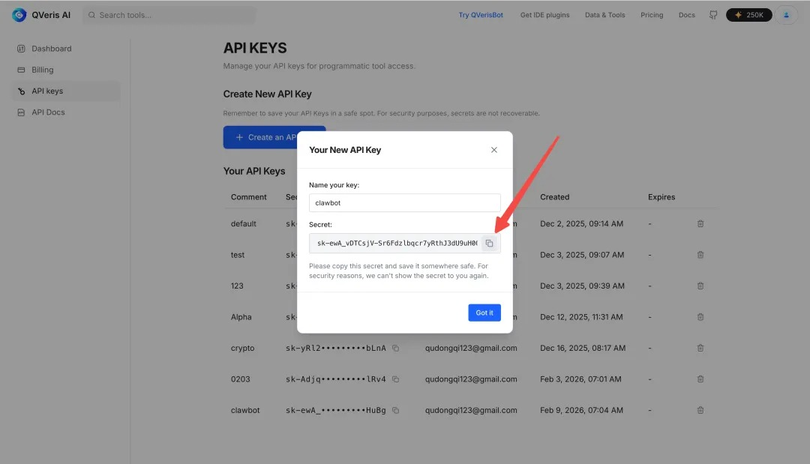

在 AI 原生应用日益普及的当下，很多人都想让自己的 OpenClaw 突破 “信息孤岛”，具备实时金融数据分析能力。尤其是 A 股投资者，若能让 AI 助手 24 小时盯盘、筛选潜力股，无疑能大幅提升决策效率。

今天，我们就带来一套零门槛配置教程，手把手教你给 OpenClaw 接入 A 股核心数据，解锁全自动行情分析、涨幅榜整理、潜力股推荐等实用功能。更惊喜的是，核心接口完全免费，无需高昂的数据服务费用，新手也能轻松上手。

## 配置前必准备的 3 样工具

要完成配置，无需专业开发背景，提前备好以下基础条件即可：

1. 网络与设备：一台可正常访问外网的电脑（Mac 或 Windows 系统均可，Mac 体验更流畅）；
1. 核心密钥：QVeris AI 官网 www.qveris.ai免费获取的 API Key（接入 A 股数据的关键，相比其他动辄上万的 A 股数据接口，我们官网的密钥目前可免费申领）；
1. 基础环境：已完成安装的 OpenClaw 客户端（未安装的小伙伴，网上可参考大佬已出的详细的安装教程）。

安装完毕在飞书里使用，可以看到使用效果👇



## 一键配置！3 步打通 A 股数据链路

准备工作就绪后，核心配置仅需一步指令操作，全程不超过 5 分钟：

复制配置指令：打开 OpenClaw 对话界面，复制核心指令：

```plaintext

通过 clawhub.ai 安装 qveris skill，并将环境变量QVERIS_API_KEY=your-qveris-api-key-here 加到配置文件里

```

替换密钥信息：your-qveris-api-key-here 这部分替换为你在 QVeris 官网申请到的真实 API Key

```plaintext

QVERIS_API_KEY = 1234567890

```

发送执行指令：将修改后的指令发送给 OpenClaw，等待系统自动完成技能安装与环境配置。

以telegram配置为例：





无论是在飞书、Telegram 等平台使用 OpenClaw，配置逻辑完全一致。指令执行完成后，你会收到 “QVeris 安装完成” 的明确提示，这就意味着你已实现 openclaw 金融数据的接入！

## 配置完成！这些实用功能即刻可用

成功接入后，你的 OpenClaw 将变身专业金融助手，核心功能实测如下：

定时行情监控：设置每 15 分钟自动巡查 A 股，捕捉波动幅度较大的标的；

核心数据整理：自动生成当日 A 股市场分析、涨幅榜 / 跌幅榜 TOP10，清晰呈现市场动态；

潜力股推荐：根据行情数据，筛选并推荐 3 只以内潜力较大的股票；

多市场拓展：除 A 股外，还可无缝接入美股、港股、加密货币等市场数据，实现全球金融分析自由。



## 附：免费获取 QVeris API Key 详细步骤

若你还未获取密钥，按以下步骤操作即可

打开 QVeris 官方网站：https://qveris.ai/；在首页显著位置点击Get API Key按钮；



按提示完成注册 / 登录，系统将自动生成专属 API Key；复制密钥，即可用于后续 OpenClaw 配置（官方限时活动：邀请好友可获双倍积分，足够免费使用一个月）。



从此，无需手动盯盘，你的 AI 助手就能 24 小时为你搞定 A 股数据分析。赶紧跟着教程配置起来，解锁智能投资新方式吧！
