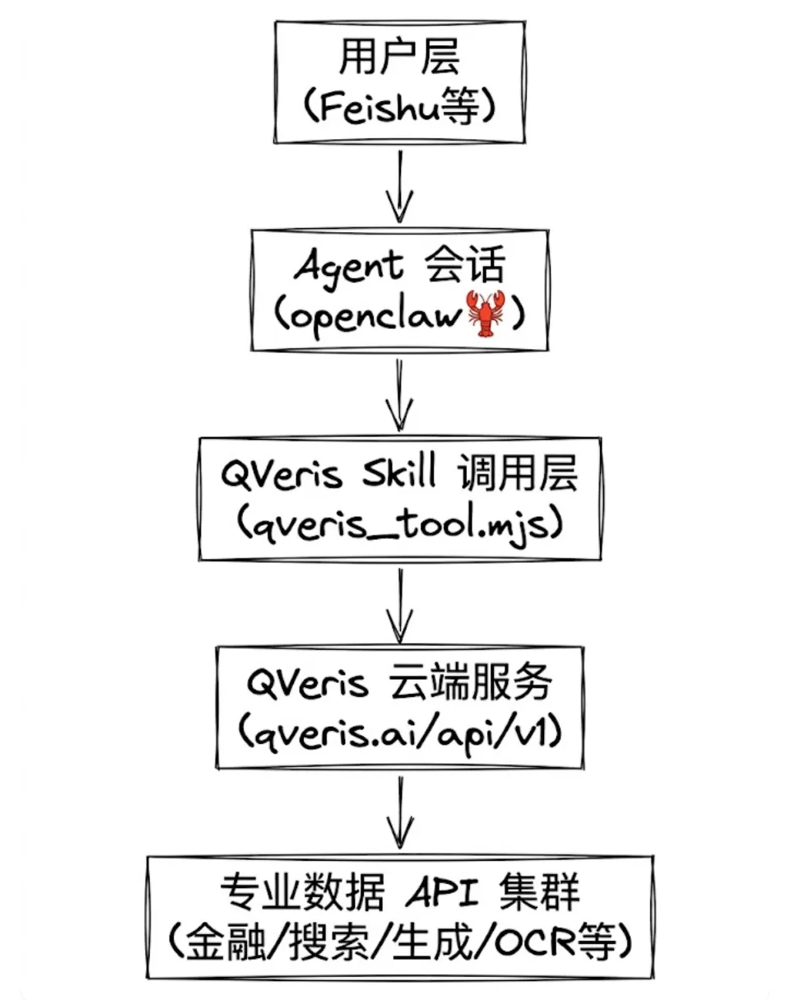

一、架构概览



二、核心配置文件详解

```plaintext

{  "tools": {    "web": {      "search": {        "enabled": true,        "provider": "qveris"      },      "fetch": {        "enabled": true      }    },    "qveris": {      "enabled": true,      "region": "global"    }  },  "plugins": {    "load": {      "paths": [        "/app/extensions/feishu",        "/root/.openclaw/skills"      ]    },    "entries": {      "feishu": {        "enabled": true      }    }  }}

```

关键配置项说明：

- tools.qveris.enabled: 启用 QVeris 工具，推荐值 true
- tools.qveris.region: QVeris 服务区域，推荐值 global
- tools.web.search.provider: 网页搜索提供商，推荐值 qveris
- plugins.load.paths: Skill 加载路径，必须包含 /root/.openclaw/skills

三、QVeris Skill 部署

3.1 安装位置

```plaintext

~/.openclaw/skills/├── qveris-official/           # QVeris 官方 Skill│   └── qveris-official/│       ├── SKILL.md           # Skill 文档│       ├── package.json│       └── scripts/│           ├── qveris_tool.mjs      # 主 CLI 工具│           ├── qveris_client.mjs    # HTTP 客户端│           └── qveris_env.mjs       # 环境变量读取└── ai-quant-analysis/         # 其他 Skill

```

3.2 安装命令

```plaintext

## 进入 skills 目录cd ~/.openclaw/skills/# 2. 克隆 QVeris Skillgit clone https://github.com/QVerisAI/open-qveris-skills.git qveris-official# 3. 验证安装ls -la ~/.openclaw/skills/qveris-official/qveris-official/scripts/

```

3.3 环境变量配置

必需环境变量：

```plaintext

## QVeris API Key（从 https://qveris.ai 获取）export QVERIS_API_KEY="sk-xxxxxxxxxxxxxxxxxxxxxxxxxxxxxxxx"# 添加到 ~/.bashrc 或 ~/.zshrc 使其持久化echo 'export QVERIS_API_KEY="sk-xxxxxxxxxxxxxxxxxxxxxxxxxxxxxxxx"' >> ~/.bashrcsource ~/.bashrc

```

安全最佳实践：

```plaintext

## 使用 Docker 环境变量（推荐）# 在 docker-compose.yml 或 Dockerfile 中设置environment:  - QVERIS_API_KEY=${QVERIS_API_KEY}# 验证环境变量echo $QVERIS_API_KEY | head -c 20 && echo "..."

```

四、QVeris 工具使用详解

4.1 核心命令

```plaintext

## 发现工具node ~/.openclaw/skills/qveris-official/qveris-official/scripts/qveris_tool.mjs \  discover "<capability_description>"# 2. 调用工具node ~/.openclaw/skills/qveris-official/qveris-official/scripts/qveris_tool.mjs \  call <tool_id> \  --discovery-id <discovery_id> \  --params '<json_params>'# 3. 检查工具详情node ~/.openclaw/skills/qveris-official/qveris-official/scripts/qveris_tool.mjs \  inspect <tool_id>

```

4.2 已验证工具清单

01、金融数据类工具

A股实时行情

- 功能：获取实时行情数据
- 用途：获取A股实时价格、成交量、涨跌幅、PE/PB、委比等
- 参数：codes（股票代码，如"000001.SZ,600000.SH"）
- 延迟：约3秒

A股历史行情

- 功能：历史+实时行情数据
- 用途：获取日线、周线、月线等历史K线数据
- 参数：codes, startdate, enddate, interval

资金流向

- 功能：个股/板块/市场资金流向
- 用途：追踪主力资金、超大单、大单、中单、小单流向
- 参数：scope, codes, startdate, enddate

融资融券

- 功能：融资融券数据
- 用途：获取融资余额、融券余额、杠杆资金分析

沪深港通

- 功能：沪深港通交易统计
- 用途：北向资金、南向资金流向追踪

02、搜索资讯类工具

国内智能搜索

- 功能：国内新闻资讯搜索
- 用途：搜索中文新闻、公告、研报
- 参数：q, count, freshness, enableContent

海外智能搜索

- 功能：海外资讯搜索
- 用途：搜索英文新闻、国际资讯

03、美股/全球市场工具

美股实时行情

- 功能：美股实时报价
- 用途：获取美股实时价格、涨跌幅

美股历史数据

- 功能：延迟股价数据
- 用途：获取美股历史价格

美股实时数据

- 功能：实时股价数据
- 用途：获取实时价格（含加密货币）

美股技术指标

- 功能：15分钟K线数据
- 用途：美股日内技术分析

市场情绪

- 功能：市场交易状态
- 用途：查询交易所开盘/收盘状态

04、其他专业工具

4.1 龙虎榜数据

- 功能：A股龙虎榜
- 用途：追踪机构席位、游资动向

4.2 技术指标计算

- 功能：Chaikin A/D Oscillator
- 用途：量价趋势分析

持续更新中。。。

五、Agent 行为规范配置

5.1 行为规范文件 ~/workspace/行为规范.md

```plaintext

## QVerisClaw 行为规范## 一、数据获取优先级（重要！）### 1.1 首选工具：QVeris数据获取优先级：1. QVeris 工具（首选）✅   - 实时行情：ths_ifind.real_time_quotation.v1   - 融资融券：ths_ifind.margin_trading.v1   - 资金流向：ths_ifind.money_flow.v1   - Web搜索：xiaosu.smartsearch.search.retrieve.v22. Web Fetch（次选）   - 当QVeris无对应工具时使用3. 原生 Web Search（最后）   - 当以上都不可用时使用### 1.2 执行流程每次需要数据时：Step 1: 使用 QVeris discover 查找工具   ↓Step 2: 如找到，使用 QVeris call 调用   ↓Step 3: 如未找到或调用失败，使用 Web Fetch   ↓Step 4: 如仍失败，使用原生 Web Search   ↓Step 5: 记录数据来源，标注可靠性## 二、数据来源标注规范✅ 【QVeris实时数据】- 最可靠，优先使用⏰ 【数据时间】- 注明数据时间戳⚠️ 【Web数据】- 可能有延迟📰 【搜索数据】- 仅供参考5.2 Agent 启动流程 ~/workspace/AGENTS.md## Session StartupBefore doing anything else:1. Read SOUL.md — this is who you are2. Read USER.md — this is who you're helping3. Read memory/YYYY-MM-DD.md (today + yesterday) for recent context4. If in MAIN SESSION: Also read MEMORY.md5. Read 行为规范.md — 加载核心行为规范（数据获取优先级等）6. 运行启动检查脚本 — bash /root/.openclaw/workspace/startup_check.sh7. 验证 QVeris 工具可用 — 确保数据获取能力正常

```

六、实战示例

6.1 A股实时行情查询

```plaintext

## Step 1: 发现工具discovery_result=$(node ~/.openclaw/skills/qveris-official/qveris-official/scripts/qveris_tool.mjs \  discover "China A-share real-time stock market data API" \  --json)discovery_id=$(echo $discovery_result | jq -r '.search_id')tool_id="ths_ifind.real_time_quotation.v1"# Step 2: 调用工具node ~/.openclaw/skills/qveris-official/qveris-official/scripts/qveris_tool.mjs \  call $tool_id \  --discovery-id $discovery_id \  --params '{"symbols": ["000001.SZ", "600000.SH"]}'

```

6.2 国内新闻搜索

```plaintext

## Step 1: 发现搜索工具discovery_result=$(node ~/.openclaw/skills/qveris-official/qveris-official/scripts/qveris_tool.mjs \  discover "web search API" \  --json)discovery_id=$(echo $discovery_result | jq -r '.search_id')# Step 2: 调用国内搜索node ~/.openclaw/skills/qveris-official/qveris-official/scripts/qveris_tool.mjs \  call xiaosu.smartsearch.search.retrieve.v2.6c50f296_domestic \  --discovery-id $discovery_id \  --params '{"q":"人工智能行业最新动态","count":10,"freshness":"week","enableContent":true}'

```

6.3 Agent 内部调用（JavaScript/TypeScript）

```plaintext

// 在 Agent 代码中调用 QVerisconst { execSync } = require('child_process');function qverisDiscover(query) {  const result = execSync(    `node ~/.openclaw/skills/qveris-official/qveris-official/scripts/qveris_tool.mjs discover "${query}" --json`,    { encoding: 'utf-8' }  );  return JSON.parse(result);}function qverisCall(toolId, discoveryId, params) {  const result = execSync(    `node ~/.openclaw/skills/qveris-official/qveris-official/scripts/qveris_tool.mjs call ${toolId} --discovery-id ${discoveryId} --params '${JSON.stringify(params)}' --json`,    { encoding: 'utf-8' }  );  return JSON.parse(result);}// 使用示例const discovery = qverisDiscover("stock price API");const toolId = discovery.results[0].tool_id;const result = qverisCall(toolId, discovery.search_id, { symbol: "AAPL" });

```

七、故障排查

7.1 常见问题

```plaintext

QVERIS_API_KEY not set原因：环境变量未配置解决方案：export QVERIS_API_KEY="..."

HTTP 401 Unauthorized原因：API Key 无效解决方案：检查 Key 是否正确，从官网重新获取

No tools found原因：查询描述不准确解决方案：使用英文能力描述，如 "stock price API"

tool execution failed原因：参数错误解决方案：检查参数类型和格式，参考示例参数

Request timed out原因：网络或工具响应慢解决方案：增加 --timeout 参数

```

7.2 诊断命令

```plaintext

## 检查环境变量echo $QVERIS_API_KEY | head -c 20 && echo "..."# 2. 检查 Skill 安装ls -la ~/.openclaw/skills/qveris-official/# 3. 测试工具发现node ~/.openclaw/skills/qveris-official/qveris-official/scripts/qveris_tool.mjs \  discover "weather forecast API"# 4. 检查 OpenClaw 配置openclaw status# 5. 查看网关日志openclaw logs --follow

```

八、高级配置

8.1 自定义工具缓存

为避免重复发现，可在 Agent 中缓存常用工具：

```plaintext

// tools-cache.json{  "stock_realtime": {    "tool_id": "ths_ifind.real_time_quotation.v1",    "last_verified": "2026-03-18T00:00:00Z"  },  "search_domestic": {    "tool_id": "xiaosu.smartsearch.search.retrieve.v2.6c50f296_domestic",    "last_verified": "2026-03-18T00:00:00Z"  }}

```

8.2 多区域配置

```plaintext

{  "tools": {    "qveris": {      "enabled": true,      "region": "global",      "fallback_regions": ["ap-southeast-1", "us-west-2"]    }  }}

```

九、安全与合规

9.1 API Key 保护

```plaintext

## 配置文件中使用环境变量引用{  "qveris": {    "apiKey": "${QVERIS_API_KEY}"  }}# 2. 日志中自动掩码# 所有包含 API Key 的日志输出自动隐藏# 显示格式: sk-xxxxxxxx...# 3. 禁止在代码中硬编码# 错误: const apiKey = "sk-xxx..."# 正确: const apiKey = process.env.QVERIS_API_KEY

```

9.2 数据隐私

- QVeris 仅接收能力描述和工具参数
- 不传输用户敏感信息
- 所有请求通过 HTTPS 加密

十、总结

OpenClaw + QVeris 的配置核心要点：

- 安装位置: ~/.openclaw/skills/qveris-official/
- 环境变量: QVERIS_API_KEY 必须配置
- 配置文件: openclaw.json 中启用 tools.qveris.enabled
- 使用流程: discover → call → 处理结果
- 行为规范: 优先使用 QVeris，标注数据来源

通过以上配置，Agent 即可获得 QVeris 全能力支持，包括实时金融数据、智能搜索、内容生成等数千种专业 API 工具。
