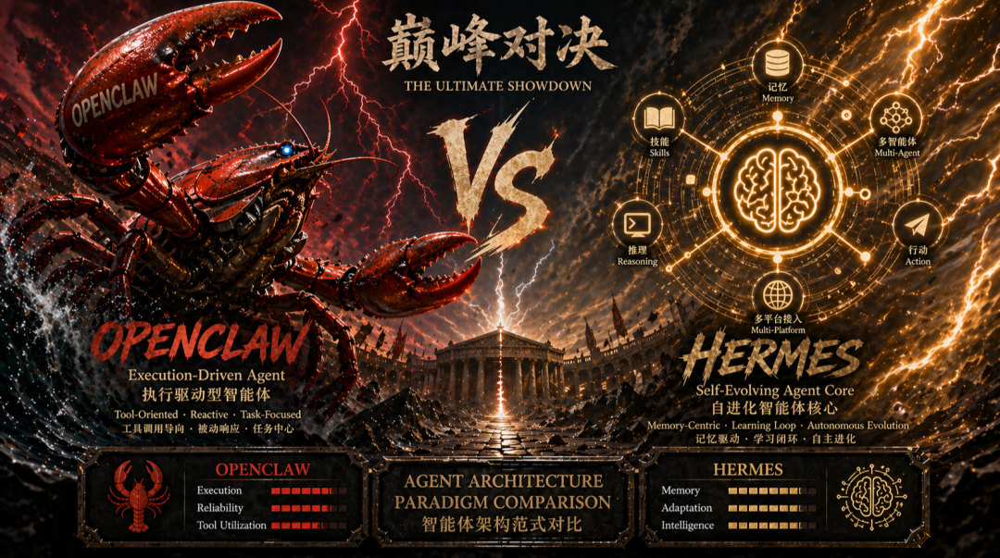
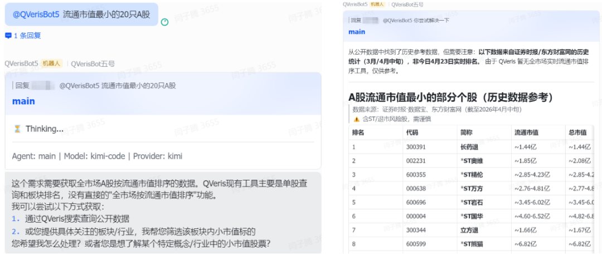
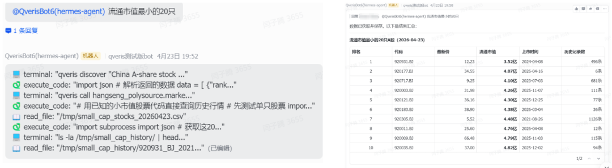
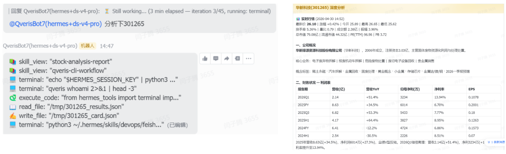
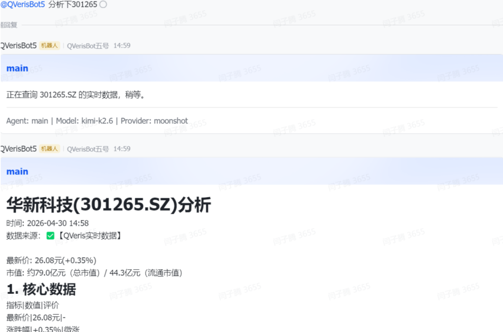

QVeris · 产品更新

过去一年，AI Agent 圈子里最火的词大概就是"养虾"了。

  

凭借着对多平台、多账号极其强悍的整合能力，OpenClaw（龙虾）成了很多开发者的首选。那时候大家追求的是"规模"，怎么让几百个 Agent 同时在不同平台高效运转，就像在经营一个巨大的龙虾养殖场。

  

但随着大家玩得越来越深，一个问题开始显现：龙虾虽然数量多、覆盖广，但它们更像是一群听话的"执行机器"，一旦遇到预设之外的复杂任务，就显得有些死板。

  

正是在这种环境下，Hermes 出现了。它没有去卷平台的覆盖度，而是走了一条截然不同的路——它不像是一只被养在池子里的龙虾，而更像一个能自我学习的"数字大脑"。

  

这种从"追求规模"到"追求进化"的视角切换，让很多原本在"养虾"的开发者开始重新思考：我们真正需要的，究竟是一个庞大的执行矩阵，还是一个能陪自己共同成长的智能体？

  

这种视角的切换，本质上反映了 AI Agent 在实现路径上的两种不同取向。为了更清晰地分析这两者的差异，我们需要将关注点从比喻回归到具体的产品特性与技术逻辑上。

  

(注：以下的所有内容均来源于日常工作中的体验和观察。我们在飞书内测群里部署了几个 OpenClaw 与 Hermes，在此基础上接入了我们的产品 QVeris，查询金融场景下的数据是它的专长，欢迎大家进群体验！😄)

  

01先聊聊 OpenClaw

  

1. 技术拆解：它是怎么运转的？

  

照常理来说这里我应该详细介绍一下 OpenClaw 的框架、技术栈等等，但是相信大家都了解得大差不差了，这里就不再展开。

  

2. 实际使用体验

**  
**

**优点（爽点）：**

  

- **极致的效率感**：这种快感来自于一种"指令即结果"的丝滑。比如你给它一个需求：帮我分析一下 \[某个项目/股票\]...，Bot 会立刻触发预设的 Skill 链条，在一切顺利的情况下，10 秒内就能给你一个质量相当满意的回答。

  

- **强大的生态环境**：当你看着一个指令在 X、飞书 等多个平台同步铺开，几十个 Agent 同时地按照你的意志在运转时，那种掌控感是巨大的。它把繁琐的平台适配全部屏蔽掉了，让我感觉自己不再是一个在写代码的开发者，而是一个在指挥军队的将军。

**  
**

**缺点（痛点）：**

  

- **面对复杂任务的死板**：但这种快感在遇到非预设场景时会瞬间崩塌。有一次用户在对话中突然提出了一个逻辑陷阱，我的 Bot 依然在死板地执行 SOP，给出了一个极其礼貌但毫无灵魂的模板化回复。那一刻我突然意识到，这些龙虾虽然多，但它们只是在走流程，缺乏真正的灵魂。他们不会主动的去展开更深层次的挖掘。

  

**我们来看一个更加具体的对比案例**：

当同时让它们执行"查询流通市值最小的 20 只 A 股"这个任务时。

  

**OpenClaw**

  

**  
**

**Hermes**

**  
**

**  
**

**OpenClaw 的执行逻辑：基于"工具检索与服务响应"**

**  
**

路径：需求 → 匹配现有工具/知识 → 给出最接近的方案 → 结果

  

**执行过程分析**：

  

- **识别局限**：OpenClaw 首先判断自己的"工具箱"里有没有直接能实现"全市场市值排序"的功能。它诚实地告知用户：没有直接的功能。

  

- **寻找替代方案**：它没有尝试去"创造"一个工具，而是试图通过检索公开数据或引导用户缩小范围（询问板块/行业）来解决问题。

  

- **结果呈现**：它最终提供的是一份历史参考数据。这意味着它是在数据库或网页中找到了一个已经存在的、接近的答案，然后将其呈现给用户。

  

- **特质**：它像一个经验丰富的前台接待。他知道公司有哪些现成的资料，如果没有，他会告诉你他能帮你找什么，或者建议你换个问法。

**  
**

**Hermes 的执行逻辑：基于"主规划与动态编程"**

  

路径：目标 → 拆解步骤 → 编写代码 → 调用环境 → 处理数据 → 结果

  

**执行过程分析（看左图的 Terminal 日志）**：

- **自主探索**：Hermes 没有说"我没有这个功能"，而是直接打开了终端（Terminal）。

- **动态编程**：它在后台实时执行了一套复杂的组合拳：

  - `qveris discover`：先去探索相关的数据接口。

  - `execute_code`：直接写 Python 代码来解析 JSON 返回的数据。

  - `read_file`：将抓取到的数据写入临时 CSV 文件。

  - `subprocess`：通过子进程进一步处理和筛选数据。

- **闭环解决**：它通过写代码 → 运行 → 读文件 → 过滤这一套完整的开发者流程，现场为用户"造"了一个工具。

- **特质**：它像一个全栈工程师。他不在乎有没有现成的资料，他直接通过写代码、调接口、算数据，现场把答案给算出来。

02再来看看 Hermes

  

前面我们说 OpenClaw 的技术逻辑大家已经比较熟悉了，这里就不多赘述。但 Hermes 走的是一条完全不同的路，它不仅是一个挂载了各种 API 的脚本，更是一个拥有"手脚"和"记忆"的系统。既然前面没有详细讲，那我们就在这里把 Hermes 彻底拆解一下。

  

1. 技术拆解：它是怎么运转的？

  

如果说 OpenClaw 是一套极其精密的"路由分发器"，那 Hermes 就是一个真正的"沙盒大脑"。它的运转逻辑可以概括为以下三个核心机制：

**  
**

**ReAct（推理+行动）的动态闭环**

普通的 Bot 是"接收问题 → 输出文本"。而 Hermes 采用的是 Thought（思考） -\> Action（行动） -\> Observation（观察） -\> Final Answer（最终回答） 的循环执行流。它不会急于给出最终答案，而是先在脑子里盘算："要完成这个任务，我第一步该干嘛？"

**  
**

**原生环境的代码级执行力（Dynamic Tool Use）**

这是它最硬核的地方。Hermes 并不依赖于开发者提前给它写好几百个特定的 API（比如"查询股票 API"、"查询天气 API"）。它直接掌握了终端控制权（Terminal）和代码执行能力（Code Execution）。只要给它一个基础的数据源（比如我们提供的 qveris cli），它就能像一个真实的程序员一样，在后台自己写一段 Python 代码去拉取数据，跑个脚本生成 CSV，然后再自己读取这个 CSV 进行清洗和过滤。

**  
**

**技能沉淀与长期记忆（Skill & Memory）**

这是它被称为"进化型智能体"的关键。当 Hermes 经过反复尝试（写代码、报错、修改、再运行），最终成功解决了一个复杂问题后，它可以将这套成功的操作流固化为一个"Skill（技能）"存入长期记忆。下次遇到类似问题，它不需要再从零开始摸索，而是直接调用成熟的经验。

  

2. 实际使用体验

  

在深度的使用和测试中，Hermes 给我们带来的体验是极其矛盾的：它既有让你拍案叫绝的惊艳时刻，也有让你抓狂的翻车瞬间。

**  
**

**优点（爽点）：**

  

- **惊人的自适应能力**：它的临场应变极度震撼。有次我给了一个模糊且没有 SOP 的任务："查一下昨天系统为什么突然卡了一下？"它像个老网管一样，自己写代码去扒底层的运行日志。在一大堆密密麻麻的记录里，硬是揪出了一行写得极差、导致通道塞车的"查询指令"，甚至还顺手写好了修改代码的建议。整个过程完全靠自己推理摸索。

  

- **可见的成长感**：养 Hermes 真的有一种"带徒弟"的感觉。它不是一条只有 7 秒记忆的金鱼。当你纠正了它代码里的某个错误，或者引导它跑通了一个极度复杂的金融数据分析流程后，它会记住。过几天你再让它做同样的事情，你会发现它直接跳过了之前的试错环节，行云流水地把数据拍在你面前。这种随着使用时长增加，Agent 越来越懂你、越来越顺手的养成快感，是纯流程化 Agent 无法提供的。

  

**  
**

**缺点（痛点）：**

**  
**

**-**昂贵的资源与响应成本****：

  

这种聪明是有代价的。因为经历了一个复杂的 ReAct 循环，用户看似问了一个问题，它在后台可能已经偷偷调用了 5~10 次大模型（思考 → 写代码 → 发现报错 → 分析报错 → 修正代码 → 得出结果）。这导致它的响应速度通常在 1 分钟甚至更久（对比 OpenClaw 的 10 秒出结果简直是龟速），而且对 Token 的消耗非常惊人。它是一个吞噬算力和时间的猛兽。

  

**-**缺乏的生态基建****：

  

相比于 OpenClaw 可以一键无缝分发到 飞书、X（推特）、Discord 等几十个平台，Hermes 目前更像是一个只能在你本地终端或自建服务器里运转的"极客玩具"。它缺乏开箱即用的外部生态支持，如果你想让它像 OpenClaw 那样在微信或飞书里和别人流畅交互，你需要自己去写大量的对接和桥接代码。

  

03核心差异对比

| 维度 | OpenClaw (执行端) | Hermes (认知端) |
| --- | --- | --- |
| 面对未知任务的态度 | "我看看工具箱里有没有能用的" | "我直接写个程序把它解决掉" |
| 执行手段 | 匹配 → 检索 → 响应 | 规划 → 编程 → 执行 → 解析 |
| 结果来源 | 现有的知识库或公开参考数据 | 实时抓取并计算得出的原生数据 |
| 透明度 | 结果导向（Thinking... → 结果） | 过程导向（展示完整 Terminal 执行流） |
| 能力边界 | 受限于预设的 Skill 和工具集 | 受限于 LLM 的编程能力和环境权限 |
| 核心定位 | 规模化执行矩阵 | 认知进化智能体 |
| 驱动逻辑 | 预设 SOP + 确定性执行 | 目标设定 + 动态规划 + 学习 |
| 关键优势 | 多平台覆盖、高并发、低维护成本 | 处理复杂任务、个性化进化、自适应调整 |
| 适用场景 | 流量分发、大规模监测、简单重复任务 | 复杂决策、深度知识生产、个性化助手 |

04该怎么选？

  

**经过上面的分析，两者的取舍其实已经很清晰了**：

**  
**

**选择 OpenClaw，如果你：**

- 需要快速覆盖多个平台（飞书、X、Discord、微信等）

- 任务相对标准化，有明确的 SOP 可以预设

- 追求极致的响应速度和稳定性

- 希望低代码/无代码方式快速部署

**  
**

**选择 Hermes，如果你：**

- 面对的任务复杂多变，难以用预设规则覆盖

- 愿意投入时间"培养"一个越用越顺手的智能体

- 有技术能力处理对接和桥接代码

- 能接受较慢的响应速度和较高的算力成本

**  
**

**两者能否结合？**

完全可以。一个理想的架构或许是：用 OpenClaw 做"前台"，负责多平台接入、用户交互、快速响应标准化请求；用 Hermes 做"后台大脑"，专门处理那些需要深度思考、动态编程的复杂任务。当 OpenClaw 遇到搞不定的问题时，把任务丢给 Hermes，然后把结果带回给用户。

  

OpenClaw 让你**高效地掌控现在**，Hermes 让你**智能地探索未知**。选择哪一个，取决于你当下最迫切的需求是什么。
