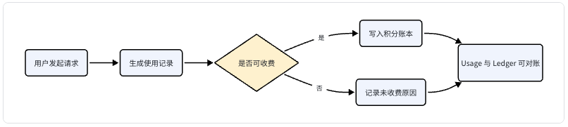
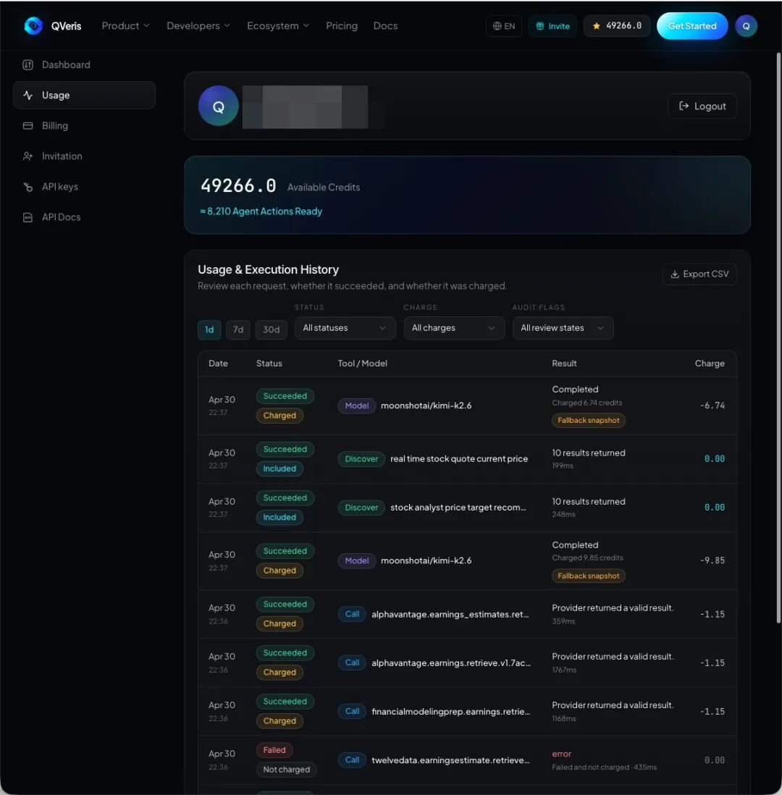
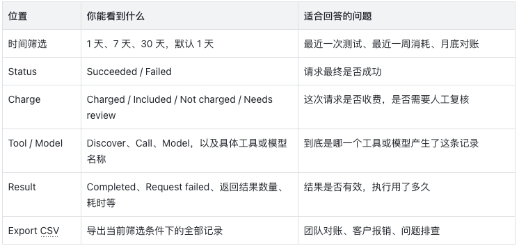
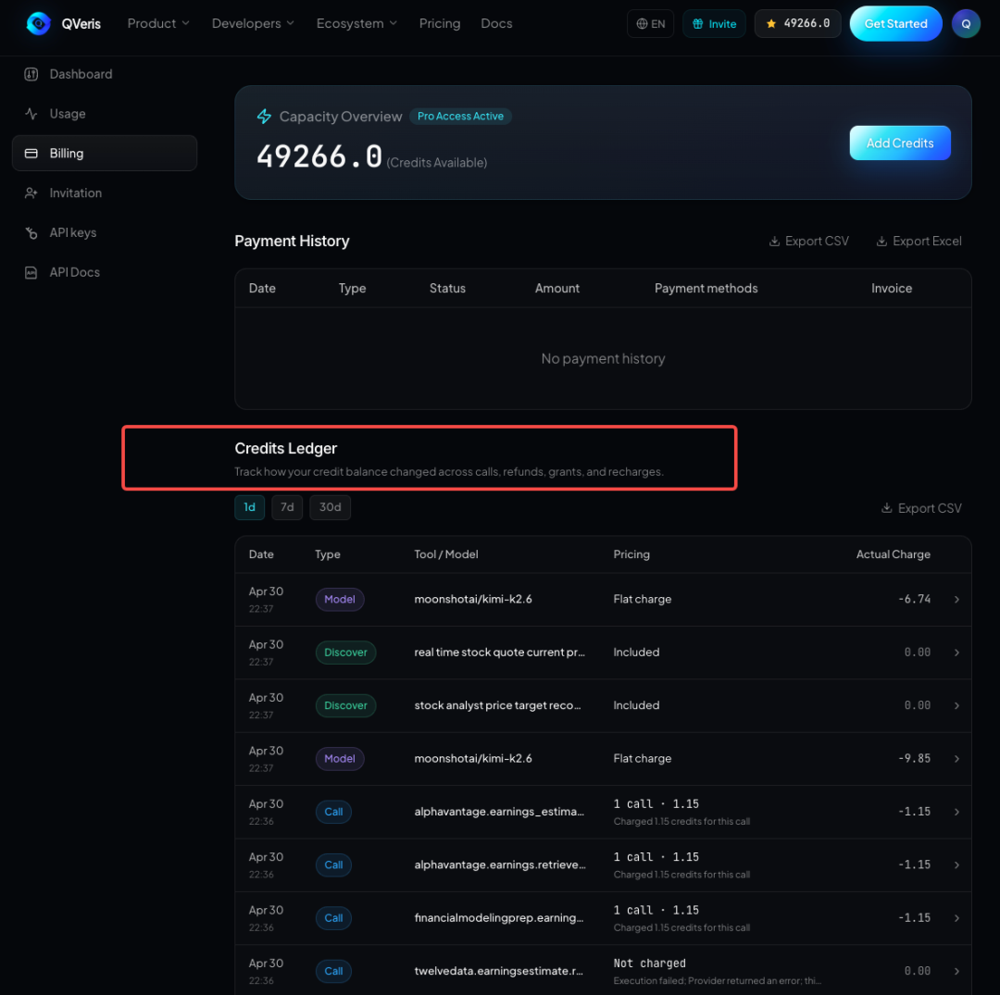
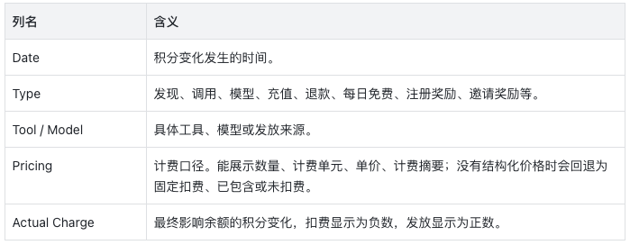
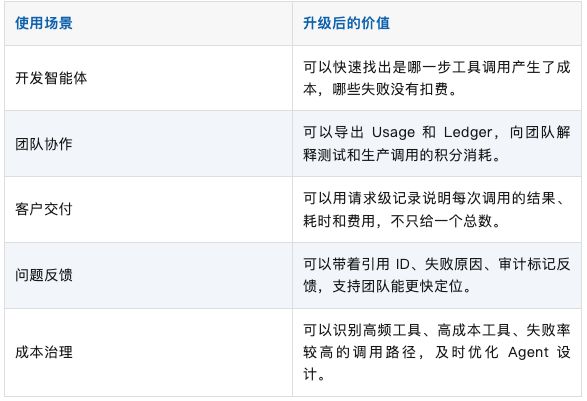
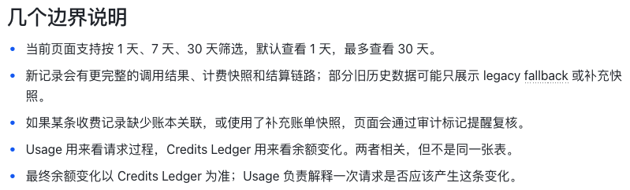

QVeris · 产品更新

每一次调用，为什么扣费都能看清楚

做智能体和 API 应用时，一个看起来简单的问题，背后可能会触发多次工具发现、工具执行和模型调用。过去用户最容易困惑的不是「余额少了多少」，而是： 

-    刚才那次调用失败了，到底有没有扣费？ 

-    如果扣费了，是哪一次调用扣的？ 

-    为什么同样是成功调用，有的收费，有的是 0？ 

-    导出的记录能不能和页面、积分流水对得上？ 

这次计费透明化升级，就是为了解决这些问题。它不是单纯多加几列账单，而是把**每一次请求变成可以查看、筛选、导出和审计的使用记录**。 

01这次升级解决了什么

过去：只能看余额变化

能看到积分减少了多少。 但很难知道是哪次调用导致的。 

现在：调用和账本可以对照

- **Usage** 负责回答「发生了什么」。 

- **Credits Ledger** 负责回答「余额为什么变了」。 

- 失败、空结果、服务商错误、超时、权限问题等，都可以明确显示为未收费或需复核。 

   你可以把它理解为：Usage 是调用明细，Credits Ledger 是积分流水。前者看过程，后者看钱。 

02Usage 页面怎么看

进入账号中心的 Usage 页面，你会看到「调用与使用记录」。它覆盖搜索发现、工具调用和模型调用，是排查一次请求的第一入口。 

**  
**

- **Succeeded + Charged**：请求成功，并且发生了实际扣费。

- **Succeeded + Included**：请求成功，但这次费用为 0，通常表示已包含、免费额度覆盖或本次规则不需要扣费。

- **Failed + Not charged**：请求失败，并且没有扣费。这是用户最容易关心的一类记录。

- **Needs review**：系统发现收费结果和调用结果之间存在需要复核的情况，例如失败但仍出现扣费、缺少账本关联或使用了补充快照。

03Credits Ledger 页面怎么看

   账号中心的 Billing 页面里有「积分账本」。它不追求记录所有请求，而是只关注**真实影响余额的事情**：工具调用扣费、模型调用扣费、充值发放、退款回退、每日免费额度、注册奖励和邀请奖励等。 

账本行也可以展开。展开后可以看到计费摘要、bucket 扣减明细、来源引用，以及多计费项时的数量、单价和小计。

这样你不仅能看到扣了多少，还能看到它是按什么数量和单价算出来的。

# 失败不收费更可信了

二阶段升级的核心，是引入标准化的执行结果判断。系统不再只看「HTTP 是否返回 200」或「success 字段是否为 true」，而是把一次调用拆成几个更接近真实业务结果的判断：

- 请求链路是否成功到达上游服务。

- 服务商是否成功处理。

- 返回结果是否有效。

- 这次结果是否符合收费条件。

最终是否允许扣费，核心依据是标准执行结果里的可收费判断。比如空结果、服务商错误、权限错误、超时、限流、无效结果等，都不应该因为触发了接口就自动进入最低扣费。

04实际怎么用

1.   登录 QVeris，进入账号中心。 

2.   如果你想查某次调用，先打开 Usage。 

3.   选择 1 天、7 天或 30 天时间范围；必要时再按成功状态、收费状态、审计标记筛选。 

4.   点击某一行展开，看摘要、错误、引用 ID 和耗时。 

5.   如果这条记录显示 Charged，再去 Billing 的 Credits Ledger 对照实际积分变化。 

推荐排查顺序：先看 Usage 判断请求是否成功和是否收费，再看 Credits Ledger 确认余额是否真的变化。 

05升级后的好处

# 常见问题

### 为什么 Usage 里有 0.00 的记录？

因为 Usage 记录的是调用事件，不只是扣费事件。成功但已包含、失败且未收费、搜索发现等都可能是 0.00。

### 为什么 Billing 里看不到一次失败调用？

如果失败调用没有扣费，就不会改变余额，因此不会作为扣费流水出现在积分账本里。你应该在 Usage 里查看这类记录。

### 为什么有的 Pricing 显示数量和单价，有的显示固定扣费？

新的结构化账单会尽量展示数量、计费单元、单价和小计。对于旧数据或缺少完整结构化快照的数据，页面会用固定扣费、已包含、未扣费等方式兜底展示。

### 看到 Needs review 应该怎么办？

这通常表示系统发现了需要复核的审计信号，例如失败但仍出现扣费、缺少账本关联或使用了补充快照。建议展开记录复制引用 ID，并联系支持团队。
