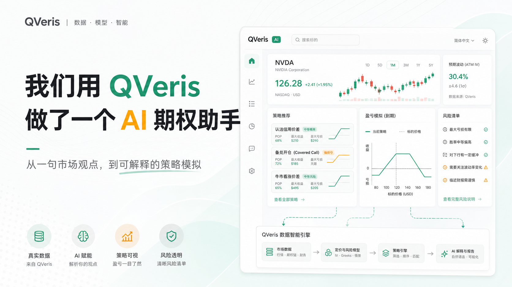
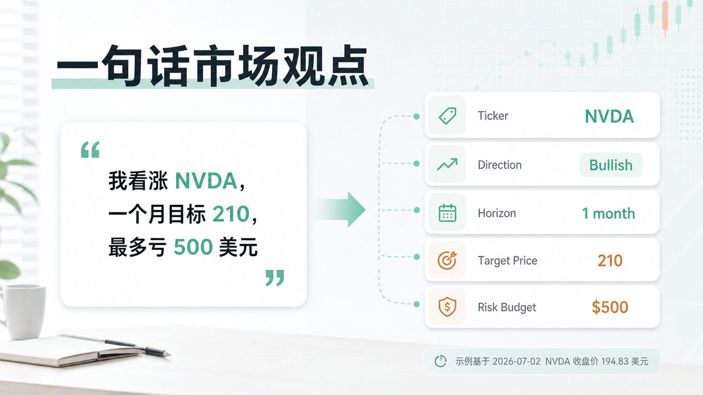
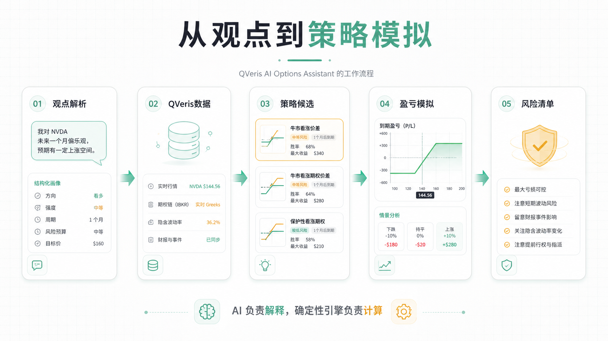
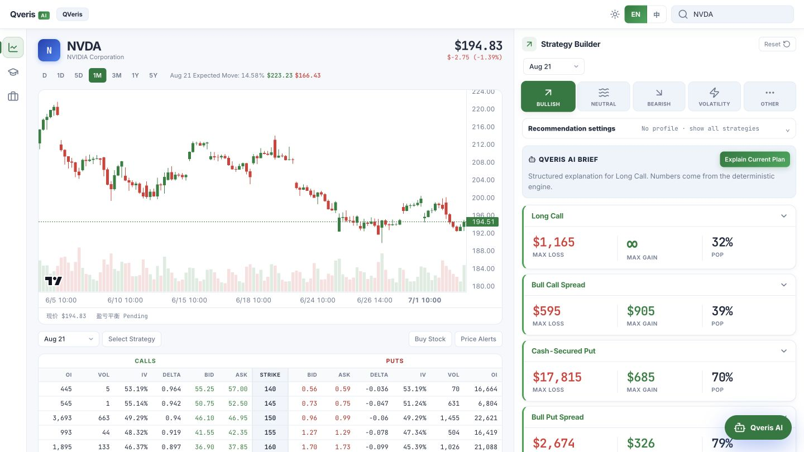
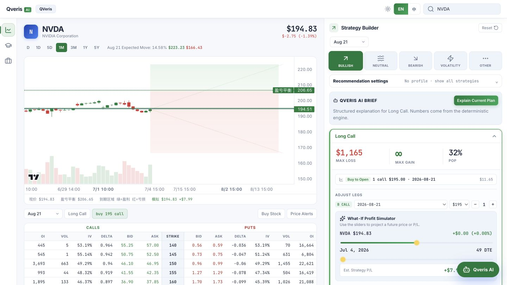
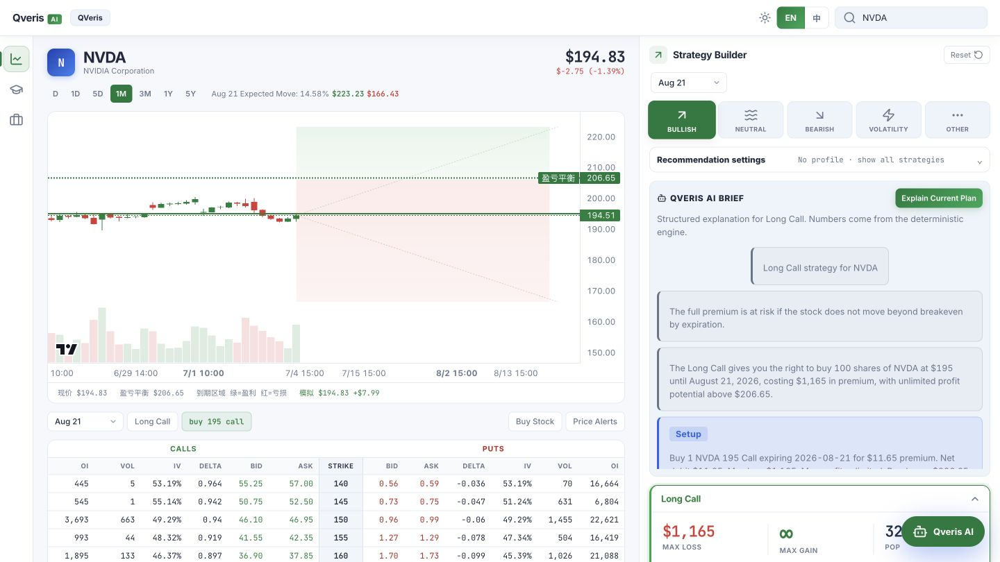
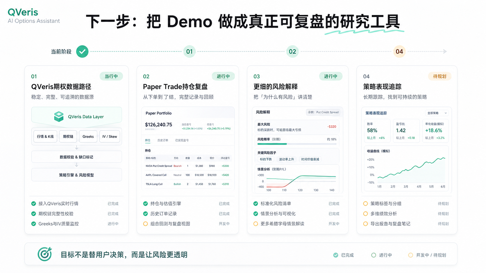

一次 AI 金融产品实验：把“我看涨 NVDA，但最多只想亏 500 美元”，拆成数据、策略、模拟和风险边界。

**项目复盘**  |  **图文版**  |  2026-07-03

我们用 QVeris 做了一个 AI 期权助手

过去一段时间，我们在做一个很具体的实验：

**AI 能不能不只解释期权概念，而是把一句真实的市场观点，翻译成一套可比较、可模拟、可复盘的期权策略？**

这件事听起来像一个聊天产品，但真正做起来，很快就会发现它不是“让模型多写几段解释”那么简单。

因为期权不是单纯判断涨跌。

它同时涉及价格、时间、波动率、执行价、到期日、权利金、最大亏损、盈亏平衡点和流动性。

一个用户可能只说一句话：

我看涨 NVDA，一个月目标 210，但最多只想亏 500 美元。

但系统背后必须回答：

- 当前价格是多少？
- 目标价离现价有多远？
- 这个时间窗口对应什么到期日？
- 买 Call、做 Call Spread，还是考虑其他结构？
- 最大亏损是否超过用户预算？
- 到期前涨到哪里才真正赚钱？
- 如果方向对了但涨幅不够，会发生什么？
- 哪些数据是真实拿到的，哪些不能让 AI 编？

这就是我们做 **QVeris AI Options Assistant** 的出发点。

它不是一个只会给结论的聊天框，而是一个把市场观点拆成策略结构、计算结果和风险边界的研究工作台。

# 01｜先从一个真实例子开始

一句市场观点

为了避免写成空泛 demo，我们先用真实行情做例子。

通过当前项目里的 QVeris market route，NVDA 在 **2026-07-02 20:29 UTC** 的行情快照如下：

| **字段** | **数值** |
|-|-|
| 最新价 | 194.83 美元 |
| 前收盘 | 197.58 美元 |
| 当日开盘 | 197.14 美元 |
| 当日最高 | 200.06 美元 |
| 当日最低 | 192.35 美元 |
| 当日涨跌 | -2.75 美元 |
| 当日涨跌幅 | -1.39% |
| 成交量 | 139,595,163 |
| 数据源 | QVeris |

在这个价格基础上，用户输入：

我看涨 NVDA，一个月目标 210，最多亏 500 美元。

系统首先要把自然语言拆成结构化字段：

| **字段** | **解析结果** |
|-|-|
| Ticker | NVDA |
| 当前价格 | 194.83 |
| 方向 | Bullish |
| 时间窗口 | 1 month |
| 目标价 | 210 |
| 风险预算 | 500 美元 |
| 经验等级 | beginner default |

这一步不是为了“显得智能”，而是为了让后面的计算有边界。

如果没有当前价格，目标价就没有参照。

如果没有时间窗口，就没法选择到期日。

如果没有风险预算，系统就不知道哪些策略应该被排除或警示。

金融产品里的 AI，第一步不是急着回答，而是先把问题问清楚。

# 02｜我们把流程拆成五步

从观点到策略模拟

这一版期权助手的核心流程很简单：

**第一步：解析观点。**

把自然语言转成 ticker、方向、强弱、目标价、时间窗口、风险预算、经验等级等字段。

**第二步：接入数据。**

市场行情和 K 线走 QVeris 数据能力。当前原型里的期权链仍使用本地开发路径做验证，后续目标是继续补齐 QVeris 期权数据路径。无论哪种来源，原则都一样：真实拿不到的数据不能让模型补。

**第三步：生成策略候选。**

系统不会只给一个“答案”，而是把不同风险结构放到一起比较。比如看涨 NVDA，可以看 Long Call、Bull Call Spread，也可以在特定条件下看 Covered Call 或 Cash-Secured Put。

**第四步：做盈亏模拟。**

每个策略都要能看到最大亏损、最大收益、盈亏平衡点、目标价收益、到期情景表，以及价格和时间变化下的模拟结果。

**第五步：生成风险解释。**

AI 负责把结果讲清楚，但它不能替代确定性计算。最大亏损、breakeven、payoff、scenario table 这些数字必须来自引擎或数据源。

这五步串起来，才是一个能工作的期权助手。

# 03｜我们做出的不是聊天框，而是工作台

期权助手工作台

目前这一版原型已经跑通了主工作台：

- 左侧展示 NVDA 行情、K 线和期权链。
- 中间承载策略构建和图表模拟。
- 右侧展示 Strategy Builder 和 QVeris AI Brief。
- Paper Trade 入口用于保存策略想法，后续做复盘。

我们没有把它设计成“你问一句、AI 回一段”的聊天窗口。

原因很简单：

期权策略不是一段话能讲完的。用户需要同时看到数据、图表、策略腿、成本、收益区间和风险提示。

这也是我们做这个项目最大的产品判断：

**AI 金融产品真正难的，不是让模型说得像专家，而是让它在真实数据、确定性计算和清楚的风险边界里工作。**

# 04｜策略不是一个答案，而是一组对比

策略卡片对比

用户说“看涨 NVDA”，并不代表系统应该只展示一个 Long Call。

因为同样是看涨，不同策略表达的是完全不同的风险收益结构：

| **策略** | **更适合的场景** | **用户必须看清楚** |
|-|-|-|
| Long Call | 强烈看涨，愿意承担权利金全部亏损 | 要涨过盈亏平衡点才真正赚钱 |
| Bull Call Spread | 温和到中度看涨，希望最大亏损可控 | 上行收益被封顶 |
| Covered Call | 已持有 100 股正股，想增强收益 | 正股继续大涨时，上方收益可能被限制 |
| Cash-Secured Put | 愿意在更低价格接股票 | 需要承担被指派买入正股的风险 |

所以，我们更希望这个产品像一个 **Strategy Translator**。

它不是直接告诉用户“做哪一个”，而是把每个策略的结构拆开：

- 为什么它和当前观点相关？
- 需要付出多少成本？
- 最大亏损在哪里？
- 盈亏平衡点是否合理？
- 如果只小涨，会不会还是亏？
- 这个策略对新手是否过于激进？

期权助手的价值，不是给一个看起来很聪明的答案，而是把答案背后的风险结构摆出来。

# 05｜先看最大亏损，再看潜在收益

盈亏模拟

期权新手最容易被“潜在收益”吸引。

但在产品里，我们希望用户第一眼先看到的是最大亏损。

所以策略卡片里放了 payoff、scenario table 和 simulator，让用户看到：

- 标的价格到不同位置时，策略大概赚亏多少。
- 到期日临近时，时间价值会怎么变化。
- IV 上升或下降时，理论价格会怎么变。
- 目标价到了，策略是否真的赚钱。
- 方向判断对了但幅度不够时，会不会亏。

这里有一个很重要的边界：

**AI 可以负责解释，但关键数字必须来自确定性引擎。**

比如最大亏损、盈亏平衡点、到期 payoff、scenario table，这些都不应该由大模型自由生成。

模型可以把它们讲清楚，但不能自己发明它们。

# 06｜为什么 QVeris 对这个项目很关键

为什么 QVeris 是底座

做完这一轮，我们更清楚地感受到：AI 金融产品的底层难点，是数据能力。

不是“有没有一个 API”这么简单，而是 Agent 要知道：

- 有哪些数据能力可以用？
- 每个工具查什么？
- 参数怎么传？
- 返回字段是什么？
- 数据来自哪里？
- 哪些字段缺失？
- 什么时候应该停止，而不是继续编？

这正是 QVeris 在这个项目里的价值。

QVeris 把金融数据能力组织成 Agent 可以使用的工作流：

**Discover：发现能力。**

先知道有哪些工具可以查行情、公司资料、财报、新闻、事件等信息。

**Inspect：检查能力。**

调用前先看工具参数、返回结构、适用边界和调用规则。

**Call：调用能力。**

真正需要数据时再执行调用，并把来源、结果和缺口留在流程里。

这让 AI 金融应用从“会写金融文字”，往“能查数据、能用工具、能保留证据”前进了一步。

对期权助手来说，这一点尤其重要。

因为一旦 AI 开始编价格、编 Greeks、编概率，用户看到的就不再是研究辅助，而是风险本身。

# 07｜我们刻意保留了数据缺口

我们没有让 AI 编答案

做这个项目时，我们反而觉得最重要的一件事，是让系统承认自己不知道什么。

尤其是期权数据：

- option price
- bid / ask
- implied volatility
- delta / gamma / theta / vega
- open interest
- probability
- strike
- expiration

这些字段如果没有真实数据，就不能让 AI “合理估计”一个看起来像真的数字。

所以我们在项目里做了几条硬边界：

| **边界** | **处理方式** |
|-|-|
| 某个关键字段当前不可用 | 标记为 QVERIS_DATA_GAP |
| 期权链报价缺失 | 不伪造 bid / ask |
| Greeks 缺失 | 不让 AI 自行补写 |
| 策略超过风险预算 | 必须提示，不描述为适合 |
| 新手用户 | 不默认推荐 0DTE 或裸卖策略 |
| 当前阶段 | 只做研究、教育、模拟和 Paper Trade |

这听起来没有“全自动交易”那么刺激，但对金融产品来说，克制本身就是能力。

如果一个 AI 只会把话说得漂亮，却不知道哪些数据不能编，它越流畅，反而越危险。

# 08｜下一步：把 Demo 做成可复盘的研究工具

下一步路线图

这一版期权助手还只是起点。

接下来，我们最关心四件事：

**第一，继续补齐 QVeris 期权数据路径。**

长期目标是让行情、期权链、IV、Greeks、OI、事件和财报都能在统一数据工作流里被发现、检查和调用。

**第二，把 Paper Trade 做成真正的复盘系统。**

用户保存的不应该只是一张策略截图，而应该能追踪开仓假设、后续标的走势、策略理论价值变化、平仓结果和复盘结论。

**第三，让风险解释更细。**

比如 IV crush、Theta decay、assignment、流动性、财报事件、跨式策略的亏损区间，都应该被解释得更具体。

**第四，沉淀策略表现。**

同样是看涨，不同市场环境下 Long Call、Call Spread、Covered Call 的结果不同。我们希望未来能把策略从“生成一次”变成“持续复盘”。

# 结尾

这段时间做下来，我们最大的感受是：

**AI 金融产品的核心，不是替用户做决定，而是让用户在做决定前，看清楚数据、结构和风险。**

期权助手只是一个起点。

它背后的问题更大：

当 AI 开始进入投资研究、策略分析和金融工具时，真正重要的不是“AI 会不会讲金融”，而是：

- 它的数据从哪里来？
- 它的计算是否确定？
- 它的风险边界是否清楚？
- 它是否知道自己不知道什么？

这也是我们选择用 QVeris 做这个项目的原因。

QVeris 不是简单给 AI 加一个数据接口，而是在帮 AI 金融应用建立一套更可靠的底座：发现能力、检查能力、调用能力，并且把数据路径和证据缺口留在工作流里。

我们希望这个期权助手最终能成为一个真正有用的研究工具：

不是替用户下判断，

而是让每一次判断都更透明、更可解释、更能复盘。

本文仅为产品开发复盘和金融知识讨论，不构成任何投资建议、交易建议或收益承诺。文中 NVDA 示例仅用于说明产品流程。
