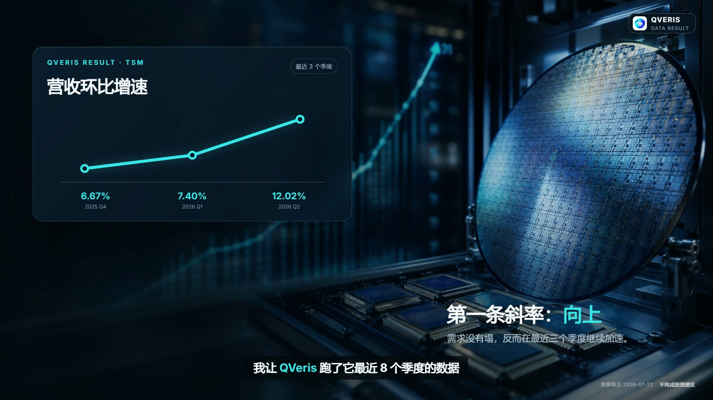
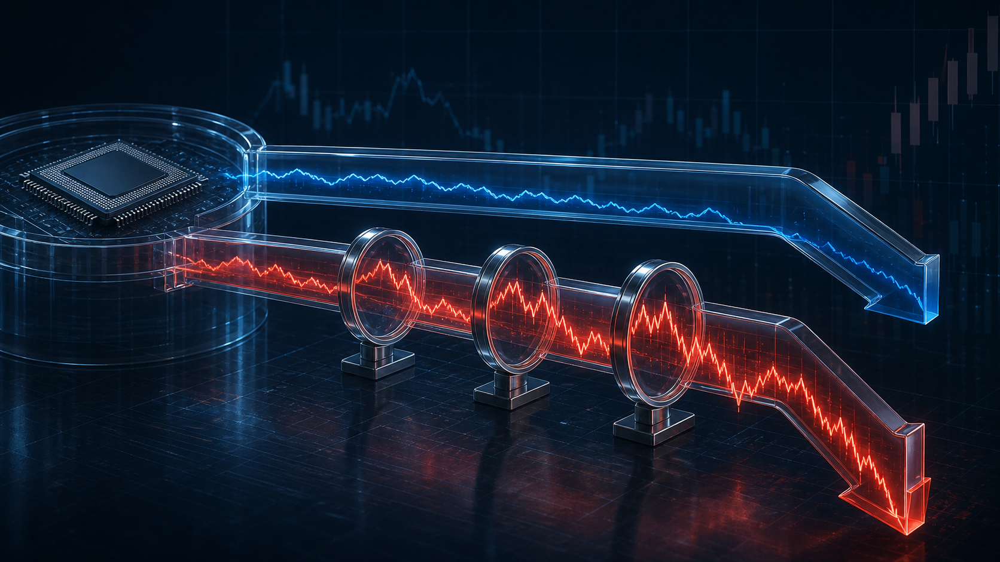
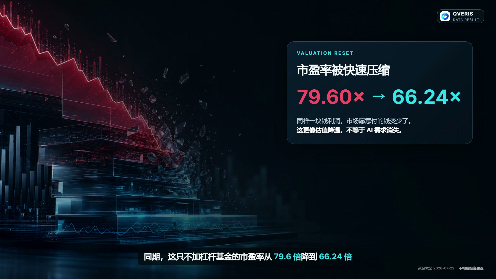
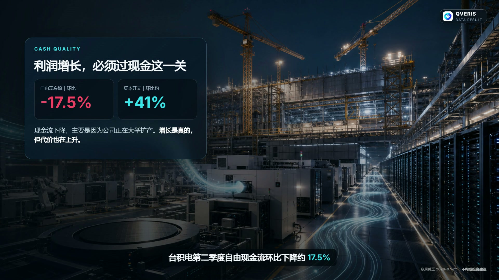
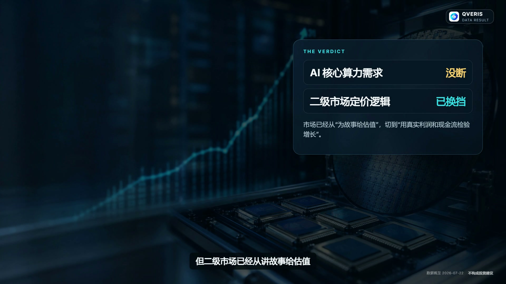

# 最近科技股大跌，AI 行情结束了吗？

科技股大跌之后，市场上通常会迅速出现两种声音。

一种说，AI 泡沫终于破了；另一种说，千载难逢的抄底机会来了。

它们看似相反，却犯了同一个错误：都试图用股价的下跌，直接证明产业的结局。

股价当然重要。但一段急跌，最多能告诉我们资金正在撤退、估值正在收缩，或者杠杆正在被清理。它不能单独证明 AI 需求已经见顶，也不能证明价格跌得够多就一定到了底部。

为了把这两件事分开，我用 QVeris 整理了台积电最近几个季度的公开财务数据，又把芯片基金的跌幅、估值和现金流放到一起比较。最后看到的是一个比“牛市结束”或“闭眼抄底”都更复杂的答案：

**AI 产业需求的斜率可能还在向上，但二级市场给它定价的方式，已经变了。**

## 股价在跌，产业的增长斜率却仍在向上

资本市场很少只为“增长”买单。它更在意的是，增长正在加速，还是正在减速。

这就是所谓的斜率。

一家公司的收入仍然增加，不代表股价一定上涨。如果市场原本期待它增长 30%，最终只增长 20%，绝对数字仍然很好，预期却落空了。反过来，一家公司眼下的利润未必惊人，只要增长速度连续抬升，资本也可能提前重新定价。

台积电是观察 AI 算力需求的一扇窗口。它不能代表整个 AI 产业，却身处先进制程和高性能计算的关键位置，许多芯片公司的订单最终都会反映到它的产能与收入里。

据 QVeris 对公开财务数据的整理和计算，台积电最近三个季度的营收环比增速，分别为 **6.67%、7.40% 和 12.02%**。营业利润环比增速，则从 **13.67%** 升至 **15.49%**，再升至 **16.63%**。

收入和营业利润的斜率，同时向上。

再往前看，台积电给出的第三季度收入指引中值约为 **452 亿美元**。以第二季度为基准计算，环比仍可能增长约 **12.4%**。

这组数据至少说明了一件事：仅从产业端看，我们暂时还看不到“AI 算力需求突然熄火”的证据。

但市场接下来问的，已经不只是“需求还在不在”。它开始追问另一件更难回答的事：为了这份增长，现在的价格是不是太贵了？

## 这轮下跌先打掉的，可能不是利润，而是价格

从 2026 年 6 月 22 日到 7 月 17 日，一只不加杠杆、覆盖 30 家主要芯片公司的基金，累计下跌 **20.34%**；同类三倍杠杆基金下跌 **54.96%**。

后一个数字看起来像是行业崩塌，但其中混入了杠杆的放大作用。三倍杠杆基金追求的是单日涨跌幅的倍数，并不承诺长期收益始终精确等于三倍。在连续波动中，复利和每日再平衡还会进一步放大损耗。

同一时期，更值得注意的是估值变化。

这只不加杠杆芯片基金的市盈率，从 **79.60 倍** 降至 **66.24 倍**。简单说，同样一块钱利润，市场愿意支付的钱变少了。

这就是估值压缩。

于是，眼前这段下跌就出现了两股互相叠加的力量：一边是市场降低了愿意为未来增长支付的价格，另一边是杠杆把正常回撤放大成了更剧烈的损失。

这能解释为什么股价跌得这么快，却仍然不能回答“现在是不是底部”。

去杠杆解释的是下跌的速度，不是下跌的终点。

## 真正需要警惕的，是增长变得越来越贵

如果增长还在加速，为什么市场不愿继续给出更高估值？

答案藏在现金里。

企业利润最终要变成现金，才有能力继续投资、回购、分红，或者穿越下一轮周期。利润表上的增长很漂亮，但如果每多赚一块钱，都需要投入越来越多的资本，增长的质量就会发生变化。

据 QVeris 整理，台积电第二季度自由现金流环比下降约 **17.5%**。一个重要原因是资本开支环比增加约 **41%**。

资本开支上升本身并不是坏事。对晶圆代工厂来说，先进制程、厂房和设备都需要巨额、长期投入。公司愿意扩产，往往意味着它看到了未来订单。

但扩产也有成本：现金先流出去，产能和收入随后才可能兑现。如果需求不及预期，今天的扩张就会变成明天的折旧压力。

与此同时，台积电第三季度毛利率指引中值约为 **66.0%**，低于第二季度的 **67.7%**。

现在，矛盾变得清楚了：收入和营业利润仍在加速，现金转化和毛利率却承受压力。

这不是“AI 行情结束”的证据，却足以让市场变得挑剔。过去只要证明 AI 需求足够大，估值就能被故事推着走；现在，投资者开始要求企业证明，这份需求可以稳定变成利润，并进一步变成现金。

增长还在，但免费的估值溢价正在消失。

## AI 行情没有简单结束，它只是换了计价方式

所以，今天再讨论“AI 行情是否结束”，不能只看指数跌了多少，也不能只看某家公司还在不在增长。

更有用的做法，是把三条线分开。

第一条是增长斜率。营收和营业利润增速，是继续抬升，还是连续两个季度放缓？

第二条是估值。价格下跌，究竟只是市场降低了出价，还是已经提前反映了基本面的恶化？

第三条是现金质量。自由现金流和利润率，是短期被扩产拖累，还是正在持续恶化？

我认为，QVeris 在这类问题里最有价值的地方，不是替人输出一句“看多”或“看空”，而是把散落在财报、指引和市场数据里的证据放到同一张桌上。

工具不能替你承担投资结果，但它可以减少一种常见错误：在价格波动最剧烈的时候，只凭情绪给产业下结论。

## 下一次科技股大跌，先检查这两组信号

如果接下来两个季度，台积电的营收和营业利润增速同步放缓，同时自由现金流与利润率继续恶化，那么“基本面转向”的判断才会得到更强的证据。

如果增长斜率仍然向上，现金压力主要来自可解释的扩产，而估值继续下降，那么市场更可能仍处于重新定价，而不是产业需求已经终结。

这两种情形都不等于“马上买”，也不等于“赶紧卖”。它们只是把一个被情绪挤压成二选一的问题，重新还原成可以验证的判断。

下一次科技股再大跌时，不妨先把价格、增长和现金重新分开。

行情最吵的时候，真正稀缺的往往不是一个更响亮的结论，而是一套不被涨跌牵着走的证据。
