QVeris · 数据实测 

内容为 QVeris × FMP 系列基本面财报数据文章，面向公众号用户阅读。主线是"我让 QVeris 真正看 Apple 基本面"，所有关键数字均来自 QVeris 成功调用 FMP 返回的数据。

用户问"Apple 基本面怎么样"，只查 PE 肯定不够

**我最近想测一个看起来很简单的问题**：

Apple 基本面怎么样？

这个问题如果丢给一个普通 Agent，很容易得到一段看似专业、其实很薄的回答：Apple 是全球科技龙头，收入稳定，利润率高，PE 多少多少，现金流很好。

听起来没错，但这类回答最大的问题是：它不知道自己在依赖什么数据。

基本面分析不是查一个 PE 就结束了。至少要看三层东西：利润表告诉你公司赚了多少钱，资产负债表告诉你靠什么资产和负债结构在赚钱，现金流量表告诉你利润有没有变成现金。再往下，还要看 As Reported 原始披露口径、TTM 指标、财务比率、增长率。

否则 Agent 很容易变成"财务形容词生成器"。稳健、强劲、优质、护城河深，写得都挺顺，就是落不到数上。

所以这次我拿 AAPL 做样本，直接让 QVeris 调 FMP，看看它能不能把 Apple 的基本面数据链路真正跑起来。

我先让 QVeris 拉利润表：五年收入和净利先站住

第一步，我先让 QVeris 调 FMP 的 Income Statement。

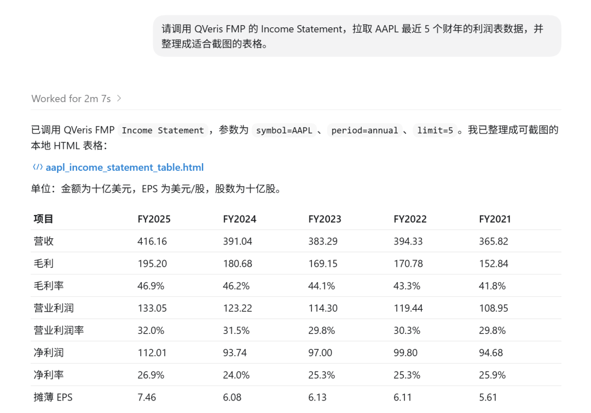

返回结果很干净：AAPL 最近 5 个财年都能拿到，字段包括 revenue、grossProfit、operatingIncome、netIncome、EPS、R&D、SG&A、filingDate、acceptedDate 等。

这里先不讲复杂模型，只看最基础的五年轨迹。

| 财年 | 收入 | 净利润 | EPS |
| --- | --- | --- | --- |
| 2025 | 4161.61 亿美元 | 1120.10 亿美元 | 7.49 |
| 2021 | 3658.17 亿美元 | 946.80 亿美元 | 5.67 |

这组数字已经比"Apple 是一家优秀公司"有用多了。它至少告诉我们：过去五年 Apple 收入从 3658 亿美元走到 4162 亿美元，净利润从 947 亿美元走到 1120 亿美元。它不是一句形容词，而是一条可以继续追问的线索。

这对 Agent 意味着什么？它终于可以先把基本盘站住。回答 Apple 基本面时，不是凭印象写"收入稳定"，而是先拿出收入、净利、EPS 的连续数据，再判断到底是增长、停滞，还是结构变化。

再追资产负债表：赚钱背后的资产结构是什么

利润表回答的是"赚了多少钱"，但还不够。

我接着让 QVeris 拉 Balance Sheet Statement。AAPL 2025 财年资产负债表也能正常返回。

| 指标 | AAPL 2025 FY |
| --- | --- |
| 总资产 | 3592.41 亿美元 |
| 总负债 | 2855.08 亿美元 |
| 股东权益 | 737.33 亿美元 |
| 现金及现金等价物 | 359.34 亿美元 |
| 总债务 | 1123.77 亿美元 |
| 净债务 | 764.43 亿美元 |

这一步很重要，因为很多 Agent 看公司时只盯利润表，像只看体检报告里的体重，不看血压、心率和肝功能。净利润高当然好，但这家公司用了多少资产？负债结构怎么样？现金够不够？这些都在资产负债表里。

有了这张表，Agent 就能从"Apple 很赚钱"往前走一步，开始理解 Apple 的资本结构。它可以看到 Apple 不是一个轻飘飘的利润数字，而是一家公司：有资产、有债务、有现金、有权益，也有长期回购和资本配置留下来的痕迹。

这对 Agent 意味着什么？它不再只是读利润，而是能把"赚钱能力"和"资产负债结构"放在一起看。这是基本面分析从入门走向可用的一步。

现金流才是试金石：利润有没有变成真现金

再往下，我最关心的是现金流。

利润表有时候很漂亮，但现金流会说真话。尤其是做基本面 Agent，如果它不能区分"会计利润"和"真现金"，那就很容易写出漂亮废话。

这次我让 QVeris 调 FMP 的 Cashflow Statements TTM。AAPL 返回的 TTM 数据截至 2026 财年 Q2（数据日期 2026-03-28）：经营现金流 1402.22 亿美元，自由现金流 1291.74 亿美元，资本开支 110.48 亿美元，净利润 1225.75 亿美元。

这组数挺有意思。Apple 的 TTM 经营现金流高于净利润，自由现金流也维持在 1291.74 亿美元的量级。换句话说，利润不是只停在报表上，它确实变成了非常可观的现金。

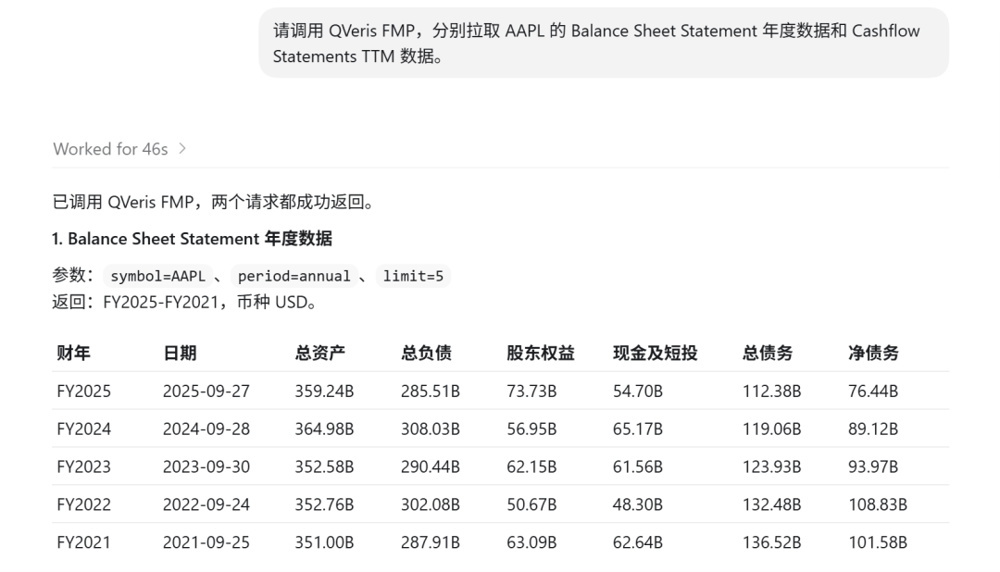

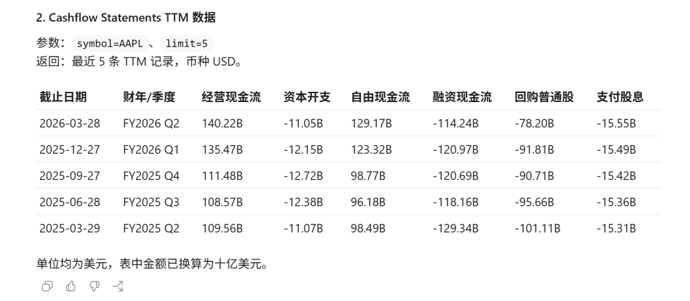

这就是基本面 Agent 应该会做的判断。不是把 cash flow 字段念一遍，而是能接着问：经营现金流和净利润关系如何？自由现金流够不够支撑回购、分红和再投资？资本开支占比高不高？

这对 Agent 意味着什么？它可以开始做"利润质量"判断了。一个只会查净利润的 Agent，最多是财务摘要；一个能追现金流的 Agent，才像真的在做投研。

As Reported 的价值：必要时能回到原始披露口径

标准化三大表好用，但专业投研里还有一个问题绕不开：这些数字是怎么从原始披露里来的？

所以我又测了 FMP 的 Full As Reported Financial Statements。QVeris 成功返回 AAPL 2025 年数据，里面能看到 documenttype 是 10-K，entityregistrantname 是 Apple Inc.，auditorname 是 Ernst & Young LLP，也能看到更接近原始披露口径的字段，比如 revenuefromcontractwithcustomerexcludingassessedtax、costofgoodsandservicessold、netincomeloss、netcashprovidedbyusedinoperatingactivities。

这部分不适合直接扔给普通用户看。字段长得像会计准则从键盘上摔了一跤，读起来一点也不友好。

但它对 Agent 非常关键。

标准化数据解决的是"好用"，As Reported 解决的是"可追溯"。如果用户追问"这个收入对应原始 10-K 里的哪个披露项"，Agent 不能只说"我觉得应该是"。它需要有机会回到原始披露口径里核对。

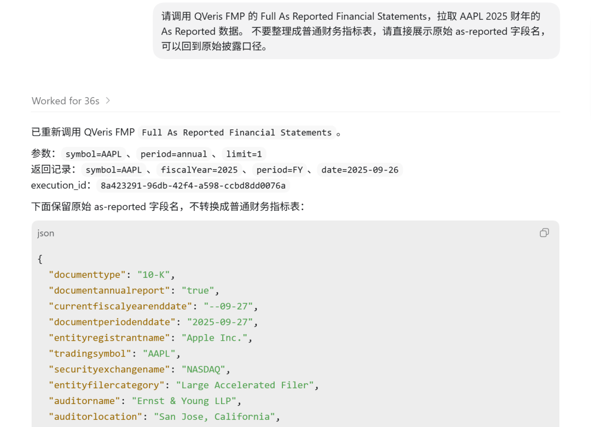

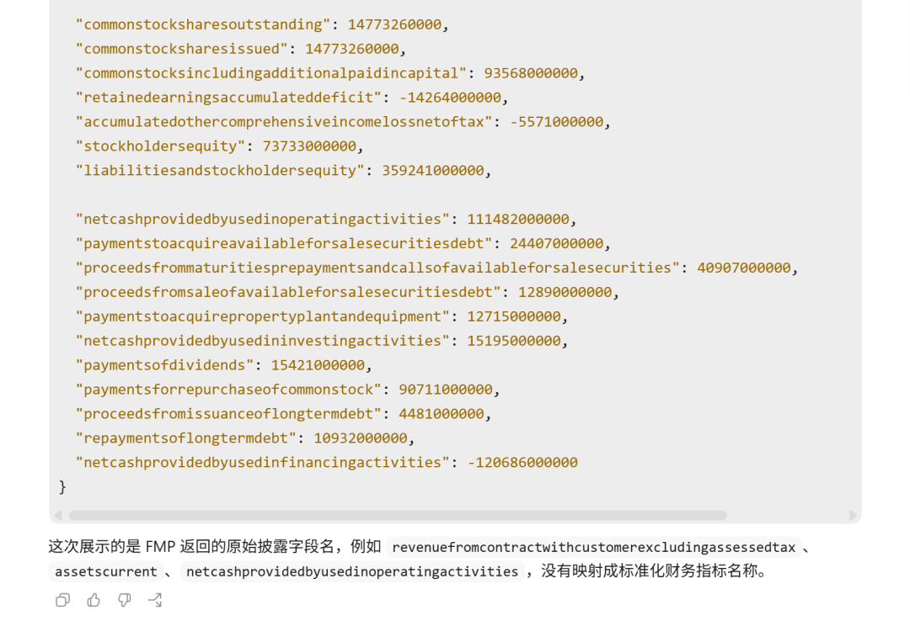

这对 Agent 意味着什么？它可以先用标准化三大表快速分析，再在需要时回到 As Reported 里做核验。这个能力让 Agent 从"看过摘要"变成"能追来源"。

Ratios、TTM 和 Growth：让 Agent 从查数变成判断

三大表是原材料，但用户真正想要的是判断。

于是我继续让 QVeris 拉 Financial Ratios、Key Metrics TTM 和 Financial Statement Growth。

| 类别 | 实测指标 | 返回值 |
| --- | --- | --- |
| Financial Ratios | 毛利率 | 46.91% |
| Financial Ratios | 净利率 | 26.92% |
| Financial Ratios | PE | 34.09 |
| Key Metrics TTM | ROA TTM | 33.03% |
| Key Metrics TTM | ROE TTM | 146.69% |
| Key Metrics TTM | ROIC TTM | 49.57% |
| Key Metrics TTM | 现金转换周期 | -35.21 天 |
| Growth | 2025 收入增长 | 6.43% |
| Growth | 2025 净利润增长 | 19.50% |
| Growth | 2025 EPS 增长 | 22.59% |

到这里，Agent 才终于有条件回答"Apple 基本面怎么样"。

它可以说：Apple 2025 年收入仍在增长，净利润增速高于收入增速；利润率仍然很高，毛利率接近 47%，净利率接近 27%；TTM 口径下 ROIC 接近 50%，自由现金流超过 1290 亿美元；估值端 PE 34.09，不算便宜，但背后是极强的现金生成能力和资本回报。

这段话的重点不是"看起来很专业"，而是每句话背后都有数据。

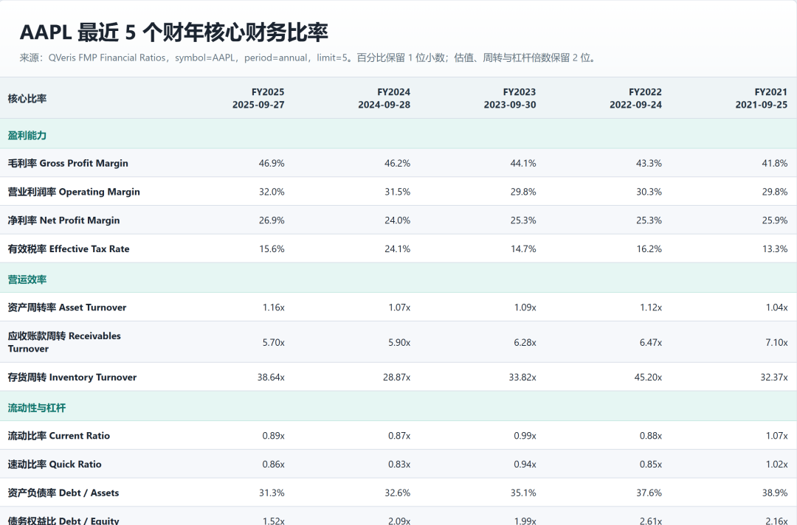

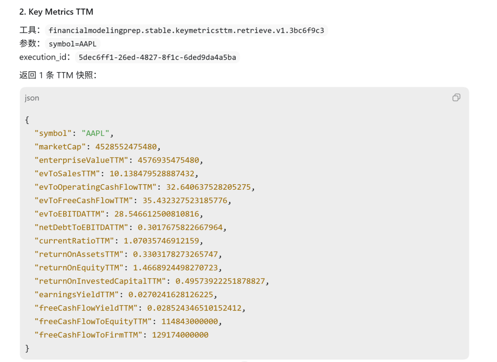

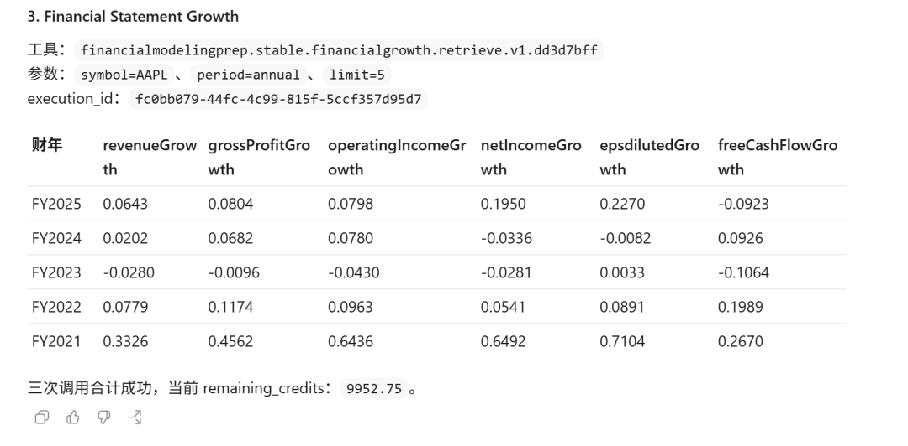

这对 Agent 意味着什么？它不再只是查数，而是能把三大表、TTM、比率和增长率拼成一条基本面判断链。用户问一句"怎么样"，Agent 背后其实跑的是一整套财务分析流程。

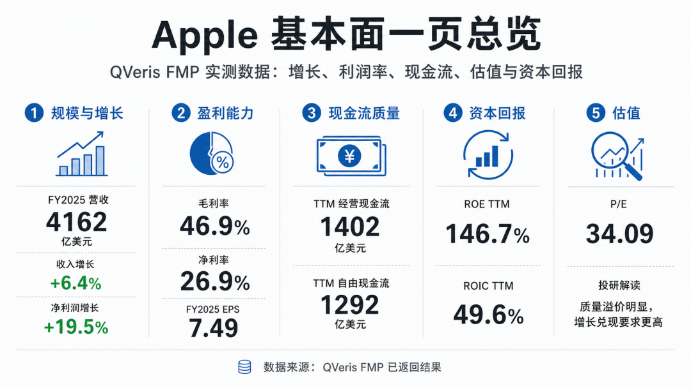

这才是基本面 Agent 该有的数据底座

**这轮测下来，我对 QVeris × FMP 的感受挺明确**：

它的价值不是"能查 Apple 财报"。能查财报的数据源不少。真正有价值的是，QVeris 能把基本面 Agent 需要的几层数据接成一条链。

Income Statement 看收入、毛利、经营利润、净利润和 EPS；Balance Sheet 看资产、负债、现金、债务和股东权益；Cashflow TTM 看利润有没有变成现金；As Reported 让 Agent 必要时能回到原始披露口径；Financial Ratios 和 Key Metrics TTM 给出估值、盈利能力、资本回报和营运效率；Growth 再把趋势变化结构化。

这不是一个"查 PE 工具"。这是一个基本面 Agent 的数据底座。

**用户以后真正会问的，也不会是"帮我返回 Apple 的利润表"。他们会问**：

Apple 过去几年还在增长吗？利润质量怎么样？估值贵不贵？现金流能不能支撑回购和分红？如果继续深入，下一步该看哪些指标？

以前这种问题要研究员自己拆成十几步：找三大表，统一年份，算比率，看现金流，再回原始披露核对。现在，这些步骤可以由 QVeris Agent 编排起来。

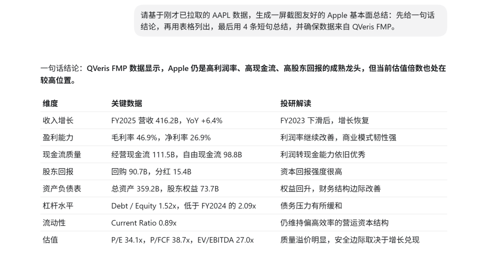

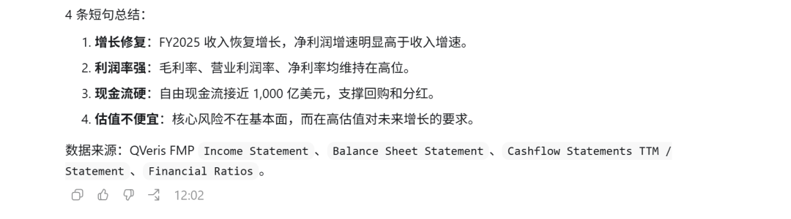

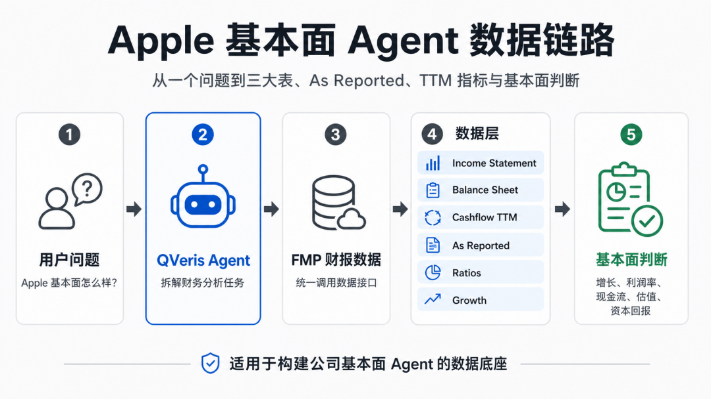

对外表达点：QVeris 已经把 FMP 的基本面财报数据接成了可调用的数据链路。开发者不需要只做"查 PE"的浅层 Agent，而是可以直接构建覆盖三大表、As Reported、TTM 指标、财务比率和增长分析的公司基本面 Agent。

QVeris 已经把 FMP 的基本面财报数据接成了可调用的数据链路。开发者不需要只做“查 PE”的浅层 Agent，而是可以直接构建覆盖三大表、As Reported、TTM 指标、财务比率和增长分析的公司基本面 Agent。
