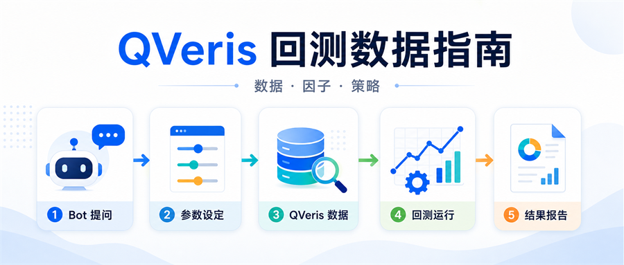
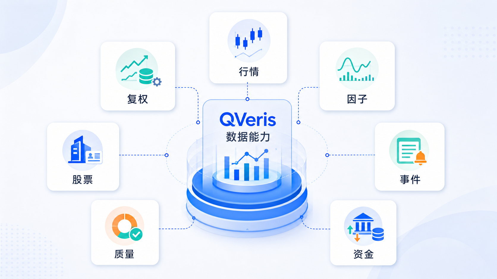
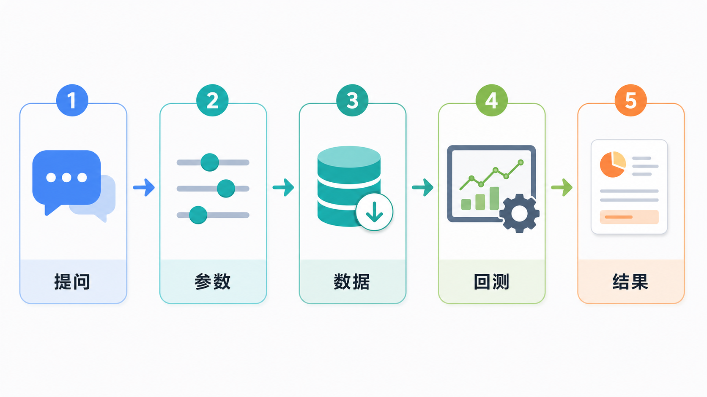
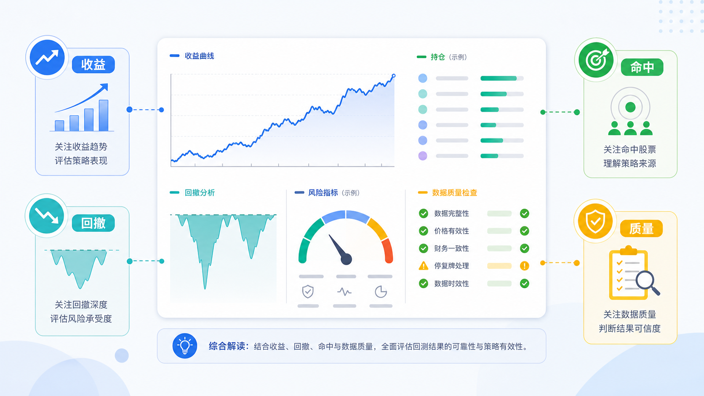

<title>用 QVeris 数据做回测：先看懂数据，再相信曲线</title>

# 一条曲线出来之前，先问三个问题

很多人做因子或策略回测，最想先看到的是收益曲线。但真正有价值的回测，不是把曲线画出来就结束，而是先把曲线背后的数据说清楚。

这次用的股票池是什么？日 K 覆盖够不够？调仓日有没有足够的候选股票？这些问题如果没处理好，回测结果看起来再完整，也可能只是一次漂亮的误判。

QVeris 更适合被理解为回测所需的数据底座：它提供本地行情、交易日、股票池、因子数据和覆盖信息，供 Bot 或调用方完成条件检查、回测执行和结果解释。

# QVeris 能为回测提供哪些数据

做回测时，QVeris 提供的不只是单一行情字段，而是一组可被回测流程使用的数据：行情、交易日、股票池、因子值和覆盖信息。

| 数据 | 在回测里解决什么问题 |
|-|-|
| 本地日 K | 用于计算个股在回测周期内的涨跌幅、调仓收益和风险指标。 |
| 交易日历 | 判断回测窗口、调仓日和可用交易日，避免把非交易日当作有效样本。 |
| 股票池 | 限定候选范围，例如沪深 300、全市场或用户指定的一组股票。 |
| 因子数据 | 在每个调仓点给股票排序，决定哪些股票进入 TopN 或策略持仓。 |
| 数据质量信息 | 提示样本不足、覆盖不完整、可回测股票过少等情况，帮助判断结果是否可信。 |

因此，一个回测结果能不能看，先不取决于收益率有多高，而取决于这些数据是否足够支撑这次问题。

# 你可以直接这样问 Bot

如果只是想快速看一个因子有没有方向感，可以把问题问得很短：

> 请基于 QVeris 数据回测一下质量因子，股票池选沪深 300，最近一年，每 20 个交易日调仓，Top30。

如果你已经有明确策略，可以把约束说得更具体：

> 请基于 QVeris 数据验证一个低估值加盈利质量策略：市盈率从低到高筛选，ROE 过滤后取 Top20，月度调仓，回测最近三年，同时给出最大回撤和每次调仓持仓。

如果你更关心数据够不够，可以先不急着跑：

> 先检查本地数据能不能支持最近一年 A 股策略回测，告诉我覆盖了多少只股票、多少个交易日，以及是否足够做 Top30。

# 一次回测大概会经历什么

当 Bot 基于 QVeris 数据发起回测时，流程通常不是直接算收益，而是先做一轮数据检查。这样做会慢一点，但可以避免“结果已经出来，后来才发现样本不够”的情况。

1. 确认你的回测目标：因子、策略、股票池、周期、调仓频率和持仓数量。
2. 检查本地行情和交易日覆盖，判断当前数据能不能支撑这次任务。
3. 如果数据不足，先说明缺口在哪里，而不是强行给出曲线。
4. 如果数据满足要求，再执行因子预览或策略回测。
5. 返回结果时，同时给出收益表现、风险指标、持仓变化和质量提示。

这个过程的重点是可解释。你不需要先判断所有技术细节，只要看 Bot 是否把“用了什么数据、过滤了什么样本、为什么能跑或不能跑”交代清楚。

# 因子回测重点看什么

因子回测更适合回答“这个信号有没有排序能力”。它不一定等同于完整策略，但可以帮助你快速判断一个方向是否值得继续研究。

| 结果项 | 阅读方法 |
|-|-|
| 分组或 TopN 表现 | 看高分组是否持续好于低分组，避免只盯某一次高收益。 |
| 调仓样本数 | 看每次调仓是否有足够股票参与排序，样本太少时结论要打折。 |
| 最大回撤 | 判断收益是否靠承担过高波动换来。 |
| 覆盖提示 | 如果提示样本不足、交易日不足，要先补数据或放宽条件。 |

一个因子如果只是在少数股票、少数日期上表现好，不要急着认为它有效。更稳妥的做法，是换股票池、换周期、换 TopN 后再看结论是否一致。

# 策略回测重点看什么

策略回测更接近真实使用。它不仅关心“买什么”，还关心“什么时候买、什么时候换、每次持有哪些股票”。

阅读策略回测时，建议按这个顺序看：

- 先看回测周期和股票池，确认它和你的问题一致。
- 再看年化收益、最大回撤、波动和胜率，不要只看最终收益。
- 接着看调仓记录，确认策略是否频繁换手、是否集中在少数股票上。
- 最后看数据质量提示，判断这次结果能不能作为下一步依据。

如果结果里出现“数据待补齐”“可回测股票不足”“交易日不足”之类的提示，优先处理数据问题。否则很容易把数据缺口误认为策略问题。

# 数据不足时，不要急着下结论

回测失败不一定代表因子没用，也不一定代表策略写错。更常见的原因，是当前数据不足以支撑你设定的条件。

比如你要求最近一年、Top30、每只股票至少 80 个交易日，但当前股票池里只有 20 只股票满足条件，那么 Bot 应该基于 QVeris 返回的覆盖统计或失败原因，把样本不足解释清楚，而不是凑出一条不可靠的曲线。

遇到这种情况，可以按三种方式处理：

- 补充本地历史行情，让更多股票进入可回测范围。
- 放宽回测周期或股票池，例如从沪深 300 扩展到更大的候选范围。
- 降低 TopN 或最小交易日要求，先做预览，再决定是否继续加严条件。

# 一次好的回测回答应该长什么样

你可以要求 Bot 不只给曲线，还要把结论讲完整。比较实用的回答结构通常包括：

1. 回测设置：股票池、周期、调仓频率、TopN、费用假设。
2. 数据覆盖：股票数量、交易日数量、日 K 行数、是否满足最低要求。
3. 核心结果：收益、回撤、波动、胜率，以及和基准的差异。
4. 持仓与调仓：每次调仓选出的股票，以及换手是否过高。
5. 质量提示：哪些地方需要复核，哪些结论可以继续观察。

这样的结果更适合继续讨论。你可以追问“为什么这段回撤最大”“把 Top30 改成 Top50 会怎样”“换成全市场股票池是否还有效”，一步一步把一个想法验证清楚。

# 最后，给第一次使用的人一个建议

不要一上来就追求复杂策略。先选一个清楚的因子、一个明确的股票池和一个不太长的周期，让 Bot 基于 QVeris 数据把覆盖检查和基础表现跑通。等你看懂了样本、调仓和风险，再逐步加入过滤条件。

回测真正有用的地方，不是证明某个想法一定赚钱，而是帮你尽早发现：这个想法的数据基础够不够，收益来自哪里，风险是不是你能接受。
