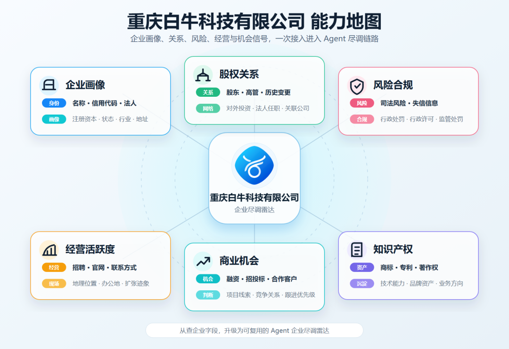
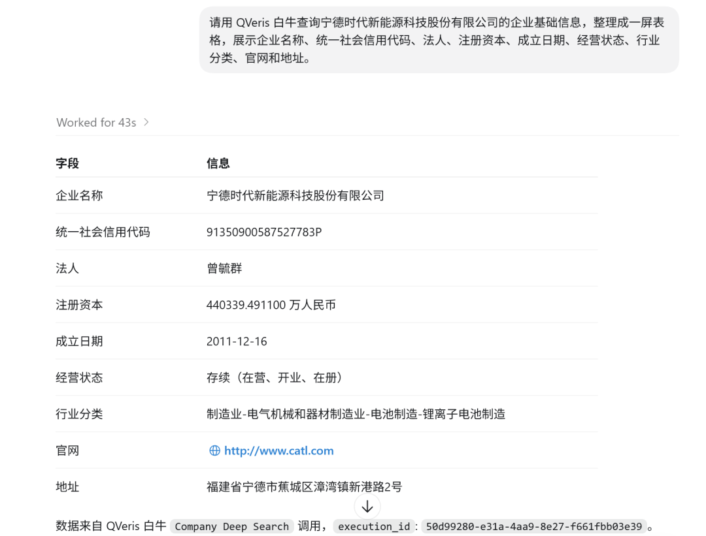
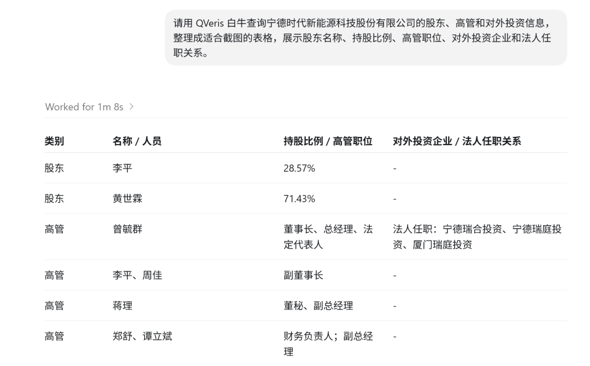
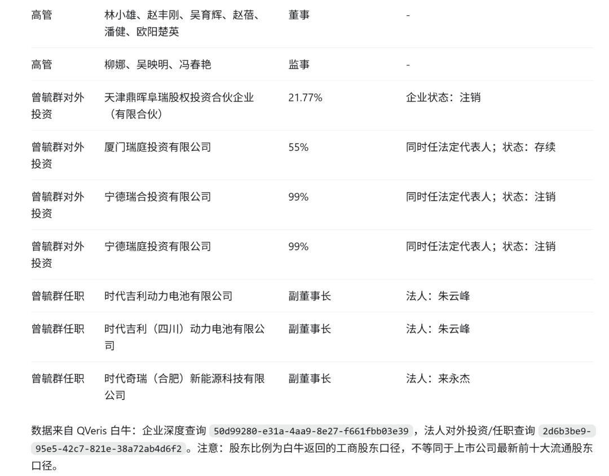
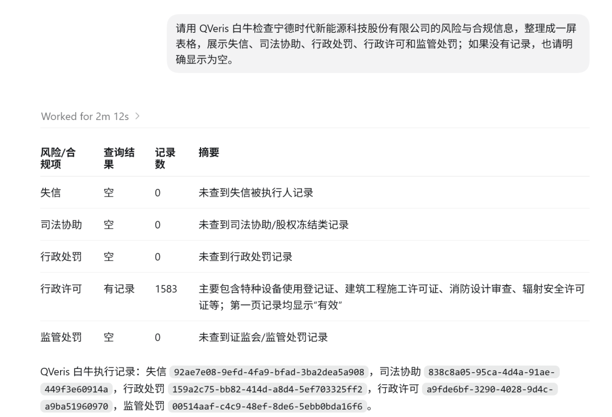
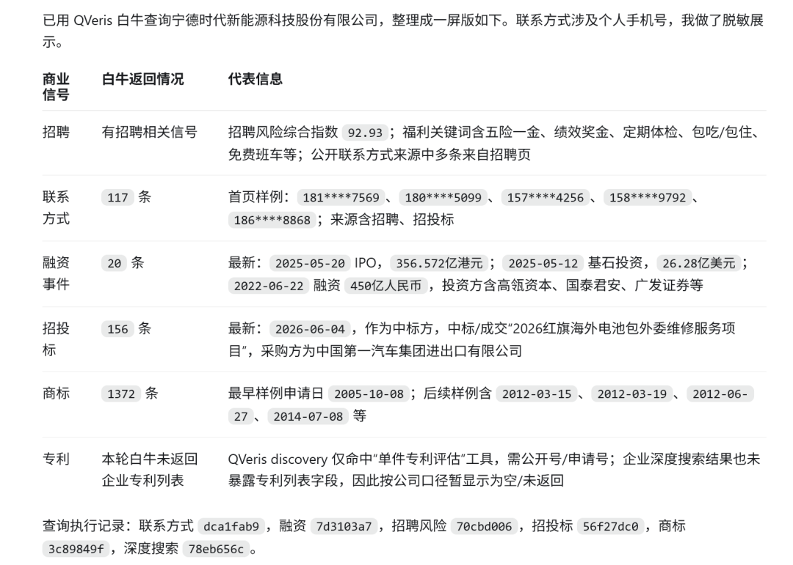
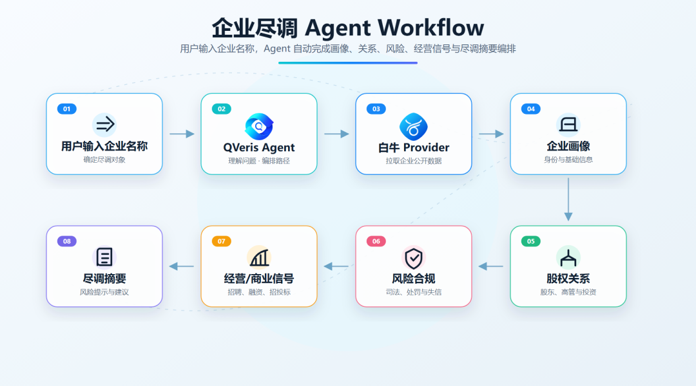
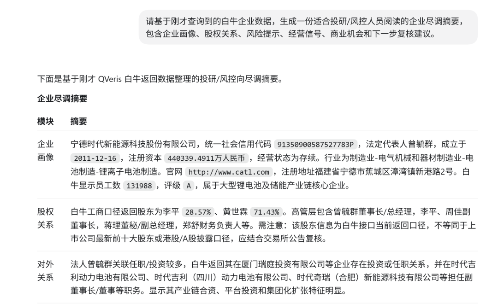
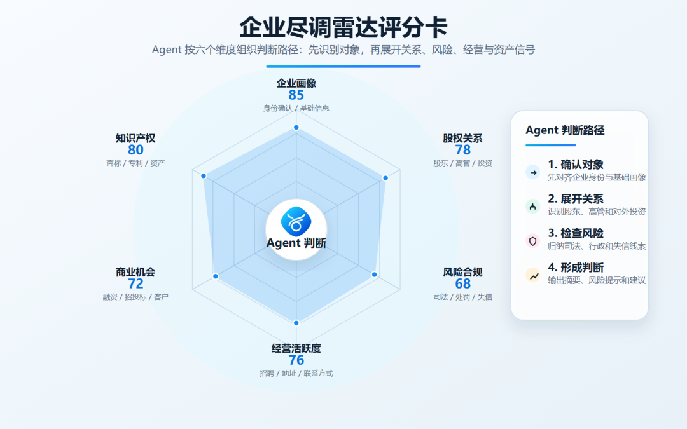

QVeris · 产品动态 
## 查一家公司，真正难的不是搜到名字

很多时候，用户问的并不是"这家公司叫什么"。

真正的问题通常是：这家公司到底是谁？它背后是谁在控制？它有没有司法、行政、失信风险？它是不是还在真实经营？它最近有没有招聘、融资、投标、扩张？它的商标、专利、对外投资，能不能说明它真的有业务能力？

过去，这类问题很难靠一次搜索解决。企业工商信息在一个地方，股权和高管在另一个地方，司法风险、行政处罚、招投标、招聘、融资、知识产权又分散在更多数据源里。人工尽调时，常见的工作流是：打开多个网站、复制企业名称、反复查、截图、拼表格，最后再靠人脑把线索串起来。

QVeris 新接入白牛 Provider 后，想解决的正是这个问题：让 Agent 不只是"查到一家公司"，而是能像企业尽调雷达一样，把分散的公开企业数据组织成一条可读、可追问、可复用的分析链路。

>
> 企业尽调不是查一个字段，而是把身份、关系、风险、经营和商业信号串起来。白牛接入后，QVeris Agent 可以沿着这条链路继续追问。 
>
## 白牛接入后，QVeris Agent 能看到什么

白牛的核心价值，是把企业相关的多维公开信息接进来。

它不是只提供一个工商查询入口，而是覆盖企业画像、股权关系、风险合规、经营活跃度、商业机会和知识产权等多个方向。对 QVeris Agent 来说，这意味着一次企业分析可以从"基础资料"继续往下追，而不是查到公司名、法人、注册资本就停住。

## 第一层：企业画像，先确认它到底是谁

任何尽调的第一步，都不是急着下结论，而是先确认对象。

同名企业、历史名称、集团公司、分支机构、关联公司，很容易让人工查询出现偏差。白牛的企业超级查询和企业深度信息能力，可以帮助 Agent 先把目标企业的基础身份对齐：企业名称、统一社会信用代码、法定代表人、注册资本、成立日期、经营状态、注册地址、官网、行业分类、地理位置等。

这一步看起来基础，但非常关键。

如果 Agent 连"查的是不是同一家公司"都没有确认，后面所有风险、股权、融资、招投标分析都可能跑偏。接入白牛后，QVeris 可以先建立企业画像，再进入下一层分析。
## 第二层：股权和关系，看清它背后连着谁

企业尽调真正开始变有意思，往往是从关系开始的。

一家公司表面上是独立主体，但它的股东是谁？高管是谁？历史上有没有关键股东变动？它对外投资了哪些公司？法人还在哪些企业任职？这些关系能不能说明它背后有集团、资本、供应链或业务网络？

白牛提供的股东高管、历史股东高管、企业对外投资、法人对外投资任职等能力，可以让 QVeris Agent 把企业从"一个点"展开成"一张关系图"。

这对很多场景都很有用：投资团队可以看企业背后的资本和控制关系，销售团队可以识别集团客户和关联公司，风控团队可以检查法人、高管和对外投资是否存在异常，BD 团队可以从企业关系里找到潜在合作路径。

Agent 的优势在于，它不只是列字段，而是可以解释关系：谁是关键控制人，哪些对外投资值得关注，历史股东变化是否意味着业务阶段变化。
## 第三层：风险与合规，不只看亮点，也看暗线

看一家公司，不能只看官网和融资新闻。

真正的尽调必须看风险：有没有失信被执行记录？有没有司法协助？有没有行政处罚？有没有行政许可？有没有税务、金融监管相关处罚？这些信息往往不会出现在企业自己的介绍里，但对判断合作风险、履约能力和合规状态非常重要。

白牛接入后，QVeris Agent 可以围绕风险与合规建立一组检查项：司法风险、行政处罚、行政许可、失信信息、监管处罚等。用户不需要一个个页面手动翻，Agent 可以先做结构化归纳，再把需要人工复核的高风险线索标出来。

这类能力尤其适合供应商准入前的基础尽调、合作方签约前的风险检查、投资标的初筛、客户或渠道商背景审查，以及金融、政企、招投标等高合规场景。

>
> 没有负面记录本身也是一种信号；同时，大量行政许可记录说明企业在生产、建设、安全、环保等合规事项上存在持续经营痕迹。 
>
这里的重点不是让 Agent 替代法务判断，而是让它先把公开风险线索找出来，减少漏看。
## 第四层：经营活跃度，从招聘、联系方式和地址看真实运转

一家公司是否"真实活跃"，不一定只看工商状态。

有些公司工商状态正常，但官网长期不更新、招聘停止、联系方式混乱、实际办公地点不清晰。也有些公司规模不大，但持续招聘、公开联系方式稳定、办公地点明确，说明它仍在扩张或运营。

白牛提供的招聘信息、常用联系方式、官网、地理位置、实际办公地点等数据，可以帮助 QVeris Agent 从经营侧判断企业状态。

例如，招聘岗位能反映业务方向：技术岗增加，可能说明研发投入；销售和渠道岗位增加，可能说明市场扩张；大量区域岗位出现，可能说明线下业务铺开。联系方式和地址则可以辅助判断企业触达能力与真实运营位置。

这让 Agent 的企业分析不再停留在"注册资本多少"，而是更接近日常业务判断：它还在不在动？往哪里动？动作是否和它宣称的业务一致？
## 第五层：商业机会，从融资和招投标找业务信号

企业数据不只是用来防风险，也可以用来找机会。

融资事件可以说明企业所处阶段和资本关注度。招投标信息可以揭示企业参与过哪些项目、服务过哪些客户、在哪些领域有合作或竞争关系。对外投资和知识产权也能帮助判断企业是否在拓展新业务，或者是否具备长期资产。

接入白牛后，QVeris Agent 可以把这些信号组织成面向业务的问题：这家公司最近有没有融资？它是否频繁参与招投标？它的合作方和竞争方是谁？它是否有商标、专利等资产沉淀？它更像一个真实经营主体，还是一个空壳主体？

>
> 经营活跃度和商业机会往往是连在一起看的，招聘、联系方式、融资、招投标和商标信息可以共同说明企业是否仍在持续运转。 
>

这对销售、投研、BD、采购和产业分析都很有价值。Agent 可以先把企业的商业活动线索整理出来，再帮助用户判断下一步是继续跟进、重点复核，还是降低优先级。
## 这对 QVeris Agent workflow 意味着什么

白牛接入 QVeris 后，企业分析可以从"查工商"升级成一套完整 workflow。

用户输入一个企业名称，Agent 可以先做企业身份确认，再拉取基础画像；接着展开股权、高管、对外投资和法人关系；然后检查司法、行政、失信、监管等风险；再通过招聘、联系方式、地址、融资、招投标和知识产权判断经营活跃度与商业价值；最后生成一份结构化企业尽调摘要。

| Workflow | 用户问题 | Agent 调用路径 | 最终输出 |
| --- | --- | --- | --- |
| 企业初筛 | 这家公司靠谱吗？ | 企业画像 → 风险合规 → 经营活跃度 | 基础尽调摘要 |
| 股权穿透 | 它背后是谁？ | 股东高管 → 历史变更 → 对外投资 → 法人任职 | 关系图和关键控制人 |
| 风险检查 | 合作前有没有坑？ | 失信 → 司法协助 → 行政处罚 → 行政许可 | 风险清单和复核建议 |
| 商业机会 | 值不值得跟进？ | 融资 → 招投标 → 招聘 → 知识产权 | 业务信号和跟进优先级 |
| 供应商准入 | 能不能纳入供应商池？ | 企业身份 → 合规风险 → 联系方式 → 经营状态 | 准入前检查报告 |

QVeris 接入白牛的意义，不是让 Agent 多背一批企业字段，而是让 Agent 能把企业数据变成判断路径。

它可以先确认"这家公司是谁"，再追问"谁控制它""它有什么风险""它是否真实活跃""它有没有商业信号"。这才是企业数据真正进入 Agent workflow 后的价值：不再只是查数，而是帮助用户更快做判断。

---

原文链接：[微信公众号原文](https://mp.weixin.qq.com/s?src=11&timestamp=1782306755&ver=6802&signature=ZTARrA9sslALul3HMSjo7l29ljsjB2I3UGwY3bGIayp*qeqDmQrUmQV1VPyXI*e62M31j1ALSDAyO-c6W2rlvQ0XNrP0Z3MGIEBCC4-a7OEVmnRvV*N8iU9qy50IC2XS&new=1)
