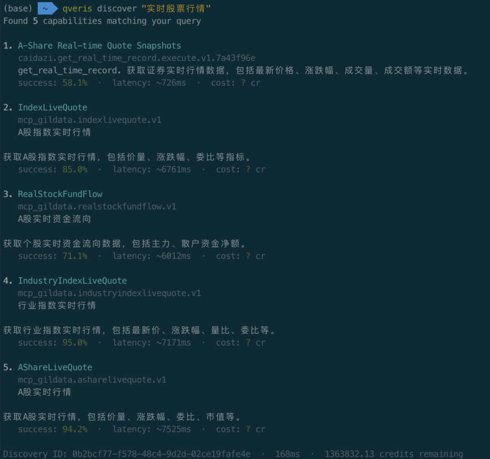
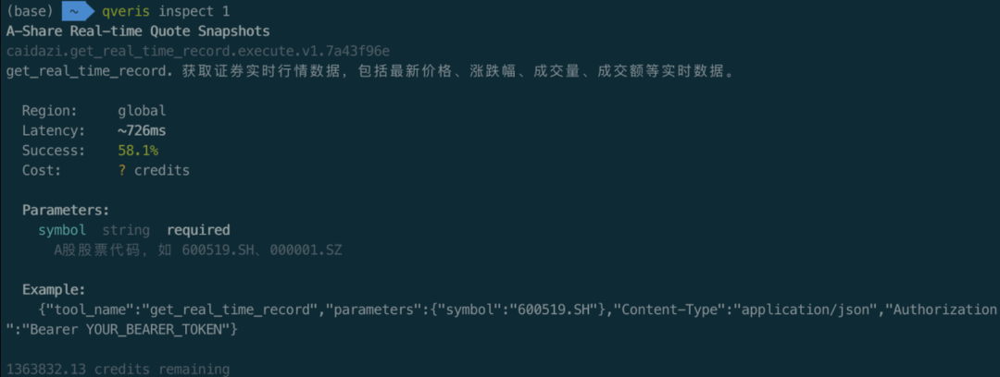
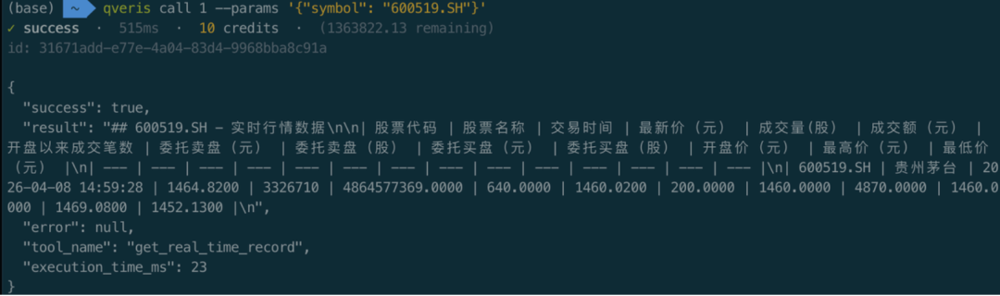
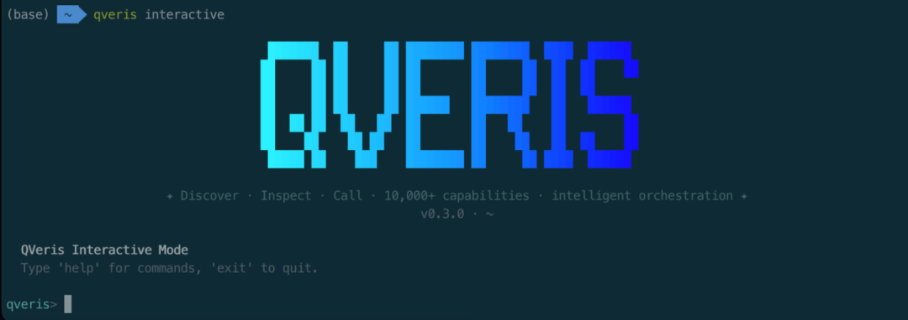
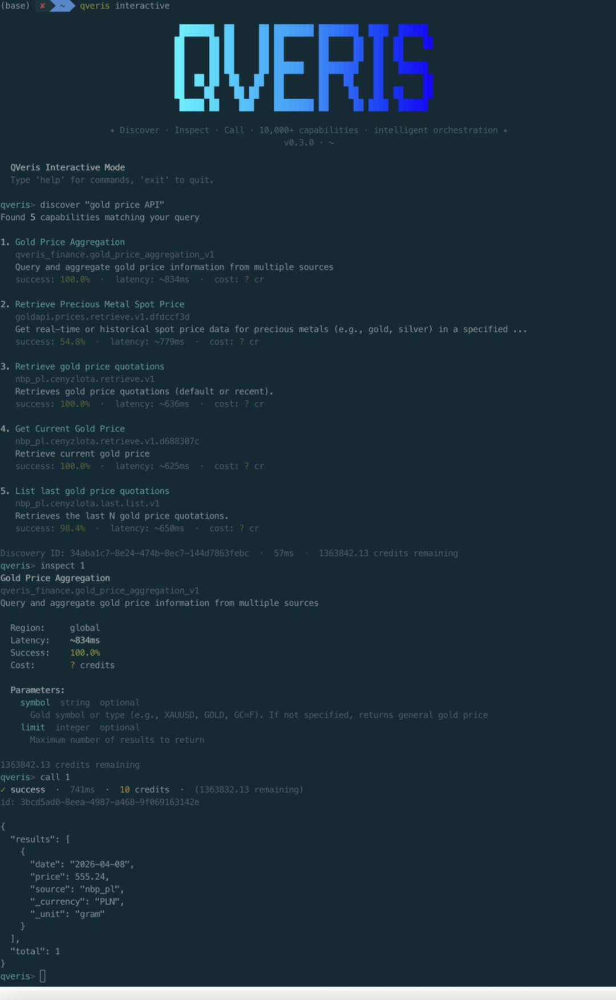
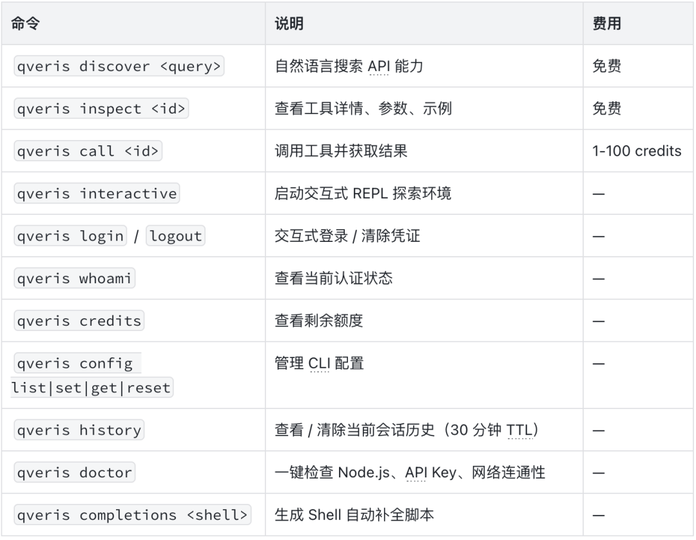
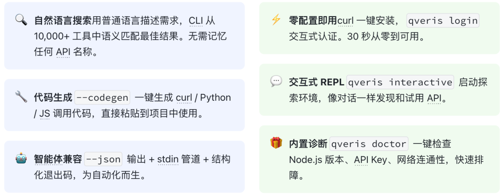
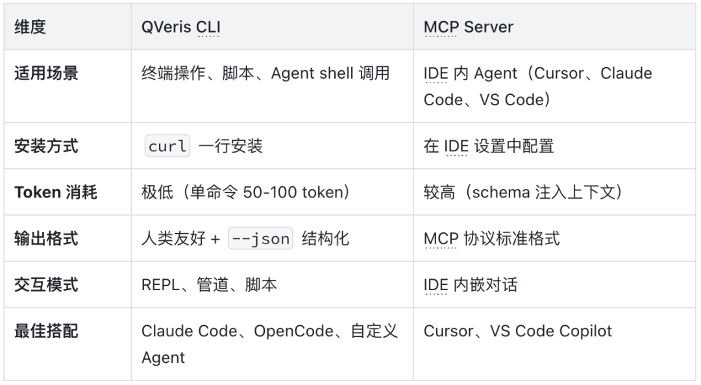

在 AI 智能体席卷开发者工具链的今天，一个现实问题始终没被很好地解决：**  
**

**当你需要快速调用一个 API，却不想写代码、不想查文档、不想注册第三方平台——怎么办？**

现在，一行命令就够了。

**QVeris CLI** 是我们为开发者和智能体打造的命令行工具，让你在终端中用自然语言发现、检查和调用 10,000+ API 能力。

无需翻文档、无需写适配代码，30 秒从零到可用。


# 01.

#  

# 30 秒安装，开箱即用

#  

**一行 curl，全局可用**：

```
curl -fsSL https://qveris.ai/cli/install | bash
```

  

**或者用 npm**：

```
npm install -g @qverisai/cli
```

  

**安装完成后，登录只需一步**：

```
qveris login # 自动打开浏览器完成认证，API Key 安全存储到本地
```

**新用户福利**：注册即送 1,000 credits，搜索完全免费，无需绑卡。

#  

# 02.

#  

# 核心工作流：Discover → Inspect → Call

#  

QVeris CLI 的设计哲学很简单——**像搜索引擎一样找 API，像终端命令一样用 API**。整个流程只有三步：

## 第一步：用自然语言搜索

##  

**不需要记任何 API 名称，直接描述你的需求**：

```
qveris discover "实时股票行情"
```

  

**CLI 会从 10,000+ 工具中语义匹配，返回最佳结果**：

```
Found 6 tools:  1. finance.stock_quote       实时股票报价      ⚡ 320ms  99.2%  2. market.live_price         实时市场价格      ⚡ 450ms  98.7%  3. trading.ticker_data       行情数据与历史     ⚡ 280ms  99.5%
```

  



每个结果都带延迟和成功率评分，一目了然。**搜索完全免费，不消耗任何 credits。**

## 第二步：查看工具详情

##  

**用索引号快速引用，不用复制粘贴长长的 tool_id**：

```
qveris inspect 1
```

  

```
finance.stock_quoteReal-time stock price quotes from major exchangesProvider: MarketData Pro  ·  Avg: 320ms  ·  Success: 99.2%Parameters:  symbol    string (required)   Stock ticker symbol  exchange  string (optional)   Exchange code
```

  



参数、说明、性能指标一览无余。

## 第三步：调用并获取结果

##  

```
qveris call 1 --params '{"symbol": "AAPL"}'
```

  

```
{ "symbol": "AAPL", "price": 198.52, "change": +2.31, "volume": 45230100 }
```



**三条命令，从"我需要一个股票 API"到拿到实时数据，全程不超过 30 秒。**

#  

# 03.

#  

# 交互式 REPL：像对话一样探索 API

#  

**如果你想边探索边试用，`qveris interactive` 启动交互式环境**：



```
$ qveris interactiveQVeris REPL v1.0 — type a query to discover tools, help for commandsqveris> weather forecast APIFound 4 tools:  1. weather.forecast   7-day weather forecast   ⚡ 380ms  2. weather.current    Current conditions        ⚡ 220msqveris> inspect 1  weather.forecast  Parameters: location (required), days (optional, default: 7)qveris> call 1 {"location": "Shanghai"}  { "location": "Shanghai", "forecast": [...] }qveris> codegen curl# Generated curl command:curl -X POST https://qveris.ai/api/v1/execute \  -H "Authorization: Bearer $QVERIS_API_KEY" \  -d '{"tool_id":"weather.forecast","params":{"location":"Shanghai"}}'
```

  



**亮点**：`codegen` 命令可以自动生成 curl / Python / JavaScript 调用代码，直接复制到你的项目中使用。

# 04.

#  

# 智能体最高效的工具调用方式

#  

**QVeris CLI 是智能体使用 QVeris 最节省 token 的方式。**

相比 MCP Server 需要将完整 tool schema 注入上下文（通常消耗数千 token），CLI 的方式是：单条命令进，JSON结果出，零协议开销。

```
# 结构化输出，智能体直接解析（先搜能力，再按 tool_id / 序号接着用）qveris discover "aggregate news or financial indicators into structureddata" --json --limit 3
```

- 
- 
- 

```js
# stdin管道，适配自动化（上游脚本拼好参数，下游直接 call）echo '{"tickers":["AAPL","MSFT","GOOGL"],"interval":"1d"}' | \  qveris call 1 --params - --json
```

（`1` 表示当前会话里最近一次 `discover` 结果中的序号；也可换成真实的 `tool_id`。）

  

- 
- 
- 

```js
# 干跑验证，不消耗 credits（确认参数与路由再真跑）qveris call 1 --params '{"tickers":["AAPL","MSFT"],"interval":"1d"}' --dry-run --json
```

**  
**

若你更强调 **「导出 Excel / CSV」**，可把 discover 换成更贴切的自然语言，例如：

```
qveris discover "export table or spreadsheet Excel CSV API" --json --limit 3
```

**说明（和真实工具对齐时）**：`discover` 返回的具体 `tool_id`、参数名以接口为准；智能体流程一般是**`discover` → `inspect` 看 schema → `call`/`--dry-run`**，和你现在 CLI 的用法一致。

  

**为什么比 MCP 更省 token？**

- MCP：需要将所有工具的完整 schema 注入 LLM 上下文，随工具数量线性增长

- CLI：单条 shell 命令 + JSON 输出，固定开销约 50-100 token

- 在 10+ 工具场景下，CLI 方式可节省 80%+ 的 token 消耗

###  

### 智能体友好设计

###  

|   |
| --- |

| 特性 | 说明 |
|----|----|
| `--json` 输出 | 所有命令支持结构化 JSON 输出，方便程序解析 |
| stdin 管道 | `--params -` 从标准输入读取参数，适配管道工作流 |
| 结构化退出码 | 0 成功 · 77 认证失败 · 69 服务不可用 · 75 网络超时 |
| 终端自动检测 | 管道模式自动禁用颜色和动画，响应体扩展至 20KB |
| `--dry-run` | 预验证参数，不消耗 credits |

**适用场景**：Claude Code、OpenCode、Cursor、自定义 Agent 脚本——任何能执行 shell 命令的智能体平台。

#  

# 05.

#  

# 完整命令速查

#  



所有命令支持 `--json` 输出 · `--api-key` 覆盖认证 · `--timeout` 超时设置

#  

# 06.

#  

# 六大核心能力

#  



#  

# 07.

#  

# QVeris CLI vs MCP Server：如何选择？

#  



**建议**：两者并非互斥。CLI 适合终端和自动化场景，MCP 适合 IDE 内嵌场景。你可以同时使用！

#  

# 08.

#  

# 使用场景

#  

## 场景一：开发者日常调试

##  

**写代码时需要快速验证一个 API 返回什么数据？不用离开终端**：

```
qveris discover "geocoding API"qveris call 1 --params '{"address": "北京市朝阳区"}'
```

  

拿到结果后，用 

`codegen python` 直接生成 Python 调用代码，复制到项目里。

##  

## 场景二：智能体自动化工作流

##  

**让你的 AI Agent 通过 shell 调用完成复杂任务**：

```
# Agent 自动发现、验证、调用qveris discover "weather forecast" --json --limit 1 | \  jq -r ".results[0].tool_id" | \  xargs -I {} qveris call {} --params '{"location":"Shanghai"}' --json
```

  

## 场景三：数据采集与分析

##  

**结合 shell 管道，批量获取数据**：

```
# 批量查询多只股票for symbol in AAPL GOOGL MSFT; do  qveris call finance.stock_quote --params "{\"symbol\":\"$symbol\"}" --jsondone | jq -s "."
```

  

## 场景四：CI/CD 集成

##  

**在持续集成流程中调用外部服务**：

```
# 部署后发送通知qveris call email.send_smtp \  --params '{"to":"team@example.com","subject":"Deploy Complete"}' \  --api-key $QVERIS_API_KEY --json
```

  

# 09.

#  

# 现在就试试

```
curl -fsSL https://qveris.ai/cli/install | bashqveris loginqveris discover "你想要的任何 API"
```

  

**三条命令，解锁 10,000+ API 能力。**

- 注册即送 1,000 credits，搜索免费

- 无需绑卡，即装即用

- 完全开源：github.com/QVerisAI/QVerisAI

#  

# 10.

#
