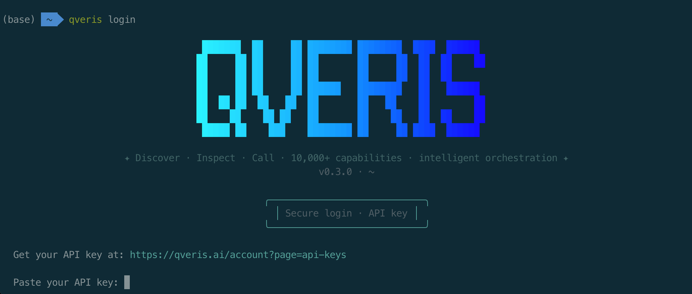
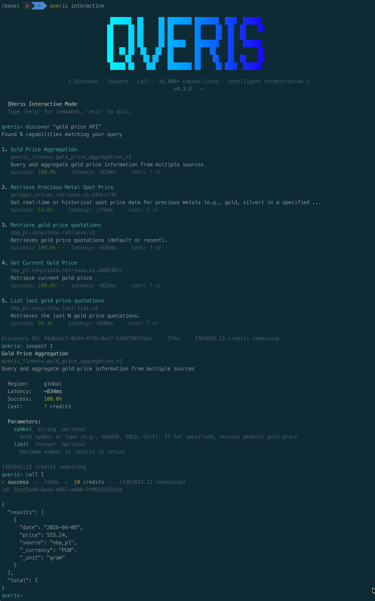
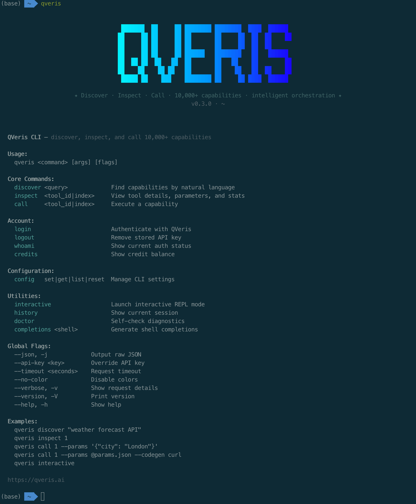
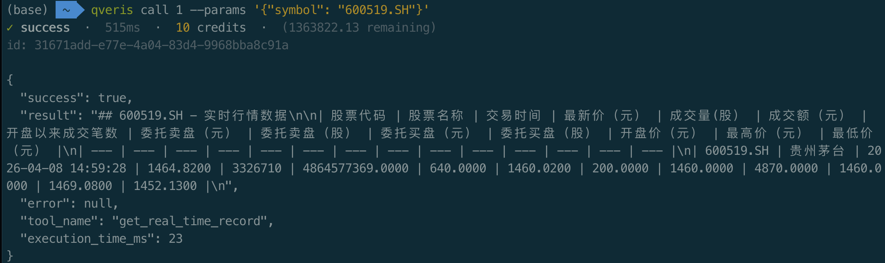
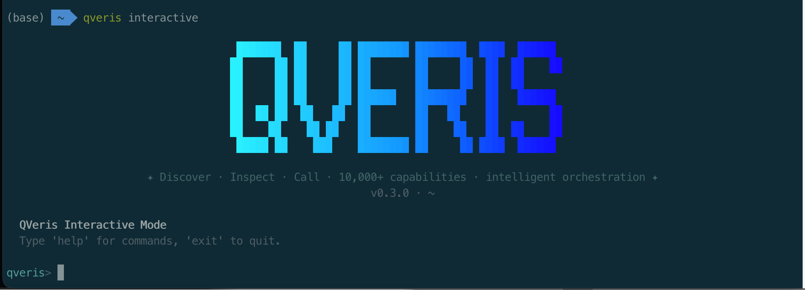
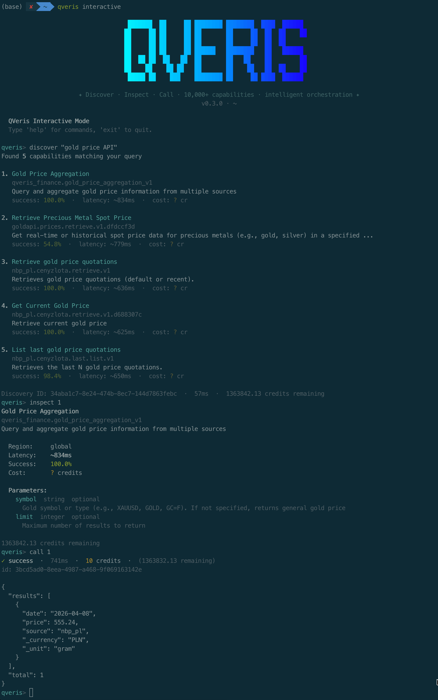

在 AI 智能体席卷开发者工具链的今天，一个现实问题始终没被很好地解决：**当你需要快速调用一个 API，却不想写代码、不想查文档、不想注册第三方平台——怎么办？**

现在，一行命令就够了。

**QVeris CLI** 是我们为开发者和智能体打造的命令行工具，让你在终端中用自然语言发现、检查和调用 10,000+ API 能力。无需翻文档、无需写适配代码，30 秒从零到可用。


---

## 01.

## 30 秒安装，开箱即用

一行 curl，全局可用：

```shell

curl -fsSL https://qveris.ai/cli/install | bash

```

或者用 npm：

```shell

npm install -g @qverisai/cli

```

安装完成后，登录只需一步：

```shell

qveris login

## 自动打开浏览器完成认证，API Key 安全存储到本地

```



> 🎁 **新用户福利**：注册即送 1,000 credits，搜索完全免费，无需绑卡。

---

## 02.

## 核心工作流：Discover → Inspect → Call

QVeris CLI 的设计哲学很简单——**像搜索引擎一样找 API，像终端命令一样用 API**。整个流程只有三步：

## 第一步：用自然语言搜索

不需要记任何 API 名称，直接描述你的需求：

```shell

qveris discover "实时股票行情"

```

CLI 会从 10,000+ 工具中语义匹配，返回最佳结果：

```plaintext

Found 6 tools:

  1. finance.stock_quote       实时股票报价       ⚡ 320ms  99.2%
  2. market.live_price         实时市场价格       ⚡ 450ms  98.7%
  3. trading.ticker_data       行情数据与历史     ⚡ 280ms  99.5%

```



每个结果都带延迟和成功率评分，一目了然。**搜索完全免费，不消耗任何 credits。**

## 第二步：查看工具详情

用索引号快速引用，不用复制粘贴长长的 tool_id：

```shell

qveris inspect 1

```

```plaintext

finance.stock_quote

Real-time stock price quotes from major exchanges

Provider: MarketData Pro  ·  Avg: 320ms  ·  Success: 99.2%

Parameters:

  symbol    string (required)   Stock ticker symbol

  exchange  string (optional)   Exchange code

```



参数、说明、性能指标一览无余。

## 第三步：调用并获取结果

```shell

qveris call 1 --params '{"symbol": "AAPL"}'

```

```json

{ "symbol": "AAPL", "price": 198.52, "change": +2.31, "volume": 45230100 }

```



**三条命令，从"我需要一个股票 API"到拿到实时数据，全程不超过 30 秒。**

---

## 03.

## 交互式 REPL：像对话一样探索 API

如果你想边探索边试用，`qveris interactive` 启动交互式环境：



```shell

$ qveris interactive

QVeris REPL v1.0 — type a query to discover tools, help for commands

qveris> weather forecast API

Found 4 tools:

  1. weather.forecast   7-day weather forecast   ⚡ 380ms
  2. weather.current    Current conditions        ⚡ 220ms

qveris> inspect 1

  weather.forecast

  Parameters: location (required), days (optional, default: 7)

qveris> call 1 {"location": "Shanghai"}

  { "location": "Shanghai", "forecast": [...] }

qveris> codegen curl

## Generated curl command:

curl -X POST https://qveris.ai/api/v1/execute \

  -H "Authorization: Bearer $QVERIS_API_KEY" \

  -d '{"tool_id":"weather.forecast","params":{"location":"Shanghai"}}'

```



> 💡 **亮点**：`codegen` 命令可以自动生成 curl / Python / JavaScript 调用代码，直接复制到你的项目中使用。

---

## 04.

## 智能体最高效的工具调用方式

**QVeris CLI 是智能体使用 QVeris 最节省 token 的方式。**

相比 MCP Server 要把完整 tool schema 塞进上下文（动辄几千 token），CLI 是：**一条命令进、JSON 结果出**，没有协议层冗余。

**# 结构化输出，智能体直接解析**（先搜能力，再按 `tool_id` / 序号接着用）

```bash

qveris discover "aggregate news or financial indicators into structured data" --json --limit 3

```

**# stdin 管道，适配自动化**（上游脚本拼好参数，下游直接 `call`）

```bash

echo '{"tickers":["AAPL","MSFT","GOOGL"],"interval":"1d"}' | \

  qveris call 1 --params - --json

```

（`1` 表示当前会话里最近一次 `discover` 结果中的序号；也可换成真实的 `tool_id`。）

**# 干跑验证，不消耗 credits**（确认参数与路由再真跑）

```bash

qveris call 1 --params '{"tickers":["AAPL","MSFT"],"interval":"1d"}' --dry-run --json

```

若你更强调 **「导出 Excel / CSV」**，可把 discover 换成更贴切的自然语言，例如：

```bash

qveris discover "export table or spreadsheet Excel CSV API" --json --limit 3

```

---

**说明（和真实工具对齐时）**：`discover` 返回的具体 `tool_id`、参数名以接口为准；智能体流程一般是 `**discover**`**→**`**inspect**`**看 schema →**`**call**`**/**`**--dry-run**`，和你现在 CLI 的用法一致。

> 🤖 **为什么比 MCP 更省 token？**
>
> - MCP：需要将所有工具的完整 schema 注入 LLM 上下文，随工具数量线性增长
> - CLI：单条 shell 命令 + JSON 输出，固定开销约 50-100 token
> - 在 10+ 工具场景下，CLI 方式可节省 80%+ 的 token 消耗

### 智能体友好设计

| 特性 | 说明 |
|---|---|
| `--json` 输出 | 所有命令支持结构化 JSON 输出，方便程序解析 |
| stdin 管道 | `--params -` 从标准输入读取参数，适配管道工作流 |
| 结构化退出码 | 0 成功 · 77 认证失败 · 69 服务不可用 · 75 网络超时 |
| 终端自动检测 | 管道模式自动禁用颜色和动画，响应体扩展至 20KB |
| `--dry-run` | 预验证参数，不消耗 credits |

**适用场景**：Claude Code、OpenCode、Cursor、自定义 Agent 脚本——任何能执行 shell 命令的智能体平台。

---

## 05.

## 完整命令速查

| **命令**|**说明**|**费用** |
|---|---|---|
| `qveris discover <query>` | 自然语言搜索 API 能力 | 免费 |
| `qveris inspect <id>` | 查看工具详情、参数、示例 | 免费 |
| `qveris call <id>` | 调用工具并获取结果 | 1-100 credits |
| `qveris interactive` | 启动交互式 REPL 探索环境 | — |
| `qveris login` / `logout` | 交互式登录 / 清除凭证 | — |
| `qveris whoami` | 查看当前认证状态 | — |
| `qveris credits` | 查看剩余额度 | — |
| `qveris config list|set|get|reset` | 管理 CLI 配置 | — |
| `qveris history` | 查看 / 清除当前会话历史（30 分钟 TTL） | — |
| `qveris doctor` | 一键检查 Node.js、API Key、网络连通性 | — |
| `qveris completions <shell>` | 生成 Shell 自动补全脚本 | — |

所有命令支持 `--json` 输出 · `--api-key` 覆盖认证 · `--timeout` 超时设置


---

## 06.

## 六大核心能力

  

    > 🔍 **自然语言搜索**用普通语言描述需求，CLI 从 10,000+ 工具中语义匹配最佳结果。无需记忆任何 API 名称。

    > 🔧 **代码生成**`--codegen` 一键生成 curl / Python / JS 调用代码，直接粘贴到项目中使用。

    > 🤖 **智能体兼容**`--json` 输出 + stdin 管道 + 结构化退出码，为自动化而生。

  

  

    > ⚡ **零配置即用**curl 一键安装，`qveris login` 交互式认证。30 秒从零到可用。

    > 💬 **交互式 REPL**`qveris interactive` 启动探索环境，像对话一样发现和试用 API。

    > 🎁 **内置诊断**`qveris doctor` 一键检查 Node.js 版本、API Key、网络连通性，快速排障。

  

---

## 07.

## QVeris CLI vs MCP Server：如何选择？

| 维度 | QVeris CLI | MCP Server |
|---|---|---|
| **适用场景** | 终端操作、脚本、Agent shell 调用 | IDE 内 Agent（Cursor、Claude Code、VS Code） |
| **安装方式** | `curl` 一行安装 | 在 IDE 设置中配置 |
| **Token 消耗** | 极低（单命令 50-100 token） | 较高（schema 注入上下文） |
| **输出格式** | 人类友好 + `--json` 结构化 | MCP 协议标准格式 |
| **交互模式** | REPL、管道、脚本 | IDE 内嵌对话 |
| **最佳搭配** | Claude Code、OpenCode、自定义 Agent | Cursor、VS Code Copilot |

> 💡 **建议**：两者并非互斥。CLI 适合终端和自动化场景，MCP 适合 IDE 内嵌场景。你可以同时使用！

---

## 08.

## 使用场景

## 场景一：开发者日常调试

写代码时需要快速验证一个 API 返回什么数据？不用离开终端：

```shell

qveris discover "geocoding API"

qveris call 1 --params '{"address": "北京市朝阳区"}'

```

拿到结果后，用 `codegen python` 直接生成 Python 调用代码，复制到项目里。

## 场景二：智能体自动化工作流

让你的 AI Agent 通过 shell 调用完成复杂任务：

```shell

## Agent 自动发现、验证、调用

qveris discover "weather forecast" --json --limit 1 | \

  jq -r ".results[0].tool_id" | \

  xargs -I {} qveris call {} --params '{"location":"Shanghai"}' --json

```

## 场景三：数据采集与分析

结合 shell 管道，批量获取数据：

```shell

## 批量查询多只股票

for symbol in AAPL GOOGL MSFT; do

  qveris call finance.stock_quote --params "{\"symbol\":\"$symbol\"}" --json

done | jq -s "."

```

---

## 09.

## 现在就试试

```shell

curl -fsSL https://qveris.ai/cli/install | bash

qveris login

qveris discover "你想要的任何 API"

```

> 🚀 **三条命令，解锁 10,000+ API 能力。**
>
> - 注册即送 1,000 credits，搜索免费
> - 无需绑卡，即装即用
> - 完全开源：[github.com/QVerisAI/QVerisAI](https://github.com/QVerisAI/QVerisAI/tree/main/packages/cli)

---

## 10.

## 关于 QVeris AI

QVeris AI 聚焦于 **Agent 时代的行动基础设施层**，致力于构建 AI 可理解、可调用的"能力互联网"。

**QVeris 当前定位：面向智能体的搜索和行动引擎，让智能体能够通过语义搜索发现并一键调用 10,000+ 工具。**

**产品矩阵：**

- **QVeris CLI** — 终端中的万能 API 入口（本文介绍）
- **QVeris MCP Server** — IDE 智能体的工具网关
- **QVerisBot** — 基于 OpenClaw 的生产级 AI 助手
- **QVeris REST API** — 标准 HTTP 接口，适配任何语言和平台

**官网：** [https://qveris.ai](https://qveris.ai)

**CLI 文档：** [https://qveris.ai/docs/cli](https://qveris.ai/cli)

**GitHub：** [https://github.com/QVerisAI/QVerisAI](https://github.com/QVerisAI/QVerisAI)

*QVeris 原创首发，转载请注明出处*
