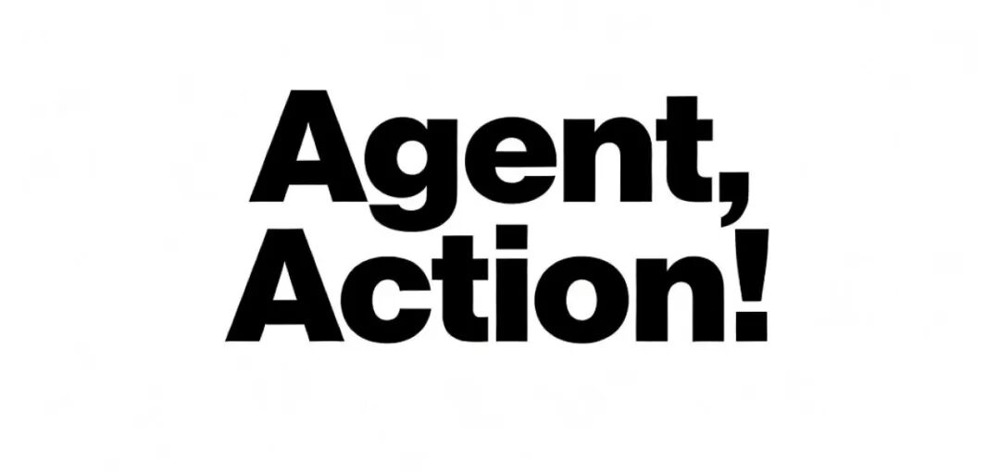
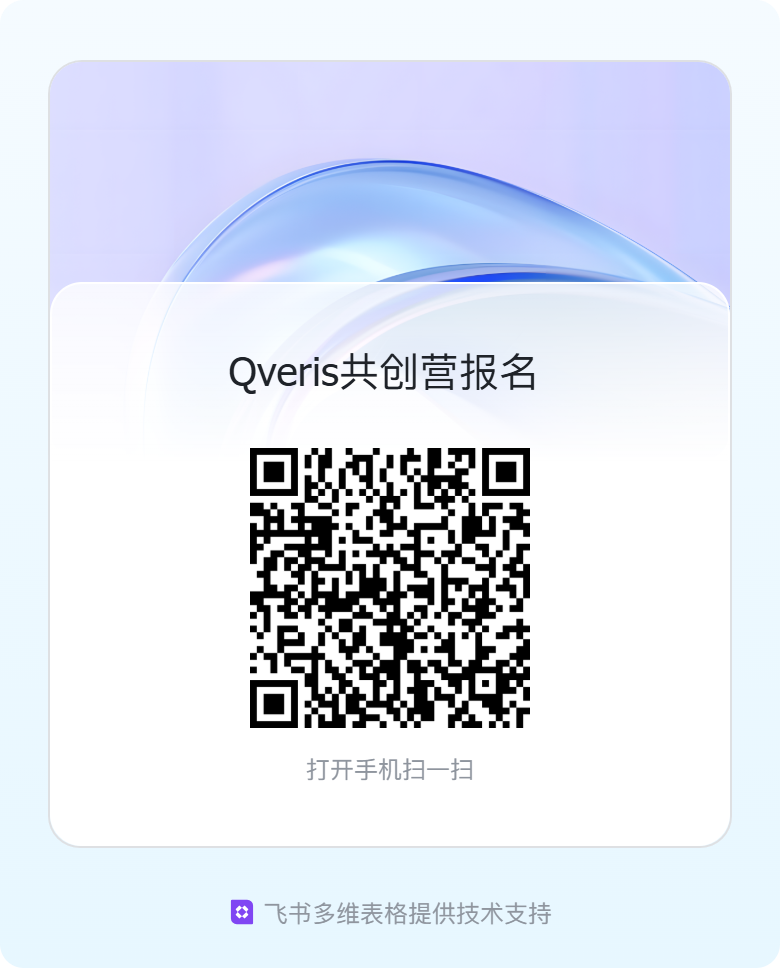

**这段时间，很多人都在聊 AI Agent。**

但在真正落地时，往往会遇到这个问题：

当 AI 想“真的去做事”时，

**它该如何选择+稳定、安全、低成本地调用工具和 API？**

这正是 Qveris 正在解决的问题。

## Qveris 在做什么？

Qveris 是一个 **AI Agent 的行动基础设施**。

我们关注的是 **AI是否真的完成了一次完整有价值的数据/工具调用闭环**：

-  获取多样化的真实数据/工具
-  在生产环境中稳定执行
-  同时具备成本可控与可审计性

如果你正在做 AI 应用、Agent 或自动化系统，这些问题你大概率已经遇到过。

## 为什么要发起 Qveris AI 共创营？

需要先说明一件事：

> **这不是一场比赛，也不是一次展示型黑客松。**

Qveris 目前仍处在 **内测与能力打磨阶段**。

与其追求规模化使用，我们更希望通过 **真实场景共创**，

**帮助开发者快速和低成本的进行实际的场景落地和持续优化。**

因此，我们发起了这次：Qveris AI 共创营（分阶段内测）

## 共创营适合什么样的开发者？

如果你：

-  正在做 / 计划做 **AI Agent 或 AI 应用**
-  需要调用多个 API、工具或数据源
-  在意开发效率、稳定性与成本问题
-  希望参与一个 Infra 产品的早期共创过程

那么你**非常适合参与!**

## 共创营会做什么？

在 **2–3 周**的共创周期内：

1. 你将基于 Qveris 构建一个 **真实应用场景**
1. **与 Qveris 团队进行 一对一深度共创**
1. **一起讨论并设计：**

工具 / API 的调用方式

Agent 的执行与编排流程

稳定性、成本与可复用能力

所有“难落地的地方”，👉 都欢迎直接提出，我们会同步优化

## Qveris 能提供什么？

1. **Qveris Token / API 使用+技术支持**
- 实时重点服务与工程迭代的快速反馈
- 提供共创期间所需的 Token 与工具调用额度
1. **共创现金奖励（有明确触发条件）**

为了尊重真实的工程投入，我们设置了 **小额但确定的现金奖励**：

- 完成一个可运行 Demo：**¥300 – ¥500**
- 场景能力被采纳并进入 QverisAI官网展示/联合开源：**¥500 – ¥1,000**
- **帮你大力推广：额外奖励 + 联合宣发 + 后续深度合作**
1. **官方长期合作推广与长期合作机会**
- 共创项目将进入 Qveris 官方案例（可选）
- 长期的token支持计划以及专属的工程反馈渠道

## **共创营参与方式说明**

- 共创营将采用 **小规模、分阶段的方式进行**
- 我们会优先支持 **有真实场景、愿意持续投入的项目**
- 随着能力逐步成熟，也会持续向更多开发者开放共创与内测机会

## 如何报名？

请回复以下 3 个问题（真实即可）：

1. 你正在做 / 想做什么 AI 场景？
2. 你需要的工具 / API 是什么？
3. 你平常用什么开发？（Cursor/trae/Claude code...）
4. 留下你的联系方式

扫码报名，我们会逐一回复👇

**Qveris 希望和开发者一起，**
**让你的 AI Agent“行动起来”！**
**欢迎加入 Qveris AI 共创营！**