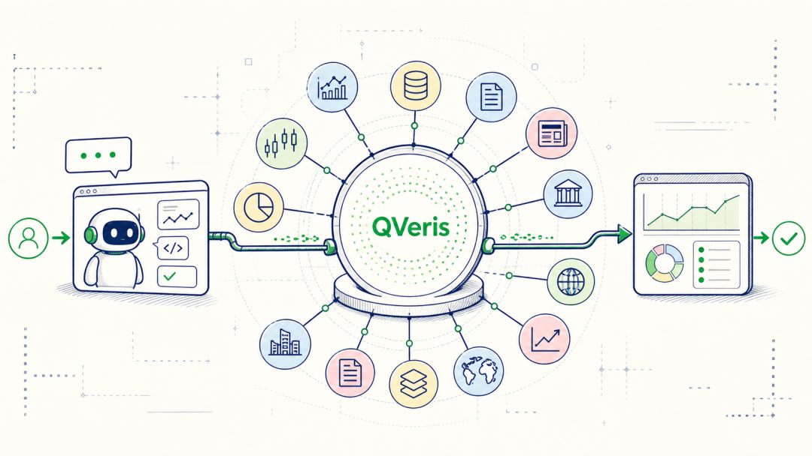
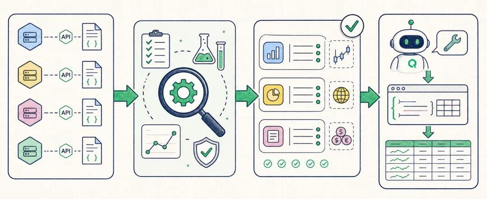
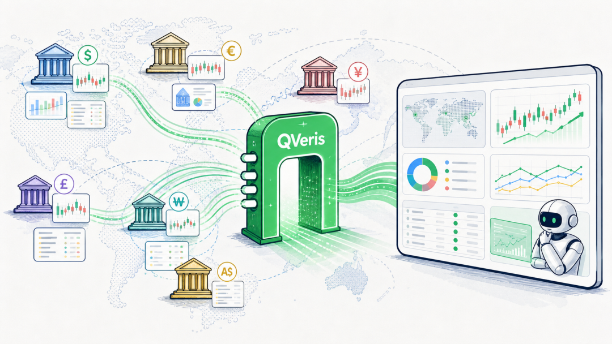
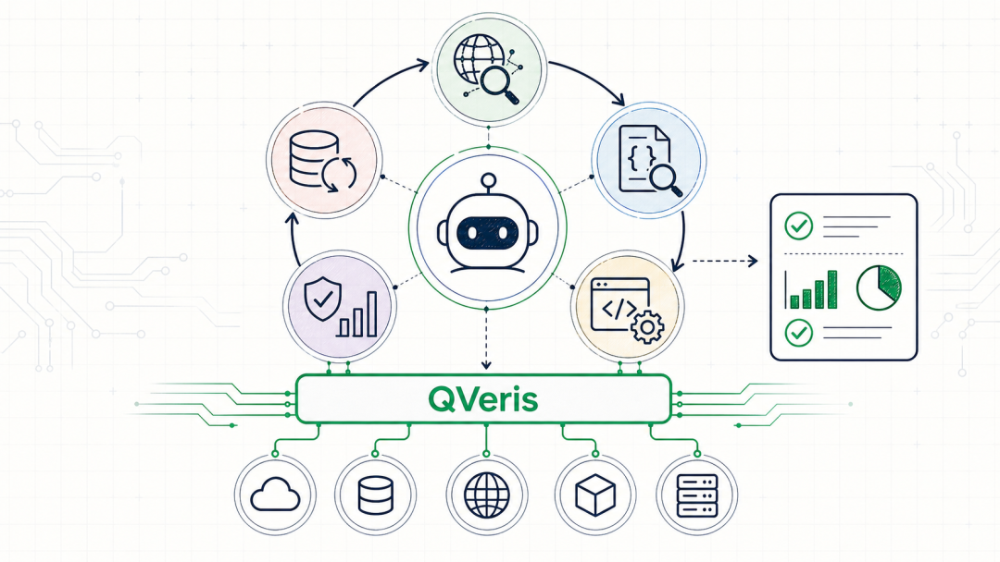

QVeris · 产品理念 

  

过去一年，很多人都在做 Agent。

但真正把 Agent 放进金融场景里，很快会遇到一个现实问题：模型会说话，不代表它能稳定地做事。

比如你让 Agent 分析一家公司，它需要的不只是"写一段分析"。它要能找到行情数据、公司财务、公告新闻、宏观指标、行业数据，甚至还要知道哪个工具能查 A 股，哪个工具能查美股，哪个工具支持历史行情，哪个工具只返回公司 profile。

更麻烦的是，这些能力往往分散在不同 API、不同 provider、不同文档、不同参数格式里。

对人来说，这是接 API 的工作。

对 Agent 来说，这是能不能真正行动的前提。

QVeris 最近在做的事情，就是把这些分散的 API，整理成一个 Agent 可以理解、可以选择、可以调用、可以验证的金融能力网络。
## API 很多，但 Agent 真正需要的是"能力"

传统接 API 的方式，是先看 provider 文档，再写代码调用某个 endpoint。

**但 Agent 的问题不是"有没有 API"，而是**：

用户问的问题，对应哪类金融能力？

这个 provider 的哪个 tool 能完成？

它需要什么输入？

返回结果里哪些字段能用？

调用失败是参数错、权限错、没有数据，还是 provider 暂时异常？

同一个能力，哪个 provider 更稳定、更便宜、更适合当前任务？

如果这些信息没有被结构化，Agent 就只能靠猜。

这也是为什么 QVeris 不只是做"API 聚合"。API 聚合解决的是入口问题，QVeris 更进一步解决的是能力理解问题。

我们会把一个个工具放进评估流程里，判断它到底覆盖了哪些金融能力：比如实时行情、历史 K 线、公司画像、财报字段、宏观指标、ETF 持仓、新闻事件、监管文件等。

最后沉淀下来的，不是一堆 endpoint 列表，而是一张能力网络：每个能力知道自己能被哪些工具完成，每个工具知道自己适合哪些场景，每次调用也能留下可复核的证据链。

## 从分散工具，到可评估的能力

一个工具接进来之后，不能只看文档说它支持什么。

真实世界里的 API 文档经常有各种不确定性：示例参数可能过时，字段名可能不一致，某些市场可能支持、某些市场不支持，同一个 endpoint 在不同 provider 下返回结构也不同。

所以 QVeris 需要做一层评估。

**简单说，评估流程会做几件事**：

先判断这个工具可能匹配哪些金融能力。

再构造真实测试参数，调用工具拿结果。

然后检查返回数据是否真的覆盖能力要求的字段。

最后把成功、失败、部分成功、空结果、权限限制等情况记录下来。

这一步很关键。

因为 Agent 不能只知道"有一个工具叫 company profile"。它要知道这个工具是否真的能返回公司名称、交易所、币种、行业分类、ISIN、CEO、IPO 日期等字段；也要知道它在美股、A 股、港股、欧洲市场上的表现是否一致。

这才是从"工具列表"走向"能力网络"的关键。

## 金融场景最怕的是"看起来能查，其实查不准"

金融 Agent 的一个典型场景是跨市场投研。

**比如用户问**：

"帮我比较贵州茅台和雀巢的基本面。"

**这个问题表面上只是两个公司对比，但真正执行时，Agent 先要解决一堆基础问题**：

贵州茅台的代码是什么？在哪个交易所？人民币计价还是其他币种？

雀巢用瑞士本地股票，还是 ADR？

两个公司能不能用同一套字段比较？

历史行情、公司 profile、财务指标的数据口径是否一致？

如果没有 QVeris 这样的能力层，Agent 很容易在市场、币种、ticker、字段结构里迷路。

而 QVeris 要做的是把这些复杂性尽量压平：让 Agent 不是先变成"数据源调度员"，而是可以直接围绕研究问题组织 workflow。

当它需要公司 profile，就去发现 profile 能力。

当它需要历史行情，就去找行情能力。

当它需要新闻或公告，就去调用对应的信息能力。

每一步都能知道工具来源、输入参数、返回字段、调用状态和失败原因。

这对金融场景尤其重要。因为一个没有来源、没有字段验证、没有调用记录的"流畅分析"，反而比一句"我查不到"更危险。

## 可调用，不等于可靠调用

Agent 调工具时，失败很常见。

有时是参数格式错了。

有时是 provider 返回空数据。

有时是权限不足。

有时是调用超时。

有时 API 表面成功，但返回的其实是样例数据、付费提示或无效内容。

如果系统只告诉 Agent "调用失败"，它下一步还是只能乱猜。

**所以 QVeris 还会把调用结果做结构化归因。比如区分**：

这是有结果的成功调用；

这是部分成功；

这是空结果，不应该盲目换参数重试；

这是 provider 错误，可以根据错误信息修正；

这是鉴权或权限问题，需要升级给人处理；

这是限流或超时，可以稍后重试。

这套机制让 Agent 不只是会调用工具，还能理解调用结果。

它知道什么时候该换参数，什么时候该换工具，什么时候该停止，什么时候该告诉用户"这个数据源当前不可用"。

这就是 Agent 从 demo 走向生产时必须具备的可靠性。

## QVeris 想提供的是金融 Agent 的行动层

如果说大模型是大脑，QVeris 更像是行动层。

**它不替模型做最终判断，也不承诺"预测涨跌"。它做的是更底层、更稳定的事**：

把金融 API 变成标准化能力；

把 provider 的差异收敛成 Agent 能理解的描述；

把调用过程变成可追踪、可复核的证据链；

把失败原因结构化，让 Agent 能继续推进任务；

把成功经验沉淀下来，让下一次调用更稳。

这也是我们理解的 Tool-native AI。

未来的 Agent 不会只在聊天框里回答问题。它会发现工具、选择工具、调用工具、验证结果，并把真实世界的数据带回推理过程。

而 QVeris 要做的，就是让这件事在金融场景里变得足够稳定、足够透明、足够可扩展。

从分散 API 到能力网络，中间隔着的不只是技术接入，更是一整套评估、标准化、调用、验证和运营机制。

这正是 QVeris 最近持续在打磨的方向。
