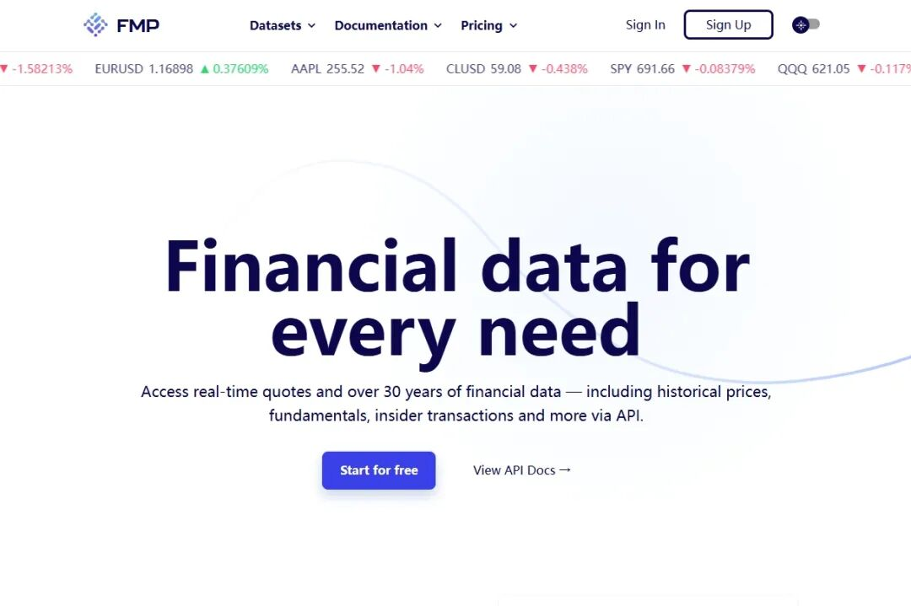
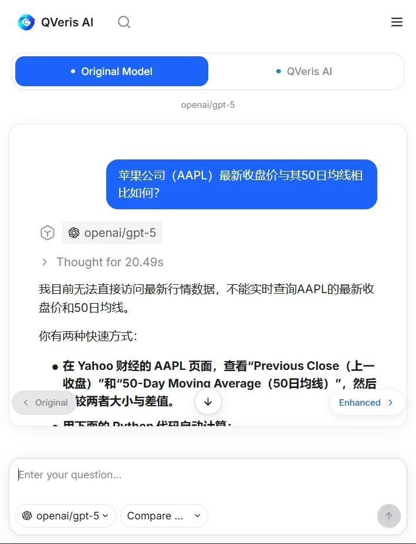
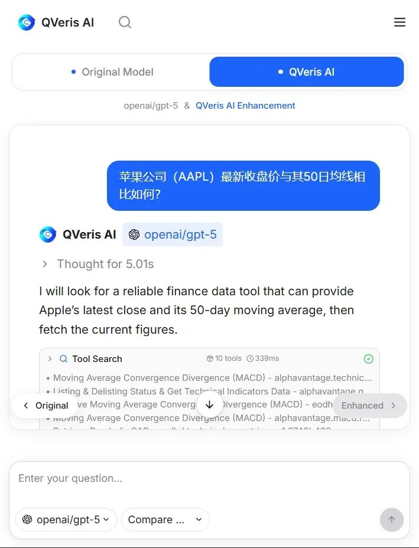
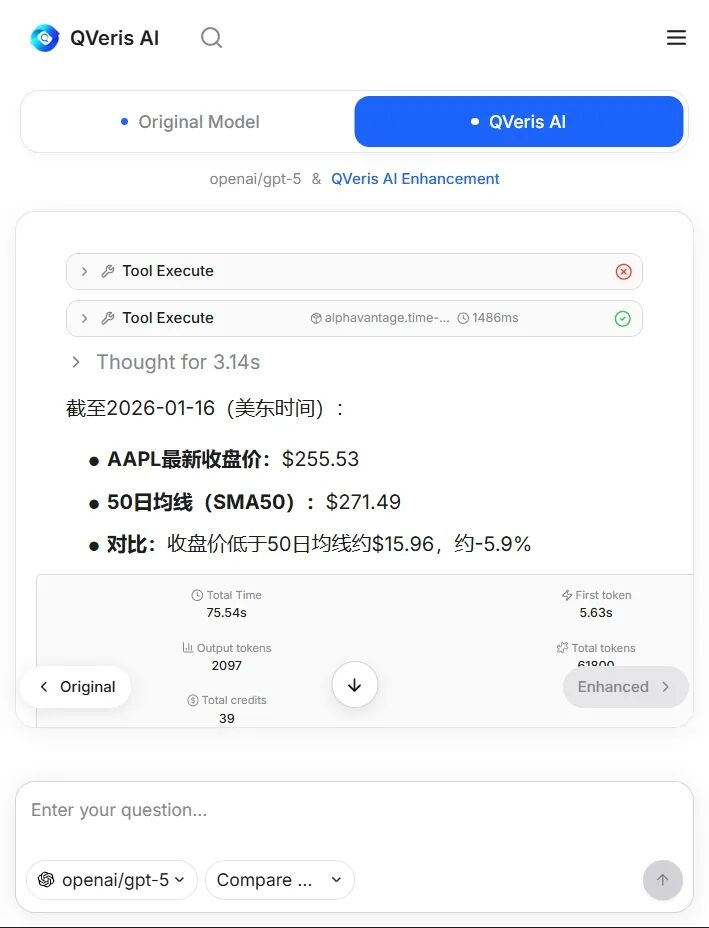

## 日期：1.20

## Qveris.ai最新接入了 Financial Modeling Prep（FMP）。

如果你做过金融相关的分析、量化或数据产品，大概率对它并不陌生。FMP 提供的是结构化、持续更新的金融数据接口，覆盖公司财报、估值指标、行情、宏观数据等，是很多金融工具和脚本背后的“数据底座”。

但当 FMP 被接入 Agent 世界时，它的意义发生了变化。

它不再只是“给人用的数据 API”，而是成为 Agent **可以主动搜索、选择、调用的金融能力之一**。

### 接入前 vs 接入后，Agent 能做什么不同？

我们可以通过一个简单的金融问题直观感受到接入前后的变化。

例如：

- “苹果公司（AAPL）最新收盘价与其50日均线相比如何？”
- “展示英伟达（NVDA）的收入增长和估值比率。”
- “获取贝莱德（BlackRock）最新的13F持仓报告。”
- “比较比特币（BTC）过去6小时的价格走势。”

**未接入时：**

- Agent 只能基于已有知识或少量固定插件分析
- 数据时效性无法保证
- 一旦某个数据源不可用，任务直接中断

**接入 FMP 之后：**

- Agent 可直接调用最新财报、行情与估值数据
- 可在同类金融数据源中进行搜索与选择
- 当某个数据源异常时，自动切换替代方案
- 真正完成从“分析”到“行动”的闭环

这正是 Agent 落地过程中最关键、也最容易被忽略的一层。

可以看到，接入后Agent更精准地调用各种金融数据。

### 从 FMP 开始，但不止于 FMP

FMP只 是一个开始。

接下来，我们会持续把更多**专业数据、垂直工具、行业能力**接入到 Agent 世界里，让它们不再只是“API 列表”，而是真正可以被 Agent 使用的行动资产。

---

如果你正在做 Agent、金融分析、自动化决策，或者只是关心：**Agent 到底什么时候能真正落地**——

后续我们将持续更新类似 FMP 这样的接入。

因为在我们看来，Agent 的未来，不是从更会说开始，而是从 **真的能用、真的能跑、真的能替人做事** 开始。

欢迎体验QVeris AI：https://qveris.ai/
