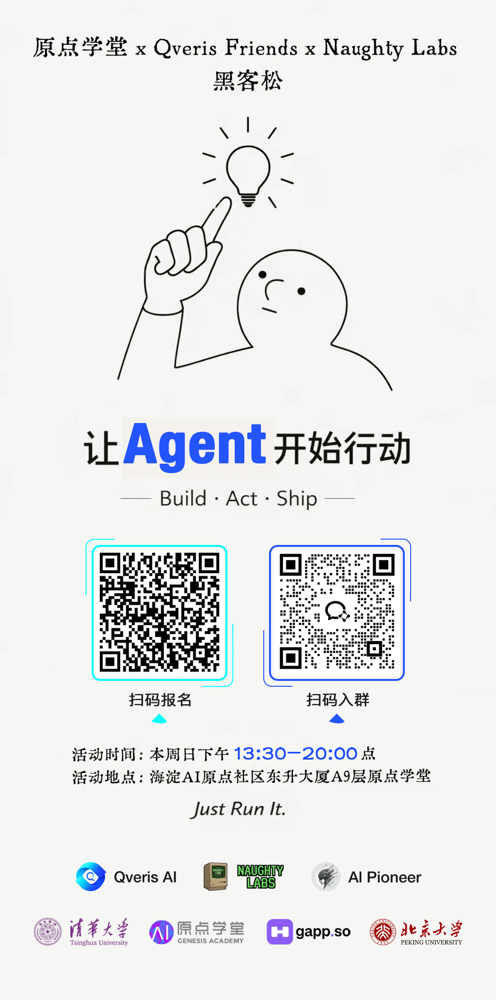
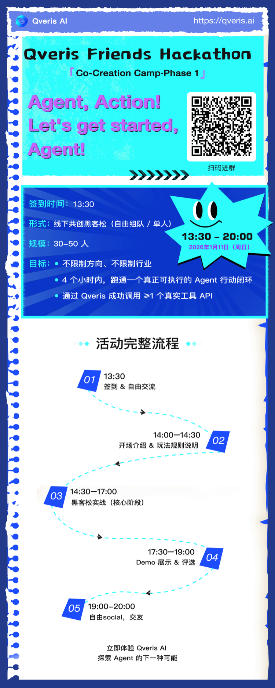

转发👆海报到朋友圈 = 现场获得1杯酒水兑换券（限前50位）

活动详情
**主题：**Agent, Action！

## **开始行动吧，Agent!**
**目标**：在 4 个小时内，跑通一个真正可执行的 Agent 行动闭环。

（通过 Qveris 成功调用 ≥1 个真实工具 API）

**奖金**：3个奖项各2000元（500元现金+1500元等值QverisAI Credits）

**时间**：周日 13:30 – 20:00

**地点：**北京海淀区五道口东升大厦A座9楼（原点学堂）

**签到：**13:30

**形式**：线下共创黑客松（自由组队 / 单人）

**规模**：30–50 人（场地有限，敬请谅解）

**玩法规则说明 & Demo 标准**
不限制方向，不限制行业和产品形态

只关注一件事：

👉 是否在 4 小时内跑通一个真正可执行的 Agent 行动闭环

最终产品形态可以在本地电脑预览展示

**最终评选 3 个项目**
**（每个奖项各一队：¥2000，现金500+1500元等值Qveris积分）**

1.The Best PMF ：最具商业潜力的项目 （1队，现场投票）

2.Just for Fun ：最好玩的项目 （1队）

3.Qveris 特别奖 ：对Qveris价值挖掘最大的（1队）

**评奖标准：**

项目提交Github算完成，参与评奖。

Github提交地址👇

https://github.com/QverisFriends

**投票标准：**

每人3票，前两个奖项现场互投，最后一个奖项Qveris官方评选

**福利部分！**
1. **注册 Qveris.ai：即赠送 5000 点 Credits：**
1. **Star Qveris Github：现场兑换饮品一杯👇**

 https://github.com/QverisAI/QverisAI

**3.**3个奖项各2000元（500元现金+1500元等值QverisAI Credits）

1. **现场提供披萨和饮料**
活动完整流程
**13:30–14:00｜签到 & 自由交流**

扫码签到

贴名牌

自由交流、找队友、报名sign up

**14:00–14:30｜开场 & Qveris 快速认知**

**负责人：主持 / 组织者**

活动流程：

Qveris Friends 是什么（2 分钟）

Qveris 是什么 & 能解决什么问题（5 分钟）

Qveris 怎么用？Cursor，VSCODE，trae，MCP （10分钟）

今天的玩法，目标 & 成功标准（5 分钟）

奖励 & 后续共创机制（5 分钟）

**14:30–17:30｜黑客松实战**

自由开发 / 自由组队

Qveris Support 现场答疑

16:30 轻提醒一次进度（不打断）

**17:30–19:00｜Demo 展示 & 评选**

每个项目 3 分钟展示 + 2 分钟提问

现场评选 + 颁奖 + 合影

**19：00-20：00 ｜自由Social，交友**附件：

**QverisAI官网**👇

https://qveris.ai

**QverisAI Github**👇

https://github.com/QverisAI/QverisAI

**调用QverisAI插件方式**👇（支持Cursor/Claude code...）

**https://qveris.ai/plugins**

**Github提交地址**👇

https://github.com/QverisFriends
