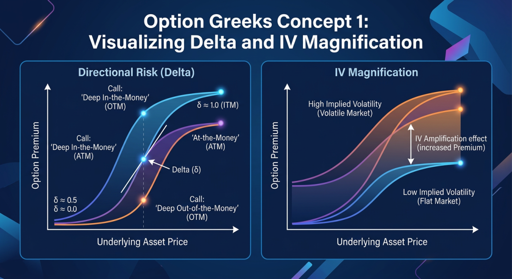
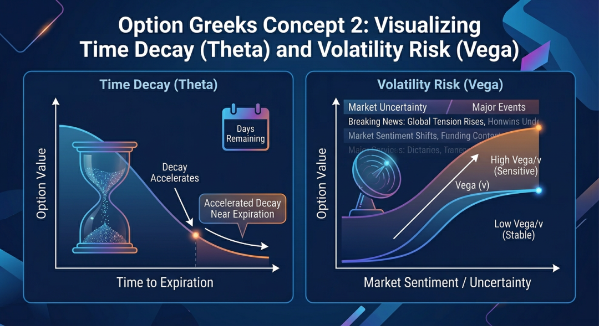
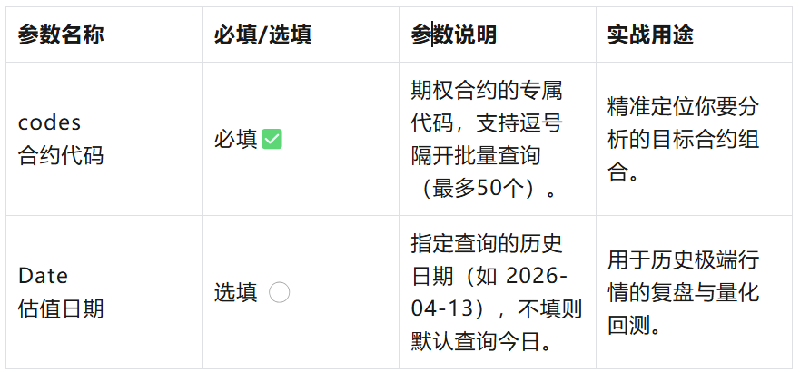
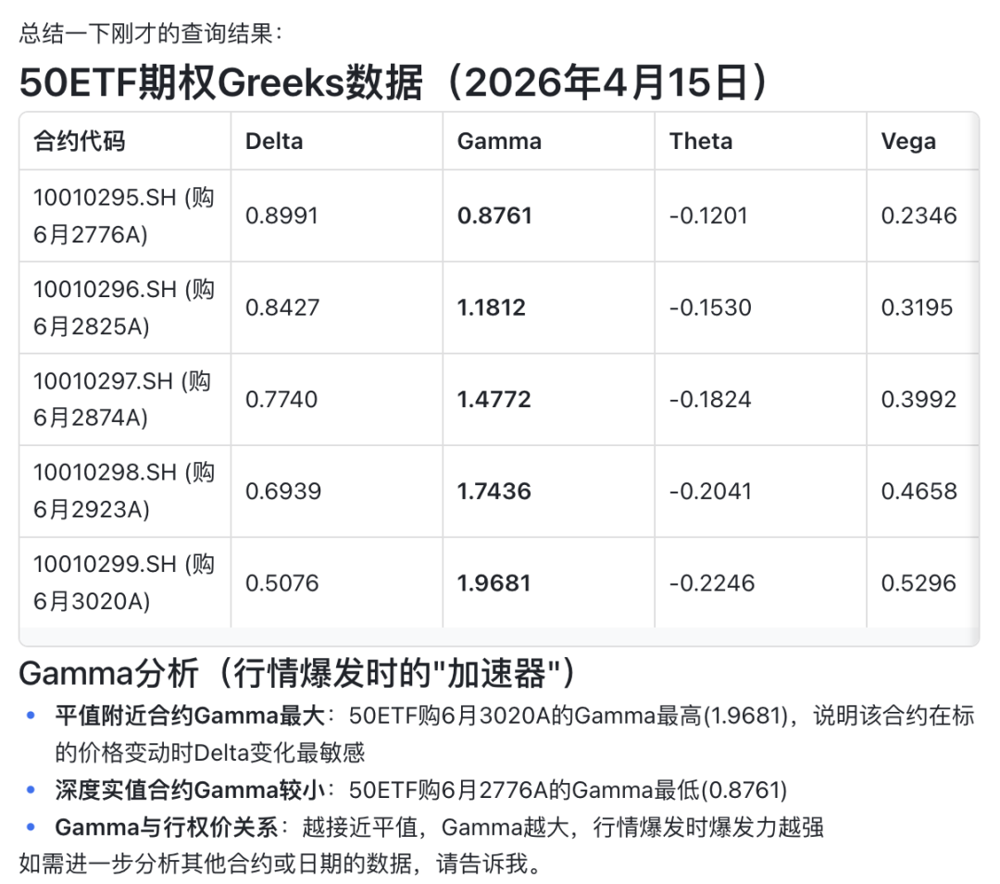
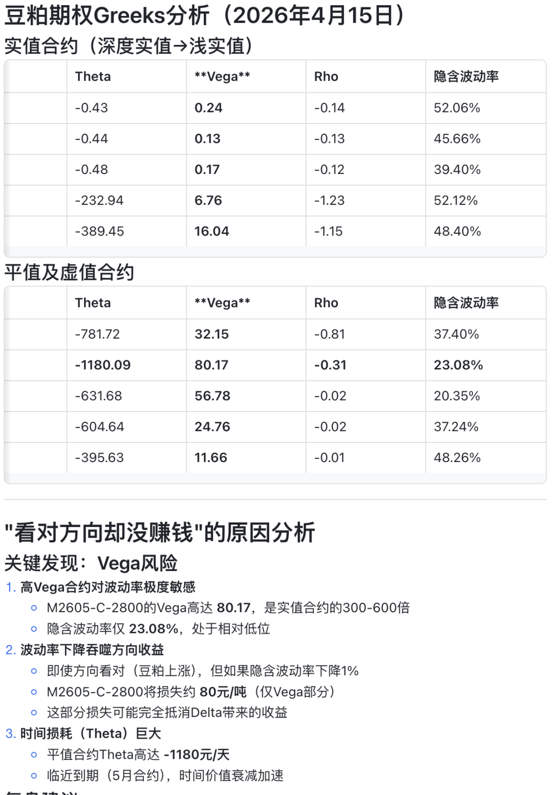

在期权交易的立体博弈中，如果你只盯着静态的“看涨/看跌”价格，那就像是在迷雾中航行 。真正的期权高手，不仅看标的方向，更要洞悉价格背后的真实驱动力——**隐含波动率 (IV**)与**风险敏感度指标 (Greeks)**。

- 为什么大盘涨了，我的看涨期权价格却在亏钱？（降维打击：**IV**下降的锅）

- 期权快到期了，持仓成本每天在无形消耗？（时间流逝：**Theta** 的力量）

- 如何构建一个对方向“脱敏”，只赚时间或波动率钱的策略？（你需要精细对冲：**Delta**&**Vega** 的协同）

如果你在交易中也曾有过这些困惑，那么今天这款全新上线的「**期权Greeks/IV 风险洞察工具**」，将成为你不可或缺的交易利器！

------------------------------------------------------------------------

## 亮点一：全品种、立体风险监测

无论你是关注上海证券交易所、深圳证券交易所的各类 ETF期权（如50ETF、300ETF），还是中国金融期货交易所的股指期权，或者是各大商品交易所的 商品期权（如铜、豆粕、白糖、工业硅等）

只需输入合约代码，即可瞬间拉取该合约的精细风险体检报告。

------------------------------------------------------------------------

## 亮点二：灵活的时间穿越，精准复盘

这款工具支持自定义估值日期。不仅可以查看今天的实时风险敞口，更支持回溯历史特定日期的 **Greeks**和**IV**，为你的量化策略回测和历史复盘提供坚实的数据支撑。

👇 【数据字段全景】 👇

|  |  |
|----|----|
| 中文释义 | 数据说明 |
| 隐含波动率(IV) | 市场预期的未来标的价格波动程度 |
| Delta (方向风险) | 标的价格变动1元时期权价格的变动量 |
| Gamma (凸性风险) | Delta对标的价格的变化率 |
| Theta (时间耗损) | 时间流逝1天时期权价格的变动量 |
| Vega (波动风险) | 隐含波动率变动1%时期权价格的变动量 |
| Rho (利率风险) | 无风险利率变动1%时期权价格的变动量 |

------------------------------------------------------------------------

##  

## 亮点三：化繁为简，读懂“六大天王”

我们将复杂的期权定价模型化繁为简，为您特别配制了通俗易懂的指标应用插图，带您一键解锁期权交易的核心密码。

### 📊 1. 隐含波动率 (IV) & 方向风险 (Delta)

隐含波动率 (IV) 衡量的是市场对未来波动的预期，它直接决定了期权的价格是贵了还是便宜了。**Delta** 则告诉你期权相对于标的方向的胜率。

*Greeks 插图 1：可视化 IV 对期权溢价的放大效应，以及 Delta 随标的价格变化的规律。*

------------------------------------------------------------------------

### 📈 2. 时间耗损 (Theta) & 波动风险 (Vega)

Theta 是时间的朋友也是敌人，它告诉你持仓多拿1天要付多少“租金”。Vega 则是你对波动率变化敏感度的仪表盘。

*Greeks 插图 2：可视化 Theta 的时间加速效损，以及 Vega 如何捕捉市场情绪变化。*

------------------------------------------------------------------------

## 极简操作：如何发起一次查询？

我们把使用门槛降到了最低，同时保留了高阶玩家需要的自定义空间。你只需要配置以下参数：

*开发者提示：codes必须精确到股权代码（如：10010295.SH,10010304.SH、M2605-C-2400.DCE、M2605-C-2450.DCE等）。*

------------------------------------------------------------------------

## 实战演示：洞悉合约的真实面貌

*(这里我们准备了两个真实的交易场景，请看工具的精彩表现！)*

- ### 场景一：对比 50ETF 不同行权价的“加速器” (Gamma)

<!-- -->

- 需求描述：查询一下昨日的50ETF期权（如：）Greeks数据

👇 【运行结果展示】 👇

> 洞察分析：从返回的数据可以清晰看到，平值附近的期权 Gamma 值显著高于深度实值期权，这意味着一旦行情启动，平值期权的 Delta 变化最敏感、增长速度最快，具有极强的爆发力！

###  

- ### 场景二：复盘豆粕期权的“波动率回归” (Vega & IV)

<!-- -->

- 需求描述：查询昨日大商所豆粕期权（如：M2605-C-2400.DCE、M2605-C-2450.DCE）的 Vega 值，复盘为何当时“看对方向却没赚钱”。

👇 【运行结果展示】 👇

> 洞察分析：“看对方向却没赚钱”，根源在于平值期权遭遇了“波动率杀”与“时间杀”的双重打击。平值合约对隐波极度敏感（Vega高达80.17），且临近到期时间价值加速流失（Theta高达-1180）。隐波的微降和每天高昂的时间成本，完全吞噬了方向做对带来的收益。在期权交易中，波动率的回归和时间的飞速流逝往往是真正的利润杀手。

------------------------------------------------------------------------

## 结语

期权交易是一场关于概率、时间与波动的立体博弈。拒绝凭感觉交易，用数据武装你的直觉！

这款「**期权Greeks/IV 风险洞察工具**」通过高度封装底层接口，为您屏蔽了繁琐的请求构造和指标解析过程。您只需填入明确的时间与合约，干净、可直接用于计算的结构化指标便触手可得！

快来体验，开启你的期权高阶进阶之路吧！

------------------------------------------------------------------------

---

原文链接：[微信公众号原文](https://mp.weixin.qq.com/s/x90wLSmQTzKb7l_fUnRyYQ)
