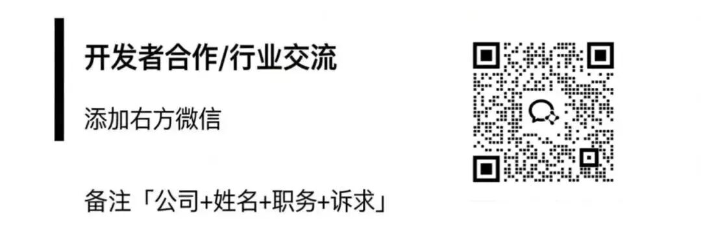
> QVeris 新供应商速递 | 第 2 期

三月的寒武纪让很多人心态崩了。月初 1200，月底跌到 1009，最大回撤 18.5%。

打开同花顺，你能看到一根根绿色的 K 线。但坐在你对面的机构研究员，同样是看寒武纪，他的屏幕上还有什么？

**券商一致预期、研报结构化观点、172 家同行对比、股东户数变动趋势、主力资金逐笔流向……**

这些数据过去只存在于 Wind 终端里，年费 4 万起。

直到我在 QVeris 上发现了恒生聚源——252 个金融数据 API，一句话就能拿到机构级数据。我用寒武纪做了一次完整测试。

## 第一层：你在同花顺也能看到的

先拉最基础的。"寒武纪实时行情"，6 秒返回 30 个字段：收盘 1009.45 元、跌 1.42%、成交 52.5 亿、换手率 1.25%、总市值 4256.7 亿、市净率 35.96。

日 K 线更完整——21 个交易日数据，每天含开高低收、成交额、振幅、量比。3 月 23 日那根 -5.24% 的长阴线（最低打到 968），紧接着 24 日 +5.89% 的大阳反弹，量价关系一目了然。

这些数据免费 APP 也有。但接下来的内容，**是你在同花顺里看不到的。**

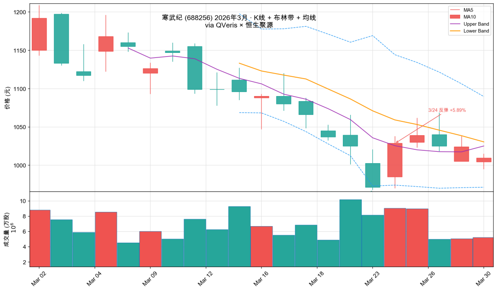

## 第二层：过去要花 6 万买 Wind 才能看到的

### 212 条券商预测，一句话拉出来

"寒武纪一致预期"——返回的数据让我愣了一下。

不是一个笼统的"分析师看好"，而是**212 条具体预测**，来自华泰、浙商、东海、广发、国海等十余家券商，每条都有明确的营收预测、净利润预测、EPS 和目标价：

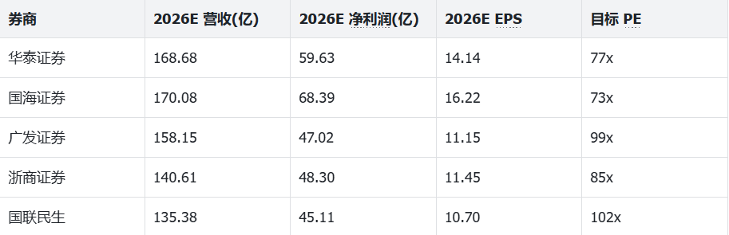

市场一致预期：**2026 年营收 143 亿（+120%）、净利润 49.5 亿（+140%）、目标价 1546 元**——比现价 1009 元高出 53%。

这组数据的价值不只是"目标价"本身。**预期分歧度**才是量化因子：华泰给 168 亿营收，国联民生只给 135 亿，分歧率 25%——这意味着市场对寒武纪 2026 年的增长路径还没有达成共识，波动率会继续维持高位。

做量化的人都知道，**分析师预期修正**是学术界验证过的最强 alpha 因子之一。当多家券商同时上调 EPS 预期时，股价往往跟涨。这个数据，过去只有 Wind 研究版（6 万+/年）才能批量获取。

### 研报不用读 PDF，结构化观点直接拿

更让我惊讶的是"公司研究观点"接口。它不是给你一堆 PDF 链接，而是**把研报拆成了结构化的维度**——盈利状况、公司经营、技术水平、核心产品、市场份额，每个维度单独提取观点：

- **华泰证券 (3/17)**："国产 AI 芯片第一梯队，2026E 营收 168 亿"
- **东海证券 (3/19)**："思元系列芯片 Day0 适配 DeepSeek-V3.2-Exp、智谱 GLM-5 等主流大模型"
- **浙商证券 (3/23)**："维持买入，预计 2026-28 年归母净利 48/76/135 亿"

这种结构化数据可以直接喂给 NLP 模型做情绪分析——不需要自己去爬研报、解析 PDF。

### 172 家同行对比，一个接口搞定

"寒武纪同行业财务比率比较"——返回半导体行业 **172 家公司**的 ROE、毛利率、净利率、资产负债率横向对比：

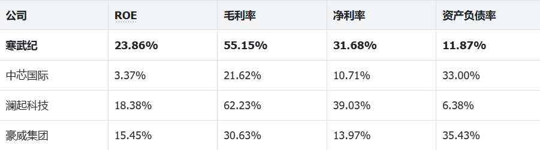

寒武纪的 ROE 23.86% 在半导体行业排名前列，资产负债率仅 11.87% 极为健康。做多因子模型需要行业内排序，这个接口**一次调用返回整个行业**，省去几小时的数据清洗。

## 第三层：量化选手的私藏信号

### 资金流向：谁在卖？

"寒武纪资金流向"——秒级拆解：超大单净流出 2.83 亿、大单净流入 0.80 亿、中单净流入 2.03 亿、散户几乎没动。

翻译一下：**机构在减仓，中等资金在接盘**。5 日累计主力净流入 +1.86 亿，但 10 日累计净流出 -3.68 亿——短期有反弹资金进场，中期趋势仍是流出。

融资余额 **155.42 亿元**，融资成本价 796.94 元——当前价 1009 远高于融资成本，杠杆资金暂时安全。但如果继续下跌接近 800 一线，融资盘可能触发踩踏。

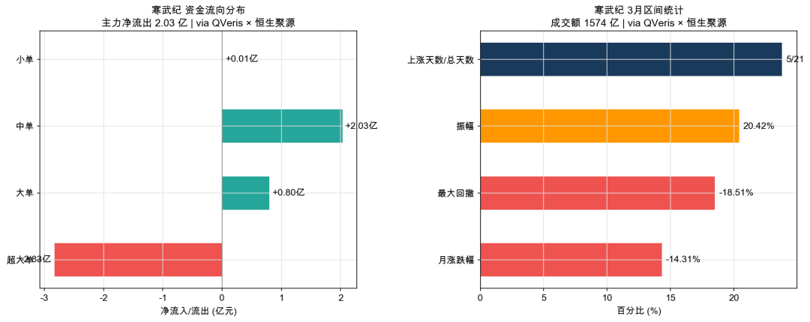

### 股东户数：散户在疯狂涌入

这是我觉得最值得关注的信号。"寒武纪股东户数"：

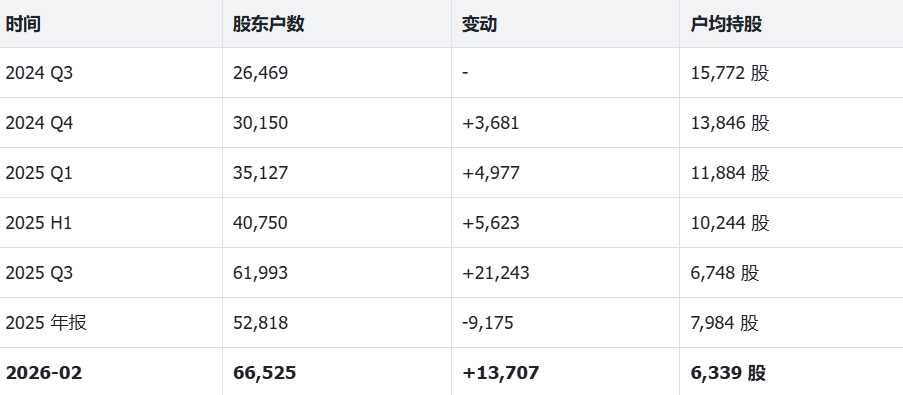

一年半时间，股东户数从 2.6 万飙升到 **6.6 万**，增长 151%。户均持股从 15,772 股降到 6,339 股——**筹码在从机构流向散户。**

量化圈有句话：**"股东户数下降是好事，上升要小心。"** 户数下降意味着筹码集中、机构吸筹；户数飙升意味着散户追高接盘。这个因子在 A 股回测中年化超额 5-8%，但数据过去只能从季报里手动一个个扒。

### 大宗交易：折价 23% 的信号

"寒武纪大宗交易"返回 32 笔记录。最扎眼的一笔：2025 年 10 月 22 日，中信证券买入 4.68 万股，成交额 5125 万，**折价 23.39%**。大宗交易折价超过 15% 通常意味着大股东或机构急于减持——这是同花顺的大宗交易页面不会帮你标红的细节。

### 财报点评：AI 自动生成的结构化分析

"寒武纪财报点评"——接口直接返回一份结构化分析报告：

> **"AI 算力需求释放驱动业绩爆发，盈利与业务结构优化成效显著"**
> 营收 64.97 亿（+453%），云端产品线收入 64.77 亿占比 99.70%。研发人员占比 80.13%，累计专利 2846 项。2025 年实现**历史首次盈利**，取消股票简称"U"标识。

不是 PDF，不是链接，是**可以直接输入分析模型的结构化文本**——覆盖业绩概览、费用分析、风险提示、未来战略四个板块，每期财报都有。

## 252 个接口，但重要的不是数量

测完寒武纪这一只股票，我调用了恒生聚源的 26 个不同接口——加上此前对基金、债券、理财等品类的测试，本文共实测 **50+ 个接口**，覆盖 8 大品类。

但数量不是重点。重点是这 252 个接口里，**有一批数据是散户花钱都难买到的：**

- 券商一致预期（Wind 研究版 6 万+/年）
- 研报结构化观点（机构内部系统）
- 同行业横截面对比（自己做需要几小时清洗）
- 股东户数变动趋势（散落在各季报里）
- 大宗交易折价明细（交易所原始数据需自己爬）

-

这些数据汇在一起，构成了一个**量化研究者梦寐以求的数据中台。**

**说说问题**

**响应速度偏慢**。平均 8 秒左右，研报观点接口超过 16 秒。不适合盘中实时策略，适合**盘后分析、策略回测、定期报告。**

**NLP 查询偶尔跑偏**。比如查"今天龙虎榜"会匹配到一只叫"今天国际"的股票。复杂查询需要多试几种表达方式。

## 用 QVeris 怎么玩

不用注册恒生聚源账号，不用拿 API Key。一句话：

> **你：寒武纪最新的券商一致预期是什么？**

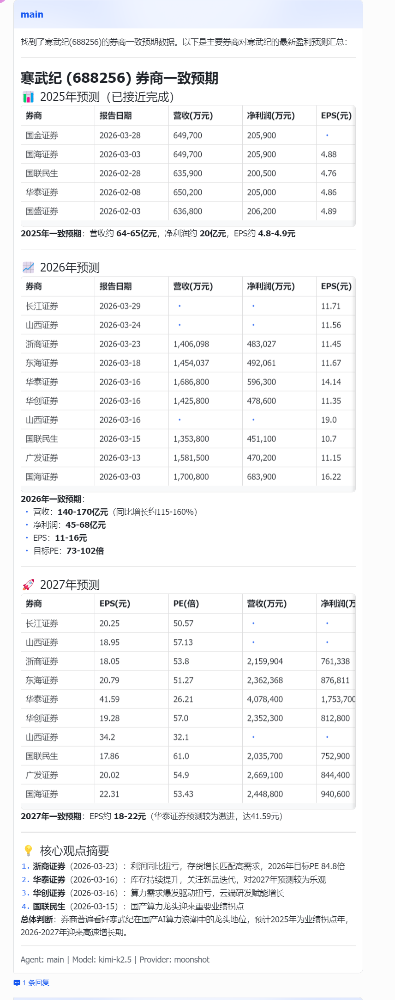

> **你：股东户数最近什么趋势？**

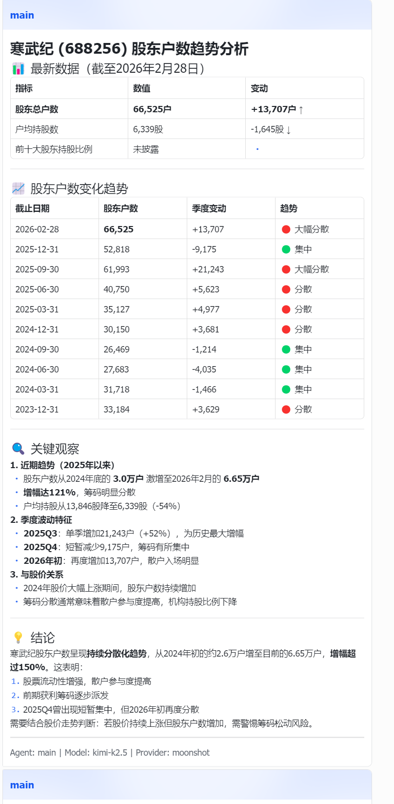

> **你：跟同行业比，寒武纪的盈利能力怎么样？**

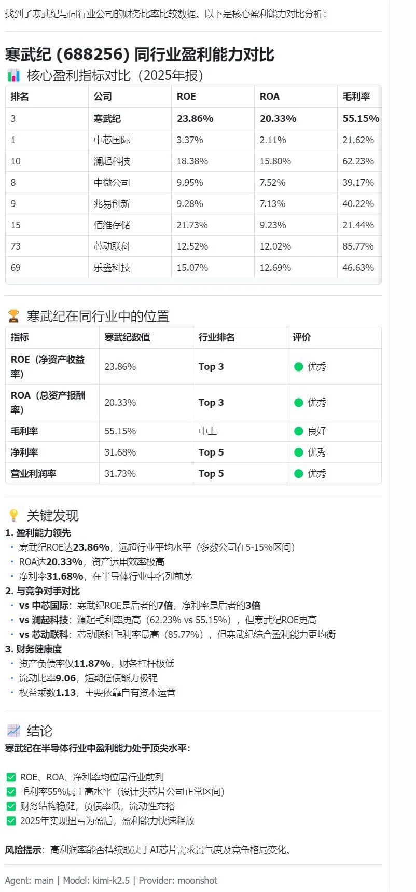

三轮对话，你已经拥有了一份初级投研报告的数据底座。

**一句话总结**：恒生聚源最大的价值不是"252 个接口"，而是**让散户第一次能碰到机构级数据**——券商一致预期、研报结构化观点、行业横截面对比、股东筹码分布。这些过去锁在 Wind 终端里的信息差，现在通过 QVeris 一句话就能拿到。

> **实测统计**：本文共实测恒生聚源 50+ 个接口，覆盖 A 股行情、财务报表、券商研报、资金流向、基金、债券、理财、企业征信 8 大品类。调用成功率 100%，平均响应 8 秒。所有文中数据均为实测结果，非模拟。

**QVeris 新供应商速递** · 用数据说话，一期一家。

探索更多应用案例：👇

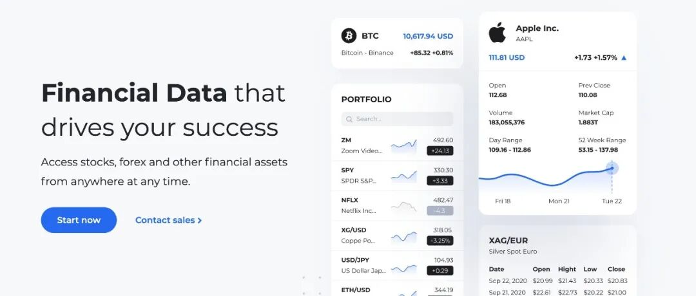

[QVeris 接入 Twelve Data：一个接口查完美股、外汇、黄金和比特币](https%3A%2F%2Fmp.weixin.qq.com%2Fs%3F__biz%3DMzY4NDAxMTE3NQ%3D%3D%26mid%3D2247484175%26idx%3D1%26sn%3Da80486a8a7c07e3a9c55cfab8b2606fa%26scene%3D21%23wechat_redirect)

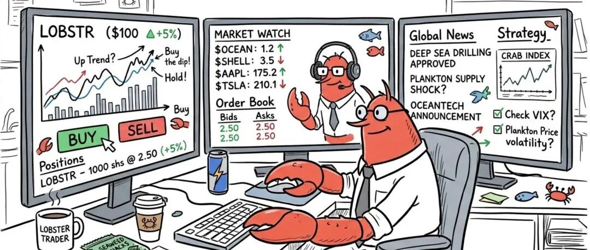

[OpenClaw 配置 QVeris 全能力指南【金融分析篇】](https%3A%2F%2Fmp.weixin.qq.com%2Fs%3F__biz%3DMzY4NDAxMTE3NQ%3D%3D%26mid%3D2247484167%26idx%3D1%26sn%3D9c5f5bc1f6c73ee42b8e3d020645951d%26scene%3D21%23wechat_redirect)

[万亿级AI Agent正在到来：软件行业即将彻底改变](https%3A%2F%2Fmp.weixin.qq.com%2Fs%3F__biz%3DMzY4NDAxMTE3NQ%3D%3D%26mid%3D2247484154%26idx%3D1%26sn%3Db1a514f6af3b81c3ad447b59e927ae10%26scene%3D21%23wechat_redirect)

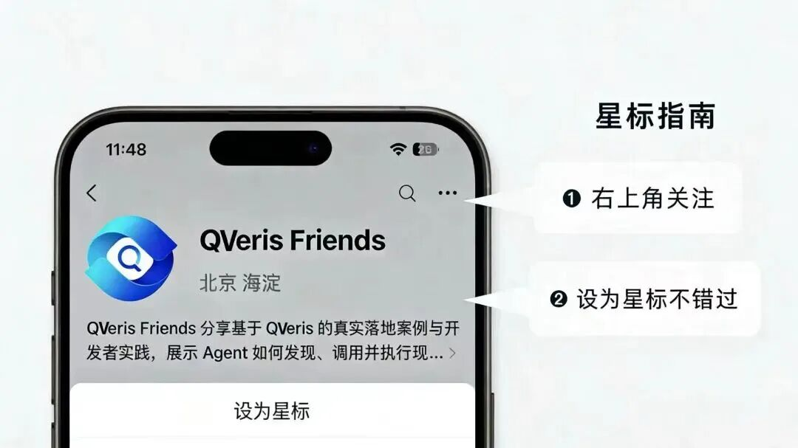
